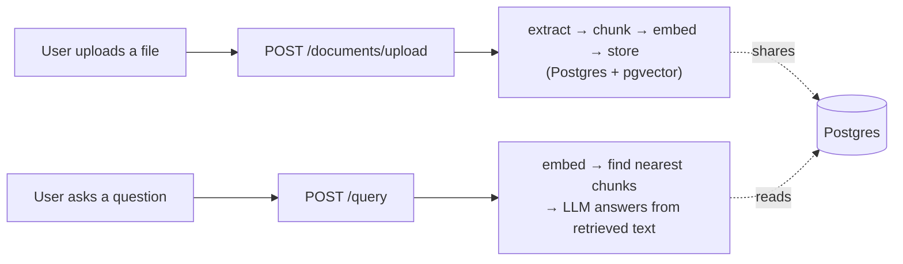

# Knowledge Brain

An enterprise-style RAG (Retrieval-Augmented Generation) platform: upload
internal documents, then ask questions about them in plain English and
get grounded answers — with the system openly admitting when it doesn't
know, instead of guessing.

Built as a hands-on learning project, one feature at a time, with a
written record of every significant decision (see [`docs/adr/`](docs/adr/))
and why it was made that way.

## Status

**Built and verified end-to-end:**
- **Document ingestion** — upload a PDF or `.txt` file → text is
  extracted → split into chunks → each chunk is embedded → everything is
  stored in Postgres.
- **Retrieval + hybrid search + answer generation** — ask a question →
  a vector search (meaning) and a keyword search (exact terms, via
  Postgres full-text search) run and get merged with Reciprocal Rank
  Fusion → an LLM answers using only that retrieved text.
- **Correlation IDs, an append-only audit log, and circuit breakers**
  around both OpenAI calls — see [`docs/adr/ADR-007`](docs/adr/ADR-007-enterprise-requirements-retrofit-scope.md)
  for why these three were prioritized over other pending requirements.

**Not built yet:** reranking, a LangGraph multi-step query pipeline, a
Neo4j document-relationship graph, PII detection, document access
control, an evaluation harness, an MCP server, the frontend, auth, and
Azure deployment. See `CLAUDE.md`'s build order for the full plan.

**Known gaps, tracked on purpose, not forgotten:**
- No automated test suite yet (`tests/` is empty).
- The audit log's "nobody can edit or delete an entry" guarantee is
  enforced at the code level only — the local database connection is a
  superuser and could bypass a real database-level restriction. See
  [`ADR-009`](docs/adr/ADR-009-audit-logging-approach.md).
- The circuit breaker's state lives in a single process's memory, so it
  doesn't share failure counts across multiple server instances yet.

## How it works



Every request also gets a correlation ID (for tracing), an audit log
entry (for accountability), and OpenAI calls are protected by a circuit
breaker (so one bad outage doesn't cascade). Full diagrams and the
reasoning behind every choice live in [`docs/ARCHITECTURE.md`](docs/ARCHITECTURE.md).

## Tech stack (what's actually running today)

- **FastAPI** — the web server
- **PostgreSQL + pgvector** — one database for both normal data and
  vector similarity search (see [`ADR-002`](docs/adr/ADR-002-pgvector-before-qdrant.md)
  for why not a dedicated vector DB, yet)
- **OpenAI** — `text-embedding-3-small` for embeddings,
  `gpt-4o-mini` for answer generation
- **SQLAlchemy (async) + `uv`** — ORM and dependency management
- **Docker** — runs Postgres locally, isolated from anything else on
  the machine (see [`ADR-003`](docs/adr/ADR-003-postgres-in-docker.md))

The full planned stack (Kafka, Qdrant, Redis, Neo4j, LangGraph, Azure,
Terraform, a Next.js frontend) is documented in `CLAUDE.md` — most of it
isn't built yet, and is being added deliberately, one justified decision
at a time, not upfront.

## Run it locally

1. **Start Docker Desktop**, then start Postgres:
   ```
   docker compose up -d
   ```
2. **Enable the pgvector extension** (one-time, per fresh database volume):
   ```
   docker exec knowledge-brain-postgres psql -U knowledge_brain -d knowledge_brain -c "CREATE EXTENSION IF NOT EXISTS vector;"
   ```
3. **Copy the environment file** and add your own OpenAI API key:
   ```
   cp .env.example .env
   ```
4. **Install dependencies:**
   ```
   uv sync
   ```
5. **Create the database tables** (one-time, per fresh database volume):
   ```
   PYTHONPATH=. uv run python scripts/create_tables.py
   ```
6. **Run the server:**
   ```
   uv run uvicorn app.main:app --reload --port 8000
   ```

Once it's running, interactive API docs (Swagger UI) are available at
`http://localhost:8000/docs` — the fastest way to try both endpoints
without writing any `curl` commands by hand.

### Trying it manually

```
curl -X POST http://localhost:8000/documents/upload -F "file=@/path/to/a/file.txt"

curl -X POST http://localhost:8000/query \
  -H "Content-Type: application/json" \
  -d '{"question": "What does this document say?"}'
```

## Project documentation

This project keeps a written record of *why*, not just *what* — useful
for picking the project back up after time away, and for interview prep.

| File | What it's for |
|---|---|
| `CLAUDE.md` | The operating rules for how this project gets built, including the full build order and enterprise requirements |
| [`docs/ARCHITECTURE.md`](docs/ARCHITECTURE.md) | How the system actually works right now, with diagrams — always current, never aspirational |
| [`docs/PROGRESS.md`](docs/PROGRESS.md) | A dated history log of every session: what was built, what was hard, what's next |
| [`docs/INTERVIEW_PREP.md`](docs/INTERVIEW_PREP.md) | A plain-language study sheet — the Q&A behind every major decision, meant to be reviewed before an actual interview |
| [`docs/adr/`](docs/adr/) | One Architecture Decision Record per significant choice: what was considered, what was picked, and why |
| [`docs/pipeline-status.html`](docs/pipeline-status.html) | A visual, at-a-glance dashboard of what's built vs. pending |
