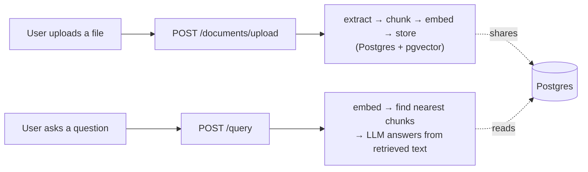

# Knowledge Brain

An enterprise-style RAG (Retrieval-Augmented Generation) platform: upload
internal documents, then ask questions about them in plain English and
get grounded answers — with the system openly admitting when it doesn't
know, instead of guessing.

Built as a hands-on learning project, one feature at a time, with a
written record of every significant decision (see [`docs/adr/`](docs/adr/))
and why it was made that way.

## Status

**Built and verified end-to-end:**
- **Document ingestion** — upload a PDF or `.txt` file → text is
  extracted → split into chunks → each chunk is embedded → everything is
  stored in Postgres.
- **Retrieval + hybrid search + answer generation** — ask a question →
  a vector search (meaning) and a keyword search (exact terms, via
  Postgres full-text search) run and get merged with Reciprocal Rank
  Fusion → an LLM answers using only that retrieved text.
- **Reranking** — hybrid search's top 20 candidates get re-scored by
  Voyage AI's reranker, which looks at the question and each chunk
  together instead of separately, before the best 5 reach the LLM. Falls
  back to hybrid search's own ranking if Voyage is unavailable.
- **LangGraph query pipeline** — the query flow is now a graph, not a
  fixed sequence: if the best reranked chunk scores below a relevance
  threshold, an LLM rewrites the question and the whole search runs
  again once before generating an answer, instead of quietly answering
  from weak results.
- **Neo4j document relationship graph** — after a document uploads, an
  LLM finds specific things it explicitly mentions (an error code, a
  ticket ID) and links it in Neo4j to any other document that actually
  defines that thing. A query then pulls in one hop of that context
  alongside its retrieved chunks — real connections, not just similar
  wording. Best-effort, same as reranking: falls back to answering from
  retrieved chunks alone if Neo4j is unavailable.
- **Correlation IDs, an append-only audit log, and circuit breakers**
  around every external AI call (OpenAI, Voyage, and Neo4j) — see [`docs/adr/ADR-007`](docs/adr/ADR-007-enterprise-requirements-retrofit-scope.md)
  for why the first three were prioritized over other pending requirements.
- **Evaluation harness** — a fixed set of known-answer test questions,
  run through the real pipeline against a small dedicated set of
  fixture documents, scored on retrieval correctness, faithfulness, and
  answer correctness (the last two via a separate LLM-as-judge call
  each). An offline, on-demand tool, not part of the running app — see
  [`ADR-016`](docs/adr/ADR-016-llm-judge-evaluation-harness.md).
- **MCP server** — the same pipeline, exposed as two tools
  (`ask_knowledge_base`, `upload_document`) other AI clients can call
  directly over HTTP, mounted on this same app at `/mcp` and gated by a
  shared API key. Reuses every service, circuit breaker, and the audit
  log the REST routes already use — see
  [`ADR-017`](docs/adr/ADR-017-mcp-server.md).
- **PII detection** — before any document is chunked or embedded, its
  text is checked by Azure AI Language against an explicit 14-category
  allowlist (names, contact info, financial data, US and India
  government IDs). Any match holds the document for human review
  instead of embedding it — `pending_review`, never made searchable.
  Runs inside the shared ingestion service, so it protects the REST
  upload endpoint and the MCP tool automatically. Fails closed, not
  open, if Azure itself is unavailable — see
  [`ADR-018`](docs/adr/ADR-018-pii-detection.md).
- **Document-level access control** — every request, REST or MCP, must
  carry an `X-User-Id` header identifying the caller; missing it is a
  401. Uploading a document auto-grants the uploader access; a new
  endpoint lets anyone with access share it with someone else.
  Retrieval — vector search, keyword search, and graph-context
  snippets alike — is filtered by a SQL join against a permissions
  table before results are ever ranked, not after. See
  [`ADR-019`](docs/adr/ADR-019-document-level-access-control.md).
- **Azure deployment** — the real backend (not a placeholder) is live
  in Azure: a Terraform module (`infra/`) provisions a resource group,
  Postgres Flexible Server, Key Vault, a container registry, and a
  Container App, wired together with a Managed Identity instead of any
  raw secret; Key Vault holds all 7 real secrets the app needs. Its
  public URL returns a real HTTP 200 with a genuine Swagger UI and a
  correlation ID header. See
  [`ADR-020`](docs/adr/ADR-020-azure-deployment-infrastructure.md),
  [`ADR-021`](docs/adr/ADR-021-containerizing-the-backend.md), and
  [`ADR-022`](docs/adr/ADR-022-deploying-the-real-backend-image.md)
  (which also covers a real deploy failure — an image built for the
  wrong CPU architecture — diagnosed and fixed live).
- **GitHub Actions CI/CD** — an OIDC-authenticated workflow (no stored
  Azure secret) that tests, builds for `amd64` explicitly, pushes, and
  deploys on every push to `main`. Verified live with a real,
  unassisted, successful end-to-end run. See
  [`ADR-023`](docs/adr/ADR-023-ci-owns-the-deployed-image.md),
  [`ADR-024`](docs/adr/ADR-024-github-actions-oidc.md), and
  [`ADR-025`](docs/adr/ADR-025-ci-cd-first-real-run.md) (three more
  real bugs — a missing CI test database, a GitHub OIDC subject claim
  mismatch, and an Azure revision-naming limit — found only once the
  pipeline actually ran).
- **API Management gateway** *(partial — see below)* — Azure API
  Management sits in front of the backend, importing its API definition
  straight from FastAPI's own OpenAPI spec and stamping a Key
  Vault-held secret onto every request it forwards; the backend rejects
  anything missing it. Verified live end-to-end: a real request through
  the gateway returns the correct `401`. Two
  of the original design's four pieces aren't built: network-level
  restriction and real per-caller rate limiting both turned out to be
  unavailable on the Consumption tier chosen for cost — see
  [`ADR-026`](docs/adr/ADR-026-api-management-gateway.md).
- **Frontend** *(just started — see below)* — a separate Next.js
  project (`frontend/`, Tailwind, Shadcn/UI on Base UI) with a shared
  shell (navigation, dark mode, a responsive mobile menu) and the first
  of five planned pages, the Document Library — backed by a new,
  permission-filtered `GET /documents` endpoint. Fetches server-side
  from a Next.js Server Component rather than the browser, avoiding the
  backend needing any CORS configuration. See
  [`ADR-028`](docs/adr/ADR-028-frontend-stack-and-base-ui.md) and
  [`ADR-029`](docs/adr/ADR-029-document-library-page.md).

**Not built yet:** the upload flow and four more planned frontend pages
(Dashboard, Query, Analytics, Admin), and full auth/multi-tenancy
(today's identity is a self-asserted header, not real authentication).
See `CLAUDE.md`'s build order for the full plan.

**Known gaps, tracked on purpose, not forgotten:**
- The automated test suite (`tests/`) covers ingestion end-to-end,
  chunking, extraction, and PII detection's "flag and stop" branch —
  it does not yet cover hybrid search, the circuit breaker, the audit
  log, LangGraph's retry logic, the Neo4j graph feature, MCP, PII
  detection's own splitting/batching logic, or any part of access
  control.
- The audit log's "nobody can edit or delete an entry" guarantee is
  enforced at the code level only — the local database connection is a
  superuser and could bypass a real database-level restriction. See
  [`ADR-009`](docs/adr/ADR-009-audit-logging-approach.md).
- The circuit breaker's state lives in a single process's memory, so it
  doesn't share failure counts across multiple server instances yet.
- The Container App's direct URL is still fully reachable, unrestricted
  — the API Management gateway's secret header is the one real access
  control today, not network isolation. See `ADR-026`.
- There's no migration tool (no Alembic) — the real Azure Postgres
  schema was created by running `create_tables.py` directly against it
  by hand (see [`ADR-027`](docs/adr/ADR-027-azure-postgres-schema-creation.md)),
  and a future schema change would need that same manual process
  repeated; nothing automates it the way CI/CD already automates
  deploying a new image.

## How it works



Every request must also carry an `X-User-Id` header — there's no login
yet, just a caller-supplied identity, but every document is only
visible to users explicitly granted access to it, and a request with
no `X-User-Id` is rejected outright. Every request also gets a
correlation ID (for tracing), an audit log entry (for accountability),
and OpenAI calls are protected by a circuit breaker (so one bad outage
doesn't cascade). Full diagrams and the reasoning behind every choice
live in [`docs/ARCHITECTURE.md`](docs/ARCHITECTURE.md).

## Tech stack (what's actually running today)

- **FastAPI** — the web server
- **PostgreSQL + pgvector** — one database for both normal data and
  vector similarity search (see [`ADR-002`](docs/adr/ADR-002-pgvector-before-qdrant.md)
  for why not a dedicated vector DB, yet)
- **OpenAI** — `text-embedding-3-small` for embeddings,
  `gpt-4o-mini` for answer generation
- **Voyage AI** — `rerank-2.5-lite` for reranking hybrid search's results
  before generation (see [`ADR-013`](docs/adr/ADR-013-reranking-with-voyage-ai.md))
- **LangGraph** — the query pipeline itself: a graph with one conditional
  loop back to a rewritten search when retrieval comes back weak (see
  [`ADR-014`](docs/adr/ADR-014-langgraph-query-pipeline.md))
- **Neo4j** — the document relationship graph: explicit `REFERENCES`
  links between documents, extracted from content, not similarity (see
  [`ADR-015`](docs/adr/ADR-015-neo4j-document-relationship-graph.md))
- **MCP (Model Context Protocol)** — the official Python SDK, mounted
  onto this same app so other AI clients can call the pipeline directly
  (see [`ADR-017`](docs/adr/ADR-017-mcp-server.md))
- **Azure AI Language** — PII detection at ingestion time, scoped to an
  explicit category allowlist rather than its full default set (see
  [`ADR-018`](docs/adr/ADR-018-pii-detection.md)) — this project's
  first real Azure dependency
- **SQLAlchemy (async) + `uv`** — ORM and dependency management
- **Docker** — runs Postgres and Neo4j locally, isolated from anything
  else on the machine (see [`ADR-003`](docs/adr/ADR-003-postgres-in-docker.md))
- **Next.js + Tailwind + Shadcn/UI (on Base UI)** — the frontend
  (`frontend/`), just started: a shared shell and one of five planned
  pages so far (see [`ADR-028`](docs/adr/ADR-028-frontend-stack-and-base-ui.md))

The full planned stack (Kafka, Qdrant, Redis, Azure) is documented in
`CLAUDE.md` — most of it isn't built yet, and is being added
deliberately, one justified decision at a time, not upfront.

## Run it locally

1. **Start Docker Desktop**, then start Postgres and Neo4j:
   ```
   docker compose up -d
   ```
2. **Enable the pgvector extension** (one-time, per fresh database volume):
   ```
   docker exec knowledge-brain-postgres psql -U knowledge_brain -d knowledge_brain -c "CREATE EXTENSION IF NOT EXISTS vector;"
   ```
3. **Copy the environment file** and add your own OpenAI and Voyage AI
   API keys:
   ```
   cp .env.example .env
   ```
   The `NEO4J_*` values already match `docker-compose.yml`'s defaults,
   so they work as-is for local development. Set `MCP_API_KEY` to any
   value of your choice — it's the shared secret MCP clients must send
   back to use the `/mcp` endpoint. Set `APIM_GATEWAY_SECRET` to any
   value too — in Azure this is generated and stamped on automatically
   by API Management (see [`ADR-026`](docs/adr/ADR-026-api-management-gateway.md)),
   but locally there's no gateway in front of the app, so every request
   needs to send this same value back manually as an `X-Gateway-Secret`
   header, or the backend rejects it with a 401. `AZURE_LANGUAGE_ENDPOINT` and
   `AZURE_LANGUAGE_KEY` need a real Azure AI Language resource (the
   free `F0` tier is enough) — create one in the
   [Azure Portal](https://portal.azure.com), search "Language service,"
   and copy its endpoint and key from the resource's "Keys and
   Endpoint" page.
4. **Install dependencies:**
   ```
   uv sync
   ```
5. **Create the database tables** (one-time, per fresh database volume):
   ```
   PYTHONPATH=. uv run python scripts/create_tables.py
   ```
6. **Run the server:**
   ```
   uv run uvicorn app.main:app --reload --port 8000
   ```

Once it's running, interactive API docs (Swagger UI) are available at
`http://localhost:8000/docs` — the fastest way to try both endpoints
without writing any `curl` commands by hand.

### Trying it manually

Every request needs an `X-User-Id` header — any value you like, it's
just a caller-supplied identity, not a real login — and an
`X-Gateway-Secret` header matching whatever value you set for
`APIM_GATEWAY_SECRET` in `.env` (see step 3 above; in Azure, API
Management adds this header automatically, but locally you have to
send it yourself):

```
curl -X POST http://localhost:8000/documents/upload \
  -H "X-User-Id: you" \
  -H "X-Gateway-Secret: your-apim-gateway-secret-here" \
  -F "file=@/path/to/a/file.txt"

curl -X POST http://localhost:8000/query \
  -H "X-User-Id: you" \
  -H "X-Gateway-Secret: your-apim-gateway-secret-here" \
  -H "Content-Type: application/json" \
  -d '{"question": "What does this document say?"}'
```

Uploading a document automatically grants you access to it. To share a
document with someone else (or test what happens when you *don't* have
access), grant another user ID:

```
curl -X POST http://localhost:8000/documents/<document-id>/access \
  -H "X-User-Id: you" \
  -H "Content-Type: application/json" \
  -d '{"user_id": "someone-else"}'
```

The same two actions are also reachable as MCP tools at
`http://localhost:8000/mcp`, over the Streamable HTTP transport, for
any MCP-compatible client (e.g. Claude Desktop) — every request must
include both the shared secret you set as `MCP_API_KEY` in an
`X-API-Key` header, and an `X-User-Id` header, same as the REST
endpoints.

### Running the frontend

The backend needs to already be running (see above). From a separate
terminal:

```
cd frontend
npm install
```

Create `frontend/.env.local` with one line, matching whatever
`APIM_GATEWAY_SECRET` is set to in the backend's own `.env`:

```
BACKEND_GATEWAY_SECRET=your-apim-gateway-secret-here
```

Then start it:

```
npm run dev
```

Visit `http://localhost:3000`. Only the shared shell and the Document
Library page (`/documents`) exist so far — everything else in the nav
is a placeholder route. The frontend currently sends a hardcoded
`X-User-Id: dev-user` on every request (see
[`ADR-029`](docs/adr/ADR-029-document-library-page.md)), which won't
match whatever user ID you've used in manual `curl` tests — they're
treated as two unrelated identities until real auth (build-order item
14) exists.

### Running the evaluation harness

```
PYTHONPATH=. uv run python eval/run_eval.py
```

Ingests its own small set of fixture documents the first time it runs
(skipped on later runs), then reports retrieval, faithfulness, and
correctness scores for a fixed set of known-answer test questions.
Paced to stay under Voyage's free-tier rate limit, so a full run takes
a couple of minutes, not seconds.

## Project documentation

This project keeps a written record of *why*, not just *what* — useful
for picking the project back up after time away, and for interview prep.

| File | What it's for |
|---|---|
| `CLAUDE.md` | The operating rules for how this project gets built, including the full build order and enterprise requirements |
| [`docs/ARCHITECTURE.md`](docs/ARCHITECTURE.md) | How the system actually works right now, with diagrams — always current, never aspirational |
| [`docs/PROGRESS.md`](docs/PROGRESS.md) | A dated history log of every session: what was built, what was hard, what's next |
| [`docs/INTERVIEW_PREP.md`](docs/INTERVIEW_PREP.md) | A plain-language study sheet — the Q&A behind every major decision, meant to be reviewed before an actual interview |
| [`docs/adr/`](docs/adr/) | One Architecture Decision Record per significant choice: what was considered, what was picked, and why |
| [`docs/pipeline-status.html`](docs/pipeline-status.html) | A visual, at-a-glance dashboard of what's built vs. pending |
