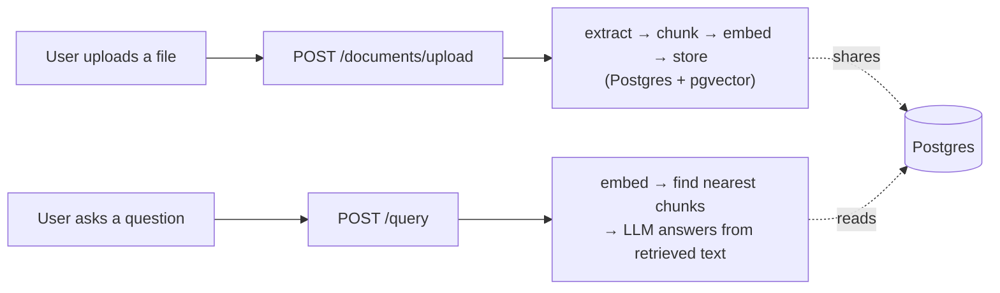

# Knowledge Brain

An enterprise-style RAG (Retrieval-Augmented Generation) platform: upload
internal documents, then ask questions about them in plain English and
get grounded answers — with the system openly admitting when it doesn't
know, instead of guessing.

Built as a hands-on learning project, one feature at a time, with a
written record of every significant decision (see [`docs/adr/`](docs/adr/))
and why it was made that way.

## Status

**Built and verified end-to-end:**
- **Document ingestion** — upload a PDF or `.txt` file → text is
  extracted → split into chunks → each chunk is embedded → everything is
  stored in Postgres. The REST upload endpoint returns immediately
  (extending [`ADR-001`](docs/adr/ADR-001-synchronous-ingestion.md)'s
  own stated next step); the pipeline runs afterward as a background
  task, with a `GET /documents/{id}/status` endpoint reporting which
  step it's currently on. MCP's `upload_document` tool stays fully
  synchronous, since a tool call only ever returns one final result.
  See [`ADR-030`](docs/adr/ADR-030-background-upload-processing.md).
- **Retrieval + hybrid search + answer generation** — ask a question →
  a vector search (meaning) and a keyword search (exact terms, via
  Postgres full-text search) run and get merged with Reciprocal Rank
  Fusion → an LLM answers using only that retrieved text.
- **Reranking** — hybrid search's top 20 candidates get re-scored by
  Voyage AI's reranker, which looks at the question and each chunk
  together instead of separately, before the best 5 reach the LLM. Falls
  back to hybrid search's own ranking if Voyage is unavailable.
- **LangGraph query pipeline** — the query flow is now a graph, not a
  fixed sequence: if the best reranked chunk scores below a relevance
  threshold, an LLM rewrites the question and the whole search runs
  again once before generating an answer, instead of quietly answering
  from weak results.
- **Neo4j document relationship graph** — after a document uploads, an
  LLM finds specific things it explicitly mentions (an error code, a
  ticket ID) and links it in Neo4j to any other document that actually
  defines that thing. A query then pulls in one hop of that context
  alongside its retrieved chunks — real connections, not just similar
  wording. Best-effort, same as reranking: falls back to answering from
  retrieved chunks alone if Neo4j is unavailable.
- **Correlation IDs, an append-only audit log, and circuit breakers**
  around every external AI call (OpenAI, Voyage, and Neo4j) — see [`docs/adr/ADR-007`](docs/adr/ADR-007-enterprise-requirements-retrofit-scope.md)
  for why the first three were prioritized over other pending requirements.
- **Evaluation harness** — a fixed set of known-answer test questions,
  run through the real pipeline against a small dedicated set of
  fixture documents, scored on retrieval correctness, faithfulness, and
  answer correctness (the last two via a separate LLM-as-judge call
  each). An offline, on-demand tool, not part of the running app — see
  [`ADR-016`](docs/adr/ADR-016-llm-judge-evaluation-harness.md).
- **MCP server** — the same pipeline, exposed as two tools
  (`ask_knowledge_base`, `upload_document`) other AI clients can call
  directly over HTTP, mounted on this same app at `/mcp` and gated by a
  shared API key. Reuses every service, circuit breaker, and the audit
  log the REST routes already use — see
  [`ADR-017`](docs/adr/ADR-017-mcp-server.md).
- **PII detection** — before any document is chunked or embedded, its
  text is checked by Azure AI Language against an explicit 14-category
  allowlist (names, contact info, financial data, US and India
  government IDs). Any match holds the document for human review
  instead of embedding it — `pending_review`, never made searchable.
  Runs inside the shared ingestion service, so it protects the REST
  upload endpoint and the MCP tool automatically. Fails closed, not
  open, if Azure itself is unavailable — see
  [`ADR-018`](docs/adr/ADR-018-pii-detection.md).
- **Document-level access control** — every request must carry a
  proven identity (see real authentication, below); missing or invalid
  is a 401. Uploading a document auto-grants the uploader access; a new
  endpoint lets anyone with access share it with someone else.
  Retrieval — vector search, keyword search, and graph-context
  snippets alike — is filtered by a SQL join against a permissions
  table before results are ever ranked, not after. See
  [`ADR-019`](docs/adr/ADR-019-document-level-access-control.md).
- **Real authentication** — email/password login with the project's
  own server-side session cookies, not JWT and not an external
  identity provider, chosen specifically to build the real mechanics
  hands-on. `POST /auth/signup` hashes a password with Argon2id
  (`argon2-cffi`, not the unmaintained `passlib`) before it's ever
  stored; `POST /auth/login` verifies it and hands back a random,
  unguessable session token as an `httponly` cookie — never the
  session row's own database id, so a value that routinely appears in
  this project's logs is never the same value that would let someone
  log in. Every REST endpoint requires that cookie to resolve to a
  real, unexpired session; MCP is deliberately unchanged, since a
  non-browser client can't hold a session cookie the same way — it
  keeps its existing shared-API-key-plus-`X-User-Id` model. The
  frontend has real `/login` and `/signup` pages now too: a route
  handler calls the backend server-to-server and re-issues the
  resulting session token as this app's own cookie, and a cheap
  edge-level check (`proxy.ts`) redirects an unauthenticated visitor
  to `/login` before a protected page ever renders. See
  [`ADR-036`](docs/adr/ADR-036-real-authentication-session-cookies.md)
  (backend) and
  [`ADR-037`](docs/adr/ADR-037-real-authentication-frontend.md)
  (frontend).
- **LLM/RAG observability** — every OpenAI and Voyage call (embedding,
  generation, query rewriting, reference extraction, reranking) now
  reports its exact prompt, exact response, tokens, cost, and latency
  to [LangSmith](https://www.langchain.com/langsmith), a dedicated
  external tool — not built into this app's own UI, a deliberate
  choice. Since the query pipeline is already a LangGraph graph,
  turning tracing on captures its whole execution automatically, node
  by node; the OpenAI calls get this by wrapping each service file's
  client once with `wrap_openai()`, Voyage's reranking call via an
  explicit `@traceable` decorator (no automatic dollar cost there,
  since LangSmith's pricing table doesn't know Voyage's rates). Every
  query's trace is tagged with who asked. See
  [`ADR-038`](docs/adr/ADR-038-llm-rag-observability.md).
- **Real-time guardrails, input and output** — every question and every
  generated answer each pass through their own pair of independent
  checks. On the way in: a moderation check plus an LLM jailbreak
  judge, run before retrieval — a flagged or doubly-unreachable
  question never triggers an embedding call, a search, or a generation
  call at all. On the way out: a moderation check plus an LLM injection
  judge, shown the actual retrieved context alongside the generated
  answer, asked whether the answer looks like it followed instructions
  smuggled into a document rather than genuinely answering the question
  — the RAG-specific risk a moderation classifier alone can't catch.
  Either side's flag replaces the real content with the same fixed,
  friendly message, sources and confidence both suppressed too, never
  revealing which check tripped. The fail policy is availability-aware
  on both sides: a single check being down contributes no signal of its
  own, but the combined decision still fails closed if neither check
  could run at all. Verified live: a real injection payload uploaded as
  a document was correctly blocked on the way out; a real jailbreak
  attempt was blocked on the way in roughly 3x faster than a full
  pipeline run, since nothing downstream ever executes. Both run as
  real steps in the query pipeline's LangGraph graph — the input check
  is now the graph's actual entry point — so MCP inherits both
  automatically. See
  [`ADR-039`](docs/adr/ADR-039-real-time-answer-guardrails.md).
- **Multi-agent federated retrieval** — documents can now be tagged
  with one or more free-text domains at upload (manual, for now); a
  supervisor LLM call decides which of a user's own domains a question
  actually needs. Zero or one domain — every question today, since
  domains are opt-in — costs exactly what it always did. Two or more
  domains runs one full retrieval-and-generation pass per domain,
  concurrently, each producing its own independent draft answer, then a
  synthesis call merges them into one response with reconciled
  citations, which gets one more guardrails pass before it returns. A
  failing domain is excluded via task-level isolation rather than a
  literal per-domain circuit breaker — this project's breakers are
  already one shared instance per external service, not per domain — a
  deliberate deviation from the build spec's literal wording, flagged
  and approved before building. Verified live: a genuinely cross-domain
  question correctly merged findings from two real domain-tagged
  documents, at roughly double a single-domain question's latency. A
  real, unfixed gap found the same session: a raw provider rate-limit
  error isn't caught by this feature's failure isolation the way a
  circuit-breaker error is, so one domain hitting it today can still
  fail the whole question — documented, not hidden. See
  [`ADR-040`](docs/adr/ADR-040-multi-agent-federated-retrieval.md).
- **Conversation history, a real sidebar, and context condensing** —
  every question now belongs to a persisted conversation, not just
  whatever the browser's memory still holds. A sidebar lists a user's
  conversations, most recently active first; resuming one is a real
  route (`/query/[conversationId]`), not client-side state, so a reload
  actually brings back the same thread. A new conversation is only
  created once its first answer comes back successfully, and a named
  conversation's ownership is checked *before* the safety/retrieval
  pipeline runs, so a bad or someone else's id fails with a 404 rather
  than after paying for a full pipeline run. A follow-up like "what
  about the other one" is now rewritten into a standalone question —
  always, on every follow-up — using the conversation's last 3 turns as
  context, before it ever touches retrieval; the input guardrail then
  checks that rewritten text, not the raw one. Those recent turns come
  from Redis (this project's first use of it, introduced only once
  condensing gave it a real job) when cached, falling back to the
  conversation's own already-loaded turns — never a crash — when the
  cache is cold, holds something unexpected, or Redis itself is
  unreachable. See
  [`ADR-041`](docs/adr/ADR-041-conversation-history-and-sidebar.md) and
  [`ADR-042`](docs/adr/ADR-042-context-condensing-and-redis.md).
- **Azure deployment** — the real backend (not a placeholder) is live
  in Azure: a Terraform module (`infra/`) provisions a resource group,
  Postgres Flexible Server, Key Vault, a container registry, and a
  Container App, wired together with a Managed Identity instead of any
  raw secret; Key Vault holds all 7 real secrets the app needs. Its
  public URL returns a real HTTP 200 with a genuine Swagger UI and a
  correlation ID header. The Container App scales to zero after 5
  minutes of no traffic (Azure Cost Management surfaced it running,
  and billing, continuously since first deploy) — the first request
  after any idle period pays a real several-second cold start, both
  through the REST API and MCP, which share the same container. See
  [`ADR-020`](docs/adr/ADR-020-azure-deployment-infrastructure.md),
  [`ADR-021`](docs/adr/ADR-021-containerizing-the-backend.md),
  [`ADR-022`](docs/adr/ADR-022-deploying-the-real-backend-image.md)
  (which also covers a real deploy failure — an image built for the
  wrong CPU architecture — diagnosed and fixed live), and
  [`ADR-035`](docs/adr/ADR-035-container-app-scale-to-zero.md).
- **GitHub Actions CI/CD** — an OIDC-authenticated workflow (no stored
  Azure secret) that tests, builds for `amd64` explicitly, pushes, and
  deploys on every push to `main`. Verified live with a real,
  unassisted, successful end-to-end run. See
  [`ADR-023`](docs/adr/ADR-023-ci-owns-the-deployed-image.md),
  [`ADR-024`](docs/adr/ADR-024-github-actions-oidc.md), and
  [`ADR-025`](docs/adr/ADR-025-ci-cd-first-real-run.md) (three more
  real bugs — a missing CI test database, a GitHub OIDC subject claim
  mismatch, and an Azure revision-naming limit — found only once the
  pipeline actually ran).
- **API Management gateway** *(partial — see below)* — Azure API
  Management sits in front of the backend, importing its API definition
  straight from FastAPI's own OpenAPI spec and stamping a Key
  Vault-held secret onto every request it forwards; the backend rejects
  anything missing it. Verified live end-to-end: a real request through
  the gateway returns the correct `401`. Two
  of the original design's four pieces aren't built: network-level
  restriction and real per-caller rate limiting both turned out to be
  unavailable on the Consumption tier chosen for cost — see
  [`ADR-026`](docs/adr/ADR-026-api-management-gateway.md).
- **Frontend** *(all five planned pages built — see below)* — a
  separate Next.js project (`frontend/`, Tailwind, Shadcn/UI on Base
  UI) with a shared shell (navigation, dark mode, a responsive mobile
  menu). The Dashboard, at the app's root, is a real digest — total
  documents and recent queries are pulled from data that already
  exists, with two data-less widgets (retrieval accuracy, cost per
  query) showing an honest "not tracked yet" state instead of a
  fabricated number. The Document Library — backed by a new,
  permission-filtered `GET /documents` endpoint — fetches server-side
  from a Next.js Server Component rather than the browser, avoiding the
  backend needing any CORS configuration. Drag-and-drop upload is built
  too, with a live per-stage progress bar. The Query page is a real
  chat interface: `/query`'s response now carries `sources` (the
  chunks that actually informed the answer, with filenames) and
  `confidence` alongside the answer text, not just the answer alone —
  the answer renders all at once, not token-by-token, since real
  streaming (build-order item 19) doesn't exist yet. The Analytics page
  adds a real, genuinely new metric — average response time, timed
  once inside `RetrievalService.run_query` so both REST and MCP queries
  count toward it — plus a hand-rolled (no new dependency) 30-day query
  volume chart and top questions, alongside one more honest "not
  tracked yet" placeholder for retrieval accuracy. The Admin page is
  the first page in this project gated by an access check —
  `require_admin`, checking a real `User.is_admin` column (originally
  a small `ADMIN_USER_IDS` allowlist, upgraded once real accounts
  existed — see `ADR-036`) rather than full RBAC, since it's the first
  page that reads across every user instead of just the caller's own —
  showing a real audit log viewer and a real document-permissions
  list, with tenant management left an honest placeholder (this system
  has no tenant concept at all yet). Every client-triggered action
  talks only to same-origin Next.js Route Handlers, which proxy the
  real, secret-bearing calls to the backend server-to-server, so
  `BACKEND_GATEWAY_SECRET` never reaches client-side JavaScript. See
  [`ADR-028`](docs/adr/ADR-028-frontend-stack-and-base-ui.md),
  [`ADR-029`](docs/adr/ADR-029-document-library-page.md),
  [`ADR-030`](docs/adr/ADR-030-background-upload-processing.md),
  [`ADR-031`](docs/adr/ADR-031-query-page.md),
  [`ADR-032`](docs/adr/ADR-032-dashboard-page.md),
  [`ADR-033`](docs/adr/ADR-033-analytics-page.md),
  [`ADR-034`](docs/adr/ADR-034-admin-page.md), and
  [`ADR-037`](docs/adr/ADR-037-real-authentication-frontend.md).

**Not built yet:** multi-tenancy — real auth (above) and multi-tenancy
are separate decisions, and only the former exists so far. Also not
built: a review workflow for documents flagged for PII (they're
correctly held back from search today, but nothing yet lets an admin
release or reject one — see `ADR-034`). See `CLAUDE.md`'s build order
for the full plan.

**Known gaps, tracked on purpose, not forgotten:**
- The automated test suite (`tests/`, 94 tests) covers ingestion
  end-to-end, chunking, extraction, PII detection's "flag and stop"
  branch, the dashboard's and analytics page's repository/service
  methods, the query pipeline's source/confidence-building logic,
  `require_admin`, real authentication (signup, login, logout, session
  expiry), both guardrail nodes' full decision tables (input and
  output, each: both checks clean, either flagging alone, one down with
  the other clean, one down with the other flagging, both down),
  federated retrieval's own routing logic (single/multi-domain,
  classification-unavailable fallback, a failing domain marked partial,
  every domain failing, every domain's own guardrail blocking, the
  synthesized answer itself getting blocked), conversation storage
  (creation, turn storage, the sidebar-ordering timestamp bump,
  user-scoped listing, the stranger-gets-`None` permission check), and
  context condensing (the full decision table for whether/how to
  condense, the seed/append/trim behavior of the recent-turns cache,
  and — a deliberate exception to this project's usual rule against
  unit-testing thin external-service wrappers — the Redis cache's
  fail-open behavior tested directly, since that behavior *is* the
  point of the module) — it does not yet cover hybrid search, the
  circuit breaker, the audit log's write path, LangGraph's retry logic,
  the Neo4j graph feature, MCP, PII detection's own splitting/batching
  logic, or document-level ACL (`grant_access`/`has_access`). The frontend has its own test
  suite too (`frontend/`, 15 tests, Vitest + React Testing Library) —
  covering the domain-tagging upload field and its document-card
  badges, the conversation sidebar, and the chat component's resume
  behavior; run with `npm test` inside `frontend/`.
- The answer guardrails add two real LLM calls to every query, safe
  ones included, and the input guardrail adds two more on top before
  retrieval even starts — a genuine, felt cost, not a false-positive
  concern. The injection judge reuses `generation_model` rather than a
  cheaper/faster model, and runs even when nothing was actually
  retrieved. Neither is wrong, both are real, un-taken levers if the
  added cost ever needs trimming. See `ADR-039` and `ADR-040`.
- Federated retrieval's failure isolation (`_run_one_domain_safely`)
  only catches circuit-breaker-related errors, not a raw provider
  exception thrown before a breaker has actually tripped open — found
  live when Voyage AI's free-tier rate limit was hit mid-verification
  and surfaced as an unhandled 500. One domain hitting this today would
  fail the whole federated question rather than just being excluded.
  See `ADR-040`.
- Domain tags are free-text with no vocabulary control and no dedup
  across documents — "HR" and "Human Resources" are two unrelated
  domains to this system, and nothing today detects or merges
  near-duplicate names. See `ADR-040`.
- Context condensing adds one more LLM call to every follow-up
  question, unconditionally — no cheaper "does this actually need
  rewriting" check first, a deliberate choice over a smarter but
  occasionally-wrong detection step. It also has the same structural
  limit as the injection judge and the domain classifier: it's an LLM,
  with no formal guarantee it produces a faithful rewrite rather than a
  subtly wrong one, and nothing today would notice if it did. See
  `ADR-042`.
- There's no rate limiting on `/auth/login` — nothing beyond Argon2id's
  own deliberately-slow hashing cost stands between a script and a
  password-guessing attempt. Sessions also have a fixed 7-day lifetime
  with no sliding renewal or a "log out everywhere" control. See
  `ADR-036`.
- The audit log's "nobody can edit or delete an entry" guarantee is
  enforced at the code level only — the local database connection is a
  superuser and could bypass a real database-level restriction. See
  [`ADR-009`](docs/adr/ADR-009-audit-logging-approach.md).
- The circuit breaker's state lives in a single process's memory, so it
  doesn't share failure counts across multiple server instances yet.
- The Container App's direct URL is still fully reachable, unrestricted
  — the API Management gateway's secret header is the one real access
  control today, not network isolation. See `ADR-026`.
- There's no migration tool (no Alembic) — the real Azure Postgres
  schema was created by running `create_tables.py` directly against it
  by hand (see [`ADR-027`](docs/adr/ADR-027-azure-postgres-schema-creation.md)),
  and a future schema change would need that same manual process
  repeated; nothing automates it the way CI/CD already automates
  deploying a new image.

## How it works



Every REST request must also carry a real, logged-in session cookie
(MCP keeps its own separate shared-key model) — every document is only
visible to users explicitly granted access to it, and a request
without a valid session is rejected outright, before it reaches any
route. Every request also gets a
correlation ID (for tracing), an audit log entry (for accountability),
and OpenAI calls are protected by a circuit breaker (so one bad outage
doesn't cascade). Full diagrams and the reasoning behind every choice
live in [`docs/ARCHITECTURE.md`](docs/ARCHITECTURE.md).

## Tech stack (what's actually running today)

- **FastAPI** — the web server
- **PostgreSQL + pgvector** — one database for both normal data and
  vector similarity search (see [`ADR-002`](docs/adr/ADR-002-pgvector-before-qdrant.md)
  for why not a dedicated vector DB, yet)
- **OpenAI** — `text-embedding-3-small` for embeddings,
  `gpt-4o-mini` for answer generation
- **Voyage AI** — `rerank-2.5-lite` for reranking hybrid search's results
  before generation (see [`ADR-013`](docs/adr/ADR-013-reranking-with-voyage-ai.md))
- **LangGraph** — the query pipeline itself: a graph with one conditional
  loop back to a rewritten search when retrieval comes back weak (see
  [`ADR-014`](docs/adr/ADR-014-langgraph-query-pipeline.md))
- **Neo4j** — the document relationship graph: explicit `REFERENCES`
  links between documents, extracted from content, not similarity (see
  [`ADR-015`](docs/adr/ADR-015-neo4j-document-relationship-graph.md))
- **MCP (Model Context Protocol)** — the official Python SDK, mounted
  onto this same app so other AI clients can call the pipeline directly
  (see [`ADR-017`](docs/adr/ADR-017-mcp-server.md))
- **Azure AI Language** — PII detection at ingestion time, scoped to an
  explicit category allowlist rather than its full default set (see
  [`ADR-018`](docs/adr/ADR-018-pii-detection.md)) — this project's
  first real Azure dependency
- **SQLAlchemy (async) + `uv`** — ORM and dependency management
- **Docker** — runs Postgres and Neo4j locally, isolated from anything
  else on the machine (see [`ADR-003`](docs/adr/ADR-003-postgres-in-docker.md))
- **Next.js + Tailwind + Shadcn/UI (on Base UI)** — the frontend
  (`frontend/`), complete: a shared shell and all five planned
  pages (see [`ADR-028`](docs/adr/ADR-028-frontend-stack-and-base-ui.md))
- **LangSmith** — traces every OpenAI/Voyage call: prompt, response,
  tokens, cost, latency, tied naturally into LangGraph since the query
  pipeline is already one (see
  [`ADR-038`](docs/adr/ADR-038-llm-rag-observability.md))

The full planned stack (Kafka, Qdrant, Azure) is documented in
`CLAUDE.md` — most of it isn't built yet, and is being added
deliberately, one justified decision at a time, not upfront. Redis
joined the built list this session (see conversation history, above) —
introduced only once a real feature (context condensing) actually
needed it, not ahead of time.

## Run it locally

1. **Start Docker Desktop**, then start Postgres, Neo4j, and Redis:
   ```
   docker compose up -d
   ```
2. **Enable the pgvector extension** (one-time, per fresh database volume):
   ```
   docker exec knowledge-brain-postgres psql -U knowledge_brain -d knowledge_brain -c "CREATE EXTENSION IF NOT EXISTS vector;"
   ```
3. **Copy the environment file** and add your own OpenAI and Voyage AI
   API keys:
   ```
   cp .env.example .env
   ```
   The `NEO4J_*` and `REDIS_URL` values already match
   `docker-compose.yml`'s defaults, so they work as-is for local
   development. Set `MCP_API_KEY` to any
   value of your choice — it's the shared secret MCP clients must send
   back to use the `/mcp` endpoint. Set `APIM_GATEWAY_SECRET` to any
   value too — in Azure this is generated and stamped on automatically
   by API Management (see [`ADR-026`](docs/adr/ADR-026-api-management-gateway.md)),
   but locally there's no gateway in front of the app, so every request
   needs to send this same value back manually as an `X-Gateway-Secret`
   header, or the backend rejects it with a 401. `AZURE_LANGUAGE_ENDPOINT` and
   `AZURE_LANGUAGE_KEY` need a real Azure AI Language resource (the
   free `F0` tier is enough) — create one in the
   [Azure Portal](https://portal.azure.com), search "Language service,"
   and copy its endpoint and key from the resource's "Keys and
   Endpoint" page. `ENVIRONMENT` defaults to `dev`, which keeps the
   session cookie (see "Trying it manually" below) usable over plain
   `http` locally — leave it as `dev` unless you're running this
   somewhere with real TLS in front of it. To use the Admin page
   locally, sign up a user (see below) and then flip that row's
   `is_admin` to `true` directly in Postgres — there's no allowlist
   setting anymore, since `require_admin` checks a real column now
   (see `ADR-036`). `LANGSMITH_API_KEY` needs a real key from a free
   [LangSmith](https://smith.langchain.com) account — without one,
   every OpenAI/Voyage call still works exactly the same, it just won't
   show up anywhere to look at afterward (see `ADR-038`).
4. **Install dependencies:**
   ```
   uv sync
   ```
5. **Create the database tables** (one-time, per fresh database volume):
   ```
   PYTHONPATH=. uv run python scripts/create_tables.py
   ```
6. **Run the server:**
   ```
   uv run uvicorn app.main:app --reload --port 8000
   ```

Once it's running, interactive API docs (Swagger UI) are available at
`http://localhost:8000/docs` — the fastest way to try both endpoints
without writing any `curl` commands by hand.

### Trying it manually

Every REST request needs a real, logged-in session now (see
[`ADR-036`](docs/adr/ADR-036-real-authentication-session-cookies.md)),
plus an `X-Gateway-Secret` header matching whatever value you set for
`APIM_GATEWAY_SECRET` in `.env` (see step 3 above; in Azure, API
Management adds this header automatically, but locally you have to
send it yourself). Sign up, then log in — `curl -c cookies.txt` saves
the session cookie login sets, `-b cookies.txt` sends it back on every
call after:

```
curl -X POST http://localhost:8000/auth/signup \
  -H "X-Gateway-Secret: your-apim-gateway-secret-here" \
  -H "Content-Type: application/json" \
  -d '{"email": "you@example.com", "password": "a-real-password"}'

curl -X POST http://localhost:8000/auth/login -c cookies.txt \
  -H "X-Gateway-Secret: your-apim-gateway-secret-here" \
  -H "Content-Type: application/json" \
  -d '{"email": "you@example.com", "password": "a-real-password"}'
```

From here, every call just needs `-b cookies.txt` instead of an
`X-User-Id` header:

```
curl -X POST http://localhost:8000/documents/upload -b cookies.txt \
  -H "X-Gateway-Secret: your-apim-gateway-secret-here" \
  -F "file=@/path/to/a/file.txt"

curl -X POST http://localhost:8000/query -b cookies.txt \
  -H "X-Gateway-Secret: your-apim-gateway-secret-here" \
  -H "Content-Type: application/json" \
  -d '{"question": "What does this document say?"}'
```

The upload call returns immediately with `status: "pending"` — the file
hasn't actually been processed yet. Take the `id` it returns and poll
the status endpoint (the frontend does this automatically, every 2
seconds) to watch it move through `processing`/`processing_stage` and
on to `ready`:

```
curl http://localhost:8000/documents/<document-id>/status -b cookies.txt \
  -H "X-Gateway-Secret: your-apim-gateway-secret-here"
```

The `/query` response above carries more than just `answer`: a
`sources` array (the chunks actually used, each with its source
document's filename) and a `confidence` number — the reranker's own
relevance score on the best chunk, or `null` if reranking itself was
unavailable for that request.

Uploading a document automatically grants you access to it. To share a
document with someone else (or test what happens when you *don't* have
access), sign up a second user, then grant their real user id — from
that second account's own `GET /auth/me -b cookies2.txt` — access:

```
curl -X POST http://localhost:8000/documents/<document-id>/access -b cookies.txt \
  -H "Content-Type: application/json" \
  -d '{"user_id": "<the other account'"'"'s real id from /auth/me>"}'
```

MCP tools (`ask_knowledge_base`, `upload_document`) are also reachable
at `http://localhost:8000/mcp`, over the Streamable HTTP transport, for
any MCP-compatible client (e.g. Claude Desktop) — MCP was deliberately
**not** migrated to session cookies (it can't hold one the way a
browser does), so it still authenticates the old way: every request
must include both the shared secret you set as `MCP_API_KEY` in an
`X-API-Key` header, and a self-asserted `X-User-Id` header.

### Running the frontend

The backend needs to already be running (see above). From a separate
terminal:

```
cd frontend
npm install
```

Create `frontend/.env.local` with one line, matching whatever
`APIM_GATEWAY_SECRET` is set to in the backend's own `.env`:

```
BACKEND_GATEWAY_SECRET=your-apim-gateway-secret-here
```

Then start it:

```
npm run dev
```

Visit `http://localhost:3000`. All five planned pages exist (Dashboard,
Document Library, Query, Analytics, Admin) — you'll land on `/login`
first if you don't have a session yet. Sign up (or log in, if you
already have an account) and you're in; see real authentication, above,
and [`ADR-037`](docs/adr/ADR-037-real-authentication-frontend.md) for
how the frontend and backend sessions connect.

Run the frontend's own test suite with:

```
npm test
```

One real gotcha worth knowing about: documents uploaded through the
browser *before* real auth existed were granted to a placeholder
identity (`"dev-user"`) that no real login can ever produce again — if
you're picking this project back up after that change, those old
documents will look like they've vanished (they're still in Postgres,
just permanently unreachable through the app now). Re-upload them under
your real account.

### Running the evaluation harness

```
PYTHONPATH=. uv run python eval/run_eval.py
```

Ingests its own small set of fixture documents the first time it runs
(skipped on later runs), then reports retrieval, faithfulness, and
correctness scores for a fixed set of known-answer test questions.
Paced to stay under Voyage's free-tier rate limit, so a full run takes
a couple of minutes, not seconds.

## Project documentation

This project keeps a written record of *why*, not just *what* — useful
for picking the project back up after time away, and for interview prep.

| File | What it's for |
|---|---|
| `CLAUDE.md` | The operating rules for how this project gets built, including the full build order and enterprise requirements |
| [`docs/ARCHITECTURE.md`](docs/ARCHITECTURE.md) | How the system actually works right now, with diagrams — always current, never aspirational |
| [`docs/PROGRESS.md`](docs/PROGRESS.md) | A dated history log of every session: what was built, what was hard, what's next |
| [`docs/INTERVIEW_PREP.md`](docs/INTERVIEW_PREP.md) | A plain-language study sheet — the Q&A behind every major decision, meant to be reviewed before an actual interview |
| [`docs/adr/`](docs/adr/) | One Architecture Decision Record per significant choice: what was considered, what was picked, and why |
| [`docs/pipeline-status.html`](docs/pipeline-status.html) | A visual, at-a-glance dashboard of what's built vs. pending |
