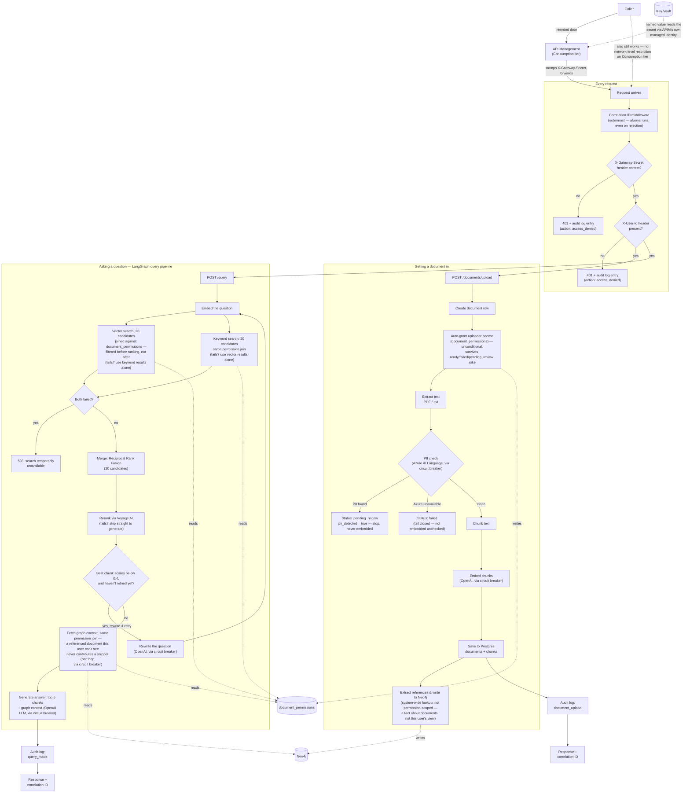
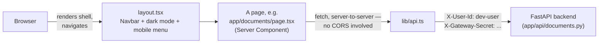
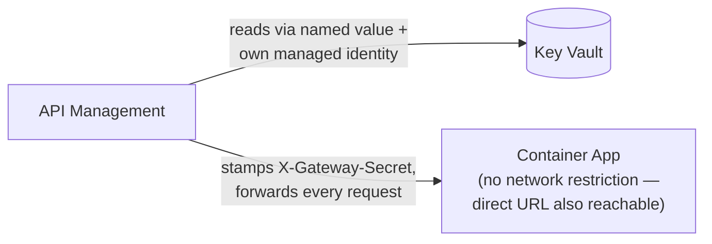
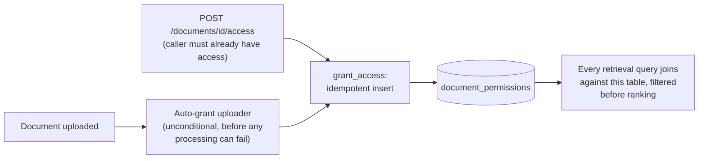
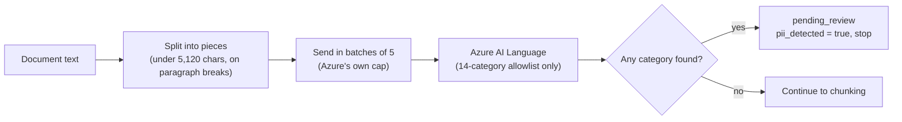
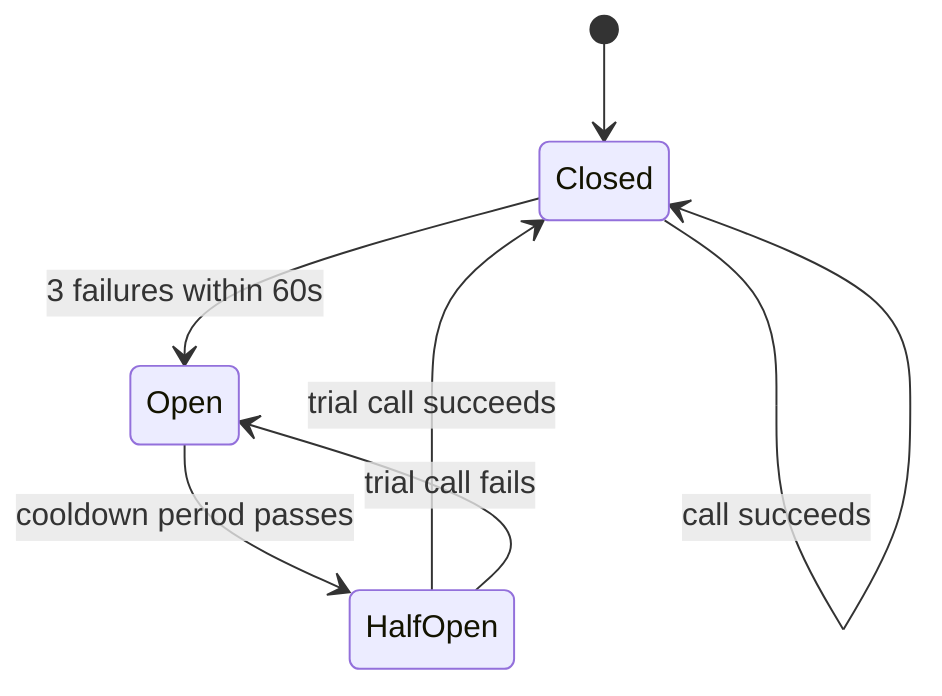
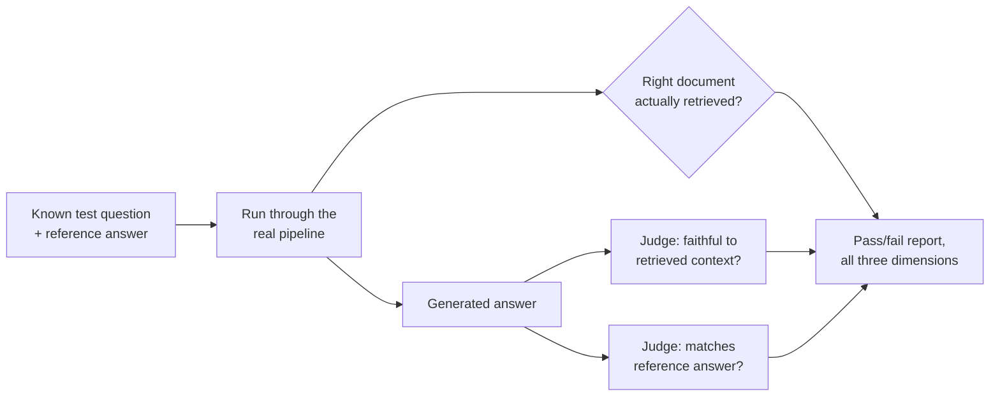
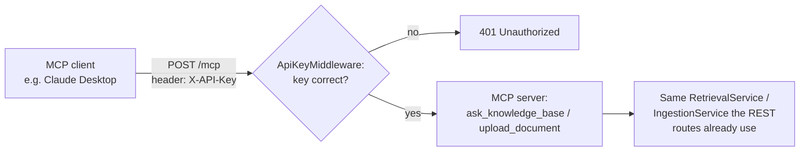
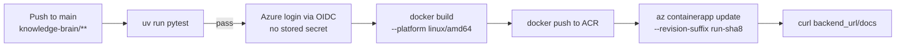

# Knowledge Brain — Architecture Guide

## What this system does

Knowledge Brain lets a company upload its internal documents and then ask
questions about them in plain English. Think of it like a private search
engine that gives you answers instead of a list of links.

## The big picture — how the pieces fit together

Two things exist now: getting a document *into* the system, and asking a
question *about* it. The second of those is no longer a straight line —
it's a LangGraph pipeline that can notice its own search results are
weak, rewrite the question, and try once more before giving up and
answering with whatever it has. Both flows now also touch a second
database: Neo4j, which remembers explicit references between documents
(not similarity — actual "this mentions that") and lets a question's
answer pull in context from a document that was never directly
retrieved, only connected. A request also reaches the backend through
one of two doors now: the intended one, Azure API Management, which
stamps a shared secret onto everything it forwards; or the Container
App's own direct URL, which still works too, since Consumption tier
APIM has no network-level way to block it. Everything after that in
the build order doesn't exist yet. Every request, regardless of which
flow it's on, also gets a correlation ID, an audit log entry, and
circuit-breaker protection around its external AI calls (OpenAI,
Voyage AI, and now Neo4j).

**Getting a document in:** a user uploads a file — through the REST
endpoint or through MCP, both funnel into the exact same pipeline —
and before anything else, the request has to carry a `X-User-Id`
header identifying who's asking; missing it means an immediate
rejection, logged as its own audit event. Once a document row exists,
its uploader is automatically granted access to it — regardless of
what happens next, so a document that later fails or gets held for
review is still visible to the person who uploaded it. The file's raw
text is then pulled out, and before anything else happens, that text
is checked for personal information (names, phone numbers,
government IDs, that kind of thing) by Azure AI Language. If it finds
any, the document stops right there: it's marked `pending_review` with
`pii_detected = true`, and nothing about it is ever chunked or
embedded — its raw text never reaches the vector index. If Azure
itself is unavailable, the document fails closed the same way any
other ingestion failure does, rather than skipping the check and
embedding something unverified. Only once a document is confirmed
clean does the rest of the pipeline run: that text is cut into small
overlapping pieces, each piece is turned into a list of numbers that
represents its meaning, and those pieces and their numbers are saved
in the database. If anything else goes wrong along the way, the
document is marked failed, with a recorded reason, rather than left in
limbo. If it succeeds, one more thing happens before the response goes
out: an LLM reads the document's text looking for specific, named
things it mentions (an error code, a ticket number), and for each one,
checks whether any *other* already-stored document actually contains
it — if so, that connection gets written to Neo4j as an explicit link
between the two documents. This step is best-effort: if it fails, the
upload still succeeds, it just won't have graph links yet.

**Asking a question:** a user sends a question, again carrying their
`X-User-Id` → it's turned into a meaning-vector, and two independent
searches run one after another: a vector search (closest meaning) and
a keyword search (Postgres full-text search, for exact terms vector
search can miss — error codes, product IDs, rare proper nouns). Both
searches are joined against the permissions table, so a chunk from a
document this user was never granted access to is never a candidate in
the first place — filtered before ranking, not after, the same way
ADR-012's hybrid-search fix avoided truncating results by filtering too
late. Each fetches a wider pool of 20 candidates, not just the final 5.
If one of the two searches fails, the system doesn't
give up — it proceeds using whichever search actually succeeded, and
only returns an error if *both* fail. The two ranked lists (or the one
that's available) are merged into one using Reciprocal Rank Fusion,
favoring chunks either search strongly agrees on. That merged pool is
then reranked: Voyage AI's reranking model looks at the actual question
and each candidate chunk *together* (unlike vector/keyword search, which
score them separately), and picks the 5 that actually answer the
question best — and now also reports *how* relevant the best one really
is. If that top score is below a threshold (0.4) and this is the first
attempt, the pipeline doesn't just accept weak results — it asks an LLM
to rephrase the question, and searches again from scratch with the new
phrasing, once. If reranking itself is unavailable, or a second attempt
still comes up weak, the pipeline moves on anyway rather than looping
forever, and generates the best answer it can from whatever it found.
Once there are chunks worth using, one more step runs before
generation: for the documents behind those final chunks, the system
asks Neo4j what each one explicitly references — not what's similar to
it, what it actually *names* — and pulls in one snippet from each
referenced document, one hop only. That snippet lookup carries the same
permission join as the primary search — a document being referenced by
one this user can see does not mean this user can see the referenced
document too, and without that check the graph-context feature could
leak content from documents this user was never granted access to,
which live testing actually caught happening before it shipped. Those
final chunks, the graph snippets, plus the *original* question (never
the rewritten one — the rewrite is only a search tool, not a
replacement for what the user actually asked), are handed to an LLM,
which answers using only that retrieved text, and says it doesn't know
rather than guessing if the answer isn't there.

**What's new since the last update:** the frontend (build-order step 13)
now exists, started for real — a separate `frontend/` project (Next.js,
Tailwind, Shadcn/UI on Base UI) sitting alongside the Python backend,
not inside it. So far it has a shared shell (navigation, dark mode,
a responsive mobile menu) and the Document Library page, the first of
five planned pages. The library page needed a real backend addition
first — `GET /documents` didn't exist — built permission-filtered from
the start, the same `document_permissions` join every other retrieval
path already uses. The page itself fetches from a Next.js Server
Component rather than the browser directly, sidestepping the backend's
complete lack of CORS configuration entirely, at the cost of a
temporary hardcoded `X-User-Id` placeholder until real auth exists.
Two real bugs were found and fixed by actually running the app, not by
review: Shadcn's newer Base UI foundation uses a `render` prop for
composition, not Radix's `asChild`, which produced real nested
`<button>` elements until caught via a live hydration error; and this
page was silently eligible for Next.js's static prerendering (no
`cookies()`/`headers()`/`searchParams` used), which would have frozen
it as a stale, un-refreshing snapshot the moment it reached a real
production build — invisible in dev, where pages always render fresh
regardless. Fixed with `dynamic = "force-dynamic"`. See ADR-028 and
ADR-029.

An API Management gateway
(build-order step 11) sits in front of the backend as the intended
public entry point. It imports its picture of the API straight from
FastAPI's own `/openapi.json` rather than duplicating the route list by
hand, and its one policy stamps a shared secret — generated once,
stored in Key Vault, read by APIM itself through a Key Vault-backed
named value and its own managed identity — onto every request it
forwards. A new `gateway_secret_middleware`, sitting between the
correlation ID and identity middleware, rejects anything missing that
exact header. The original design also called for a network-level
lock, restricting the Container App to only accept traffic from APIM's
own IP — but Consumption tier APIM has no static outbound IP at all,
confirmed live (`az apim show` returned an empty list), so that half of
the design doesn't exist: the backend's own direct URL still works,
completely unrestricted, and the header secret is the one real
mechanism deciding access today. Rate limiting was designed, attempted,
and removed for the same reason — Consumption tier rejects the
per-caller policy this needed outright, and the fallback Azure offers
is scoped per-subscription, meaningless given `subscription_required =
false` was deliberately left off. Verifying this feature live also
surfaced a real, separate incident: the Azure Postgres database had
never had its application tables created, so any rejected request
against the deployed backend crashed trying to write its audit log
entry — caught only because API Management's own request trace showed
the gateway mechanism itself working correctly before that unrelated
crash happened. Fixed the following session (see ADR-027); a real
request through APIM now returns the correct `401` instead of a `500`,
a clean end-to-end confirmation the trace evidence alone couldn't give
at the time. See ADR-026.

Document-level access control
(build-order step 8) — every uploaded document is now visible only to
users explicitly granted access, checked at retrieval time via a SQL
join, not after results come back. A lightweight `X-User-Id` header
stands in for real identity (full auth is build-order item 14, still
much later); missing it gets an immediate 401. Uploading a document
auto-grants its uploader; a new endpoint lets anyone with access grant
it to someone else. The permission check itself lives inside the
repository's search queries, not the API routes, so both REST and MCP
inherit it automatically — but that same reasoning revealed a real gap
live: `DocumentGraphService`'s reference-building and the query
pipeline's graph-context snippet lookup each read chunk data through
their *own* separate functions, neither of which the primary search fix
touched. Reference-building was deliberately left permission-agnostic
(it establishes system-wide facts about documents, not a user's view),
but the graph-context snippet lookup had no permission check at all —
a real leak, closed with the same join everywhere else uses. See
ADR-019.

PII (personal information)
detection (build-order step 7), the first check that can stop a
document from being ingested at all rather than just degrade quality.
It runs inside `IngestionService` itself, not either API route, so it
protects both the REST upload endpoint and MCP's `upload_document`
automatically — neither file needed to change. Detection is scoped to
an explicit, hand-picked list of 14 categories (names, contact info,
financial data, US and India government IDs), not Azure's full
173-category default set — live testing caught a real false-positive
source first: Azure's `PersonType` category flagged ordinary words
like "employee" as PII, which would have made nearly every real
document trigger a review. Long documents get split on paragraph
breaks and sent in batches, to stay under Azure's real 5,120-character
synchronous request limit without cutting through the middle of a name
the way a hard character cut could. See ADR-018.

An MCP server (build-order step 10) was added before that, a second
front door into the exact same pipeline. MCP (Model
Context Protocol) is a standard way for an AI client — Claude Desktop,
another agent — to discover and call a tool directly, instead of only
being reachable through this project's own `/query` and `/documents`
endpoints. It's mounted onto the same running app under `/mcp`,
guarded by one shared secret checked in raw ASGI middleware (plain
`scope`/`receive`/`send`, not Starlette's `BaseHTTPMiddleware`, which
turned out to break MCP's long-lived streaming responses — found by
live testing, not by reading the code). It exposes exactly two tools,
`ask_knowledge_base` and `upload_document`, and neither one is new
logic — both are thin wrappers around the same `RetrievalService` and
`IngestionService` the REST routes already use, reusing every circuit
breaker, the audit log, and correlation IDs without duplicating any of
it. See ADR-017.

An evaluation harness (build-order step 9) was added before that,
living entirely outside the running app in `eval/`. It's the
first thing in this project that actually measures answer quality
systematically rather than by a human eyeballing one response — a fixed
set of known-answer test questions run against dedicated fixture
documents through the real pipeline, scored on whether the right
document was retrieved, whether the answer stayed grounded in its
context, and whether it matched the reference answer, using a separate
LLM call to judge each of the last two. Verified live: all 6 test cases
passed on all three dimensions. Deliberately scoped as an offline,
on-demand tool — not wired into CI yet, and not to be confused with a
different, related idea (a real-time safety check on every live answer)
that came up in the same conversation and was split out as its own
future build-order item instead. See ADR-016.

A Neo4j document relationship graph (build-order step 6) was also
added. Unlike hybrid search or reranking, this
isn't about finding text that reads similarly — it's about explicit,
named connections between documents (a support note mentioning a
specific ticket ID that another document actually defines) that
similarity search structurally cannot see. An LLM extracts what a
document explicitly mentions at upload time; the existing keyword
search (no new lookup mechanism needed) resolves each mention to a
real document if one exists; a `REFERENCES` edge gets written to Neo4j.
At query time, the pipeline follows that edge one hop out from whatever
was actually retrieved, pulling in extra context from documents that
were never directly searched, only connected. Verified live: a question
answerable only by combining two separate documents came back correct,
citing a detail that existed solely in the graph-linked one. See
ADR-015.

The query pipeline (build-order step 5) is a LangGraph graph that can
loop back once if what it finds is weak, rather than a fixed sequence.
Getting the "weak" signal right took a real pivot: the original plan
(retry when zero chunks come back) turned out to basically never fire
with real data, since vector search always returns *something*, however
irrelevant — live testing caught this before it shipped. The actual
trigger is Voyage's own relevance score on the best chunk found,
thresholded at 0.4 based on real measured scores (a true match scored
0.914; irrelevant questions scored ~0.28–0.29 against the same data).
See ADR-014.

## The main components

**Frontend (`frontend/`)** — a separate Next.js project, not part of the
Python backend at all, talking to it purely over HTTP. `app/layout.tsx`
is the shared shell every page sits inside: navigation, dark mode
(via `next-themes`, toggling a `dark` class that every color in
`globals.css` is keyed off through CSS variables), and a hamburger menu
below the `md` breakpoint. `lib/api.ts` and `lib/config.ts` hold the one
place that knows how to reach the backend — the base URL, the temporary
`dev-user` identity placeholder, and the gateway secret local dev needs
to send by hand. Talks to: the FastAPI backend, over plain HTTP, from
the Next.js server itself rather than the browser (see the Document
Library entry below for why). If it disappeared, the backend and its
API would still work exactly as before — MCP and direct `curl`/API
access would be unaffected, only the human-facing UI would be gone.

**Document Library (`frontend/app/documents/page.tsx`)** — the first of
five planned frontend pages, and the first real proof the frontend can
talk to the backend end to end. An `async` Server Component: fetches
the calling user's documents once, server-side, before the page ever
reaches the browser. Explicitly marked `dynamic = "force-dynamic"` —
without it, Next.js would treat the page as eligible for build-time
static prerendering (nothing in it reads `cookies()`, `headers()`, or
`searchParams`), freezing it as a stale snapshot in production, a real
bug caught live, not by review. Handles all three states `CLAUDE.md`
requires explicitly: `loading.tsx` (a skeleton grid, shown automatically
by Next.js while the fetch is in flight), `error.tsx` (a human-readable
retry screen, not a raw stack trace), and a designed empty state (not a
blank page) when the list comes back genuinely empty. Talks to:
`GET /documents` on the backend. If it disappeared, there would be no
way to see what's already been uploaded — uploads (once that flow
exists) would still succeed, just invisibly.

**API Management gateway (`infra/apim.tf`)** — the intended front door
onto the whole system, sitting in front of everything below it. Its one
job is stamping a shared secret onto every request it forwards, so the
backend can tell "came through the gateway" from "didn't." Talks to:
Key Vault (reading the secret via its own managed identity), and the
Container App (forwarding every request that reaches it — nothing
filters *which* requests reach it, since the intended network-level
restriction turned out not to be possible on this tier). If it
disappeared, nothing about the backend's own behavior would change —
callers would just need to know the direct Container App URL instead,
which already works today regardless.

**API route (`app/api/documents.py`)** — the "front door." Accepts an
uploaded file over the network, rejects unsupported file types immediately,
and hands the file off to the ingestion service. Talks to: the ingestion
service. If it disappeared, there'd be no way to get a file into the system
at all.

**Identity middleware (`app/core/middleware.py`)** — the newest
addition, `user_id_middleware`, sits alongside the correlation ID
middleware and stamps every request with whoever's calling, read from
an `X-User-Id` header. Unlike a correlation ID, this one can't be
invented when missing — no header means an immediate 401, logged to
the audit table as its own event. Exempts only Swagger UI's own pages
(`/docs`, `/openapi.json`, `/redoc`), so the API's documentation stays
browsable without an identity. Talks to: the audit log directly (it
opens its own database session, the same way MCP's tools do, since
middleware runs outside FastAPI's dependency injection). If it
disappeared, every permission check downstream would have nothing to
check against.

**Permission repository (`app/repositories/permission_repository.py`)**
— all direct database access for who can see which document.
`grant_access` is idempotent (`ON CONFLICT DO NOTHING`, not
check-then-insert, so two concurrent grants for the same pair can't
race into an error); `has_access` is a plain existence check. Talks to:
nothing but the database — this table is intentionally simple, one row
per (document, user) grant, no roles or ownership tiers. If it
disappeared, nothing could ever be shared, and no document would be
retrievable by anyone, including its own uploader.

**Ingestion service (`app/services/ingestion_service.py`)** — the
conductor. Knows the *order* the pipeline steps must run in (extract,
check for PII, then chunk, then embed, then save), and marks the
document ready, pending review, or failed at the end. Talks to:
extraction, PII detection, chunking, embedding, and the repository. If
it disappeared, each individual step would still work, but nothing
would tie them together. Deliberately does *not* know about the
relationship graph below — building references is a separate concern,
run afterward, not folded into this service's own responsibility. This
is also the one place both the REST upload route and MCP's
`upload_document` tool both call — anything added here, like the PII
check below, protects both automatically.

**PII detection (`app/services/pii_detection.py`)** — a single
function, `detect_pii`, that sends a document's text to Azure AI
Language and returns which of an explicit 14-category allowlist it
found, if any (not Azure's full default set — see below). Splits text
longer than Azure's per-request character limit on paragraph breaks,
not a hard cut, and batches pieces up to Azure's 5-document cap per
request. Wrapped in its own circuit breaker (`azure_pii_detection`),
independent from every other one in this project. Talks to: Azure AI
Language. If it disappeared, ingestion would still run — but nothing
would stop a document containing personal information from being
embedded and made searchable.

**Document graph service (`app/services/document_graph_service.py`)**
— runs once per document, right after ingestion succeeds. Reads what
the document explicitly mentions (via reference extraction), checks
whether any mention actually matches content already in another
document (via `find_by_keyword_unrestricted`, deliberately not
permission-filtered — this step establishes a system-wide fact about
which documents reference which, not a view scoped to any one user),
and records a `REFERENCES` edge in Neo4j for each real match. Talks to:
reference extraction, the repository, and the graph repository.
Best-effort — if it fails, the document still uploads successfully, it
just won't have graph links yet.

**Reference extraction (`app/services/reference_extraction.py`)** — a
single, narrow LLM call: given a document's text, return the specific
named things it mentions (error codes, ticket numbers, policy names) —
not general topics, only things specific enough to plausibly be their
own document. Wrapped in its own circuit breaker
(`openai_reference_extraction`). Talks to: OpenAI.

**Extraction (`app/services/extraction.py`)** — pulls plain text out of a
file's raw bytes. Different file types (PDF vs plain text) need different
extraction logic, since a PDF's bytes contain layout and font information
mixed in with the actual words.

**Chunking (`app/services/chunking.py`)** — cuts a long piece of text into
smaller, overlapping pieces. Necessary because embedding models work on
short passages, and because search works better on small, focused pieces
than on one giant block of text.

**Embedding (`app/services/embedding.py`)** — calls an external AI model
(OpenAI) that turns each chunk of text into a list of numbers representing
its meaning. This is what will eventually let us search "by meaning"
instead of just by exact keyword.

**Repository (`app/repositories/document_repository.py`)** — the only
place in the codebase that talks directly to the database. Everything else
asks the repository to save or update things, rather than writing its own
database queries. Also the actual enforcement point for document
permissions: `find_similar_chunks` and `find_by_keyword` both join
against `document_permissions`, and `get_first_chunk_text` (used for
graph context) does the same — deliberately not centralized behind one
shared check, since each query needs the join applied to its own SQL.
`find_by_keyword_unrestricted` exists specifically *without* that join,
for the one caller (reference-building) that needs to see every
document regardless of ownership. `list_documents_for_user` (added for
the Document Library page) is the same pattern applied to browsing
instead of search — a document with no matching permission row for the
calling user simply never appears in the result.

**Retrieval service (`app/services/retrieval_service.py`)** — still the
conductor for answering questions. `answer_question` builds a small
LangGraph graph (in `__init__`) and hands the question to it; the
actual step logic lives in six methods on this class (`_retrieve_node`,
`_rerank_node`, `_rewrite_node`, `_should_retry`, `_graph_context_node`,
`_generate_node`), each a graph node, all reusing the exact same
search/rerank/graph-lookup helpers hardened in ADR-012, ADR-013, and
ADR-015 — nothing about the existing partial-failure or
reranker-fallback behavior changed to add graph context on top. Talks
to: embedding, the repository, hybrid search, reranking, query
rewriting, the graph repository, and generation.

**Query graph (`app/services/query_graph.py`)** — defines the shape of
the data that flows between the retrieval service's graph nodes
(`QueryState`: the question, its possibly-rewritten form, candidates,
reranked chunks, a relevance score, retry count, the answer) and wires
those nodes into a compiled LangGraph graph. Talks to: nothing directly
— it only describes connections between methods the retrieval service
already owns.

**Query rewriting (`app/services/query_rewriting.py`)** — a single,
narrowly-scoped LLM call: given a question that just returned weak
search results, ask a model to rephrase it into something more likely to
find real content. Wrapped in its own circuit breaker
(`openai_query_rewrite`), kept separate from generation's, so a
rewriting outage can't be mistaken for a generation outage. Talks to:
OpenAI.

**Hybrid search (`app/services/hybrid_search.py`)** — merges the vector
search and keyword search result lists into one ranked list, using
Reciprocal Rank Fusion (scoring by rank position in each list, summed
across both, rather than trying to compare their raw, incomparable
scores). Talks to: nothing directly — it's a pure function called by the
retrieval service.

**Reranking (`app/services/reranking.py`)** — takes hybrid search's wider
candidate pool and re-scores it by sending the actual question and each
candidate chunk *together* to Voyage AI's reranking model, unlike
vector/keyword search, which score them separately and therefore more
approximately. Returns only the best few chunks, in order. Wrapped in its
own circuit breaker (`voyage_reranking`), independent from the two
OpenAI ones. Talks to: Voyage AI's hosted API.

**Generation (`app/services/generation.py`)** — sends the question and the
retrieved chunks to an LLM, with instructions to answer only from that
text and admit uncertainty rather than guess. This is the piece that
actually turns "relevant text" into a readable answer.

**Database (Postgres + pgvector, running in Docker)** — stores documents
and their chunks, including each chunk's meaning-vector, in one place,
and now answers both "which chunks are closest in meaning to this
vector?" (pgvector cosine similarity) and "which chunks best match these
keywords?" (Postgres's built-in full-text search) — no second database
needed for either.

**Graph database (Neo4j, running in Docker)** — stores one node per
document and directed `REFERENCES` edges between them, answering a
question neither pgvector nor full-text search can: "what does this
document explicitly point at, regardless of how differently worded the
two are." `app/core/graph_database.py` holds the driver/session setup
(mirrors `database.py`), and `app/repositories/graph_repository.py` is
the only place that writes Cypher (mirrors `document_repository.py`).
Wrapped in its own circuit breaker (`neo4j`).

**Correlation ID middleware (`app/core/middleware.py`)** — stamps every
incoming request with a unique ID (or reuses one a caller already sent),
readable from anywhere in the code handling that request via
`get_correlation_id()`, and echoes it back as a response header. Talks to:
nothing directly — every route and response includes its value. If it
disappeared, there'd be no way to trace one request's activity across
logs. Registered *last* in `main.py`, deliberately — the last middleware
registered wraps *outermost*, so this one always gets to stamp its
header even when `user_id_middleware` rejects a request before
anything else runs.

**Audit log (`app/models/audit_log.py`, `app/repositories/audit_repository.py`)**
— an append-only record of every user-initiated, state-changing action
(a document was uploaded, a question was asked). The repository
deliberately exposes only an insert method — nothing in the codebase can
update or delete an entry. Talks to: called directly from the API routes,
right after each action succeeds.

**Circuit breaker (`app/core/circuit_breaker.py`)** — wraps both OpenAI
call sites (embedding and generation) and stops calling OpenAI for a
cooldown period once it's failed repeatedly, instead of letting every
request separately wait for a doomed call to time out. Two independent
instances exist, one per call site, so a run of embedding failures
doesn't affect generation's circuit.

**Evaluation harness (`eval/`)** — a separate, on-demand tool, not part
of the running app: a fixed set of known-answer test questions
(`eval/dataset.json`), run against a handful of small, dedicated
fixture documents (`eval/fixtures/`) through the *real* pipeline, then
scored on three separate things — was the right document actually
retrieved, is the answer grounded in its context (`eval/judge.py`'s
`judge_faithfulness`), and does it match the reference answer
(`judge_correctness`). Talks to: the real ingestion and retrieval
pipelines, plus its own OpenAI circuit breaker for the two judge calls.
If it disappeared, the system would still work exactly the same —
there'd just be no way to tell, other than manually reading answers,
whether a change made retrieval or generation better or worse.

**MCP server (`app/mcp/server.py`, `app/mcp/auth.py`)** — a second
front door onto the same pipeline, for AI clients rather than a human
typing questions. `server.py` registers two tools, `ask_knowledge_base`
and `upload_document`, each a thin wrapper that opens its own database
(and, where needed, Neo4j) session and calls the exact same services
`app/api/query.py` and `app/api/documents.py` already call — no
business logic lives here. `auth.py`'s `ApiKeyMiddleware` runs first on
every request to `/mcp`, rejecting anything that doesn't carry the
correct shared secret before it can reach a tool at all. Talks to:
`RetrievalService`, `IngestionService`, `DocumentGraphService`, the
audit log — everything the REST routes already talk to. If it
disappeared, the pipeline would still work exactly as before; only the
MCP-specific entry point would be gone.

## Key decisions we made and why

We run the pipeline synchronously (the user waits while their file is
processed) rather than using a background queue like Kafka, deliberately
starting simple and adding a queue later once we feel the pain of long
processing times. Concretely, that pain has a number: with the database
connection pool's default size, roughly 15 concurrent uploads is enough
to start exhausting it, since each upload holds its connection for the
whole pipeline's duration — that's the actual threshold that would justify
Kafka, not a vague sense of "too much traffic." See ADR-001.

We chose Postgres + pgvector over a dedicated vector database (Qdrant) to
start, since it keeps document metadata and search vectors in one place
with one connection, and Qdrant is planned for later once we need
specialized, large-scale vector search. See ADR-002.

We run Postgres in Docker rather than installing it directly on the
developer's machine, to avoid it colliding with other software already
installed locally, and so the exact same setup works on any machine. See
ADR-003.

We instruct the answer-generation model explicitly to say it doesn't know
rather than guess, because an LLM's default tendency is to always produce
a confident-sounding answer — without that instruction, missing or
irrelevant retrieved context would likely lead to a made-up answer instead
of an honest "not found." See ADR-004.

Rather than retrofitting every "enterprise requirement" from an expanded
project scope all at once, we split them by whether they're actually
buildable yet: correlation IDs, audit logging, and circuit breakers were
added now since they're self-contained; PII detection, access control,
and Azure-specific concerns (API gateway, Key Vault) were deferred, since
they depend on work — an auth model, an actual cloud deployment — that
doesn't exist yet. See ADR-007.

The correlation ID is shared across a request using a `ContextVar` rather
than FastAPI's `request.state`, specifically because services and the
repository are called several layers deep and never receive the raw
`request` object — a `ContextVar` is readable from anywhere in that call
chain without threading it through every function signature. See ADR-008.

The circuit breaker was built by hand rather than pulling in a library,
consistent with how the rest of this project was built, and its state
lives in each process's memory — meaning it does not yet work correctly
across multiple server instances, since each one tracks failures
independently. At real scale that's not just a missed optimization, it's
a misleading on-call signal: dashboards would show inconsistent,
partial error rates split oddly across replicas instead of one clean
"OpenAI is down," which looks like a bug rather than the protection
working as intended. See ADR-010.

Keyword search uses Postgres's built-in full-text search rather than a
dedicated search engine like Elasticsearch, for the same reason pgvector
was chosen over Qdrant — one database, no new infrastructure. The two
result lists (vector and keyword) are merged with Reciprocal Rank Fusion
rather than trying to combine their raw scores directly, since a cosine
distance and a text-relevance score aren't measured on comparable scales.
See ADR-011.

Reranking uses Voyage AI's hosted API rather than a local cross-encoder
model or reusing OpenAI with a ranking prompt — the goal was specifically
a model purpose-trained for relevance scoring, without pulling a heavy
new local ML dependency into a project that otherwise only ever talks to
hosted AI APIs. Reranking is the one external AI dependency in this
system that's genuinely optional: if it fails, the request still
succeeds, just using hybrid search's own ranking instead — unlike an
OpenAI failure, which still fails the request today, just with a clean
`503` instead of a crash. See ADR-013.

The query pipeline detects "weak retrieval" using Voyage's own
relevance score, not an empty-results check — the empty-results version
was actually built first, per the original plan, and found not to work
against live testing: vector search has no relevance floor, so it
always returns *something*. The retry is also deliberately skipped, not
just declined, when reranking itself is unavailable rather than merely
weak — rewriting the question can't fix an unreachable API, and would
likely just hit the same open circuit again a moment later. `MAX_RETRIES`
is a hard cap of 1, and deliberately not something that gets raised
under higher traffic — more retries under load means more calls to the
exact vendors already struggling, worsening the problem instead of
fixing it, the same retry-storm reasoning ADR-012 already used once. See
ADR-014.

The document relationship graph tracks explicit references extracted
from a document's own text, not topic similarity an LLM infers — the
latter was considered and rejected specifically because it would
substantially duplicate what vector search already does; the graph's
whole reason to exist is answering a structurally different question
similarity search can't. Traversal is deliberately capped at one hop
(what a document directly references, never references-of-references),
and the whole feature is best-effort, same as reranking: unreachable
Neo4j degrades to "no extra context," never a failed upload or a failed
query. See ADR-015.

The evaluation harness's test documents live in the *same* database as
everything else, not a separate one — a fully separate eval database
(the same pattern the pytest test suite uses) was considered and
rejected as more isolation than the problem actually needed; a handful
of dedicated, idempotently-ingested fixture documents gets the same
reproducibility without a second database to maintain. Faithfulness and
correctness are judged by two separate LLM calls, not one combined
call, specifically to avoid one response conflating two different
judgments. See ADR-016.

Identity is delivered via middleware and a `ContextVar`, mirroring the
correlation ID pattern exactly, rather than a FastAPI `Depends()` —
specifically because it needed to cover MCP too, and MCP tools aren't
FastAPI routes that can use route-level dependency injection.
Permission checks live inside the repository's own queries as a SQL
join, applied before ranking and the `LIMIT`, not as a filter on
results afterward — the same reasoning ADR-012 already used to avoid
silently truncating results by filtering too late. Sharing a document
uses the simplest available rule — anyone who currently has access can
grant it to someone else — accepted deliberately over building
ownership tracking, a real scope trade-off named in ADR-019, not an
oversight. Building this surfaced a genuine architectural lesson: there
is no single central gate protecting all chunk access in this system,
since `DocumentGraphService`'s reference-building and the query
pipeline's graph-context lookup each read chunk data through their own
separate repository functions, neither automatically covered by fixing
`find_similar_chunks`/`find_by_keyword` alone — the graph-context path
had no permission check at all until this was found live and fixed.
See ADR-019.

PII detection runs inside `IngestionService`, not either API route,
specifically so it protects both `/documents/upload` and MCP's
`upload_document` without either file changing — the same reasoning
that let MCP itself reuse the service layer unchanged. It fails
closed, not open like reranking or Neo4j, when Azure's service is
unavailable — a deliberate departure from this project's usual
best-effort pattern, because this is a compliance gate, not a
quality-of-answer feature: an unverified document must not be
embedded, even at the cost of blocking uploads system-wide during an
Azure outage. That trade-off was raised again, deliberately, after the
feature shipped — a real availability concern worth reconsidering once
this handles genuine production traffic, tracked rather than resolved.
Detection is scoped to an explicit 14-category allowlist rather than
Azure's full default set, after live testing — not code review — found
Azure's `PersonType` category flagging ordinary words like "employee"
as PII, which would have made nearly every real document trigger
review. See ADR-018.

The MCP server is mounted onto the existing FastAPI app rather than
run as its own standalone process, specifically to reuse the circuit
breakers, audit logging, and correlation ID middleware already built —
a separate process would need to duplicate all of that wiring instead.
It's gated by a network-reachable HTTP transport rather than a
local-only one, a deliberate choice to learn how this pattern works in
a real enterprise deployment, which in turn meant pulling forward a
minimal slice of build-order item 14 (one shared API key, checked with
a constant-time comparison) rather than the full auth system, or
building the full item early. A single shared secret was chosen over
per-caller keys because there's exactly one real caller type today —
distinguishing callers only matters once there's more than one kind to
distinguish. The gate itself is raw ASGI middleware, not Starlette's
more common `BaseHTTPMiddleware`, after live testing showed
`BaseHTTPMiddleware` silently breaks MCP's long-lived streaming
responses by running the wrapped app in a separate, buffered task. See
ADR-017.

API Management was chosen on Consumption tier for the same reason
every other "cheapest managed option" in this project was — pay per
call, no fixed monthly bill, appropriate for a project with no real
production traffic yet. That choice was made before discovering it
couldn't deliver the network-level half of the original two-lock
design: Consumption tier has no static outbound IP at all, confirmed
live rather than assumed, so the Container App can't actually be
restricted to only accept APIM's traffic. Rather than leave in
Terraform code that silently generated zero restriction rules while
implying real protection, it was removed, and the gateway secret header
was accepted as the one real lock — mirroring the same trade-off this
project already made for MCP's single shared secret, proportionate to
a project with no real external callers yet, not a permanent design.
Real network isolation would need Developer or Premium tier's VNet
integration, a genuine ongoing cost. Rate limiting was designed,
attempted, and also removed: the per-caller policy the requirement
actually needed isn't available on Consumption tier at all, and the
fallback Azure offers there is scoped per-subscription — meaningless
given subscriptions were deliberately left unrequired. See ADR-026,
including a correction made during the feature's own interview-prep
review: upgrading tier may restore real rate limiting *and* network
isolation together, since the originally wanted policy never actually
needed subscriptions in the first place, a claim not yet confirmed
against Azure's own documentation.

The frontend fetches from a Next.js Server Component rather than the
browser, specifically to avoid the backend needing any CORS
configuration at all — the request happens server-to-server, where the
browser's cross-origin restriction never applies in the first place.
Chosen over adding `CORSMiddleware` to the backend, since the backend
would need no change at all for something driven entirely by a
temporary, pre-auth identity placeholder. This has a real limit: it
only works for data a Server Component can fetch before rendering — the
upcoming upload flow needs genuine client-side interactivity (a file
picker, drag-and-drop, progress feedback), which will force a real
choice between adding CORS for that one path or proxying uploads
through a Next.js Route Handler instead. See ADR-029.

## How data moves through the system

**Uploading a document:** a user sends a file to the upload address —
either the REST endpoint or MCP's `upload_document`, both reach the
same code from here on — carrying an `X-User-Id` header identifying
who they are; missing it, the request is rejected before any of this
runs. The system checks the file type is supported, creates a database
record for the document immediately (marked "pending"), and
immediately grants the uploader access to it — regardless of what
happens during the rest of ingestion, so a document that later fails or
gets held for review is still visible to whoever uploaded it. It then
extracts the document's text. Before anything else, that text is
checked for personal information by Azure AI Language, scoped to a
specific 14-category allowlist. If any is found, the document stops
here: marked "pending review," `pii_detected` set permanently to true,
and nothing further happens to it — no chunking, no embedding. If
Azure itself can't be reached, the document fails closed the same way
any other failure does, with the reason recorded, rather than skipping
the check. Only a document confirmed clean continues: its text is
split into chunks, each chunk becomes a meaning-vector, and everything
is saved to the database. If every step succeeds, the document is
marked "ready." If any step fails, the document is marked "failed"
instead of being left stuck partway through. If it succeeds, one more
thing happens: an LLM reads the document's own text for specific
things it names — an error code, a ticket ID — and for each one, the
existing keyword search checks whether any other stored document
actually contains it. Real matches get written to Neo4j as an explicit
link. This step can't fail the upload; if Neo4j or the extraction call
is unavailable, the document is still "ready," it just has no graph
links.

**Asking a question:** a user sends a question to the query address,
again carrying their `X-User-Id`. The question is turned into a
meaning-vector using the same embedding model used for chunks, so the
two are comparable. Postgres finds 20 candidate chunks by vector
similarity and, separately, 20 by keyword match — both searches joined
against the permissions table, so a document this user was never
granted access to is never a candidate at all, not filtered out
afterward — and merges the two ranked lists into one with Reciprocal
Rank Fusion. Voyage AI's reranking model then looks at the actual
question and each of those 20 candidates together, narrows them down to
the 5 that genuinely answer the question best, and reports how relevant
the best one actually is. If that top score is weak and this is the
first attempt, the pipeline loops back: an LLM rephrases the question,
and the whole search runs again with the new phrasing — once, never
more; the user's identity carries through the retry unchanged, since it
was set once in the graph's shared state and no node along the way
touches it. Once there are chunks worth using, the system asks Neo4j
what the documents behind those chunks explicitly reference — one hop
only — and pulls in a snippet from each, subject to the same permission
check: a referenced document this user can't see contributes no
snippet. Those chunks, the graph snippets, and the *original* question
are sent to an LLM, which writes an answer grounded only in that
retrieved text.

**Asking a question or uploading a document via MCP:** an AI client
sends a request to `/mcp` with a shared secret in a header instead of
a human hitting `/query` or `/documents/upload` directly. The gate
checks that secret first — wrong or missing, the request stops there
with a 401, nothing else runs. Once past the gate, the request follows
the exact same two journeys described above: `ask_knowledge_base` and
`upload_document` are thin wrappers calling the same
`RetrievalService` and `IngestionService`, so everything from that
point on — the LangGraph retry loop, graph context, the audit log
entry — behaves identically regardless of which door the request came
through.

## What could go wrong and how we handle it

**A scanned PDF with no real text** — some PDF pages are just a photograph
of a page, with no actual character data underneath. Extracting text from
a page like that returns nothing, so that page contributes no searchable
content. The document still gets marked "ready," since nothing in the
pipeline actually errors — it just silently produces zero useful chunks,
which is a worse failure mode than a visible one, since there's no signal
telling anyone it happened. Not handled yet — a future improvement would
add OCR (a technology that reads text out of images) to cover this case.

**An embedding call fails partway through a large document** — because all
of a document's chunks are sent to the embedding model in a single batch
request, a failure there means none of that document's chunks get saved,
not a partial set. The whole document is marked "failed," and it would
need to be re-uploaded and reprocessed from scratch.

**No documents have been uploaded yet, or nothing relevant matches** — the
similarity search still returns *something* (it always returns the
closest chunks it can find, even if none are truly relevant). The query
pipeline now notices this, using Voyage's own relevance score rather
than trusting that "some chunks came back" means they're any good — if
the best one scores below 0.4 and this is the first attempt, it rewrites
the question and tries once more before giving up. Even after that,
there's still no guarantee: the generation step's "say you don't know"
instruction is what actually prevents a bad answer, and that instruction
isn't perfectly reliable — there's no automated evaluation harness yet
(build-order step 9) measuring how often the model still guesses despite
being told not to, so today the only backstop is a human noticing an
answer looks wrong. See ADR-004 and ADR-014.

**The query pipeline's retry loop itself has a blind spot** — when it
fires, it's invisible to anyone watching the system from outside: the
user just gets an answer, with nothing in the API response indicating a
retry happened. The only trace today is a correlation-tagged log line
inside `_rewrite_node`. There's no metric yet for "how often does this
retry fire," so an on-call engineer would have to know to grep logs for
it specifically — acceptable at zero production traffic, not acceptable
once this serves real users. See ADR-014.

**OpenAI itself starts failing repeatedly (outage, rate limit)** — after
3 failures within 60 seconds, that call site's circuit breaker opens.
Further ingestion attempts fail fast and the document is marked `failed`,
same as any other embedding failure. Further query attempts get an
immediate `503` with a clear "temporarily unavailable" message instead of
hanging until a timeout. After a cooldown, one trial call is allowed
through to check whether OpenAI has recovered. This only works cleanly
as a single process today — run more than one server instance and each
tracks its own failures independently, so one instance can report "down"
while others keep serving successfully, a confusing, inconsistent signal
rather than a clean one. See ADR-010.

**Voyage AI (reranking) starts failing repeatedly** — after 3 failures in
60 seconds, its own independent circuit breaker opens, same mechanism as
the OpenAI ones. Unlike an OpenAI failure, this doesn't fail the request:
`retrieval_service.py` catches it and falls back to hybrid search's own
Reciprocal Rank Fusion order instead, so the user still gets an answer,
just without reranking's improvement to which chunks were chosen. See
ADR-013.

**Neo4j starts failing repeatedly, either during upload or during a
query** — its own independent circuit breaker opens after 3 failures in
60 seconds, same mechanism as the others. Neither case fails the
request: an upload still succeeds without new graph links (the
extraction LLM call and Neo4j write share one try/except in
`documents.py`, catching only `CircuitOpenError`), and a query still
answers using its retrieved chunks alone, without extra graph context.
Reranking and Neo4j are now the two dependencies in this system where a
failure degrades *quality*, not *availability* — everything else
(OpenAI's embedding and generation calls) still fails the request
outright today, just cleanly, as a `503`. See ADR-015.

**The audit log's tamper-proofing is currently code-level only** — the
repository has no update/delete methods, but the database connection
itself is a superuser and could bypass a real database-level restriction.
True enforcement needs either a separate, deliberately restricted database
role, or (the more realistic enterprise fix) shipping audit entries to
genuinely separate write-once storage, like Azure Blob Storage with an
immutability policy — neither exists yet. See ADR-009.

**Neo4j's document lookup has no index either, same class of gap** —
`MATCH (d:Document {id: $document_id})` currently matches by scanning,
not by an index. Fine at the current handful of documents, a full scan
at real scale — same shape of deferred work as the two gaps below, just
one more database added to the list, not a new kind of problem.

**A referenced document's snippet is naive, not targeted** — the
context pulled in from a referenced document is always just that
document's *first* chunk, not the chunk most relevant to the actual
question being asked. A more accurate version would rerun retrieval
against just that document using the current question — not built,
a known simplification made for this pass, not an oversight.

**Neither half of hybrid search has a real index yet** — both
`cosine_distance` and `to_tsvector` are computed fresh, on every row, on
every query. Fine at our current tiny scale, but at 10 million chunks
(roughly 61 GB of raw embedding data alone, at 1536 dimensions per vector)
an unindexed scan on every query becomes the dominant cost. The fix is an
HNSW index on the embedding column and a GIN index on a persisted
`tsvector` column — deliberately deferred, tracked as a future
optimization rather than forgotten. See ADR-002.

**Keyword search can return fewer chunks than requested, even when vector
search always returns exactly the requested count** — vector search
always finds *the closest* chunks, even if they're not a good match;
keyword search is a real filter and may find fewer matches, or none.
Reciprocal Rank Fusion handles this naturally — a chunk found by only one
search still gets included, just without the score boost a chunk found by
both searches gets.

**One of the two hybrid searches actually errors out (not just "found
nothing," a real failure)** — the request no longer fails outright. The
retrieval service catches each search's failure independently and
proceeds using whichever one succeeded; only a failure of *both* searches
returns a `503`. Getting this right required a second fix: rolling back
the database session to recover from one search's failure was quietly
invalidating the *other* search's already-fetched, successful results,
since a rollback expires every object the session is still tracking —
fixed by detaching each search's results from the session immediately
after fetching them. Found by actually running a test that force-fails
each search independently, not by reading the code. See ADR-012.

**The evaluation harness's own judgment can be wrong** — a real, known
limitation of LLM-as-judge generally, not specific to this
implementation: the judge scoring faithfulness and correctness is
itself an LLM call, and can be wrong or inconsistent between runs, the
same way the system it's judging can be. A passing eval score is a
strong signal, not a mathematical proof. It also only runs when someone
remembers to run it — nothing wires it into CI yet, so it can't catch a
regression on its own, only when manually invoked. See ADR-016.

**A new feature reads chunk data through its own path, bypassing
permission checks that already exist elsewhere** — this already
happened once, live, while building document-level ACL: fixing the
join in `find_similar_chunks`/`find_by_keyword` did nothing for
`get_first_chunk_text`, the separate function powering graph-context
snippets, which had no permission check at all until it was found and
fixed. There is no single central gate protecting all chunk access in
this system — every function reading chunk content needs its own
explicit check, and a future feature (an admin export tool, a new
analytics query) that reads chunks through yet another new path would
need this applied again, deliberately, not inherited automatically.
See ADR-019.

**A shared document can be re-shared indefinitely, with no way for the
original uploader to see or stop it** — the sharing rule is
deliberately simple: anyone with access can grant access to someone
else. There's no ownership concept distinguishing the original uploader
from someone granted access later, so a document could, in principle,
spread to people the uploader never intended and has no visibility
into. Acceptable for a single-tenant learning project; a real
multi-tenant deployment would need ownership tracking before this
rule could be trusted. See ADR-019.

**Identity is entirely self-asserted** — `X-User-Id` is just a header
value; nothing verifies a caller actually is who they claim to be. The
same honest trade-off MCP's shared secret already accepted, and for the
same reason: proportionate for a project with no real users yet, closed
properly once build-order item 14 (real auth) exists.

**Azure AI Language itself goes down during PII detection** — after 3
failures in 60 seconds, its own independent circuit breaker opens,
same mechanism as every other external dependency. Unlike reranking or
Neo4j, this *does* fail the request — deliberately, fail-closed, since
an unverified document must not be embedded. The real cost: one
vendor's outage now blocks every upload, system-wide, on both the REST
and MCP paths — a genuine, larger blast radius than any other single
dependency failure in this system today, accepted for a compliance
gate but flagged, after the feature shipped, as worth reconsidering
once this handles real production traffic rather than test uploads.
See ADR-018.

**A flagged document has nowhere to actually be reviewed** — `pending_review`
and `pii_detected` exist correctly in the database, but there's no
admin UI yet for a human to look at a flagged document and release or
delete it. At any meaningful upload volume, this becomes a second,
separate risk from the fail-closed one above: a growing backlog of
documents nobody has looked at, with no alerting on queue size either.
Frontend work, a future build-order item, not built here.

**The PII allowlist only recognizes US and India identity formats** —
a document containing, say, a French social security number or a UK
national insurance number sails through undetected today. Not a bug —
a deliberate scope decision, made explicit in ADR-018 rather than left
implicit — but a real limit on how broadly this system could honestly
claim compliance coverage without revisiting it.

**The MCP server's shared secret leaks** — anyone holding it can call
either tool, indistinguishable in the audit log from a legitimate
caller beyond "held a valid key." There's no anomaly detection today
watching call volume or timing, so a leak would look like normal
traffic until someone noticed something odd by hand — a real, named
gap, acceptable only because there's exactly one real caller type
today. The fix (per-caller keys, plus volume-based alerting) waits on
build-order item 14 actually existing. See ADR-017.

**A Container App deployment can report success while the app itself
is completely unreachable** — witnessed directly, not hypothetical:
`terraform apply` exited cleanly, yet the real backend stayed down for
over an hour, silently replaced in practice by an old, unrelated
revision still marked healthy. `provisioningState` only confirms
Azure's API accepted the request to update a resource; it says nothing
about whether the process inside the new container ever actually
started. There's no automated alert on this today — an availability
probe against a real endpoint (Application Insights, hitting a `/health`
route that doesn't exist yet) would catch it immediately; right now
the only backstop is a human noticing a stale response. See ADR-022.

**The API Management gateway's secret is the one thing standing between
the backend and the public internet** — there's no network-level
restriction behind it, since Consumption tier APIM has no static IP to
restrict to. If that secret ever leaked, whoever holds it could call
the backend's own direct URL, skipping API Management (and whatever
rate limiting or logging it would otherwise provide) entirely. The
header check has no way to tell "came through the real gateway" from
"knows the right value" — same honest shape of risk this project
already accepted for MCP's shared key. Closing it for real needs a
VNet-capable tier, a genuine ongoing cost, not built here. See ADR-026.

**The Azure Postgres database had no application tables in it at all,
for several sessions, unnoticed** — found live, not by inspection,
while verifying the API Management gateway: every prior "verified live"
deployment check only ever hit `/docs`, which never touches the
database. `create_tables.py` had never been run against it, so any
rejected request against the real deployment crashed with
`UndefinedTableError` trying to write its `audit_log` entry — meaning
no feature that wrote to the database could actually succeed against
the live backend, only against local Docker Postgres. Fixed the
following session: the `vector` extension enabled and every table
created directly against Azure Postgres, confirmed both by `\dt` and by
a real request through the live APIM gateway returning the correct
`401` instead of a `500`. See ADR-027. The real, still-open risk this
incident points at: there's no migration tool (no Alembic, just
`Base.metadata.create_all()`, an idempotent create-everything-once
step) and nothing automates applying a *future* schema change to Azure
the way CI/CD already automates deploying a new image — the next real
column or table added will need this exact same manual process
repeated, not something a `git push` alone will ever trigger.

**A frontend page can look completely correct in dev and still be
silently broken in production** — witnessed directly building the
Document Library page: it rendered its empty state correctly, no
console errors, nothing visibly wrong. The Next.js dev overlay's "Route:
Static" label was the only signal, easy to dismiss as cosmetic. The real
mechanism: this Next.js version caches any `fetch()` reachable before a
request-time API (`cookies()`, `headers()`, `searchParams`) is used, and
this page used none of those — so in a real production build, it would
have been rendered once at build time and served as a frozen snapshot
to every visitor, indefinitely, never showing a newly uploaded document
without a full redeploy. Dev mode hides this completely, since pages
always render on-demand there regardless of static/dynamic
classification — this class of bug is specifically invisible to local
testing alone. Fixed with `export const dynamic = "force-dynamic"` on
any page whose data is inherently per-user or frequently changing —
now a pattern to apply by default to every future page (Query history,
Analytics, Admin), not a one-off fix. See ADR-029.

**A composition pattern that looks right can render as invalid,
nested HTML** — `<DropdownMenuTrigger asChild><Button>...</Button></DropdownMenuTrigger>`
is the standard Radix pattern for "let this trigger render as my own
custom element instead of its own." Shadcn's newer default foundation,
Base UI, has no `asChild` prop at all — confirmed directly from its
installed TypeScript types — so it was silently ignored, and the
trigger rendered its own native `<button>` with the child `Button`
(also a `<button>`) nested inside it, an HTML violation that produced a
real hydration error. The fix, Base UI's actual composition mechanism,
is a `render` prop: `<DropdownMenuTrigger render={<Button>...</Button>} />`.
Caught only by running the app and reading a real browser error, not by
reviewing the component source, which looked equally plausible either
way. See ADR-028.

## Azure infrastructure overview

The real backend is now genuinely running in Azure — not the
placeholder, the actual FastAPI application, reading its secrets from
Key Vault, and reachable from the public internet. This was verified
directly, not assumed from a clean `terraform apply`: a `curl` against
the app's real URL returned an actual `200` from `uvicorn`, serving
FastAPI's Swagger UI, with a genuine `x-correlation-id` header on the
response — Enterprise Requirement 3 working end to end in the deployed
environment, not just in local dev. Build-order item 12 (Azure
deployment) is now **fully complete** — both the manual deploy path
and the automated one (GitHub Actions CI/CD) are verified live, the
latter with a real, unassisted, successful end-to-end run. API
Management (item 11) has since been built too — see the "What's new"
section above and ADR-026 for what it does and doesn't actually close.

Getting there took five separate phases, each documented in its own
ADR: [ADR-020](adr/ADR-020-azure-deployment-infrastructure.md)
(the infrastructure itself — five distinct real errors, from a
regional Postgres restriction to a provider bug needing `terraform
import`), [ADR-021](adr/ADR-021-containerizing-the-backend.md) (the
`Dockerfile`, built and verified locally, pushed to Azure Container
Registry), [ADR-022](adr/ADR-022-deploying-the-real-backend-image.md)
(actually getting that image running live, covered below),
[ADR-023](adr/ADR-023-ci-owns-the-deployed-image.md) /
[ADR-024](adr/ADR-024-github-actions-oidc.md) (designing automated
deploys via GitHub Actions, covered further down), and
[ADR-025](adr/ADR-025-ci-cd-first-real-run.md) (three more real bugs
found only once that pipeline actually ran).

Key Vault now holds six real secrets — the Postgres connection string,
the Neo4j AuraDB password, and the OpenAI, Voyage, MCP, and Azure
Language API keys — each written by Terraform and read by the
Container App at startup through its Managed Identity, never as a
plain environment variable with a real value baked into `main.tf` or
committed to git. Two non-secret values (the Neo4j connection URI and
the Azure Language endpoint) ride alongside as plain environment
variables, since there's nothing to protect in a URL by itself.

Deploying that image live surfaced a real, non-obvious failure that
took a genuine diagnostic chain to trace: `terraform apply` reported
success, but the app stayed unreachable for over an hour afterward.
The actual cause was the container image's own CPU architecture —
built with a plain `docker build` on an Apple Silicon Mac, it came out
targeting `arm64`, while Azure Container Apps only runs `amd64`. Azure
could fetch the image just fine; it just couldn't run what was inside
it, surfacing as `ImagePullBackOff` with zero console output ever
produced, since the container never actually started. The fix was
rebuilding with `--platform linux/amd64` explicitly set, rather than
left to Docker's host-architecture default. Along the way, a
misleading detour: `az role assignment list`'s table view displayed
what looked like the wrong identity holding the registry's `AcrPull`
permission — actually just a display quirk (it falls back to showing
a service principal's client ID when Azure AD can't resolve a friendly
name), not a real misconfiguration. The permission had been correct
the whole time. Full account, including the fix for `outputs.tf`
computing a URL that silently went stale on every new deployment, is
in ADR-022.

Infrastructure changes (Terraform) and routine deployments (which
image is currently running) remain two separate concerns, same as
planned from the start. Automating the deploy half is now written: a
GitHub Actions workflow, at the monorepo root since that's the only
place GitHub discovers workflow files across this repo's three sibling
projects, triggers on any push to `main` touching `knowledge-brain/`,
runs the test suite as a real gate, builds explicitly for `amd64`
(closing the earlier architecture mismatch for good, not just this one
time), pushes to ACR, deploys via `az containerapp update`, and smoke
tests the live URL. It authenticates to Azure via OIDC — a federated
identity trust rule scoped to exactly this repository's `main`
branch — rather than a stored secret sitting in GitHub, with two
narrowly-scoped role assignments (push to the registry, manage this
one Container App, nothing broader). See
[ADR-024](adr/ADR-024-github-actions-oidc.md) for the full reasoning,
including two bugs review caught before anything was ever run.

Letting CI deploy on its own terms meant deciding who owns the
Container App's `image` field going forward — Terraform's own static
`:latest` reference would otherwise get silently re-applied over
whatever CI actually deployed, the next time anyone ran `terraform
apply` for an unrelated reason. A `lifecycle` block now tells Terraform
to stop tracking that one field permanently once CI takes over, the
same mechanism already used for Postgres's `zone` drift. See
[ADR-023](adr/ADR-023-ci-owns-the-deployed-image.md).

This is now verified live — a real, unassisted workflow run completed
every step successfully. Getting there took three more real fixes,
each found only by actually running the pipeline somewhere that wasn't
a laptop, none visible from reading the YAML or Terraform alone: the
test job needed a real, ephemeral Postgres service container, since
`.env` (and the values it holds) has never existed on any CI runner;
the federated credential's trust `subject` needed this GitHub account's
actual immutable organization and repository IDs, not just their
names, which GitHub includes as a real anti-repo-hijacking security
measure; and the deploy step's revision name needed a short,
letter-prefixed identifier instead of a raw 40-character commit SHA,
since Azure caps a Container App revision name at 54 combined
characters and requires it to start with a letter. Full account in
[ADR-025](adr/ADR-025-ci-cd-first-real-run.md).

The infrastructure lives in `infra/`, following the exact layout
`CLAUDE.md`'s scaffolding rules specify: `main.tf` holds every
resource, `variables.tf` holds their inputs, `outputs.tf` exposes the
values later pieces will need.

A single resource group holds everything, tagged for cost tracking the
same way every Terraform resource in this project is required to be.
Inside it: a Container Apps environment running the real FastAPI
backend as a container, reachable at a stable app-level URL that
always resolves to whichever revision currently holds live traffic —
distinct from a revision-pinned URL, which stays tied to one specific
deploy forever (see Glossary).

Postgres becomes Azure Database for PostgreSQL Flexible Server, on the
cheapest Burstable tier, with `pgvector` explicitly allow-listed at the
server level — a separate step from actually enabling the extension
inside a database, which still has to happen by hand, the same way it
did locally. Neo4j does not become an Azure-native resource at all —
it becomes Neo4j AuraDB, a fully managed service outside Azure
entirely, reached over the network exactly the way OpenAI or Voyage
already are. That's a deliberate choice, not an oversight:
`CLAUDE.md`'s own service mapping never actually specified how Neo4j
should be hosted, and AuraDB's free tier matches the same
managed-over-self-hosted pattern already used for Postgres.

Every secret lives in Key Vault, never in an environment variable with
a real value in it. A single user-assigned Managed Identity is what's
actually allowed to read from it — a real Azure AD identity the
Container App "wears," not a password. That same identity is
separately granted permission to pull images from the container
registry, through a completely different Azure permission system —
RBAC role assignments, not Key Vault's own access policies. Worth
knowing these are two unrelated systems, not the same mechanism reused
twice — confirmed the hard way this session, tracing an apparent
permissions failure that turned out to be a red herring instead.

One real compromise, named on purpose and still not fully closed: the
Container App's ingress is public-facing, meaning the backend is
reachable directly from the internet with no gateway actually forcing
traffic through it. Enterprise Requirement 1 says that should never
happen. Deploying the backend before building the gateway (item 12
before item 11) was a deliberate build-order swap, since a gateway needs
something real to route to — and API Management now exists, on the
public route it's meant to be the front door for. But the compromise
isn't actually tightened: Consumption tier APIM has no static outbound
IP, so the Container App can't be network-restricted to only accept its
traffic, and the direct URL still works exactly as before APIM existed.
The one real change is that requests going through APIM now carry a
secret the backend checks — real protection against a casual caller,
not against anyone who already knows or guesses the direct URL and that
header. Closing this for real needs a VNet-capable APIM tier, a genuine
ongoing cost not taken on yet. See ADR-026.

Getting the real infrastructure up took five distinct, real errors,
each with a different root cause — a subscription-level regional
restriction on Postgres that Azure's own error message described
misleadingly, a provider bug that created two resources successfully
in Azure but failed to record them in Terraform's state (fixed with
`terraform import`, reconciling state with reality by hand), Postgres
silently drifting its own availability zone after creation, and the
placeholder image itself listening on a different port than the one
originally configured. None were anticipated in the design — all were
diagnosed from real evidence (`az` CLI output, official docs, or
GitHub issue threads), not guessed at. Full details in
[ADR-020](adr/ADR-020-azure-deployment-infrastructure.md).

The real Azure Postgres database now has its schema — the `vector`
extension and every application table were created directly against it
the session after the gap was found, closing that standalone item. See
ADR-027. Still ahead: real per-caller rate limiting and network
isolation, both blocked by the same Consumption-tier limitation named
in ADR-026.

## Glossary

**Chunk** — a small piece of a larger document's text.

**Embedding / vector** — a list of numbers produced by an AI model that
represents what a piece of text means, used so similar meanings can be
found by comparing numbers instead of comparing exact words.

**pgvector** — an add-on to Postgres that lets it store and search
embedding vectors alongside normal data.

**Cosine similarity** — a way of comparing two vectors by the angle
between them, used to measure how similar in meaning two pieces of text
are, regardless of how long either one is.

**Retrieval-Augmented Generation (RAG)** — the pattern of finding relevant
text first, then handing it to an LLM to write an answer from, instead of
asking the LLM to answer purely from what it already knows.

**Reranking** — a second, more accurate pass over a search's candidate
results, narrowing a larger pool down to the best few before they reach
generation.

**Cross-encoder** — the kind of model reranking uses: it looks at a
question and one candidate chunk *together*, in a single pass, rather
than comparing two separately-computed representations the way vector
search does. More accurate, but too slow to run against every row in a
database — only against a short candidate list.

**Hallucination** — when an LLM confidently states something false or
made-up, typically because it lacks real information and defaults to
guessing rather than admitting uncertainty.

**Repository** — the part of the code responsible only for reading and
writing to the database, with no business logic in it.

**Service** — the part of the code responsible for business logic — the
actual sequence of steps a feature performs.

**Correlation ID** — a unique ID assigned to one incoming request, included
in every response and log line from that request, so its whole story can
be traced even while many other requests are happening at once.

**`ContextVar`** — a Python variable that's automatically kept separate
per concurrent task, letting code anywhere in that task's call stack read
the same value without it being passed explicitly as a parameter.

**Circuit breaker** — a safeguard that stops calling a repeatedly-failing
external service for a cooldown period, so requests fail fast instead of
each one separately waiting for a doomed call to time out. Named after
the same mechanism in an electrical panel.

**Audit log** — a permanent, append-only record of significant
user-initiated actions (who did what, when), kept for accountability —
its value depends on nobody, including the application itself, being able
to edit or delete an entry after it's written.

**Hybrid search** — combining keyword (exact-term) search with vector
(meaning-based) search, so a system can find both "conceptually similar"
results and "contains this exact word/code" results, instead of only one.

**Full-text search / `tsvector` / GIN index** — Postgres's built-in
keyword search: `tsvector` is a normalized, searchable form of text
(lowercased, stop words removed, words stemmed to their root); a GIN
index lets Postgres search that form quickly instead of reprocessing raw
text on every query.

**Reciprocal Rank Fusion (RRF)** — a way to merge two independently
ranked lists into one, by scoring each item based on *where it ranked* in
each list (not its raw score) and summing those scores — so items both
lists agree are good naturally rise to the top.

**LangGraph** — a framework for building a pipeline as a graph of steps
("nodes") connected by "edges," instead of one fixed sequence of
function calls. Its point is *conditional* edges: the next step can
depend on what the current step actually found, which lets a pipeline
branch or loop, not just run the same steps in the same order every
time.

**Node / edge (LangGraph)** — a node is one step in the pipeline (e.g.
"rerank the candidates"); an edge connects two nodes. A conditional edge
picks which node runs next based on the current state, rather than
always going to the same next step.

**Graph database (Neo4j)** — a database built around nodes (things —
here, one per document) and edges (relationships between things — here,
`REFERENCES`), optimized for "what's connected to this, and how." Not
to be confused with LangGraph above: LangGraph's "graph" is a pipeline
of code steps, this one is actual stored data about how documents
relate to each other — same word, two unrelated meanings, both used in
this project.

**Cypher** — Neo4j's query language, built specifically for describing
and following relationships (`MATCH (a)-[:REFERENCES]->(b)`), the same
role SQL plays for Postgres.

**One-hop traversal** — following a relationship exactly one step out
(what this document directly references) rather than chasing it
further (what *those* documents reference, in turn). A deliberate scope
limit here, not a technical ceiling — unbounded traversal means
unbounded extra context and cost per query.

**Relevance score** — a number a reranker assigns to how well a specific
chunk actually answers a specific question, roughly 0 (unrelated) to 1
(a strong match) for Voyage's reranker specifically. Different from
cosine similarity or `ts_rank`: those compare separately-computed
representations, this compares the actual question and the actual chunk
together.

**Query rewriting** — asking an LLM to rephrase a question that just
returned poor search results, so the *retrieval* step gets a better shot
at finding real content on a second attempt. Distinct from the answer
the user eventually sees, which is always generated from their
*original* question, never the rewritten one.

**LLM-as-judge** — using a separate LLM call to score something a
different part of the system produced (here, whether an answer is
faithful to its context, and whether it matches a reference answer),
since open-ended text can't be checked with simple string matching.
Comes with a real trade-off: the judge can itself be wrong, the same
way the thing it's judging can be.

**Faithfulness (evaluation)** — whether a generated answer only claims
things its retrieved context actually supports, checked separately from
whether the answer is *correct* — an answer can be faithful (grounded
in the context) while still missing or misstating the actual point of
the question, or correct while pulling in a detail the context didn't
literally state.

**Fixture** — a small, deliberately-written piece of test data (here,
a handful of short documents with known, unambiguous facts) used
specifically so a test's expected outcome is known in advance, as
opposed to testing against real, unpredictable production data.

**MCP (Model Context Protocol)** — a standard way for an AI client to
discover and call tools an application exposes, without one-off
integration code for every new client. A "tool" here is just a
function with a name and description the client can call directly —
`ask_knowledge_base` and `upload_document` in this project.

**ASGI** — the standard interface Python web servers and frameworks
(FastAPI, Starlette, Uvicorn) use to talk to each other: any
compatible piece of code receives the same three things — `scope`
(request metadata), `receive` (a way to read incoming data), and
`send` (a way to write a response) — regardless of which framework
wrote it, which is what lets one small custom class (like
`ApiKeyMiddleware`) sit directly in front of a whole other framework's
app.

**Middleware** — code that runs on every request before (and
sometimes after) whatever normally handles it, used for a check or
action that applies broadly rather than to one specific route — an
API key check or a correlation ID stamp, in this project.

**Lifespan (ASGI)** — the startup/shutdown hook an ASGI app runs once,
not per request — used here to start the MCP server's internal task
group when the app boots, since mounting a sub-app doesn't
automatically forward the outer app's own startup event into it.

**Shared secret** — one fixed value both sides of a connection already
know, checked on every request as a simple "are you allowed to be
here" gate. Weaker than per-caller credentials (anyone holding it is
indistinguishable from anyone else who has it) but simpler, and
proportionate when there's only one real caller type to gate.

**PII (Personally Identifiable Information)** — information that could
identify a specific individual — a name, phone number, email, or
government ID number — distinct from confidential-but-not-personal
data like a company's internal figures, and distinct from credentials
(passwords, API keys), which are a different risk category this
project has explicitly deferred.

**Allowlist vs. blocklist** — an allowlist only permits what's
explicitly named, rejecting everything else by default; a blocklist
only rejects what's explicitly named, permitting everything else by
default. This project's PII check uses an allowlist of 14 categories,
chosen after a blocklist-style approach (Azure's full default set)
proved too broad — an allowlist is also the only way to exclude
`PersonType`, a category not even listed among Azure's own filterable
options.

**Fail closed vs. fail open** — what a system does when it can't
complete a safety or quality check at all, not when the check runs and
finds a problem. Fail closed blocks the action until the check
succeeds (used here for PII detection, since an unembedded document is
safer than an unverified one); fail open lets the action proceed
anyway (used for reranking and Neo4j, where a missing enhancement
still leaves a working answer). The same system can reasonably choose
differently for different checks, depending on what's actually at risk
if the check is silently skipped.

**Access control list (ACL)** — a record of exactly who is allowed to
access a specific resource — here, one row per (document, user) pair
that's been explicitly granted, stored in `document_permissions`. Not
the same as a role (like "admin"), which grants broad, resource-agnostic
capability; an ACL entry only ever says something about one specific
document and one specific user.

**Identity vs. authentication** — identity is *who a request claims to
be*; authentication is *proving that claim is true*. This project has
identity (`X-User-Id`) without authentication — nothing verifies the
header's value is genuine, only that it's present. Real authentication
(passwords, sessions, tokens someone can't just type in) is
build-order item 14, not built yet.

**Idempotent** — an operation that produces the same end result no
matter how many times it runs. `grant_access`'s `ON CONFLICT DO
NOTHING` makes granting the same permission twice safe — the second
call changes nothing, rather than erroring or creating a duplicate.

**SQL join** — combining rows from two database tables based on a
shared value between them, evaluated as part of one query rather than
as two separate steps in application code. This project's permission
filter is a join between `chunks` (by way of their `document_id`) and
`document_permissions`, so the database itself restricts which rows
are ever candidates for ranking — nothing gets fetched and then
discarded afterward.

**Infrastructure as code (Terraform)** — describing cloud resources in
files, checked into git, instead of clicking through a cloud provider's
console. The files are the source of truth; running them is what
creates or changes the real infrastructure, so what's committed always
matches what should exist — never something remembered or discovered
by clicking around after the fact.

**Terraform resource vs. data block** — a `resource` block creates and
manages something new; a `data` block only looks up information that
already exists, creating nothing. Both can reference other blocks by
name, but only one of the two ever changes real infrastructure.

**Managed Identity (Azure)** — an Azure Active Directory identity that
belongs to a piece of software, not a person — created so a running
resource can prove who it is to another Azure service without ever
holding a password. A *user-assigned* identity, this project's choice,
exists as its own standalone resource and can be attached to more than
one thing; a *system-assigned* identity is created and destroyed
automatically alongside the one specific resource it belongs to.

**Tenant ID vs. principal ID (Azure AD)** — a tenant ID identifies an
entire organization's directory; a principal ID (also called an object
ID) identifies one specific identity — a person, an app, a managed
identity — inside that directory. Many different principal IDs can
exist inside the same one tenant ID.

**RBAC (role-based access control) vs. a resource's own access
policy** — two separate, unrelated Azure permission systems. Most
Azure services (including the container registry) use general-purpose
RBAC, granted via a role assignment naming a specific role (like
`AcrPull`, "can pull images, nothing else"); Key Vault instead uses its
own dedicated access-policy system. Granting permission through one
system has no effect on the other — an identity with full Key Vault
access still has zero access to anything gated by RBAC until granted
that separately.

**Terraform state** — Terraform's own record of what it believes
exists in the real world, stored separately from the actual cloud
resources themselves. Normally kept in sync automatically after every
`apply`, but a failure at the wrong moment (a network drop, a provider
bug) can create a real resource in Azure without recording it, leaving
state and reality out of sync until someone reconciles them by hand.

**`terraform import`** — the command that reconciles state with
reality: it takes a resource that already exists in the cloud (found
by its Azure resource ID) and adds it into Terraform's state without
creating anything new, so the next `plan` stops trying to recreate
something that's already there.

**Docker layer caching** — Docker builds an image as a stack of
layers, one per instruction, and reuses a previously-built layer
instead of redoing it whenever that layer's inputs haven't changed
since the last build. Ordering a Dockerfile so rarely-changing inputs
(dependency files) come before frequently-changing ones (application
code) means most rebuilds skip straight to reinstalling nothing but
the app itself.

**Non-root container user** — running a container's process as an
ordinary, low-privilege user instead of Docker's root default. Doesn't
change how the app behaves; only matters if the app or a dependency is
ever compromised, in which case an attacker inherits that limited
user's permissions instead of root's — a defense-in-depth measure for
a scenario that may never happen, not a fix for something broken
today.

**`host.docker.internal`** — a special hostname Docker provides
specifically so a process running *inside* a container can reach
services running on the machine hosting that container. Necessary
because `localhost` means something different depending on where it's
evaluated: inside a container, it refers to the container itself, not
the laptop or server running it.

**Container App revision** — a snapshot of a Container App's full
configuration (image, environment variables, everything) at one point
in time. Every deploy creates a new one. In "Single" revision mode,
this project's choice, exactly one revision holds live traffic at a
time — but a new revision can exist and even hold that traffic weight
while still being unhealthy underneath, which is exactly what happened
this session.

**Revision-pinned URL vs. app-level URL** — a Container App exposes
two different kinds of address: one tied to a specific, named revision
(permanently, even after a newer revision replaces it), and one at the
app level that always resolves to whichever revision currently holds
live traffic. `infra/outputs.tf` originally used the first kind by
mistake, which made a real fix look like it hadn't worked, since the
URL being tested could never reflect anything deployed after it.

**Image architecture (`amd64` vs. `arm64`) / `ImagePullBackOff`** — a
container image is built for one specific CPU instruction set, not
architecture-neutral. `docker build` defaults to whatever chip the
build machine itself uses; Apple Silicon Macs produce `arm64` images
by default, while Azure Container Apps only runs `amd64`. Nothing in
`docker build`, `docker push`, or a registry listing checks for this
mismatch — it only surfaces where the image is actually run, as
`ImagePullBackOff`, Azure's status for "this container will not start."
Fixed by passing `--platform linux/amd64` to `docker build` explicitly.

**Client ID vs. principal ID (Azure AD), redux** — see also "Tenant ID
vs. principal ID" above. A single identity actually carries both: the
client ID is what it uses to authenticate *as itself* (used correctly
elsewhere in this project, e.g. `managed_identity_client_id`); the
principal ID (object ID) is what Azure's permission system checks when
deciding *what it's allowed to do*. Confusing the two doesn't
necessarily error loudly — `az role assignment list`'s table view can
display a client ID as a fallback label when it can't resolve a
friendly name, which looks identical to a real misconfiguration unless
you check the raw `principalId` field specifically.

**Azure AD Application vs. Service Principal** — an `azuread_application`
is an identity's *definition* — its name, its registration — not
something Azure's permission system can grant anything to directly. A
`Service Principal` is the actual usable instance of that identity
inside one specific Azure AD tenant, and it's the Service Principal's
object ID (not the Application's client ID, and not the Application's
own object ID either) that a role assignment's `principal_id` needs.
Every identity used for RBAC in this project — the backend's Managed
Identity, now the GitHub Actions identity — is really a Service
Principal under the hood, even when Terraform's resource name says
something else.

**OIDC (OpenID Connect) federated identity** — a way for one system to
prove its identity to another without ever holding a shared secret.
GitHub mints a short-lived, signed token for each workflow run;
Azure AD trusts that token directly, but only if it matches an exact,
pre-configured condition — here, a workflow run on this specific
repository's `main` branch, nothing broader. The alternative (a stored
service principal secret as a GitHub Actions secret) works too, but
it's a standing credential that exists at rest and can leak; OIDC's
token exists only for the duration of one workflow run and proves
nothing on its own outside that exact trust condition. See ADR-024.
The trust condition itself — the token's `subject` claim — isn't
always just `repo:org/repo:ref:refs/heads/branch`: this account's
tokens include immutable numeric organization and repository IDs
too (`repo:org@ownerId/repo@repoId:ref:...`), a real anti-hijacking
measure protecting against a renamed or transferred repository
inheriting trust meant for the original one. The federated credential
has to be configured against whatever format the tokens actually use,
confirmed from a real rejected token's exact subject, not assumed from
documentation alone. See ADR-025.

**Azure Container App revision naming constraints** — a revision name
must be 54 characters or fewer *combined with* the Container App's own
name, must start with a letter, and must end with an alphanumeric
character. A raw 40-character commit SHA used directly as a revision
suffix can blow past that combined limit and, depending on the SHA,
can just as easily start with a digit — both real, silent failure
modes for a naive CI deploy step. A short, letter-prefixed slice of
the SHA (e.g. `run-` plus its first 8 characters) satisfies all three
rules for any possible commit. See ADR-025.

**API Management (APIM)** — Azure's managed API gateway product: a
service that sits in front of a backend, forwarding requests through
whatever checks its own policies define, rather than callers reaching
the backend directly. This project uses it as the intended (though not
network-enforced) public entry point. See ADR-026.

**APIM Consumption tier** — the cheapest, pay-per-call APIM tier, with
no fixed monthly cost. The real trade-off found live in this project:
no VNet integration and no static outbound IP address at all, meaning
a backend behind it can't be network-restricted to only accept its
traffic, and several policies (including the per-caller rate-limiting
one this project wanted) aren't available on it at all. Developer and
Premium tiers remove these limits at a real, fixed monthly cost.

**Named value (APIM)** — a slot inside API Management holding a config
value referenced by name (`{{like-this}}`) from a policy, instead of
that value being pasted directly into the policy's own text. Can pull
its value live from Key Vault, through APIM's own managed identity,
rather than storing a copy of a secret a second time.

**Policy (APIM)** — instructions attached to an API (or one specific
operation) telling API Management what to do to a request before
forwarding it, and to the response before returning it — rate limiting,
header injection, logging, and similar checks, written in an XML format
with four sections (`inbound`, `backend`, `outbound`, `on-error`)
corresponding to each stage of a request's round trip.

**Next.js App Router** — the routing convention this frontend uses:
a file named `page.tsx` inside a folder automatically becomes that
folder's URL (`app/documents/page.tsx` → `/documents`), with no router
configuration written by hand. `layout.tsx` files wrap every page
beneath them in shared UI. The older alternative, the "Pages Router,"
isn't used here.

**Server Component vs. Client Component** — the default in the App
Router is a Server Component: code that runs only on the server, never
shipped to the browser, which is what lets `app/documents/page.tsx`
fetch data directly and safely (no API keys or backend URLs exposed to
users). A Client Component (marked `"use client"` at the top of the
file, like `theme-toggle.tsx` or `navbar.tsx`) is needed for anything
requiring browser-only behavior — click handlers, hooks like
`usePathname()`, reading `localStorage`.

**Static vs. dynamic rendering (Next.js)** — whether a page's output is
computed once (at build time, then reused for every visitor until a
redeploy) or freshly on every single request. A page defaults to static
eligibility unless it reads something request-specific
(`cookies()`, `headers()`, `searchParams`) or is explicitly marked
`export const dynamic = "force-dynamic"`. Dev mode always renders
on-demand regardless of this classification, which is exactly why this
distinction is easy to miss without deliberately checking it.

**Tailwind CSS** — a utility-first styling approach: elements are
styled with small, pre-defined class names directly in the markup
(`className="flex gap-4 rounded-lg"`) instead of separate `.css` files
with hand-invented class names.

**Shadcn/UI** — unlike most component libraries, its CLI copies actual
component *source code* into this project's own `components/ui/`
folder rather than installing an opaque npm package — every component
is fully owned and editable, not used as a black box.

**Base UI** — the headless (unstyled, accessibility-and-behavior-only)
primitive library Shadcn's components in this project are built on,
chosen over the older, more commonly-documented Radix per the CLI's own
current recommendation. Its composition API is a `render` prop, not
Radix's `asChild` — a real, breaking difference discovered live. See
ADR-028.

**CSS custom property (CSS variable)** — a named value (`--primary`,
`--background`) defined once and referenced everywhere
(`var(--primary)`), the mechanism this project's dark mode depends on:
every color is defined twice, once under `:root` and once under
`.dark`, same names, different values, so a component using `bg-primary`
never needs to know which mode is active.

**CORS (Cross-Origin Resource Sharing)** — a browser security rule
blocking JavaScript on one origin (`localhost:3000`) from reading a
response from a different origin (`localhost:8000`) unless the server
explicitly allows it. Only applies to requests made *from a browser* —
a server-to-server request (like a Next.js Server Component fetching
the backend directly) is never subject to it, which is why this
project's frontend fetches server-side instead of configuring CORS on
the backend. See ADR-029.
