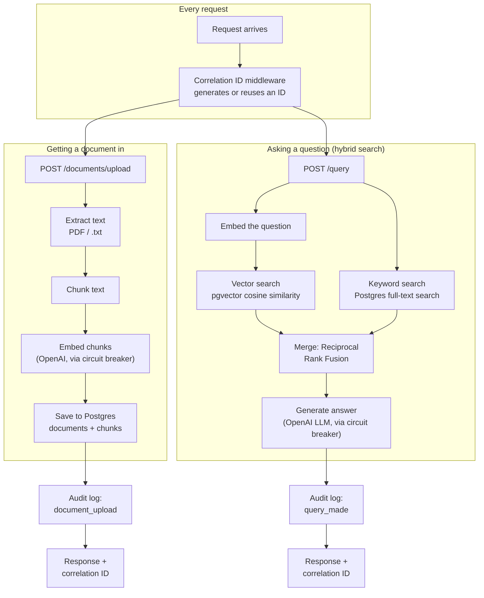
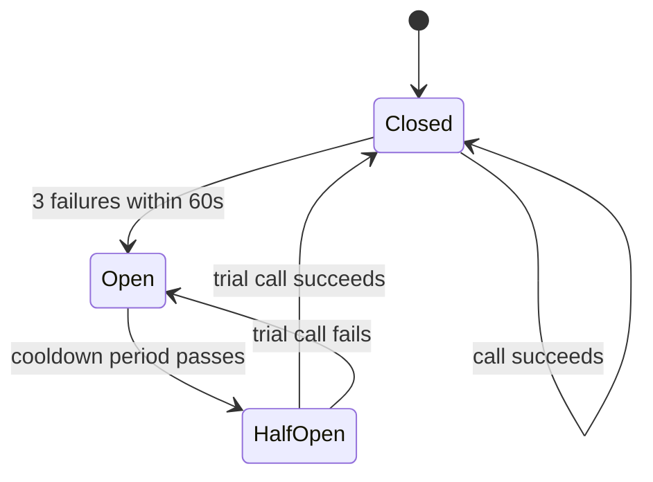

# Knowledge Brain — Architecture Guide

## What this system does

Knowledge Brain lets a company upload its internal documents and then ask
questions about them in plain English. Think of it like a private search
engine that gives you answers instead of a list of links.

## The big picture — how the pieces fit together

Two things exist now: getting a document *into* the system, and asking a
question *about* it. Reranking, a LangGraph multi-step query pipeline,
and everything after that in the build order don't exist yet. Every
request, regardless of which of the two flows it's on, now also gets a
correlation ID, an audit log entry, and circuit-breaker protection around
its OpenAI calls.

**Getting a document in:** a user uploads a file → the API receives it →
the file's raw text is pulled out → that text is cut into small
overlapping pieces → each piece is turned into a list of numbers that
represents its meaning → those pieces and their numbers are saved in the
database. If anything goes wrong along the way, the document is marked as
failed rather than left in limbo.

**Asking a question:** a user sends a question → it's turned into a
meaning-vector, and two independent searches run one after another: a
vector search (closest meaning) and a keyword search (Postgres full-text
search, for exact terms vector search can miss — error codes, product
IDs, rare proper nouns). The two ranked lists are merged into one using
Reciprocal Rank Fusion, favoring chunks either search strongly agrees on.
Those merged chunks, plus the original question, are handed to an LLM,
which answers using only that retrieved text, and says it doesn't know
rather than guessing if the answer isn't there.

**What's new since the last update:** search is now hybrid — vector
similarity and Postgres full-text keyword search both run, and their
results are merged with Reciprocal Rank Fusion rather than trusting
either search alone.

## The main components

**API route (`app/api/documents.py`)** — the "front door." Accepts an
uploaded file over the network, rejects unsupported file types immediately,
and hands the file off to the ingestion service. Talks to: the ingestion
service. If it disappeared, there'd be no way to get a file into the system
at all.

**Ingestion service (`app/services/ingestion_service.py`)** — the
conductor. Knows the *order* the pipeline steps must run in (extract, then
chunk, then embed, then save), and marks the document ready or failed at
the end. Talks to: extraction, chunking, embedding, and the repository. If
it disappeared, each individual step would still work, but nothing would
tie them together.

**Extraction (`app/services/extraction.py`)** — pulls plain text out of a
file's raw bytes. Different file types (PDF vs plain text) need different
extraction logic, since a PDF's bytes contain layout and font information
mixed in with the actual words.

**Chunking (`app/services/chunking.py`)** — cuts a long piece of text into
smaller, overlapping pieces. Necessary because embedding models work on
short passages, and because search works better on small, focused pieces
than on one giant block of text.

**Embedding (`app/services/embedding.py`)** — calls an external AI model
(OpenAI) that turns each chunk of text into a list of numbers representing
its meaning. This is what will eventually let us search "by meaning"
instead of just by exact keyword.

**Repository (`app/repositories/document_repository.py`)** — the only
place in the codebase that talks directly to the database. Everything else
asks the repository to save or update things, rather than writing its own
database queries.

**Retrieval service (`app/services/retrieval_service.py`)** — the
conductor for answering questions, mirroring the ingestion service's role.
Embeds the question, asks the repository for both the closest chunks
(vector) and the best keyword matches, merges them via hybrid search,
then asks the generation service to write an answer. Talks to: embedding,
the repository, hybrid search, and generation.

**Hybrid search (`app/services/hybrid_search.py`)** — merges the vector
search and keyword search result lists into one ranked list, using
Reciprocal Rank Fusion (scoring by rank position in each list, summed
across both, rather than trying to compare their raw, incomparable
scores). Talks to: nothing directly — it's a pure function called by the
retrieval service.

**Generation (`app/services/generation.py`)** — sends the question and the
retrieved chunks to an LLM, with instructions to answer only from that
text and admit uncertainty rather than guess. This is the piece that
actually turns "relevant text" into a readable answer.

**Database (Postgres + pgvector, running in Docker)** — stores documents
and their chunks, including each chunk's meaning-vector, in one place,
and now answers both "which chunks are closest in meaning to this
vector?" (pgvector cosine similarity) and "which chunks best match these
keywords?" (Postgres's built-in full-text search) — no second database
needed for either.

**Correlation ID middleware (`app/core/middleware.py`)** — stamps every
incoming request with a unique ID (or reuses one a caller already sent),
readable from anywhere in the code handling that request via
`get_correlation_id()`, and echoes it back as a response header. Talks to:
nothing directly — every route and response includes its value. If it
disappeared, there'd be no way to trace one request's activity across
logs.

**Audit log (`app/models/audit_log.py`, `app/repositories/audit_repository.py`)**
— an append-only record of every user-initiated, state-changing action
(a document was uploaded, a question was asked). The repository
deliberately exposes only an insert method — nothing in the codebase can
update or delete an entry. Talks to: called directly from the API routes,
right after each action succeeds.

**Circuit breaker (`app/core/circuit_breaker.py`)** — wraps both OpenAI
call sites (embedding and generation) and stops calling OpenAI for a
cooldown period once it's failed repeatedly, instead of letting every
request separately wait for a doomed call to time out. Two independent
instances exist, one per call site, so a run of embedding failures
doesn't affect generation's circuit.

## Key decisions we made and why

We run the pipeline synchronously (the user waits while their file is
processed) rather than using a background queue like Kafka, deliberately
starting simple and adding a queue later once we feel the pain of long
processing times. See ADR-001.

We chose Postgres + pgvector over a dedicated vector database (Qdrant) to
start, since it keeps document metadata and search vectors in one place
with one connection, and Qdrant is planned for later once we need
specialized, large-scale vector search. See ADR-002.

We run Postgres in Docker rather than installing it directly on the
developer's machine, to avoid it colliding with other software already
installed locally, and so the exact same setup works on any machine. See
ADR-003.

We instruct the answer-generation model explicitly to say it doesn't know
rather than guess, because an LLM's default tendency is to always produce
a confident-sounding answer — without that instruction, missing or
irrelevant retrieved context would likely lead to a made-up answer instead
of an honest "not found." See ADR-004.

Rather than retrofitting every "enterprise requirement" from an expanded
project scope all at once, we split them by whether they're actually
buildable yet: correlation IDs, audit logging, and circuit breakers were
added now since they're self-contained; PII detection, access control,
and Azure-specific concerns (API gateway, Key Vault) were deferred, since
they depend on work — an auth model, an actual cloud deployment — that
doesn't exist yet. See ADR-007.

The correlation ID is shared across a request using a `ContextVar` rather
than FastAPI's `request.state`, specifically because services and the
repository are called several layers deep and never receive the raw
`request` object — a `ContextVar` is readable from anywhere in that call
chain without threading it through every function signature. See ADR-008.

The circuit breaker was built by hand rather than pulling in a library,
consistent with how the rest of this project was built, and its state
lives in each process's memory — meaning it does not yet work correctly
across multiple server instances, since each one tracks failures
independently. See ADR-010.

Keyword search uses Postgres's built-in full-text search rather than a
dedicated search engine like Elasticsearch, for the same reason pgvector
was chosen over Qdrant — one database, no new infrastructure. The two
result lists (vector and keyword) are merged with Reciprocal Rank Fusion
rather than trying to combine their raw scores directly, since a cosine
distance and a text-relevance score aren't measured on comparable scales.
See ADR-011.

## How data moves through the system

**Uploading a document:** a user sends a file to the upload address. The
system checks the file type is supported, creates a database record for
the document immediately (marked "pending"), then extracts its text,
splits that text into chunks, turns each chunk into a meaning-vector, and
saves everything to the database. If every step succeeds, the document is
marked "ready." If any step fails, the document is marked "failed" instead
of being left stuck partway through.

**Asking a question:** a user sends a question to the query address. The
question is turned into a meaning-vector using the same embedding model
used for chunks, so the two are comparable. Postgres finds the handful of
chunks whose vectors are closest to the question's vector, using cosine
similarity (a way of measuring how similar two vectors' meaning is,
regardless of text length). Those chunks and the question are sent to an
LLM, which writes an answer grounded only in that retrieved text.

## What could go wrong and how we handle it

**A scanned PDF with no real text** — some PDF pages are just a photograph
of a page, with no actual character data underneath. Extracting text from
a page like that returns nothing, so that page contributes no searchable
content. Not handled yet — a future improvement would add OCR (a
technology that reads text out of images) to cover this case.

**An embedding call fails partway through a large document** — because all
of a document's chunks are sent to the embedding model in a single batch
request, a failure there means none of that document's chunks get saved,
not a partial set. The whole document is marked "failed," and it would
need to be re-uploaded and reprocessed from scratch.

**No documents have been uploaded yet, or nothing relevant matches** — the
similarity search still returns *something* (it always returns the
closest chunks it can find, even if none are truly relevant), but the
generation step's instructions mean the LLM says it doesn't know rather
than forcing an answer out of unrelated context.

**OpenAI itself starts failing repeatedly (outage, rate limit)** — after
3 failures within 60 seconds, that call site's circuit breaker opens.
Further ingestion attempts fail fast and the document is marked `failed`,
same as any other embedding failure. Further query attempts get an
immediate `503` with a clear "temporarily unavailable" message instead of
hanging until a timeout. After a cooldown, one trial call is allowed
through to check whether OpenAI has recovered.

**The audit log's tamper-proofing is currently code-level only** — the
repository has no update/delete methods, but the database connection
itself is a superuser and could bypass a real database-level restriction.
True enforcement needs a separate, deliberately restricted database role,
which doesn't exist yet. See ADR-009.

**Neither half of hybrid search has a real index yet** — both
`cosine_distance` and `to_tsvector` are computed fresh, on every row, on
every query. Fine at our current tiny scale, but at real scale this needs
an HNSW index on the embedding column and a GIN index on a persisted
`tsvector` column — deliberately deferred, tracked as a future
optimization rather than forgotten.

**Keyword search can return fewer chunks than requested, even when vector
search always returns exactly the requested count** — vector search
always finds *the closest* chunks, even if they're not a good match;
keyword search is a real filter and may find fewer matches, or none.
Reciprocal Rank Fusion handles this naturally — a chunk found by only one
search still gets included, just without the score boost a chunk found by
both searches gets.

## Glossary

**Chunk** — a small piece of a larger document's text.

**Embedding / vector** — a list of numbers produced by an AI model that
represents what a piece of text means, used so similar meanings can be
found by comparing numbers instead of comparing exact words.

**pgvector** — an add-on to Postgres that lets it store and search
embedding vectors alongside normal data.

**Cosine similarity** — a way of comparing two vectors by the angle
between them, used to measure how similar in meaning two pieces of text
are, regardless of how long either one is.

**Retrieval-Augmented Generation (RAG)** — the pattern of finding relevant
text first, then handing it to an LLM to write an answer from, instead of
asking the LLM to answer purely from what it already knows.

**Hallucination** — when an LLM confidently states something false or
made-up, typically because it lacks real information and defaults to
guessing rather than admitting uncertainty.

**Repository** — the part of the code responsible only for reading and
writing to the database, with no business logic in it.

**Service** — the part of the code responsible for business logic — the
actual sequence of steps a feature performs.

**Correlation ID** — a unique ID assigned to one incoming request, included
in every response and log line from that request, so its whole story can
be traced even while many other requests are happening at once.

**`ContextVar`** — a Python variable that's automatically kept separate
per concurrent task, letting code anywhere in that task's call stack read
the same value without it being passed explicitly as a parameter.

**Circuit breaker** — a safeguard that stops calling a repeatedly-failing
external service for a cooldown period, so requests fail fast instead of
each one separately waiting for a doomed call to time out. Named after
the same mechanism in an electrical panel.

**Audit log** — a permanent, append-only record of significant
user-initiated actions (who did what, when), kept for accountability —
its value depends on nobody, including the application itself, being able
to edit or delete an entry after it's written.

**Hybrid search** — combining keyword (exact-term) search with vector
(meaning-based) search, so a system can find both "conceptually similar"
results and "contains this exact word/code" results, instead of only one.

**Full-text search / `tsvector` / GIN index** — Postgres's built-in
keyword search: `tsvector` is a normalized, searchable form of text
(lowercased, stop words removed, words stemmed to their root); a GIN
index lets Postgres search that form quickly instead of reprocessing raw
text on every query.

**Reciprocal Rank Fusion (RRF)** — a way to merge two independently
ranked lists into one, by scoring each item based on *where it ranked* in
each list (not its raw score) and summing those scores — so items both
lists agree are good naturally rise to the top.
