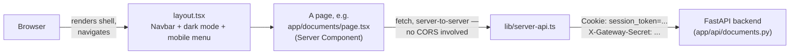
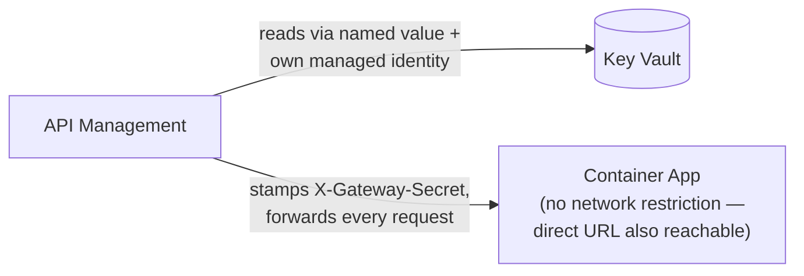
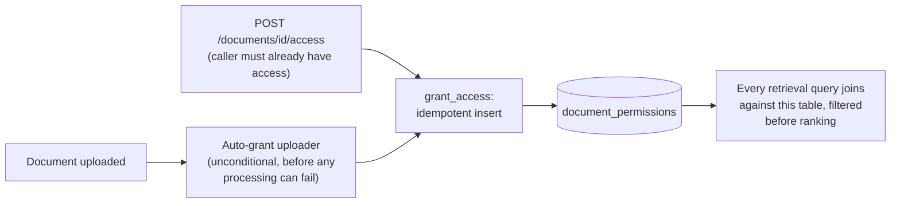
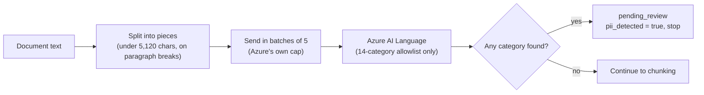
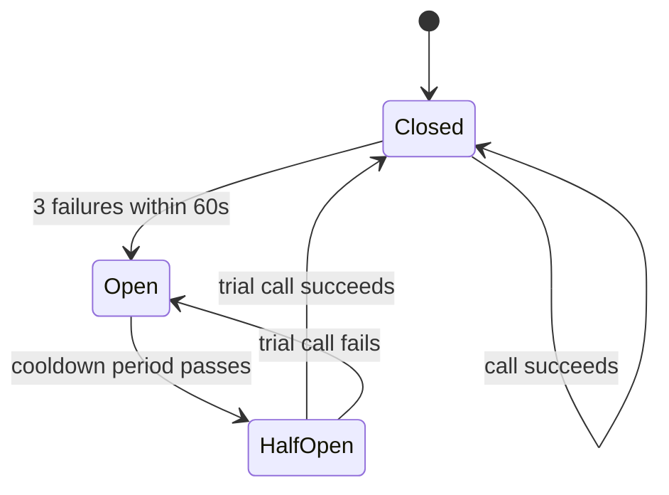
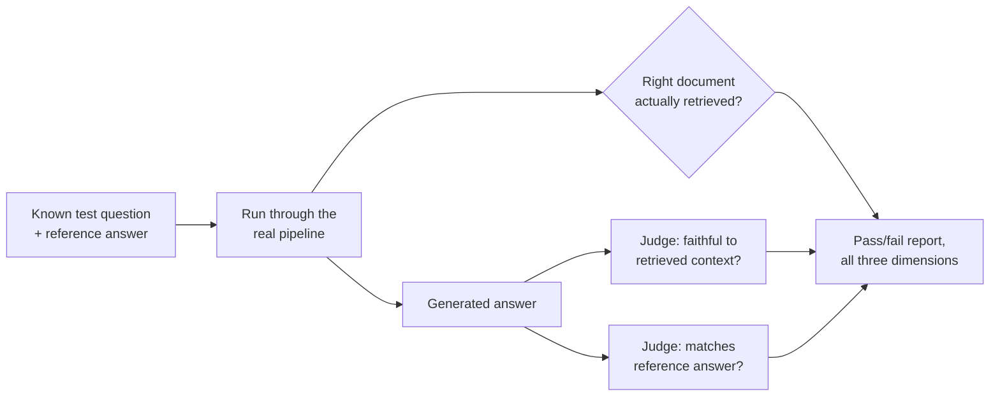
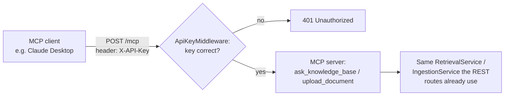
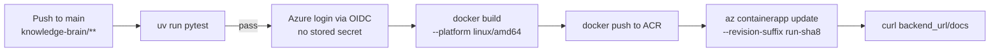

# Knowledge Brain — Architecture Guide

## What this system does

Knowledge Brain lets a company upload its internal documents and then ask
questions about them in plain English. Think of it like a private search
engine that gives you answers instead of a list of links.

## The big picture — how the pieces fit together

Two things exist now: getting a document *into* the system, and asking a
question *about* it. The second of those is no longer a straight line —
it's a LangGraph pipeline that can notice its own search results are
weak, rewrite the question, and try once more before giving up and
answering with whatever it has. A question is now checked twice before
it's ever trusted: once on the way in (is the question itself a
jailbreak or toxic?), and once on the way out (does the generated
answer look safe, and does it show signs of following instructions
smuggled into a retrieved document?). Between those two checks, a
question can now fan out across more than one document *domain* — a
free-text category tag set manually at upload — with a supervisor
deciding whether it needs one domain (the common case, unchanged in
cost) or several (a real, more expensive path: one full retrieval pass
per domain, run concurrently, then merged by a synthesis call). Both
flows now also touch a second database: Neo4j, which remembers explicit
references between documents (not similarity — actual "this mentions
that") and lets a question's answer pull in context from a document
that was never directly retrieved, only connected. Every question now
also belongs to a *conversation* — a real, resumable thread stored in
Postgres, not just whatever the browser happens to still have in
memory — though nothing about the question's own wording is rewritten
against earlier turns yet; that's a later half of the same build item,
still to come. A request also reaches the backend through one of two
doors now: the intended one, Azure API Management, which stamps a
shared secret onto everything it forwards; or the Container App's own
direct URL, which still works too, since Consumption tier APIM has no
network-level way to block it. Everything after item 17 in the build
order doesn't exist yet (item 18, conversation history, is partially
built — storage and resuming, not yet the condensing half). Every
request, regardless of which flow it's on, also gets a correlation ID,
an audit log entry, and circuit-breaker protection around its external
AI calls (OpenAI, Voyage AI, and now Neo4j).

```mermaid
flowchart TD
    CLIENT[Caller] -->|"intended door"| APIM["API Management<br/>(Consumption tier)"]
    KV[(Key Vault)] -.->|"named value reads the<br/>secret via APIM's own<br/>managed identity"| APIM
    APIM -->|"stamps X-Gateway-Secret,<br/>forwards"| REQ
    CLIENT -.->|"also still works — no<br/>network-level restriction<br/>on Consumption tier"| REQ

    subgraph mw["Every request"]
        REQ[Request arrives] --> CID["Correlation ID middleware<br/>(outermost — always runs, even on rejection)"]
        CID --> GW{"X-Gateway-Secret<br/>header correct?"}
        GW -->|no| GWREJECT["401 + audit log entry<br/>(action: access_denied)"]
        GW -->|yes| MCPCHECK{"Path under /mcp?"}
        MCPCHECK -->|"yes — MCP's own<br/>separate trust model"| MCPUID{"X-User-Id header<br/>present?"}
        MCPUID -->|no| REJECT["401 + audit log entry<br/>(action: access_denied)"]
        MCPCHECK -->|no — REST| SESSION{"session_token cookie<br/>valid + unexpired in DB?"}
        SESSION -->|no| REJECT
    end

    MCPUID -->|yes| MCPDOOR[/mcp: ask_knowledge_base / upload_document]
    SESSION -->|yes| UP[POST /documents/upload]
    SESSION -->|yes| Q[POST /query]

    subgraph ingest["Getting a document in"]
        UP --> CREATE["Create document row + grant access<br/>(synchronous — fast enough to finish<br/>before the response goes out) —<br/>domains: free-text tags, set manually,<br/>optional, deduped on save"]
        CREATE --> RESP0["Response returns immediately:<br/>document id, status = pending"]
        CREATE -.->|"scheduled as a<br/>FastAPI BackgroundTask"| BG["Background: process_document<br/>(own fresh DB + Neo4j sessions)"]
        BG --> STATUS0["status → processing"]
        STATUS0 --> EXTRACT["stage: extracting<br/>Extract text (PDF / .txt)"]
        EXTRACT --> PIICHECK{"stage: checking_pii<br/>(Azure AI Language, via circuit breaker)"}
        PIICHECK -->|PII found| FLAG["Status: pending_review<br/>pii_detected = true — stop, never embedded"]
        PIICHECK -->|Azure unavailable| FAILCLOSED["Status: failed<br/>(fail closed — not embedded unchecked)"]
        PIICHECK -->|clean| CHUNK["stage: chunking<br/>Chunk text"]
        CHUNK --> EMBED["stage: embedding<br/>Embed chunks (OpenAI, via circuit breaker)"]
        EMBED --> SAVESTAGE["stage: saving"]
        SAVESTAGE --> SAVE[Save to Postgres<br/>documents + chunks]
        SAVE --> READY["status → ready"]
        READY --> BUILDREFS["Extract references & write to Neo4j<br/>(system-wide lookup, not permission-scoped —<br/>a fact about documents, not this user's view)"]
    end

    POLL["Frontend: GET /documents/id/status<br/>every 2s while processing"] -.->|"permission-checked read"| STATUSREAD[("documents.status +<br/>documents.processing_stage")]
    STATUS0 -.writes.-> STATUSREAD
    EXTRACT -.writes.-> STATUSREAD
    PIICHECK -.writes.-> STATUSREAD
    CHUNK -.writes.-> STATUSREAD
    EMBED -.writes.-> STATUSREAD
    SAVESTAGE -.writes.-> STATUSREAD
    READY -.writes.-> STATUSREAD

    Q --> CONVCHECK{"conversation_id given?"}
    CONVCHECK -->|"yes, but not found<br/>or not this user's"| CONV404["404 — before any<br/>retrieval ever runs"]
    CONVCHECK -->|"yes, valid"| INPUTGUARD
    CONVCHECK -->|"no — will create<br/>a new one, later"| INPUTGUARD

    subgraph retrieve["Asking a question — FederatedRetrievalService"]
        INPUTGUARD{"Input guardrail: moderation +<br/>jailbreak check, concurrent<br/>(via circuit breakers)"}
        INPUTGUARD -->|"flagged, or both<br/>checks unavailable"| BLOCKED1["Blocked before any retrieval —<br/>fixed friendly message,<br/>no sources/confidence"]
        INPUTGUARD -->|clean| CLASSIFY{"Classify domains needed<br/>(LLM, scoped to this user's<br/>own accessible domains)"}
        CLASSIFY -->|"0 or 1 domain —<br/>the common case"| SINGLE

        subgraph SINGLE["One RetrievalService.run_query pass<br/>(domain filter optional)"]
            QEMBED[Embed the question]
            QEMBED --> VEC["Vector search: 20 candidates<br/>joined against document_permissions,<br/>narrowed to one domain if given<br/>(fails? use keyword results alone)"]
            QEMBED --> KW["Keyword search: 20 candidates<br/>same permission + domain join<br/>(fails? use vector results alone)"]
            VEC --> BOTH{Both failed?}
            KW --> BOTH
            BOTH -->|yes| ERR[503: search temporarily<br/>unavailable]
            BOTH -->|no| RRF["Merge: Reciprocal Rank Fusion<br/>(20 candidates)"]
            RRF --> RERANK["Rerank via Voyage AI<br/>(fails? skip straight to generate)"]
            RERANK --> CHECK{Best chunk scores below 0.4,<br/>and haven't retried yet?}
            CHECK -->|yes, rewrite & retry| REWRITE["Rewrite the question<br/>(OpenAI, via circuit breaker)"]
            REWRITE --> QEMBED
            CHECK -->|no| GRAPHCTX["Fetch graph context, same permission join<br/>(one hop, via circuit breaker)"]
            GRAPHCTX --> GEN["Generate answer: top 5 chunks<br/>+ graph context (OpenAI LLM)"]
            GEN --> OUTGUARD1{"Output guardrail: moderation +<br/>injection check, concurrent"}
        end

        OUTGUARD1 -->|"flagged, or both<br/>checks unavailable"| BLOCKED2["Blocked — fixed friendly<br/>message, no sources/confidence"]
        OUTGUARD1 -->|clean| SOURCES["Build sources + confidence —<br/>confidence = null if reranker<br/>was unavailable"]

        CLASSIFY -->|"2+ domains —<br/>a genuinely cross-domain question"| FEDROW["Run one full SINGLE pass<br/>per domain, concurrently —<br/>each produces its own complete<br/>draft answer (asyncio.gather)"]
        FEDROW -->|"one domain's pass<br/>fails — excluded,<br/>result marked partial"| SYNTH
        FEDROW --> SYNTH["Synthesize: merge the per-domain<br/>draft answers into one (LLM),<br/>reconciling citations"]
        SYNTH --> OUTGUARD2{"Output guardrail again,<br/>on the merged answer —<br/>context = every contributing<br/>domain's own chunks"}
        OUTGUARD2 -->|"flagged, or both<br/>checks unavailable"| BLOCKED2
        OUTGUARD2 -->|clean| SOURCES2["Sources = union of every<br/>contributing domain's sources —<br/>confidence always null"]
    end

    BUILDREFS -.writes.-> NEO4J[(Neo4j)]
    GRAPHCTX -.reads.-> NEO4J

    GRANT -.writes.-> ACL[(document_permissions)]
    VEC -.reads.-> ACL
    KW -.reads.-> ACL
    GRAPHCTX -.reads.-> ACL

    SAVE --> AUDIT1[Audit log:<br/>document_upload]
    Q --> AUDIT2[Audit log:<br/>query_made]

    SOURCES --> TURNSAVE
    SOURCES2 --> TURNSAVE
    BLOCKED1 --> TURNSAVE
    BLOCKED2 --> TURNSAVE
    TURNSAVE["Create conversation now,<br/>if none was given<br/>(title = truncated question)"] --> ADDTURN["Add turn: raw question, answer,<br/>sources, confidence, domains_used,<br/>correlation_id"]

    AUDIT1 --> RESP1[Response +<br/>correlation ID]
    AUDIT2 --> RESP2[Response: answer + sources +<br/>confidence + conversation_id +<br/>correlation ID]
    ADDTURN -.-> RESP2

    ADDTURN -.writes.-> CONVDB[(conversations + turns)]
    CONVCHECK -.reads.-> CONVDB
```

**Getting a document in:** a user uploads a file — through the REST
endpoint or through MCP, both funnel into the exact same pipeline —
and before anything else, the request has to prove who's asking.
REST callers do that with a real, logged-in session: a `session_token`
cookie, checked against the `sessions` table for a row that exists and
hasn't expired. MCP callers still authenticate the way they always
have — a shared API key plus a self-asserted `X-User-Id` header, a
deliberately separate trust model an MCP client can't hold a browser
cookie the way REST callers do (see ADR-036). Either way, missing or
invalid identity means an immediate rejection, logged as its own audit
event. The REST endpoint's own work
now stops almost immediately: it creates the document row, grants the
uploader access to it, writes the audit log entry, and returns —
`pending` — without waiting for anything else. Everything from text
extraction onward runs afterward, as a FastAPI background task, in its
own fresh database and Neo4j sessions (the request's own sessions are
already gone by the time a background task actually executes). The
moment that task starts, status moves to `processing`, and a second,
purpose-built field, `processing_stage`, is updated before each real
step — `extracting`, `checking_pii`, `chunking`, `embedding`, `saving`
— purely so a frontend progress bar has something fine-grained to
poll, never read by anything else in the system. The file's raw text
is pulled out, and before anything else happens, that text is checked
for personal information (names, phone numbers, government IDs, that
kind of thing) by Azure AI Language. If it finds any, the document
stops right there: it's marked `pending_review` with `pii_detected =
true`, and nothing about it is ever chunked or embedded — its raw text
never reaches the vector index. If Azure itself is unavailable, the
document fails closed the same way any other ingestion failure does,
rather than skipping the check and embedding something unverified.
Only once a document is confirmed clean does the rest of the pipeline
run: that text is cut into small overlapping pieces, each piece is
turned into a list of numbers that represents its meaning, and those
pieces and their numbers are saved in the database, and only then does
status move to `ready`. If anything else goes wrong along the way, the
document is marked failed, with a recorded reason, rather than left in
limbo. If it succeeds, one more thing happens, still inside the
background task: an LLM reads the document's text looking for
specific, named things it mentions (an error code, a ticket number),
and for each one, checks whether any *other* already-stored document
actually contains it — if so, that connection gets written to Neo4j as
an explicit link between the two documents. This step is best-effort:
if it fails, the upload still succeeds, it just won't have graph links
yet. MCP's `upload_document` tool calls the exact same two split
methods (`create_document`, then `process_document`), just back to
back in one call rather than one scheduled after the other returns —
MCP has no "return now, poll later" concept the way an HTTP response
does, a tool call gives one final result, so it stays fully
synchronous by design, not backgrounded. Splitting the service into
two methods this session broke that call site outright (it still
called the now-deleted `ingest_document`) until this was caught
reviewing this very document and fixed. Whoever uploads a document can
also tag it with one or more free-text domains at the same time — a
comma-separated field on the REST form, a plain list on the MCP tool —
stored directly on the row, deduped, and left empty by default. Nothing
reads or interprets a document's *content* to guess its domain; a tag
means exactly, and only, what whoever uploaded it typed.

**Asking a question:** a user sends a question, again proven by their
session cookie (or, over MCP, the same shared-key/`X-User-Id` pair
described above). If it names an existing conversation, that
conversation is checked — and only checked, nothing else runs yet —
before anything else: it has to actually belong to this user, or the
request stops right there with a 404, the same shape as a document this
user was never granted access to. This is the one place in the whole
flow that runs *before* the safety check below, deliberately, so a bad
or someone-else's conversation id never gets to cost a full pipeline
run first. With that settled (or with no conversation named at all, in
which case one is created only once an answer actually comes back), the
very first real work is a safety check on the *question itself* — a moderation classifier and an LLM
jailbreak judge, run concurrently, look for toxic content or a direct
attempt to hijack the assistant's instructions. If either flags it, or
both checks are simultaneously unreachable, the question never reaches
retrieval at all — no embedding, no search, no LLM generation call, all
of it skipped, replaced with the same fixed, friendly blocked message
every other guardrail in this system uses. A clean question then goes
to a supervisor: which of this user's own accessible domains, if any,
does this question actually need? Zero or one domain needed — every
question today, since domains are opt-in and most documents remain
untagged — takes the pipeline described below exactly once, at exactly
the cost it always had. Two or more domains needed runs that same
pipeline once per domain, concurrently, each producing its own
complete, independent draft answer, then merges them (see "What's new
since the last update" below for that path in full).

One pass of the pipeline itself: the question is turned into a
meaning-vector, and two independent searches run: a vector search
(closest meaning) and a keyword search (Postgres full-text search, for
exact terms vector search can miss — error codes, product IDs, rare
proper nouns), each optionally narrowed to one domain. Both searches
are joined against the permissions table, so a chunk from a document
this user was never granted access to is never a candidate in the
first place — filtered before ranking, not after, the same way
ADR-012's hybrid-search fix avoided truncating results by filtering too
late. Each fetches a wider pool of 20 candidates, not just the final 5.
If one of the two searches fails, the system doesn't
give up — it proceeds using whichever search actually succeeded, and
only returns an error if *both* fail. The two ranked lists (or the one
that's available) are merged into one using Reciprocal Rank Fusion,
favoring chunks either search strongly agrees on. That merged pool is
then reranked: Voyage AI's reranking model looks at the actual question
and each candidate chunk *together* (unlike vector/keyword search, which
score them separately), and picks the 5 that actually answer the
question best — and now also reports *how* relevant the best one really
is. If that top score is below a threshold (0.4) and this is the first
attempt, the pipeline doesn't just accept weak results — it asks an LLM
to rephrase the question, and searches again from scratch with the new
phrasing, once. If reranking itself is unavailable, or a second attempt
still comes up weak, the pipeline moves on anyway rather than looping
forever, and generates the best answer it can from whatever it found.
Once there are chunks worth using, one more step runs before
generation: for the documents behind those final chunks, the system
asks Neo4j what each one explicitly references — not what's similar to
it, what it actually *names* — and pulls in one snippet from each
referenced document, one hop only. That snippet lookup carries the same
permission join as the primary search — a document being referenced by
one this user can see does not mean this user can see the referenced
document too, and without that check the graph-context feature could
leak content from documents this user was never granted access to,
which live testing actually caught happening before it shipped. Those
final chunks, the graph snippets, plus the *original* question (never
the rewritten one — the rewrite is only a search tool, not a
replacement for what the user actually asked), are handed to an LLM,
which answers using only that retrieved text, and says it doesn't know
rather than guessing if the answer isn't there. Before that answer goes
anywhere, one more check runs: a moderation classifier and an LLM
injection judge look at the finished answer together, and if either
flags it — or if both are simultaneously unreachable — the real answer
never leaves the server, replaced with the same fixed, friendly message
and no sources or confidence at all (see ADR-039). Otherwise, for a
single-domain question, the response sent back carries more than just
that answer text: each chunk that actually informed it, with its source
document's filename, plus a confidence number — the same relevance
score reranking already computed on the best chunk, or nothing at all
if reranking itself was unavailable for this request, since a real low
score and "no score was computed" must never look identical to
whoever's reading it. Whatever the outcome — a real answer, a blocked
one, or a partial cross-domain one — it gets written as one turn in the
conversation this question belonged to, and the response now carries
that conversation's id back too, so the caller can ask a follow-up
inside the same thread (see ADR-041). Only an outright failure (a 503,
both search backends down or a circuit already open) skips this
entirely — nothing about a request that never got a real answer is
recorded as if it did.

**What's new since the last update:** questions now live somewhere —
build-order item 18, the storage-and-sidebar half of it (the other
half, condensing a follow-up into a standalone question before it
enters retrieval, is a deliberate scope cut for a later session, not
forgotten). Every question now belongs to a `Conversation`, and every
answer to it is saved as a `Turn` — question, answer, sources,
confidence, which domains were used, all in one row. A new conversation
is only actually created once its first answer comes back successfully
(a failed attempt never leaves an empty thread behind), and a named
conversation is checked for ownership *before* the safety/retrieval
pipeline runs at all, so a bad id fails fast with a 404 rather than
after paying for a full pass. The frontend Query page changed shape to
match: a sidebar (new component, `ConversationSidebar`) lists every
conversation a user has started, most recently active first, and the
page itself is now two routes instead of one — `/query` for a new
conversation, `/query/[conversationId]` to resume an old one — sharing
the same chat UI (extracted into `QueryChat`) rather than duplicating
it. Verified live: a question with no conversation id gets one back,
which then shows up in the sidebar without a page reload; navigating
directly to that conversation's URL — the real test of "resume any
time," not just client-side state — brings back the exact same
transcript; a stranger's or nonexistent conversation id returns a
clean 404 on both the API and the page itself. See ADR-041.

**What's new before that:** two things landed together this
session. First, an input guardrail — the same availability-aware,
two-check shape as the output guardrail below, but running *before*
retrieval instead of after. A new graph node, `input_guardrail_check`,
is now the query pipeline's entry point: a moderation classifier
(reused as-is) and a new LLM jailbreak judge (`check_jailbreak`, judging
whether the raw question is a direct injection/jailbreak attempt, as
opposed to the output guardrail's `check_injection`, which catches
*indirect* injection smuggled in through a retrieved document) run
concurrently on the question itself. A flag from either check, or both
checks being simultaneously unreachable, blocks the question before it
costs anything — no embedding call, no search, no generation call, all
skipped entirely. Verified live: a jailbreak attempt was blocked in
about 2.8 seconds, against roughly 9 seconds for a full pipeline run on
a real question, confirming the point of catching it this early.

Second, build-order item 17, multi-agent federated retrieval — the
reason a "domain" concept exists in this system at all now. A document
can be tagged with one or more free-text domains at upload (manual, for
now — see ADR-040), and a new supervisor call, `classify_domains`,
decides which of a user's own accessible domains a question actually
needs. Zero or one domain needed delegates straight to the exact
single-domain pipeline this document already describes, completely
unchanged, at the same cost as before this feature existed. Two or more
domains needed runs that same pipeline once per domain, concurrently
(`asyncio.gather`) — each a full, independent pass with its own
retrieval, reranking, graph context, generation, and output guardrail
check, producing its own complete draft answer, not just a shared pool
of chunks. A new synthesis call (`synthesize_answers`) then merges the
per-domain drafts into one answer, reconciling citations and naming it
plainly if two domains disagree, and the *merged* answer gets one more
moderation+injection safety pass before it's returned — on top of the
pass each domain's own draft already went through individually. If one
domain's pass fails, it's excluded via a task-level safe-wrapper, not a
literal per-domain circuit breaker (this project's breakers are already
one shared instance per external service, not per domain — a real
outage doesn't care which domain asked); synthesis still returns an
answer from whichever domains succeeded, clearly marked partial.
`confidence` is always `null` on this path — no single well-defined
relevance score exists once several domains' reranked results have been
merged into prose by an LLM. `FederatedRetrievalService` is now the one
entry point `/query`, MCP's `ask_knowledge_base`, and the frontend all
reach through — `RetrievalService` itself didn't change its own public
shape, it just gained an optional `domain` parameter, and is now a
building block the federated service calls rather than something
callers reach directly. The one exception, named plainly rather than
silently: the evaluation harness (`eval/run_eval.py`) still calls
`RetrievalService` directly, since it needs the raw internal chunks and
graph context for scoring that `FederatedResult` deliberately doesn't
expose to normal callers — behaviorally identical for it today, since
its fixtures carry no domain tags. Verified live: a genuinely
cross-domain question (leave-day policy plus a travel-cancellation
reimbursement question, spanning HR and Finance test documents)
correctly merged both domains' findings with `confidence` explicitly
`null`, at roughly double the latency of an equivalent single-domain
question (~11.8s vs ~5.5s) — the felt cost of running two full passes
plus a merge, confirmed directly rather than assumed. The upload form
gained a matching "Domains (optional)" field, sending the same
comma-separated string the backend already expects, with the resulting
tags rendered as badges on each document card — the first frontend
change to reach this feature, and the reason this project now has
Vitest + React Testing Library set up at all (it had zero frontend test
infrastructure before this). See ADR-040.

**What's new before that:** every generated answer now
passes through a real safety checkpoint before it can reach a user —
build-order item 16, real-time answer guardrails. A new graph node,
`guardrail_check`, sits between `generate` and the end of the query
pipeline, running two independent checks concurrently: a moderation
classifier (OpenAI's Moderation API — fast, purpose-built, but blind to
anything specific to this app) and an LLM injection judge, shown the
actual retrieved context alongside the generated answer and asked
whether the answer looks like it followed instructions smuggled into a
document rather than genuinely answering the question — the RAG-
specific risk a generic moderation tool has no way to catch. If either
check flags the answer, `state["answer"]` gets overwritten with a
fixed, friendly message before any downstream reader (the REST route,
MCP's tool, `build_sources_and_confidence`) ever sees the real one —
sources and confidence get suppressed too, since showing the exact
chunk that tripped the check would defeat the point. The fail policy
went through a real refinement mid-build: not uniform fail-closed
(PII detection's own precedent) or uniform fail-open (reranking's), but
availability-aware — a single check being down contributes no signal
of its own, but the combined decision still fails closed the moment
*neither* check could run at all, since "no information exists" is a
different claim from "checked and clean." Verified live with a real
attack, not just a mock: a document uploaded with a genuine injection
payload (a fake "system override" instruction embedded in otherwise
normal policy text) got retrieved, and the resulting answer was
correctly blocked. The real, felt cost, also confirmed live: every
query now pays for two more LLM calls, visible directly as higher
per-query token usage in LangSmith. See ADR-039.

**What's new before that:** every LLM and reranker call in
this system now reports itself to LangSmith — build-order item 15,
LLM/RAG observability. Not a dashboard built into this app; a
dedicated external tool, the user's own explicit choice. Every OpenAI
call (embedding, generation, query rewriting, reference extraction)
goes through a client wrapped once with `wrap_openai()` — LangSmith's
own trick for projects, like this one, that call the raw `openai` SDK
directly rather than through LangChain's model classes. After that one
line per file, every real call through that client automatically
reports its exact prompt, exact response, tokens each direction,
dollar cost, latency, and success or failure, with no other code
change. The Voyage reranking call has no equivalent automatic wrapper,
so `rerank_chunks` got an explicit `@traceable` decorator instead —
same coverage, minus an automatic dollar figure, since LangSmith's
built-in pricing table only knows OpenAI's rates. Because the query
pipeline is already a LangGraph graph (ADR-014), turning tracing on
process-wide captures its whole execution automatically too — every
node in `retrieval_service.py` shows up as its own step in a trace,
with zero change to the graph's own logic. The one place real code
changed to add attribution: `RetrievalService.run_query`'s single
graph-invocation call now tags the entire trace with who asked and the
request's correlation_id, reusing the `user_id` the graph already
threads through `QueryState` rather than a fresh lookup that would
have quietly broken the moment the same function ran from a background
context (the exact `ContextVar`-reset trap ADR-030's ingestion path
already had to solve once). MCP inherits all of this for free — same
service functions, no MCP-specific change needed. See ADR-038.

**What's new before that:** the frontend can now actually log
in — the other half of real authentication, completing ADR-036 with
ADR-037. Login and signup pages exist for real (`/login`, `/signup`),
each a thin Server Component wrapper around a Client Component form.
Signing in calls a same-origin route handler, which calls the backend
server-to-server and re-issues the session token as this app's own
cookie, scoped to this app's own origin rather than relaying the
backend's `Set-Cookie` header verbatim. `proxy.ts` — Next.js 16 renamed
"middleware" to this — is a cheap, first-line gate on every route
except `/login`/`/signup`: does a session cookie exist at all; the real
check happens where each page already fetches its data, the same
two-layer shape (cheap gate, real check behind it) `user_id_middleware`
and `require_admin` already use on the backend. Every page and route
handler that used to send the fake `X-User-Id: dev-user` header now
forwards the real cookie instead, through a shared `backendAuthHeaders`
helper — a genuine build failure, not a style choice, forced
`lib/api.ts` to split into a client-safe file and a new
`lib/server-api.ts`: Turbopack's Server/Client boundary check operates
per file, so a Client Component importing anything from a file that
also imports `next/headers` fails outright, even if it never calls the
part that does. A `/code-review` pass after the initial build found and
fixed six real issues — a login route that could return `200` with no
session actually established, a status-poll timer that kept firing
after a `401` instead of stopping itself, a logout button with no error
handling that could get stuck forever on a network failure, and three
duplication issues consolidated into shared helpers. Two real, live
findings along the way, neither a code bug: the very first live signup
attempt failed because the `users`/`sessions` tables from last session
had never actually been created against the local database, and
documents uploaded through the frontend before this session turned out
to be permission-granted to the old `"dev-user"` placeholder string —
now permanently unreachable by any real account, since no real login
can ever produce that identity again. See ADR-037.

**What's new before that:** real authentication now exists
for REST — the backend half of build-order item 14 (auth, multi-
tenancy, and production hardening). Every previous page and endpoint
trusted a self-asserted `X-User-Id` header; a caller could set it to
anything and be believed. That's gone for REST now. Two new tables,
`users` and `sessions`, back a real signup/login/logout flow
(`POST /auth/signup`, `POST /auth/login`, `POST /auth/logout`,
`GET /auth/me`): a password is hashed with Argon2id before it's ever
stored, and logging in creates a `Session` row with a long random
token, sent to the browser only as an `httponly` cookie the browser
can't read or forge. `user_id_middleware` — the one place every
request's identity gets established — now checks that cookie against
the database on every REST request instead of trusting a header;
missing or invalid, expired included, and the request is rejected
before it reaches any route. MCP was deliberately left untouched: it
isn't a browser and can't hold a session cookie the same way, so it
keeps its existing shared-API-key-plus-`X-User-Id` model, on its own
branch inside the same middleware function. The Admin page's
`require_admin` (ADR-034) was upgraded alongside this — it now checks
a real `User.is_admin` column instead of the `ADMIN_USER_IDS`
allowlist, which was removed from configuration entirely rather than
left behind as a second, dead check. **The frontend was deliberately
not touched this session** — it still sends the old `X-User-Id`
header and has no login/signup screens, so every page that calls the
backend will fail until a separate, already-planned future session
wires up real login, cookie forwarding through the Next.js Route
Handlers, and a logout control. Multi-tenancy itself — isolating
separate companies' data from each other — is equally not part of
this pass; it's its own future decision. See ADR-036.

**What's new before that:** the deployed backend's Container
App now scales to zero. Checking Azure Cost Management for the first
time since deployment found the largest single cost line was the
Container App itself — traced directly to `infra/main.tf`'s
`min_replicas = 1`, which had kept one instance running continuously
since first deployment, billed the whole time regardless of whether
any real request ever arrived. Changed to `min_replicas = 0`: Container
Apps' own default HTTP scale rule wakes a fresh replica automatically
on the next request after 5 minutes of idle time (Microsoft's
documented default cool-down period), no manual toggle needed, unlike
the Postgres start/stop approach discussed but not built. Confirmed
safe first, not assumed: Microsoft's own docs warn `min_replicas = 0`
without ingress enabled can strand an app at zero replicas
permanently — this backend already has ingress enabled (`external_enabled
= true`, needed for APIM and the direct URL regardless), so that
danger case doesn't apply. The real, accepted cost: a several-second
cold start on the first request after any idle period, affecting MCP
identically to REST, since both run in the same container. See
ADR-035.

**What's new before that:** the Admin page (build-order item
13's fifth and final planned page) now exists, completing the
originally planned frontend. It's a bird's-eye view over data every
other page already reads — documents, permissions, the audit log —
just unscoped from "the current user" to "everyone," which is exactly
why it's the first page in this project to need its own access gate.
A new `require_admin` FastAPI dependency checks the caller's
`X-User-Id` against a small, explicit allowlist (`ADMIN_USER_IDS`),
attached once at the router level so every admin route inherits it
automatically. Not real RBAC — the same proportionate "pull forward a
small slice of real auth" move this project already made for MCP's
shared secret (ADR-017), not the full system (item 14) built early,
and not left open either. Two new repository reads are the first in
this codebase to deliberately span every user rather than scope to
one: `get_all_recent_entries` and `list_all_permissions`, both
explicit in their own docstrings that they do no authorization
themselves — that's `require_admin`'s job, at the route layer. Tenant
management stayed an honest placeholder, the same reasoning as every
other data-less widget on the Dashboard and Analytics pages: there's
no tenant concept anywhere in this system's data model yet, and
building one just for this page would mean quietly implementing a
piece of item 14 under a different feature's name. See ADR-034.

A real, related gap surfaced in conversation after the page shipped,
deliberately not built yet: documents flagged `pending_review` for PII
have no reviewer workflow at all. Worth naming precisely because it's
not just "add an approve button" — `IngestionService.process_document`
extracts a document's text into a local variable, checks it for PII,
and if flagged, discards both the extracted text and the original file
bytes once `flag_for_review` runs; neither is persisted anywhere. A
real review workflow needs its own decision about where flagged
content lives long enough to be reviewed, and needs to be admin-gated
for the same separation-of-duties reason `require_admin` exists at
all — the uploader who created the risk shouldn't be the one clearing
it. Tracked as its own future item, not folded into ADR-034.

**What's new before that:** the Analytics page (build-order
item 13's fourth page) now exists — real query volume over the last 30
days, real top questions, and a real average response time, alongside
one more honest "not tracked yet" placeholder for retrieval accuracy
(the same gap named twice already). Average response time is genuinely
new: nothing in this system timed a query before this session.
`RetrievalService.run_query` now wraps the whole graph invocation in
`time.monotonic()` and stores `duration_ms` on the returned state —
captured once, at the service level, not duplicated per caller, since
MCP's `ask_knowledge_base` writes to the exact same `query_made` audit
log `/query` does, and a response-time average that only ever saw REST
traffic wouldn't be honest. That forced MCP off the now-deleted
`answer_question` (a thin wrapper with no remaining callers) onto
`run_query`, the same method `/query` and the evaluation harness
already used. A new `AnalyticsService` aggregates existing audit log
data — grouping by day, counting exact question-text matches (a real,
named limit: no semantic clustering), averaging `duration_ms` only
across entries that have it. The volume chart is hand-rolled inline
SVG, no new dependency, consistent with this project's pattern of
building things itself rather than reaching for a charting library.

A `/code-review` pass after the initial build caught a real correctness
bug before it shipped: `AnalyticsService` only emitted a data point for
days with an actual query, and the chart spaced points evenly by array
index — a real week-long gap in usage would have rendered as if the
surrounding days were consecutive, silently misrepresenting how sparse
usage actually was. Fixed by zero-filling every day in the window, so
"index N" and "day N of the window" are always the same thing. The
same pass also found a genuine near-miss: the `query_made` audit
write, with its new `duration_ms` field, was hand-duplicated between
`/query`'s route and MCP's tool — exactly the kind of drift risk that
already happened once in this very session (`duration_ms` was added to
one call site before the other) — now consolidated into one
`AuditRepository.log_query_made` method. See ADR-033.

**What's new before that:** the Dashboard page (build-order
item 13's third page) now exists at the app's root, `/` — replacing an
unmodified `create-next-app` boilerplate that had sat there since the
very first frontend session, since the navbar's "Dashboard" link has
always pointed at `/`, not a nested route (caught live, after first
building it at the wrong path). It's a real digest, not a new data
source: total documents comes from a new `count_documents_for_user`
(a `COUNT(*)`, not a fetch-and-`len()`), and recent queries comes from
the audit log's `query_made` entries, already written by every `/query`
call — the audit repository's first read method, which doesn't touch
its append-only guarantee at all, since that guarantee was always
specifically "no `UPDATE`/`DELETE`." Two of the spec's four widgets —
retrieval accuracy trend and cost per query — got an honest "not
tracked yet" state instead of a number, the same move already made
twice for the Query page: accuracy has no ground-truth signal for a
real question (only the offline eval harness has that), and cost needs
token-level instrumentation across every LLM call site, squarely
build-order item 15's territory. See ADR-032.

While preparing this session's tests, a real scaffolding violation from
the *previous* session was found and fixed: `/query`'s sources/
confidence-building logic was sitting directly in the route handler,
not a service, breaking this project's own "routes stay thin" rule.
Extracted into `RetrievalService.build_sources_and_confidence`, which
also made it independently testable — this project has never used an
HTTP test client, so business logic living inside a route handler was
effectively untestable at all. Verified live that extracting it changed
nothing about `/query`'s actual response. See ADR-032.

**What's new before that:** the Query page (build-order item
13's second page) now exists — a real chat interface at `/query`, a
Client Component with a scrolling transcript, an input box pinned at
the bottom, and per-turn loading and error states. It calls the exact
same LangGraph pipeline described above through a new same-origin proxy
(`POST /api/query`), same reasoning as the upload flow's own proxy
routes. The one real backend change: `/query` used to return only
`answer` and `correlation_id`, throwing away data the pipeline already
computed. It now also returns `sources` (the actual chunks the answer
drew from, with filenames) and `confidence` (the reranker's own
relevance score on the best chunk) — both pulled from `QueryState`,
nothing newly computed. `confidence` is `null`, not `0.0`, specifically
when the reranker was unavailable and the pipeline fell back to hybrid
search's own ordering — reusing the exact distinction
`_rerank_safely` already drew internally (a real low score must never
look identical to "no score exists"), just finally surfaced past the
service boundary. Two things CLAUDE.md's own page spec calls for were
deliberately not built yet, both named rather than silently skipped:
the answer renders all at once, not token-by-token, since real
streaming is build-order item 19 with its own Enterprise Requirement
that doesn't exist yet; and there's no sidebar of past conversations,
since that needs real storage and context-condensing, build-order item
18, also not built. See ADR-031.

**What's new before that:** document uploads through the REST
endpoint no longer block the caller for the pipeline's full duration.
Extending ADR-001's own stated next step, `POST /documents/upload` now
only does the fast, synchronous part — create the row, grant access,
audit-log the action — and returns immediately with the document's real
`status` (`pending`) at that moment; the rest of the pipeline runs as a
FastAPI background task afterward, in its own fresh database and Neo4j
sessions, since the request's own sessions are already gone by the time
a background task executes. A new `processing_stage` field (values:
`queued`, `extracting`, `checking_pii`, `chunking`, `embedding`,
`saving`) tracks progress through that background run — deliberately
kept as its own column, separate from `status`, since `status` is
load-bearing everywhere (permissions, the document list, business
rules) while this field exists purely for a progress bar and nothing
else in the system ever reads it. A new `GET
/documents/{id}/status` endpoint, permission-checked the same way every
other retrieval path is, lets the frontend poll it. Two new Next.js
Route Handlers proxy the upload and the status poll server-to-server,
resolving the exact CORS-vs-proxy choice the previous session's update
flagged as still open — the browser now calls only same-origin Next.js
paths, so `BACKEND_GATEWAY_SECRET` never reaches client-side JavaScript
and the backend still needs no CORS configuration at all. A new
`UploadDropzone` client component handles drag-and-drop, kicks off the
upload, then polls status every 2 seconds and renders a per-stage
progress bar until the document reaches a terminal state, at which
point it refreshes the document list and removes itself. Splitting
`IngestionService.ingest_document` into two methods
(`create_document`, `process_document`) to make this possible had one
real, unintended consequence: it broke MCP's `upload_document` tool,
which still called the now-deleted method — caught and fixed the same
session, before it shipped, not after. See ADR-030.

The frontend (build-order step 13)
now exists, started for real — a separate `frontend/` project (Next.js,
Tailwind, Shadcn/UI on Base UI) sitting alongside the Python backend,
not inside it. So far it has a shared shell (navigation, dark mode,
a responsive mobile menu) and the Document Library page, the first of
five planned pages. The library page needed a real backend addition
first — `GET /documents` didn't exist — built permission-filtered from
the start, the same `document_permissions` join every other retrieval
path already uses. The page itself fetches from a Next.js Server
Component rather than the browser directly, sidestepping the backend's
complete lack of CORS configuration entirely, at the cost of a
temporary hardcoded `X-User-Id` placeholder until real auth exists.
Two real bugs were found and fixed by actually running the app, not by
review: Shadcn's newer Base UI foundation uses a `render` prop for
composition, not Radix's `asChild`, which produced real nested
`<button>` elements until caught via a live hydration error; and this
page was silently eligible for Next.js's static prerendering (no
`cookies()`/`headers()`/`searchParams` used), which would have frozen
it as a stale, un-refreshing snapshot the moment it reached a real
production build — invisible in dev, where pages always render fresh
regardless. Fixed with `dynamic = "force-dynamic"`. See ADR-028 and
ADR-029.

An API Management gateway
(build-order step 11) sits in front of the backend as the intended
public entry point. It imports its picture of the API straight from
FastAPI's own `/openapi.json` rather than duplicating the route list by
hand, and its one policy stamps a shared secret — generated once,
stored in Key Vault, read by APIM itself through a Key Vault-backed
named value and its own managed identity — onto every request it
forwards. A new `gateway_secret_middleware`, sitting between the
correlation ID and identity middleware, rejects anything missing that
exact header. The original design also called for a network-level
lock, restricting the Container App to only accept traffic from APIM's
own IP — but Consumption tier APIM has no static outbound IP at all,
confirmed live (`az apim show` returned an empty list), so that half of
the design doesn't exist: the backend's own direct URL still works,
completely unrestricted, and the header secret is the one real
mechanism deciding access today. Rate limiting was designed, attempted,
and removed for the same reason — Consumption tier rejects the
per-caller policy this needed outright, and the fallback Azure offers
is scoped per-subscription, meaningless given `subscription_required =
false` was deliberately left off. Verifying this feature live also
surfaced a real, separate incident: the Azure Postgres database had
never had its application tables created, so any rejected request
against the deployed backend crashed trying to write its audit log
entry — caught only because API Management's own request trace showed
the gateway mechanism itself working correctly before that unrelated
crash happened. Fixed the following session (see ADR-027); a real
request through APIM now returns the correct `401` instead of a `500`,
a clean end-to-end confirmation the trace evidence alone couldn't give
at the time. See ADR-026.

Document-level access control
(build-order step 8) — every uploaded document is now visible only to
users explicitly granted access, checked at retrieval time via a SQL
join, not after results come back. A lightweight `X-User-Id` header
stands in for real identity (full auth is build-order item 14, still
much later); missing it gets an immediate 401. Uploading a document
auto-grants its uploader; a new endpoint lets anyone with access grant
it to someone else. The permission check itself lives inside the
repository's search queries, not the API routes, so both REST and MCP
inherit it automatically — but that same reasoning revealed a real gap
live: `DocumentGraphService`'s reference-building and the query
pipeline's graph-context snippet lookup each read chunk data through
their *own* separate functions, neither of which the primary search fix
touched. Reference-building was deliberately left permission-agnostic
(it establishes system-wide facts about documents, not a user's view),
but the graph-context snippet lookup had no permission check at all —
a real leak, closed with the same join everywhere else uses. See
ADR-019.

PII (personal information)
detection (build-order step 7), the first check that can stop a
document from being ingested at all rather than just degrade quality.
It runs inside `IngestionService` itself, not either API route, so it
protects both the REST upload endpoint and MCP's `upload_document`
automatically — neither file needed to change. Detection is scoped to
an explicit, hand-picked list of 14 categories (names, contact info,
financial data, US and India government IDs), not Azure's full
173-category default set — live testing caught a real false-positive
source first: Azure's `PersonType` category flagged ordinary words
like "employee" as PII, which would have made nearly every real
document trigger a review. Long documents get split on paragraph
breaks and sent in batches, to stay under Azure's real 5,120-character
synchronous request limit without cutting through the middle of a name
the way a hard character cut could. See ADR-018.

An MCP server (build-order step 10) was added before that, a second
front door into the exact same pipeline. MCP (Model
Context Protocol) is a standard way for an AI client — Claude Desktop,
another agent — to discover and call a tool directly, instead of only
being reachable through this project's own `/query` and `/documents`
endpoints. It's mounted onto the same running app under `/mcp`,
guarded by one shared secret checked in raw ASGI middleware (plain
`scope`/`receive`/`send`, not Starlette's `BaseHTTPMiddleware`, which
turned out to break MCP's long-lived streaming responses — found by
live testing, not by reading the code). It exposes exactly two tools,
`ask_knowledge_base` and `upload_document`, and neither one is new
logic — both are thin wrappers around the same `RetrievalService` and
`IngestionService` the REST routes already use, reusing every circuit
breaker, the audit log, and correlation IDs without duplicating any of
it. See ADR-017.

An evaluation harness (build-order step 9) was added before that,
living entirely outside the running app in `eval/`. It's the
first thing in this project that actually measures answer quality
systematically rather than by a human eyeballing one response — a fixed
set of known-answer test questions run against dedicated fixture
documents through the real pipeline, scored on whether the right
document was retrieved, whether the answer stayed grounded in its
context, and whether it matched the reference answer, using a separate
LLM call to judge each of the last two. Verified live: all 6 test cases
passed on all three dimensions. Deliberately scoped as an offline,
on-demand tool — not wired into CI yet, and not to be confused with a
different, related idea (a real-time safety check on every live answer)
that came up in the same conversation and was split out as its own
future build-order item instead. See ADR-016.

A Neo4j document relationship graph (build-order step 6) was also
added. Unlike hybrid search or reranking, this
isn't about finding text that reads similarly — it's about explicit,
named connections between documents (a support note mentioning a
specific ticket ID that another document actually defines) that
similarity search structurally cannot see. An LLM extracts what a
document explicitly mentions at upload time; the existing keyword
search (no new lookup mechanism needed) resolves each mention to a
real document if one exists; a `REFERENCES` edge gets written to Neo4j.
At query time, the pipeline follows that edge one hop out from whatever
was actually retrieved, pulling in extra context from documents that
were never directly searched, only connected. Verified live: a question
answerable only by combining two separate documents came back correct,
citing a detail that existed solely in the graph-linked one. See
ADR-015.

The query pipeline (build-order step 5) is a LangGraph graph that can
loop back once if what it finds is weak, rather than a fixed sequence.
Getting the "weak" signal right took a real pivot: the original plan
(retry when zero chunks come back) turned out to basically never fire
with real data, since vector search always returns *something*, however
irrelevant — live testing caught this before it shipped. The actual
trigger is Voyage's own relevance score on the best chunk found,
thresholded at 0.4 based on real measured scores (a true match scored
0.914; irrelevant questions scored ~0.28–0.29 against the same data).
See ADR-014.

## The main components

**Frontend (`frontend/`)** — a separate Next.js project, not part of the
Python backend at all, talking to it purely over HTTP. `app/layout.tsx`
is the shared shell every page sits inside: navigation, dark mode
(via `next-themes`, toggling a `dark` class that every color in
`globals.css` is keyed off through CSS variables), and a hamburger menu
below the `md` breakpoint. It also fetches `getCurrentUser()` once
(ADR-037) and passes it to the navbar, so the shell itself knows who's
logged in without every page re-deriving it. `lib/server-api.ts` holds
the real backend calls (`getDashboard`, `getDocuments`, and so on),
each forwarding the caller's real session cookie rather than the old
`dev-user` placeholder; `lib/api.ts` holds only what's safe to reach
from a Client Component (shared types, `postQuery`) — the two are
deliberately separate files, not just separate concerns, since a
Client Component importing anything from a file that also imports
`next/headers` fails to build at all (see the Auth entry below).
`lib/config.ts` holds the base URL and the gateway secret local dev
needs to send by hand. Talks to: the FastAPI backend, over plain HTTP,
from the Next.js server itself rather than the browser (see the
Document Library entry below for why). If it disappeared, the backend
and its API would still work exactly as before — MCP and direct
`curl`/API access would be unaffected, only the human-facing UI would
be gone.



**Document Library (`frontend/app/documents/page.tsx`)** — the first of
five planned frontend pages, and the first real proof the frontend can
talk to the backend end to end. An `async` Server Component: fetches
the calling user's documents once, server-side, before the page ever
reaches the browser. Explicitly marked `dynamic = "force-dynamic"` —
without it, Next.js would treat the page as eligible for build-time
static prerendering (nothing in it reads `cookies()`, `headers()`, or
`searchParams`), freezing it as a stale snapshot in production, a real
bug caught live, not by review. Handles all three states `CLAUDE.md`
requires explicitly: `loading.tsx` (a skeleton grid, shown automatically
by Next.js while the fetch is in flight), `error.tsx` (a human-readable
retry screen, not a raw stack trace), and a designed empty state (not a
blank page) when the list comes back genuinely empty. Talks to:
`GET /documents` on the backend. If it disappeared, there would be no
way to see what's already been uploaded — uploads would still succeed,
just invisibly.

**Upload dropzone (`frontend/components/upload-dropzone.tsx`) and its
proxy routes (`frontend/app/api/documents/upload/route.ts`,
`frontend/app/api/documents/[id]/status/route.ts`)** — the client-side
half of getting a document in, added with ADR-030. The dropzone is a
`"use client"` component: handles drag-and-drop and click-to-browse,
uploads via `POST /api/documents/upload` (a same-origin Next.js path,
not the backend directly), then polls `GET
/api/documents/{id}/status` every 2 seconds and renders a progress bar
keyed off `processing_stage`, until the document reaches a terminal
status, at which point it calls `router.refresh()` (so the Document
Library list picks up the newly-finished document) and removes its own
card. The two Route Handlers exist for exactly one reason: keeping
`BACKEND_GATEWAY_SECRET` out of client-side JavaScript entirely — the
browser only ever talks to these same-origin paths, which then make the
real, secret-bearing calls to the backend server-to-server, the same
reasoning the Document Library page's own server-side fetch already
established, just triggered by a user action instead of a page render.
The upload route handler needed no change at all for domain tagging
(ADR-040): it forwards the browser's whole `FormData` object through to
the backend untouched, so a `domains` field the dropzone adds just
rides along. The dropzone itself gained a "Domains (optional)" text
input, sent as the same comma-separated string the backend already
parses — its value persists across a successful upload rather than
clearing, so tagging a batch of same-category files doesn't mean
retyping the tag each time. Talks to: `POST /documents/upload` and `GET
/documents/{id}/status` on the backend, from the Next.js server, never
from the browser. If it disappeared, uploading would still be possible
through `curl` or MCP, just not through the UI.

**Document card (`frontend/components/document-card.tsx`)** — the
per-document card the Document Library page renders one of for each
upload: filename, status badge, upload date, a PII warning if flagged,
and now a small outline badge per domain tag. Extracted out of
`app/documents/page.tsx` into its own file this session, for a reason
that's really about testing, not styling: the page file transitively
imports `next/headers` (through `lib/server-api`), so it throws outside
a real Next.js request — a plain component-render test couldn't import
`DocumentCard` from there at all. Same client-safe/server-only split
`lib/api.ts`/`lib/server-api.ts` already established, applied to a
component instead of data-fetching functions. Talks to: nothing
directly — a pure function of the `DocumentListItem` it's given.

**Frontend tests (`frontend/vitest.config.mts`, `*.test.tsx` files
next to the components they cover)** — this project's first frontend
test infrastructure, set up from nothing this session (Vitest + React
Testing Library, the user's own choice over Playwright's full-browser
e2e approach, for faster component-level tests). Two real setup snags
along the way, both dependency-resolution issues rather than app bugs:
a peer-dependency conflict between `@vitejs/plugin-react` and the
`shadcn` CLI's own babel version (two separate dev-only toolchains,
resolved with `--legacy-peer-deps`), and a missing
`@testing-library/dom` peer that had to be installed explicitly. Tests
cover exactly what this session built: the domain field renders and
accepts typing, the typed value actually lands in the upload's
`FormData`, an empty field still sends an empty `domains` value
(matching the backend's default), and `DocumentCard` renders a badge
per domain or none at all for an untagged document. Run with `npm
test`. If it disappeared, nothing about the running app would change —
only the ability to catch a regression in this behavior without
manually re-testing it in a browser.

**Query chat (`frontend/components/query-chat.tsx`) and its proxy route
(`frontend/app/api/query/route.ts`)** — the chat interface itself,
originally added with ADR-031, extracted into its own component with
ADR-041 so it could be shared between two routes instead of living
directly in one page file. A `"use client"` component holding one
array of turns in React state, seeded from whatever initial turns its
caller passes in — empty for a new conversation, a real transcript for
a resumed one (see the Query page/conversation page entries below).
Submitting a question posts to `POST /api/query`, the same
same-origin-proxy pattern as the upload routes and for the same
reason — keeping `BACKEND_GATEWAY_SECRET` out of client-side
JavaScript for this client-triggered action, now also carrying whichever
conversation id this component currently holds (or `null`, to start a
new one). Each turn shows a loading skeleton while waiting, then the
complete answer at once (not token-by-token — real streaming is item
19, still not built), a confidence badge, and a card per source chunk
with its document's filename. The moment a brand-new conversation's
first answer comes back, this component adopts the id the backend
handed back, swaps the URL to `/query/{id}` with `router.replace` (no
full navigation, so the transcript already in state isn't lost), and
calls `router.refresh()` so the sidebar's server-fetched list picks up
the new entry. Talks to: `POST /query` on the backend, from the Next.js
server, never from the browser. If it disappeared, the same question
could still be asked through `curl` or MCP's `ask_knowledge_base`, just
not through the UI.

**Query routes and sidebar (`frontend/app/query/layout.tsx`,
`frontend/app/query/page.tsx`, `frontend/app/query/[conversationId]/page.tsx`,
`frontend/components/conversation-sidebar.tsx`)** — added with ADR-041.
The layout is the one thing both routes share: it fetches this user's
conversation list once, server-side, and wraps whichever page renders
below it in `ConversationSidebar`. Plain `/query` renders `QueryChat`
with no initial state — a new conversation. `/query/[conversationId]`
fetches that one conversation's turns server-side first (`getConversation`,
in `lib/server-api.ts`) and hands them to `QueryChat` as its starting
state; a conversation that doesn't exist, or belongs to someone else,
renders a dedicated `not-found.tsx` rather than a generic error.
`ConversationSidebar` itself renders the same conversation list twice —
a static column on `md`+ screens, the same list again inside a mobile
`Sheet` triggered by a button, mirroring the exact split `Navbar`
already uses for its own hamburger menu — so there's one list-rendering
function, not two independently-maintained ones. Talks to: `GET
/conversations` and `GET /conversations/{id}` on the backend, both
through same-origin proxy routes for the usual gateway-secret reason.
If the sidebar disappeared, conversations would still exist and be
resumable by URL, just not discoverable without already knowing the
link.

**Dashboard page (`frontend/app/page.tsx`) and its endpoint
(`app/api/dashboard.py`)** — the first thing anyone sees, added with
ADR-032, at the app's root rather than a nested route since that's
where the navbar's "Dashboard" link has always pointed. A Server
Component, same pattern as the Document Library page: fetches once,
server-side, `dynamic = "force-dynamic"` from the start. Four tiles —
total documents (a real `COUNT(*)`), recent queries (a real list from
the audit log's own `query_made` entries), and two deliberately honest
"not tracked yet" placeholders for retrieval accuracy and cost per
query, neither of which this system has ever measured for a real
question. Talks to: `GET /dashboard` on the backend, from the Next.js
server. If it disappeared, every number on it would still be
individually reachable — the document list, the query history in the
audit log — just not summarized in one place.

**Analytics page (`frontend/app/analytics/page.tsx`), `AnalyticsService`
(`app/services/analytics_service.py`), and its endpoint
(`app/api/analytics.py`)** — added with ADR-033, a trends view over the
same audit log data the Dashboard already reads, aggregated across the
last 30 days instead of just the most recent few. `AnalyticsService`
groups entries by day (zero-filled for every day in the window, not
just days with a query — a real correctness bug found by `/code-review`
and fixed before it shipped, since a chart spacing points by array
index needs every index to mean the same calendar day, always), counts
exact question-text matches (no semantic clustering — a named limit,
not an oversight), and averages `duration_ms` only across entries new
enough to have it. The volume chart (`components/query-volume-chart.tsx`)
is hand-rolled inline SVG, no charting library. Average response time
is the one genuinely new metric in this system — nothing timed a query
before this ADR; `RetrievalService.run_query` now does, once, for every
caller. Retrieval accuracy trend gets the same honest placeholder as
the Dashboard, for the same reason. Talks to: `GET /analytics` on the
backend, from the Next.js server. If it disappeared, the underlying
audit log data would still exist and still be queryable directly —
only the aggregated trend view would be gone.

**Admin page (`frontend/app/admin/page.tsx`) and its endpoint
(`app/api/admin.py`), gated by `require_admin`
(`app/core/admin_auth.py`)** — added with ADR-034, the fifth and final
originally-planned frontend page. Unlike every page before it, this
one reads across every user, not just the caller — the reason it's
also the first page in this project to need its own access check.
`require_admin` is a FastAPI dependency, attached once at the router
level (`dependencies=[Depends(require_admin)]`), checking the
authenticated caller's real `User.is_admin` column (ADR-036) — until
this session, a small, explicit `X-User-Id` allowlist (`ADMIN_USER_IDS`),
now removed entirely now that real accounts exist. Still not full
RBAC — no per-action permissions, just one boolean — the same
proportionate "pull forward a small slice of real auth" move already
used for MCP's shared secret (ADR-017). Shows a real
audit log viewer (`AuditRepository.get_all_recent_entries`) and a real
document-permissions list (`PermissionRepository.list_all_permissions`),
both entirely built from components already extracted in prior
sessions (`ListCard`, `StatTile`) — the first frontend page needing no
new shared component. Tenant management is an honest placeholder, the
same reasoning as every other data-less widget on the Dashboard and
Analytics pages: there's no tenant concept in this system's data model
at all yet. `admin/error.tsx` deliberately shows the real error
message rather than a fixed generic one — a `403` ("you're not an
admin") and a genuine server failure are different situations worth
telling apart here specifically. Talks to: `GET /admin` on the
backend, from the Next.js server. If it disappeared, every number on
it would still be individually reachable by someone with direct
database access — only the one consolidated, admin-gated view would
be gone.

**API Management gateway (`infra/apim.tf`)** — the intended front door
onto the whole system, sitting in front of everything below it. Its one
job is stamping a shared secret onto every request it forwards, so the
backend can tell "came through the gateway" from "didn't." Talks to:
Key Vault (reading the secret via its own managed identity), and the
Container App (forwarding every request that reaches it — nothing
filters *which* requests reach it, since the intended network-level
restriction turned out not to be possible on this tier). If it
disappeared, nothing about the backend's own behavior would change —
callers would just need to know the direct Container App URL instead,
which already works today regardless.



**API route (`app/api/documents.py`)** — the "front door." Accepts an
uploaded file over the network, rejects unsupported file types
immediately, creates the document row and grants access synchronously,
schedules the rest of the pipeline as a background task, and returns
without waiting for it. Also owns `_process_uploaded_document`, the
background task function itself — it opens its own fresh database and
Neo4j sessions (the request's are already gone by the time it runs),
calls `IngestionService.process_document`, and then best-effort builds
the reference graph if the document reached `ready`. Also exposes `GET
/{document_id}/status`, permission-checked, for the frontend to poll.
Talks to: the ingestion service. If it disappeared, there'd be no way
to get a file into the system, or to check on one already uploading,
at all.

**Identity middleware (`app/core/middleware.py`)** — `user_id_middleware`
sits alongside the correlation ID middleware and stamps every request
with whoever's calling — but, since ADR-036, it no longer just believes
what it's told. It branches on the request path: anything under `/mcp`
still trusts a self-asserted `X-User-Id` header, MCP's own deliberately
separate trust model (an MCP client can't hold a browser session cookie
the way REST callers now do); everything else must present a
`session_token` cookie that resolves, via `SessionRepository`, to a
real, unexpired row in the `sessions` table. `/auth/signup` and
`/auth/login` are exempt from this check entirely — they're how a
caller gets a session in the first place. Unlike a correlation ID, this
one can't be invented when missing — no valid identity means an
immediate 401, logged to the audit table as its own event. Also exempts
Swagger UI's own pages (`/docs`, `/openapi.json`, `/redoc`), so the
API's documentation stays browsable without an identity. Talks to: the
audit log directly (it opens its own database session, the same way
MCP's tools do, since middleware runs outside FastAPI's dependency
injection) and, for REST requests, the new `sessions`/`users` tables via
`SessionRepository`. If it disappeared, every permission check
downstream would have nothing to check against.

**Auth (`app/api/auth.py`, `app/services/auth_service.py`,
`app/repositories/user_repository.py`,
`app/repositories/session_repository.py`, `app/models/user.py`,
`app/models/session.py`)** — added with ADR-036, the only place in the
codebase that ever touches a real password, hashed or plain.
`AuthService.sign_up` hashes a password with Argon2id (`argon2-cffi`,
used directly, not through the unmaintained `passlib`) and inserts a
`User` row; `log_in` verifies the hash and, on success, creates a
`Session` row with a random `secrets.token_urlsafe(32)` token — a
different value from the row's own `id`, deliberately, since `id`s
routinely appear in this project's log lines and a leaked `id` must
never be equivalent to a leaked login; `log_out` deletes the session
row. A wrong password and a nonexistent email raise the identical
`InvalidCredentialsError`, so a login attempt can never be used to
discover which emails have accounts. The API layer
(`POST /auth/signup`, `POST /auth/login`, `POST /auth/logout`,
`GET /auth/me`) sets/clears the session cookie and writes an audit log
entry for each state-changing action, the same pattern every other
state change in this project already follows. Talks to: the `users`
and `sessions` tables, and (indirectly, as the thing every other route
now depends on) `user_id_middleware`. If it disappeared, nobody could
log in, and — since the middleware now requires a real session for
every REST request — nothing else in the system would be reachable
either.

**Frontend auth (`frontend/app/login/page.tsx`,
`frontend/app/signup/page.tsx`, `frontend/components/login-form.tsx`,
`frontend/components/signup-form.tsx`,
`frontend/app/api/auth/{login,signup,logout}/route.ts`,
`frontend/lib/auth.ts`, `frontend/proxy.ts`)** — added with ADR-037,
the frontend half of the pair above. The login/signup pages are thin
Server Component wrappers — they call `getCurrentUser()` and redirect
to `/` if already logged in — around the actual Client Component
forms. Their route handlers follow this project's existing
same-origin-proxy pattern: the browser calls `/api/auth/login`, which
calls the real backend server-to-server, then pulls the token out of
the backend's own `Set-Cookie` header and re-issues it as this app's
own cookie via `lib/auth.ts`'s `applySessionFromResponse` — a fresh
cookie scoped to this app's own origin, not a byte-for-byte relay.
Signup chains a second, server-to-server login call right after
account creation, so a new user lands already logged in. `proxy.ts`
(Next.js 16's renamed `middleware.ts`) is the cheap, first-line gate:
does a session cookie exist at all, on every route except `/login` and
`/signup`; the real, database-backed check happens wherever a page
actually fetches its data, via `lib/auth.ts`'s `backendAuthHeaders`
and `getCurrentUser`, the same two-layer shape `user_id_middleware`
and `require_admin` already use on the backend. Talks to: the backend's
`/auth/*` endpoints, and every other frontend page/route indirectly,
since `backendAuthHeaders` is what they all now use to reach the
backend at all. If it disappeared, every page would be back to
ADR-036's original state — reachable by URL, but unable to prove who's
asking, so immediately rejected.

**Permission repository (`app/repositories/permission_repository.py`)**
— all direct database access for who can see which document.
`grant_access` is idempotent (`ON CONFLICT DO NOTHING`, not
check-then-insert, so two concurrent grants for the same pair can't
race into an error); `has_access` is a plain existence check.
`list_all_permissions` (ADR-034) is the one method here that doesn't
scope to a single user or document — every grant, across everyone,
joined against `Document` for filenames, powering the Admin page. It
does no authorization of its own; enforcing that only an admin can
call it is `require_admin`'s job, at the route layer, not this
repository's. Talks to: nothing but the database — this table is
intentionally simple, one row per (document, user) grant, no roles or
ownership tiers. If it disappeared, nothing could ever be shared, and
no document would be retrievable by anyone, including its own uploader.



**Ingestion service (`app/services/ingestion_service.py`)** — the
conductor, split into two methods since ADR-030. `create_document` is
just the fast part: insert the row, grant the uploader access — small
on purpose, since it has to finish before an HTTP response goes out.
`process_document` is everything else: knows the *order* the pipeline
steps must run in (extract, check for PII, then chunk, then embed,
then save), updates `processing_stage` before each one, sets `status`
to `processing` at the start and `ready`/`pending_review`/`failed` at
the end. It takes a `document_id`, not a `Document` object — by the
time it runs, the caller usually only has the id, not an
already-loaded ORM object from a different session. Talks to:
extraction, PII detection, chunking, embedding, and the repository. If
it disappeared, each individual step would still work, but nothing
would tie them together. Deliberately does *not* know about the
relationship graph below — building references is a separate concern,
run afterward, not folded into this service's own responsibility. Both
methods are called from two places: the REST route (`create_document`
synchronously, `process_document` as a background task) and MCP's
`upload_document` tool (both called back to back, synchronously — MCP
has no notion of "return now, poll later"). Anything added inside
`process_document`, like the PII check below, protects both callers
automatically.

**PII detection (`app/services/pii_detection.py`)** — a single
function, `detect_pii`, that sends a document's text to Azure AI
Language and returns which of an explicit 14-category allowlist it
found, if any (not Azure's full default set — see below). Splits text
longer than Azure's per-request character limit on paragraph breaks,
not a hard cut, and batches pieces up to Azure's 5-document cap per
request. Wrapped in its own circuit breaker (`azure_pii_detection`),
independent from every other one in this project. Talks to: Azure AI
Language. If it disappeared, ingestion would still run — but nothing
would stop a document containing personal information from being
embedded and made searchable.



**Document graph service (`app/services/document_graph_service.py`)**
— runs once per document, right after ingestion succeeds. Reads what
the document explicitly mentions (via reference extraction), checks
whether any mention actually matches content already in another
document (via `find_by_keyword_unrestricted`, deliberately not
permission-filtered — this step establishes a system-wide fact about
which documents reference which, not a view scoped to any one user),
and records a `REFERENCES` edge in Neo4j for each real match. Talks to:
reference extraction, the repository, and the graph repository.
Best-effort — if it fails, the document still uploads successfully, it
just won't have graph links yet.

**Reference extraction (`app/services/reference_extraction.py`)** — a
single, narrow LLM call: given a document's text, return the specific
named things it mentions (error codes, ticket numbers, policy names) —
not general topics, only things specific enough to plausibly be their
own document. Wrapped in its own circuit breaker
(`openai_reference_extraction`). Talks to: OpenAI.

**Extraction (`app/services/extraction.py`)** — pulls plain text out of a
file's raw bytes. Different file types (PDF vs plain text) need different
extraction logic, since a PDF's bytes contain layout and font information
mixed in with the actual words.

**Chunking (`app/services/chunking.py`)** — cuts a long piece of text into
smaller, overlapping pieces. Necessary because embedding models work on
short passages, and because search works better on small, focused pieces
than on one giant block of text.

**Embedding (`app/services/embedding.py`)** — calls an external AI model
(OpenAI) that turns each chunk of text into a list of numbers representing
its meaning. This is what will eventually let us search "by meaning"
instead of just by exact keyword.

**Repository (`app/repositories/document_repository.py`)** — the only
place in the codebase that talks directly to the database. Everything else
asks the repository to save or update things, rather than writing its own
database queries. Also the actual enforcement point for document
permissions: `find_similar_chunks` and `find_by_keyword` both join
against `document_permissions`, and `get_first_chunk_text` (used for
graph context) does the same — deliberately not centralized behind one
shared check, since each query needs the join applied to its own SQL.
`find_by_keyword_unrestricted` exists specifically *without* that join,
for the one caller (reference-building) that needs to see every
document regardless of ownership. `list_documents_for_user` (added for
the Document Library page) is the same pattern applied to browsing
instead of search — a document with no matching permission row for the
calling user simply never appears in the result. `get_document_for_user`
(added for status polling, ADR-030) is the same join narrowed to one
document by id, returning `None` identically whether the document
doesn't exist or the caller just lacks access — the two cases are
deliberately indistinguishable from outside. `get_by_id` is the
one exception to "every read checks permissions" — a plain
primary-key lookup with no join at all, for the background task's own
internal use deciding whether to build graph references, mirroring
`find_by_keyword_unrestricted`'s reasoning: system-level code, not a
user-facing read. `update_processing_stage` mirrors `update_status`'s
exact shape, writing to the new progress-tracking column instead.
`create_document` dedupes its `domains` argument (order-preserving) —
the one point both the REST upload route and the MCP upload tool
converge on, so a repeated tag like "HR, HR" is caught once, centrally,
rather than needing the same fix in two callers (ADR-040, found by
`/code-review`). `find_similar_chunks` and `find_by_keyword` both
gained an optional `domain` parameter, joining `Document` and narrowing
with `Document.domains.any()` only when one is given — the actual
mechanism a domain-scoped `RetrievalService.run_query` call uses to see
only its own slice of the knowledge base. `list_domains_for_user`
(ADR-040) returns the distinct domains across documents a user can
access — untagged documents and domains behind documents the user
can't see never appear, so `classify_domains` is never offered a choice
that isn't real for that user.

**Retrieval service (`app/services/retrieval_service.py`)** — the
single-domain conductor for answering one question. `__init__` builds a
small LangGraph graph once (`self._graph = build_query_graph(self)`);
the actual step logic lives in methods on this class
(`_input_guardrail_node`, `_retrieve_node`, `_rerank_node`,
`_rewrite_node`, `_should_retry`, `_graph_context_node`,
`_generate_node`, `_output_guardrail_node`), each a graph node, all
reusing the exact same search/rerank/graph-lookup helpers hardened in
ADR-012, ADR-013, and ADR-015 — nothing about the existing
partial-failure or reranker-fallback behavior changed to add graph
context, guardrails, or domain filtering on top. `run_query` now takes
an optional `domain` parameter, threaded into both search helpers, so
one call can be scoped to a single document domain or left unrestricted
(ADR-040). Since that ADR, this class is no longer the one entry point
callers reach directly — `FederatedRetrievalService` is, with this
class as the building block it calls once (unrestricted) or several
times concurrently (one call per relevant domain). The one remaining
direct caller is the evaluation harness (`eval/`), which needs this
class's raw `QueryState` — the actual reranked chunks and graph context
— for scoring, detail `FederatedRetrievalService`'s own return shape
deliberately doesn't expose. `answer_question`, the old thin wrapper
MCP used to call before ADR-033, was deleted once that switch left it
with no remaining callers — a real, verified deletion, not a stub kept
around "just in case." A second method, `build_sources_and_confidence`
(added with ADR-032), turns a finished `QueryState` into what a caller
actually shows — deduped per-document filename lookups and the
`confidence = None`-when-unavailable rule — moved here from the route
handler it originally shipped in, both to respect this project's own
"routes stay thin" rule and to make it directly unit-testable without
a running HTTP server; `FederatedRetrievalService` calls it internally
too, for its own single-domain pass-through path. Talks to: embedding,
the repository, hybrid search, reranking, query rewriting, the graph
repository, generation, and the guardrail/jailbreak checks.

**Query graph (`app/services/query_graph.py`)** — defines the shape of
the data that flows between the retrieval service's graph nodes
(`QueryState`: the question, its possibly-rewritten form, an optional
`domain` filter (ADR-040), candidates, reranked chunks, a relevance
score, retry count, the answer, and the `blocked`/`block_reason` pair
both guardrails write to) and wires those nodes into a compiled
LangGraph graph. `input_guardrail_check` is the graph's actual entry
point, not `retrieve` — a conditional edge routes straight to the
graph's end on a block, so a bad question never reaches retrieval at
all. Talks to: nothing directly — it only describes connections between
methods the retrieval service already owns.

**Query rewriting (`app/services/query_rewriting.py`)** — a single,
narrowly-scoped LLM call: given a question that just returned weak
search results, ask a model to rephrase it into something more likely to
find real content. Wrapped in its own circuit breaker
(`openai_query_rewrite`), kept separate from generation's, so a
rewriting outage can't be mistaken for a generation outage. Talks to:
OpenAI.

**Hybrid search (`app/services/hybrid_search.py`)** — merges the vector
search and keyword search result lists into one ranked list, using
Reciprocal Rank Fusion (scoring by rank position in each list, summed
across both, rather than trying to compare their raw, incomparable
scores). Talks to: nothing directly — it's a pure function called by the
retrieval service.

**Reranking (`app/services/reranking.py`)** — takes hybrid search's wider
candidate pool and re-scores it by sending the actual question and each
candidate chunk *together* to Voyage AI's reranking model, unlike
vector/keyword search, which score them separately and therefore more
approximately. Returns only the best few chunks, in order. Wrapped in its
own circuit breaker (`voyage_reranking`), independent from the two
OpenAI ones. Talks to: Voyage AI's hosted API.

**Generation (`app/services/generation.py`)** — sends the question and the
retrieved chunks to an LLM, with instructions to answer only from that
text and admit uncertainty rather than guess. This is the piece that
actually turns "relevant text" into a readable answer.

**Database (Postgres + pgvector, running in Docker)** — stores documents
and their chunks, including each chunk's meaning-vector, in one place,
and now answers both "which chunks are closest in meaning to this
vector?" (pgvector cosine similarity) and "which chunks best match these
keywords?" (Postgres's built-in full-text search) — no second database
needed for either.

**Graph database (Neo4j, running in Docker)** — stores one node per
document and directed `REFERENCES` edges between them, answering a
question neither pgvector nor full-text search can: "what does this
document explicitly point at, regardless of how differently worded the
two are." `app/core/graph_database.py` holds the driver/session setup
(mirrors `database.py`), and `app/repositories/graph_repository.py` is
the only place that writes Cypher (mirrors `document_repository.py`).
Wrapped in its own circuit breaker (`neo4j`).

**Correlation ID middleware (`app/core/middleware.py`)** — stamps every
incoming request with a unique ID (or reuses one a caller already sent),
readable from anywhere in the code handling that request via
`get_correlation_id()`, and echoes it back as a response header. Talks to:
nothing directly — every route and response includes its value. If it
disappeared, there'd be no way to trace one request's activity across
logs. Registered *last* in `main.py`, deliberately — the last middleware
registered wraps *outermost*, so this one always gets to stamp its
header even when `user_id_middleware` rejects a request before
anything else runs.

**Audit log (`app/models/audit_log.py`, `app/repositories/audit_repository.py`)**
— an append-only record of every user-initiated, state-changing action
(a document was uploaded, a question was asked). The repository has no
update or delete methods — that guarantee has never been about reads,
only about `UPDATE`/`DELETE` — and now has several: the generic
`log_action` write, `log_query_made` (a named wrapper around it, the
one place both `/query` and MCP's tool write a query event from,
ADR-033), and three reads: `get_recent_queries_for_user` and
`get_query_entries_for_user` (ADR-032, ADR-033), both scoped to one
user, and `get_all_recent_entries` (ADR-034), the first read here that
isn't — every user, every action type, powering the Admin page's
audit viewer. Same contract as `list_all_permissions`: it does no
authorization itself, `require_admin` does. Talks to: called directly
from the API routes, right after each action succeeds, and read from
the Dashboard/Analytics/Admin routes' services.

**Conversations and turns (`app/models/conversation.py`,
`app/repositories/conversation_repository.py`, `app/api/conversations.py`)**
— added with ADR-041. A `Conversation` is a thread with a title
(a plain truncation of its first question, not an LLM call — see
ADR-041's reasoning) and an `updated_at` that `add_turn` bumps on every
new turn, which is what lets the sidebar list conversations
most-recently-active-first. A `Turn` is one question/answer pair,
storing its sources and which domains were used as JSONB/array columns
directly on the row — the same shape `AuditLog.extra_data` already
established, since this data is written once and read back whole,
never queried by an individual field. `condensed_question` exists as a
column already but is stored equal to `raw_question` for now — a
placeholder for the context-condensing half of this build item, not
yet built. `get_conversation_for_user` returns `None` identically
whether a conversation doesn't exist or belongs to someone else, the
same indistinguishable-404 shape `get_document_for_user` already uses,
simpler here since a conversation has exactly one owner and no sharing
model. Talks to: called from `/api/query.py` (resolving/creating a
conversation and writing each turn) and `/api/conversations.py` (the
sidebar's list, and one conversation's detail when resuming it). If
this disappeared, `/query` would still answer questions exactly as
before this feature — conversation tracking sits one layer above
`FederatedRetrievalService`, which never changed.

**Circuit breaker (`app/core/circuit_breaker.py`)** — wraps both OpenAI
call sites (embedding and generation) and stops calling OpenAI for a
cooldown period once it's failed repeatedly, instead of letting every
request separately wait for a doomed call to time out. Two independent
instances exist, one per call site, so a run of embedding failures
doesn't affect generation's circuit.



**Observability (`app/core/observability.py`, plus one line changed in
each of `embedding.py`, `generation.py`, `query_rewriting.py`,
`reference_extraction.py`, and a decorator on `reranking.py`'s
`rerank_chunks`)** — added with ADR-038, LangSmith tracing for every
LLM/reranker call. `enable_tracing()` runs once, at the very top of
`app/main.py`, before any other app module is imported — it mirrors
this project's own validated `Settings` into the real process
environment variables (`LANGSMITH_TRACING`, `LANGSMITH_API_KEY`,
`LANGSMITH_PROJECT`) that LangSmith's SDK actually reads, since our own
`.env` loading only fills a Python object, never `os.environ` itself.
`wrap_openai()` wraps each service file's OpenAI client once; every
real call made through it afterward reports its prompt, response,
tokens, cost, and latency automatically — the mechanism exists
specifically because this project calls the raw `openai` SDK directly,
not through LangChain's own model classes, so there was no other way
to get this without hand-instrumenting every call site individually.
`RetrievalService.run_query` additionally tags its one graph-invocation
call with `user_id` and `correlation_id`, covering the whole trace, not
just one call inside it — reusing the `user_id` already threaded
through `QueryState`, deliberately not a fresh `ContextVar` read, since
that would silently break the moment the same function ran from a
background context (see the ingestion pipeline's own note on this same
trap). Talks to: LangSmith's hosted API — the one dependency in this
system that exists purely for visibility, never load-bearing; a
tracing failure is designed to never break the actual OpenAI/Voyage
call underneath it, verified live with a deliberately invalid API key
before a real one was ever configured. If it disappeared, every call
would still work exactly the same — only the ability to see what
happened inside them would be gone.

**Guardrails (`app/services/moderation.py`,
`app/services/injection_detection.py`, `app/services/jailbreak_detection.py`,
and `_input_guardrail_node`/`_output_guardrail_node` on
`RetrievalService`)** — the safety checkpoints every question and every
generated answer now pass through. `check_moderation` wraps OpenAI's
Moderation API — fast, purpose-built, but blind to anything specific to
this app — and is reused as-is on both the question and the answer.
`check_injection` (output side, ADR-039) is shown the actual retrieved
context alongside the generated answer, judging whether the answer
looks like it followed instructions embedded in a document rather than
genuinely answering the question — *indirect* injection, smuggled in
through data the pipeline itself retrieved. `check_jailbreak` (input
side, ADR-040) judges the raw question alone, before any retrieval has
run, for a *direct* jailbreak or injection attempt typed straight in —
a different risk with no context to compare against. Both pairs run
concurrently inside their own node — `_input_guardrail_node` is the
graph's actual entry point, `_output_guardrail_node` sits between
`generate` and the graph's end — so REST and MCP both inherit both
checks for free the same way every other feature under this pipeline
has. The fail policy is availability-aware, not uniformly fail-open or
fail-closed, and identical on both sides: a single check being down
contributes no signal of its own — a question or answer the *other*
check actually cleared still gets through — but the combined decision
fails closed the moment neither check could run at all. On a block,
the node overwrites `state["answer"]` directly with the same fixed,
friendly message on both sides (deliberately identical whether it was
the input or the output check that tripped, and deliberately never
naming which check, so neither reveals anything an attacker could use
to refine the next attempt), and `build_sources_and_confidence`
suppresses sources and confidence too — every downstream reader just
sees a state that's already safe to show, with no awareness that
blocking exists or where in the pipeline it happened. Talks to: OpenAI,
via its own `wrap_openai()`-wrapped client (so a blocked answer is
fully visible in LangSmith too) and its own circuit breaker per check,
same as every other external call in this system. If it disappeared,
every question and answer would go straight back to being trusted
completely, the way it always was before ADR-039.

**Domain classification (`app/services/domain_classification.py`)** —
a single LLM call, `classify_domains(question, available_domains)`,
deciding which of a user's own accessible document domains a question
actually needs. Never invents a domain outside the list it's given —
the available set always comes from `list_domains_for_user`, so the
model is only ever choosing among domains that genuinely have
accessible documents behind them. Own circuit breaker
(`domain_classification`); on failure, `FederatedRetrievalService`
falls back to unrestricted search rather than blocking the question.
Talks to: OpenAI.

**Synthesis (`app/services/synthesis.py`)** — a single LLM call,
`synthesize_answers(question, domain_answers, partial)`, merging one
complete draft answer per domain into a single coherent answer,
reconciling citations and naming it plainly if two domains actually
disagree rather than picking a side silently. Told explicitly when the
result is partial (one or more domains couldn't be reached), so the
merged answer says so rather than presenting itself as complete. Own
circuit breaker (`synthesis`). Talks to: OpenAI.

**Federated retrieval service (`app/services/federated_retrieval_service.py`)**
— added with ADR-040, the new single entry point every real caller (the
REST route, MCP's `ask_knowledge_base`) now goes through instead of
`RetrievalService` directly. Classifies domains, then either delegates
straight to one `RetrievalService.run_query` call (zero or one domain,
the common case, unchanged cost) or runs one call per relevant domain
concurrently via `asyncio.gather`, each a full independent pass
producing its own draft answer. `_run_one_domain_safely` is this
feature's actual failure-isolation mechanism — not a literal per-domain
circuit breaker (this project's breakers are already one shared
instance per external service, which a per-domain instance would only
duplicate) — catching one domain's exception so it can't stop the
others, and marking the eventual result `partial` if any domain was
excluded this way. On the multi-domain path, calls `synthesize_answers`
to merge the drafts, then runs one more moderation+injection check on
the *merged* answer, reusing `RetrievalService`'s own guardrail-safety
helpers directly rather than duplicating that logic. Returns
`FederatedResult` (answer, sources, confidence, duration_ms, blocked,
block_reason, domains_used, partial) — a deliberately different shape
from the raw `QueryState` a direct `RetrievalService` caller sees, since
`confidence` has no honest single value once several domains have been
merged into prose. Talks to: the repository (for
`list_domains_for_user`), domain classification, synthesis, and
`RetrievalService` itself.

**Evaluation harness (`eval/`)** — a separate, on-demand tool, not part
of the running app: a fixed set of known-answer test questions
(`eval/dataset.json`), run against a handful of small, dedicated
fixture documents (`eval/fixtures/`) through the *real* pipeline, then
scored on three separate things — was the right document actually
retrieved, is the answer grounded in its context (`eval/judge.py`'s
`judge_faithfulness`), and does it match the reference answer
(`judge_correctness`). Talks to: the real ingestion and retrieval
pipelines, plus its own OpenAI circuit breaker for the two judge calls.
If it disappeared, the system would still work exactly the same —
there'd just be no way to tell, other than manually reading answers,
whether a change made retrieval or generation better or worse.
Deliberately still calls `RetrievalService` directly, not
`FederatedRetrievalService` (ADR-040) — scoring needs the raw
`reranked_chunks`/`graph_context` off `QueryState`, which
`FederatedResult` intentionally doesn't expose to normal callers, and
its fixture documents carry no domain tags, so the two are behaviorally
identical here regardless. This file also had a real, pre-existing bug
fixed the same session it was next touched for something else
(ADR-030's split of ingestion into `create_document`/`process_document`
had left this file calling a method, `ingest_document`, that no longer
existed) — caught only because this file happened to be read for
`domain` support, not because anything was actively monitoring it.



**MCP server (`app/mcp/server.py`, `app/mcp/auth.py`)** — a second
front door onto the same pipeline, for AI clients rather than a human
typing questions. `server.py` registers two tools, `ask_knowledge_base`
and `upload_document`, each a thin wrapper that opens its own database
(and, where needed, Neo4j) session and calls the exact same services
`app/api/query.py` and `app/api/documents.py` already call — no
business logic lives here. `auth.py`'s `ApiKeyMiddleware` runs first on
every request to `/mcp`, rejecting anything that doesn't carry the
correct shared secret before it can reach a tool at all. Talks to:
`RetrievalService`, `IngestionService`, `DocumentGraphService`, the
audit log — everything the REST routes already talk to. If it
disappeared, the pipeline would still work exactly as before; only the
MCP-specific entry point would be gone.



## Key decisions we made and why

We run the pipeline synchronously (the user waits while their file is
processed) rather than using a background queue like Kafka, deliberately
starting simple and adding a queue later once we feel the pain of long
processing times. Concretely, that pain has a number: with the database
connection pool's default size, roughly 15 concurrent uploads is enough
to start exhausting it, since each upload holds its connection for the
whole pipeline's duration — that's the actual threshold that would justify
Kafka, not a vague sense of "too much traffic." See ADR-001.

We chose Postgres + pgvector over a dedicated vector database (Qdrant) to
start, since it keeps document metadata and search vectors in one place
with one connection, and Qdrant is planned for later once we need
specialized, large-scale vector search. See ADR-002.

We run Postgres in Docker rather than installing it directly on the
developer's machine, to avoid it colliding with other software already
installed locally, and so the exact same setup works on any machine. See
ADR-003.

We instruct the answer-generation model explicitly to say it doesn't know
rather than guess, because an LLM's default tendency is to always produce
a confident-sounding answer — without that instruction, missing or
irrelevant retrieved context would likely lead to a made-up answer instead
of an honest "not found." See ADR-004.

Rather than retrofitting every "enterprise requirement" from an expanded
project scope all at once, we split them by whether they're actually
buildable yet: correlation IDs, audit logging, and circuit breakers were
added now since they're self-contained; PII detection, access control,
and Azure-specific concerns (API gateway, Key Vault) were deferred, since
they depend on work — an auth model, an actual cloud deployment — that
doesn't exist yet. See ADR-007.

The correlation ID is shared across a request using a `ContextVar` rather
than FastAPI's `request.state`, specifically because services and the
repository are called several layers deep and never receive the raw
`request` object — a `ContextVar` is readable from anywhere in that call
chain without threading it through every function signature. See ADR-008.

The circuit breaker was built by hand rather than pulling in a library,
consistent with how the rest of this project was built, and its state
lives in each process's memory — meaning it does not yet work correctly
across multiple server instances, since each one tracks failures
independently. At real scale that's not just a missed optimization, it's
a misleading on-call signal: dashboards would show inconsistent,
partial error rates split oddly across replicas instead of one clean
"OpenAI is down," which looks like a bug rather than the protection
working as intended. See ADR-010.

Keyword search uses Postgres's built-in full-text search rather than a
dedicated search engine like Elasticsearch, for the same reason pgvector
was chosen over Qdrant — one database, no new infrastructure. The two
result lists (vector and keyword) are merged with Reciprocal Rank Fusion
rather than trying to combine their raw scores directly, since a cosine
distance and a text-relevance score aren't measured on comparable scales.
See ADR-011.

Reranking uses Voyage AI's hosted API rather than a local cross-encoder
model or reusing OpenAI with a ranking prompt — the goal was specifically
a model purpose-trained for relevance scoring, without pulling a heavy
new local ML dependency into a project that otherwise only ever talks to
hosted AI APIs. Reranking is the one external AI dependency in this
system that's genuinely optional: if it fails, the request still
succeeds, just using hybrid search's own ranking instead — unlike an
OpenAI failure, which still fails the request today, just with a clean
`503` instead of a crash. See ADR-013.

The query pipeline detects "weak retrieval" using Voyage's own
relevance score, not an empty-results check — the empty-results version
was actually built first, per the original plan, and found not to work
against live testing: vector search has no relevance floor, so it
always returns *something*. The retry is also deliberately skipped, not
just declined, when reranking itself is unavailable rather than merely
weak — rewriting the question can't fix an unreachable API, and would
likely just hit the same open circuit again a moment later. `MAX_RETRIES`
is a hard cap of 1, and deliberately not something that gets raised
under higher traffic — more retries under load means more calls to the
exact vendors already struggling, worsening the problem instead of
fixing it, the same retry-storm reasoning ADR-012 already used once. See
ADR-014.

The document relationship graph tracks explicit references extracted
from a document's own text, not topic similarity an LLM infers — the
latter was considered and rejected specifically because it would
substantially duplicate what vector search already does; the graph's
whole reason to exist is answering a structurally different question
similarity search can't. Traversal is deliberately capped at one hop
(what a document directly references, never references-of-references),
and the whole feature is best-effort, same as reranking: unreachable
Neo4j degrades to "no extra context," never a failed upload or a failed
query. See ADR-015.

The evaluation harness's test documents live in the *same* database as
everything else, not a separate one — a fully separate eval database
(the same pattern the pytest test suite uses) was considered and
rejected as more isolation than the problem actually needed; a handful
of dedicated, idempotently-ingested fixture documents gets the same
reproducibility without a second database to maintain. Faithfulness and
correctness are judged by two separate LLM calls, not one combined
call, specifically to avoid one response conflating two different
judgments. See ADR-016.

Identity is delivered via middleware and a `ContextVar`, mirroring the
correlation ID pattern exactly, rather than a FastAPI `Depends()` —
specifically because it needed to cover MCP too, and MCP tools aren't
FastAPI routes that can use route-level dependency injection.
Permission checks live inside the repository's own queries as a SQL
join, applied before ranking and the `LIMIT`, not as a filter on
results afterward — the same reasoning ADR-012 already used to avoid
silently truncating results by filtering too late. Sharing a document
uses the simplest available rule — anyone who currently has access can
grant it to someone else — accepted deliberately over building
ownership tracking, a real scope trade-off named in ADR-019, not an
oversight. Building this surfaced a genuine architectural lesson: there
is no single central gate protecting all chunk access in this system,
since `DocumentGraphService`'s reference-building and the query
pipeline's graph-context lookup each read chunk data through their own
separate repository functions, neither automatically covered by fixing
`find_similar_chunks`/`find_by_keyword` alone — the graph-context path
had no permission check at all until this was found live and fixed.
See ADR-019.

PII detection runs inside `IngestionService`, not either API route,
specifically so it protects both `/documents/upload` and MCP's
`upload_document` without either file changing — the same reasoning
that let MCP itself reuse the service layer unchanged. It fails
closed, not open like reranking or Neo4j, when Azure's service is
unavailable — a deliberate departure from this project's usual
best-effort pattern, because this is a compliance gate, not a
quality-of-answer feature: an unverified document must not be
embedded, even at the cost of blocking uploads system-wide during an
Azure outage. That trade-off was raised again, deliberately, after the
feature shipped — a real availability concern worth reconsidering once
this handles genuine production traffic, tracked rather than resolved.
Detection is scoped to an explicit 14-category allowlist rather than
Azure's full default set, after live testing — not code review — found
Azure's `PersonType` category flagging ordinary words like "employee"
as PII, which would have made nearly every real document trigger
review. See ADR-018.

The MCP server is mounted onto the existing FastAPI app rather than
run as its own standalone process, specifically to reuse the circuit
breakers, audit logging, and correlation ID middleware already built —
a separate process would need to duplicate all of that wiring instead.
It's gated by a network-reachable HTTP transport rather than a
local-only one, a deliberate choice to learn how this pattern works in
a real enterprise deployment, which in turn meant pulling forward a
minimal slice of build-order item 14 (one shared API key, checked with
a constant-time comparison) rather than the full auth system, or
building the full item early. A single shared secret was chosen over
per-caller keys because there's exactly one real caller type today —
distinguishing callers only matters once there's more than one kind to
distinguish. The gate itself is raw ASGI middleware, not Starlette's
more common `BaseHTTPMiddleware`, after live testing showed
`BaseHTTPMiddleware` silently breaks MCP's long-lived streaming
responses by running the wrapped app in a separate, buffered task. See
ADR-017.

API Management was chosen on Consumption tier for the same reason
every other "cheapest managed option" in this project was — pay per
call, no fixed monthly bill, appropriate for a project with no real
production traffic yet. That choice was made before discovering it
couldn't deliver the network-level half of the original two-lock
design: Consumption tier has no static outbound IP at all, confirmed
live rather than assumed, so the Container App can't actually be
restricted to only accept APIM's traffic. Rather than leave in
Terraform code that silently generated zero restriction rules while
implying real protection, it was removed, and the gateway secret header
was accepted as the one real lock — mirroring the same trade-off this
project already made for MCP's single shared secret, proportionate to
a project with no real external callers yet, not a permanent design.
Real network isolation would need Developer or Premium tier's VNet
integration, a genuine ongoing cost. Rate limiting was designed,
attempted, and also removed: the per-caller policy the requirement
actually needed isn't available on Consumption tier at all, and the
fallback Azure offers there is scoped per-subscription — meaningless
given subscriptions were deliberately left unrequired. See ADR-026,
including a correction made during the feature's own interview-prep
review: upgrading tier may restore real rate limiting *and* network
isolation together, since the originally wanted policy never actually
needed subscriptions in the first place, a claim not yet confirmed
against Azure's own documentation.

The frontend fetches from a Next.js Server Component rather than the
browser, specifically to avoid the backend needing any CORS
configuration at all — the request happens server-to-server, where the
browser's cross-origin restriction never applies in the first place.
Chosen over adding `CORSMiddleware` to the backend, since the backend
would need no change at all for something driven entirely by a
temporary, pre-auth identity placeholder. This had a real limit,
noted at the time: it only worked for data a Server Component could
fetch before rendering, and the upload flow needed genuine client-side
interactivity — a file picker, drag-and-drop, live progress. That was
resolved by proxying uploads through a Next.js Route Handler rather
than adding CORS: the browser calls a same-origin `/api/documents/...`
path, which then makes the real, secret-bearing call to the backend
server-to-server, same reasoning as the Server Component fetch, just
triggered by a client action instead of a page render. See ADR-029 and
ADR-030.

Document processing was made asynchronous with FastAPI's own
`BackgroundTasks`, not Kafka, extending rather than reversing ADR-001 —
the concrete trigger ADR-001 named for reaching for a real queue
(sustained concurrent uploads exhausting the connection pool) still
hasn't happened; what changed is a slow *single* upload blocking a real
UI became a real, observed problem the moment the frontend existed to
notice it. Progress tracking got its own separate `processing_stage`
column rather than adding finer-grained values to `DocumentStatus`
itself, since status is a small, stable set every permission check and
business rule already depends on, while the new field is meaningful
only for the lifetime of one background run and read by nothing outside
the progress bar. See ADR-030.

The Query page's answer renders all at once, not token-by-token, and
carries no conversation history — both a deliberate scope cut, not an
oversight. CLAUDE.md's own page spec describes both a streaming answer
and a sidebar of past conversations, but each depends on a real backend
feature that doesn't exist yet: SSE streaming is item 19, conversation
storage and context-condensing is item 18, each later in the build
order than this page and each with its own detailed Enterprise
Requirement still unbuilt. A client-side typewriter effect (revealing
an already-complete answer a few characters at a time) was considered
and rejected specifically because it would look identical to real
streaming on screen while being architecturally nothing like it — no
SSE, no real time-to-first-token improvement — and would need tearing
out rather than extending once item 19 is real. `QueryResponse` was
extended in place with `sources` and `confidence`, rather than adding a
second endpoint, since both values already exist inside the same
`QueryState` the answer itself comes from — a second endpoint would
mean paying for a second pipeline run, or introducing new cached state,
for data that was already sitting in memory one line away. `confidence`
is typed `float | None`, not defaulted to `0.0`, reusing the exact
distinction `_rerank_safely` already drew internally for its own
`reranker_unavailable` flag: a real low score and "no score was
computed at all" must never look the same to whoever reads the number.
See ADR-031.

The Dashboard's two data-less widgets — retrieval accuracy trend and
cost per query — got the same honest-placeholder treatment as the
Query page's streaming and history gaps, for the same reason: neither
has real data behind it yet, and a fabricated or approximate number
would look authoritative while being wrong. A live-confidence-as-proxy
option for the accuracy widget was considered and rejected specifically
because confidence and accuracy are different claims — a reranker's
relevance judgment carries no ground truth, and can be high on a wrong
answer or low on a right one; labeling it "accuracy" would overstate
what it actually measures. Document counting uses a dedicated
`COUNT(*)` query rather than reusing the existing list-and-`len()`
pattern, since the dashboard never needs the actual rows, only the
number — a real, if currently small, difference in how much data
crosses the network for no reason. See ADR-032.

Average response time is timed once, in `RetrievalService.run_query`,
not separately in `/query`'s route and MCP's tool — a response-time
average that only ever saw REST traffic would misrepresent actual
usage, since MCP's `ask_knowledge_base` writes to the exact same
`query_made` audit log. That forced MCP off `answer_question` (now
deleted, no callers left) onto `run_query`. The query-volume chart is
zero-filled for every day in its 30-day window, not just days with
activity — found as a real bug by `/code-review` after the initial
build, since spacing chart points evenly by array index only works if
every index corresponds to the same calendar day regardless of whether
that day had any queries; a sparse list of only-active days silently
compressed real gaps in usage into apparent consecutive activity. The
`query_made` audit write was consolidated into one
`AuditRepository.log_query_made` method after the same review pass
found it hand-duplicated between REST and MCP — a duplication that had
already caused a real, if minor, drift within this very session
(`duration_ms` landed on one call site before the other). See ADR-033.

The Admin page is the one page in this project that needed an access
check at all — every earlier page only ever exposed the caller's own
data, so leaving them open was proportionate to a project with no real
users yet; a page that shows *every* user's documents, permissions,
and activity to anyone who sets any `X-User-Id` header is a real,
different kind of exposure, not more of the same. `require_admin` was,
at the time, a small, explicit allowlist, not RBAC — the same "pull
forward a small slice of real auth" move already used for MCP's shared
secret (ADR-017); ADR-036 later replaced the allowlist with a real
`User.is_admin` column once real accounts existed, but kept the same
attach-once-at-the-router-level shape. Tenant management
stayed a placeholder for the same reason two other data-less widgets
did on earlier pages: there's no real data model behind it, and
building one just for this page would mean quietly implementing a
piece of item 14 under a different feature's name. See ADR-034.

We chose server-side session cookies over JWT (a self-contained signed
token needing no server-side lookup) and over handing the whole login
flow to an external identity provider, for real authentication. JWT
was rejected specifically because it trades away the mechanics this
pass exists to build hands-on — hashing, session state, revocation —
for a scheme that needs none of them, and can't even be revoked before
it expires without adding that state back anyway; an external provider
was rejected for the same reason, one step further removed, since it
leaves nothing to actually build. Argon2id was chosen for password
hashing over the older bcrypt default, verified live rather than
assumed: OWASP's own cheat sheet promoted it to the top recommendation
in 2024. MCP was deliberately left on its existing shared-secret model
rather than migrated — it can't hold a browser session cookie the way
REST callers now do, so folding it in would be new scope, not a
migration of this one. See ADR-036.

On the frontend, we chose to issue a fresh, app-owned session cookie
rather than relay the backend's `Set-Cookie` header verbatim — the
backend's header was shaped for a server-to-server response, not for
the browser's actual relationship to this app, so a route handler
reads the token out of it and calls `cookies().set()` itself, with
attributes chosen for this app's own environment. For route
protection, we chose a cheap, edge-level presence check (`proxy.ts`)
backed by a real, database-checked validity check wherever a page
already fetches its data, over either doing a full database check at
the edge (rejected: Next.js's own guidance is that Proxy runs on every
route, including prefetches, so a real backend call there is a real,
avoidable cost paid far too often) or skipping the edge-level check
entirely (rejected: a first-line gate for the obvious case is nearly
free to add). For the login/signup forms themselves, we chose
same-origin route handlers over Server Actions — Next.js's newer,
officially-recommended mechanism — specifically to keep one consistent
pattern with the rest of this app rather than introduce a second
pattern on top of everything else being new this session. See
ADR-037.

## How data moves through the system

**Uploading a document through the REST endpoint:** a user sends a
file, with their logged-in session's cookie identifying who they are —
checked against the `sessions` table before any of this runs; missing
or expired, the request is rejected right there. The system checks
the file type is supported, creates a database record for the document
immediately (marked "pending"), immediately grants the uploader access
to it, writes an audit log entry, schedules the rest of the work as a
background task, and returns right there — the caller gets the
document's id back well before any real processing has happened. From
this point on, everything runs in the background, in its own fresh
database and Neo4j connections: status moves to "processing," and a
separate progress field is updated before each real step, purely so a
frontend polling `GET /documents/{id}/status` can show which one is
currently happening. The document's text is extracted, then checked
for personal information by Azure AI Language, scoped to a specific
14-category allowlist. If any is found, the document stops here:
marked "pending review," `pii_detected` set permanently to true, and
nothing further happens to it — no chunking, no embedding. If Azure
itself can't be reached, the document fails closed the same way any
other failure does, with the reason recorded, rather than skipping the
check. Only a document confirmed clean continues: its text is split
into chunks, each chunk becomes a meaning-vector, and everything is
saved to the database — only then does status move to "ready." If any
step fails, the document is marked "failed" instead of being left
stuck partway through. If it succeeds, one more thing happens, still in
the background: an LLM reads the document's own text for specific
things it names — an error code, a ticket ID — and for each one, the
existing keyword search checks whether any other stored document
actually contains it. Real matches get written to Neo4j as an explicit
link. This step can't fail the upload; if Neo4j or the extraction call
is unavailable, the document is still "ready," it just has no graph
links. Alongside the file, the uploader can optionally attach one or
more free-text domain tags (a comma-separated form field), stored on
the document row and deduped — the same mechanism `list_domains_for_user`
later reads from to know which domains actually exist for a given user
(see ADR-040).

**Uploading a document through MCP:** the same journey, with one
difference — there's no separate response-then-background split, since
a tool call only ever produces one final result. `create_document` and
everything `process_document` does above all run synchronously, back
to back, in the same call, and the tool's return value describes the
document's actual final state, not an in-progress one. Domains arrive
here as a plain list rather than a comma-separated string, since MCP
tool arguments carry real JSON types.

**Asking a question:** a user sends a question to the query address,
again proven by their session cookie, naming an existing conversation
or none at all. If one was named, it's checked for ownership right
away — before the guardrail below, before anything — and a 404 stops a
stranger's or nonexistent id cold, without paying for a single
embedding or LLM call (see ADR-041). With that settled, an input
guardrail checks the *question itself* — a moderation classifier
and an LLM jailbreak judge, concurrently — and a flagged or
doubly-unreachable check stops everything right there: no embedding,
no search, no LLM call, replaced with the same fixed, friendly blocked
message every guardrail in this system uses (see ADR-040's extension of
ADR-039's pattern to the input side). A clean question then goes to a
supervisor, `classify_domains`, which decides how many of this user's
own accessible domains the question needs. Zero or one domain — every
question today, since domains are opt-in — takes the path this
paragraph already describes below, exactly once, at no extra cost.

The path itself: the question is turned into a meaning-vector using the
same embedding model used for chunks, so the two are comparable.
Postgres finds 20 candidate chunks by vector similarity and,
separately, 20 by keyword match — both searches joined against the
permissions table, so a document this user was never granted access to
is never a candidate at all, not filtered out afterward, and both
optionally narrowed to one domain — and merges the two ranked lists
into one with Reciprocal Rank Fusion. Voyage AI's reranking model then
looks at the actual question and each of those 20 candidates together,
narrows them down to the 5 that genuinely answer the question best, and
reports how relevant the best one actually is. If that top score is
weak and this is the first attempt, the pipeline loops back: an LLM
rephrases the question, and the whole search runs again with the new
phrasing — once, never more; the user's identity carries through the
retry unchanged, since it was set once in the graph's shared state and
no node along the way touches it. Once there are chunks worth using,
the system asks Neo4j what the documents behind those chunks explicitly
reference — one hop only — and pulls in a snippet from each, subject to
the same permission check: a referenced document this user can't see
contributes no snippet. Those chunks, the graph snippets, and the
*original* question are sent to an LLM, which writes an answer grounded
only in that retrieved text. Before that answer goes anywhere, the
output guardrail runs: a moderation check and an LLM injection judge
look at it together — if either flags it, or if both are unreachable at
once, the answer is replaced with the same fixed, friendly message and
no sources or confidence, and neither the REST route nor MCP's tool
ever sees the real one (see ADR-039). Otherwise, for a single-domain
question, the response returns that answer alongside the chunks that
actually informed it (each with its source document's filename) and a
confidence number pulled straight from reranking's own best score — or
`null` if reranking was unavailable for this request, rather than a
`0.0` that would look like a real, low score.

Two or more domains needed is a genuinely different, more expensive
path: the pipeline above runs once per relevant domain, fully and
concurrently, each producing its own complete draft answer rather than
sharing one pool of chunks. A synthesis call then merges those drafts
into a single answer, reconciling citations across domains and naming
it plainly if two domains actually disagree — and that merged answer
gets one more pass through the exact same output guardrail described
above before it's returned. `confidence` is always `null` on this
path, since no single relevance score means anything once several
domains' reranked results have been merged into prose. If one domain's
retrieval pass fails outright, it's excluded rather than failing the
whole question — synthesis proceeds with whichever domains succeeded,
and the result is marked partial. See ADR-040. Whatever comes back —
real, blocked, or partial — is saved as one turn in the conversation
(created just now, if none was named at the start), and its id rides
back in the response so the next question in the same thread can name
it too. See ADR-041.

**Asking a question or uploading a document via MCP:** an AI client
sends a request to `/mcp` with a shared secret in a header instead of
a human hitting `/query` or `/documents/upload` directly. The gate
checks that secret first — wrong or missing, the request stops there
with a 401, nothing else runs. Once past the gate, the request runs the
exact same underlying pipeline described above: `ask_knowledge_base`
and `upload_document` are thin wrappers calling the same
`FederatedRetrievalService` and `IngestionService`, so the input and
output guardrails, the domain-routing decision, the LangGraph retry
loop, graph context, and the audit log entry all behave identically
regardless of which door the request came through.
`ask_knowledge_base` calls the exact same `run_query()` the REST route
does (the one entry point every caller shares — a principle ADR-033
established and ADR-040 carried forward onto the new federated service),
and only returns the answer string, already guaranteed safe to show by
the time it reaches this point, whether that's the real answer, a
blocked message, or a synthesized cross-domain one. An MCP tool result
is meant to be read by another AI, not rendered as a UI with source
cards and a confidence badge, so it was never extended to return
`sources`/`confidence` the way `/query`'s REST response does. Both call
sites reuse the exact same `FederatedRetrievalService`; they just ask
it for different amounts of what one pipeline run already produced.

## What could go wrong and how we handle it

**A scanned PDF with no real text** — some PDF pages are just a photograph
of a page, with no actual character data underneath. Extracting text from
a page like that returns nothing, so that page contributes no searchable
content. The document still gets marked "ready," since nothing in the
pipeline actually errors — it just silently produces zero useful chunks,
which is a worse failure mode than a visible one, since there's no signal
telling anyone it happened. Not handled yet — a future improvement would
add OCR (a technology that reads text out of images) to cover this case.

**An embedding call fails partway through a large document** — because all
of a document's chunks are sent to the embedding model in a single batch
request, a failure there means none of that document's chunks get saved,
not a partial set. The whole document is marked "failed," and it would
need to be re-uploaded and reprocessed from scratch.

**No documents have been uploaded yet, or nothing relevant matches** — the
similarity search still returns *something* (it always returns the
closest chunks it can find, even if none are truly relevant). The query
pipeline now notices this, using Voyage's own relevance score rather
than trusting that "some chunks came back" means they're any good — if
the best one scores below 0.4 and this is the first attempt, it rewrites
the question and tries once more before giving up. Even after that,
there's still no guarantee: the generation step's "say you don't know"
instruction is what actually prevents a bad answer, and that instruction
isn't perfectly reliable — there's no automated evaluation harness yet
(build-order step 9) measuring how often the model still guesses despite
being told not to, so today the only backstop is a human noticing an
answer looks wrong. See ADR-004 and ADR-014.

**The query pipeline's retry loop itself has a blind spot** — when it
fires, it's invisible to anyone watching the system from outside: the
user just gets an answer, with nothing in the API response indicating a
retry happened. The only trace today is a correlation-tagged log line
inside `_rewrite_node`. There's no metric yet for "how often does this
retry fire," so an on-call engineer would have to know to grep logs for
it specifically — acceptable at zero production traffic, not acceptable
once this serves real users. See ADR-014.

**Two domains that are really the same thing, spelled differently** —
domains are free-text, typed by hand at upload, with no fixed
vocabulary and no dedup across documents (ADR-040). "HR" and "Human
Resources" are, to this system, two completely unrelated domains;
nothing today detects, warns about, or merges near-duplicate names, so
a question that should reach both silently only reaches whichever one
`classify_domains` happens to pick. Not handled yet — a future
improvement would need either a fixed, admin-managed taxonomy or a
normalization/dedup step at upload time, both explicitly out of scope
for this pass's "simple free-text category" decision.

**A raw provider rate-limit error isn't a circuit-breaker error, and
that gap is real, not theoretical** — caught live during this feature's
own verification: Voyage AI's free tier caps unpaid accounts at 3
reranking requests per minute (the same constraint `eval/run_eval.py`
already paces around with a 20-second sleep between cases), and a burst
of rapid test queries tripped it mid-session, surfacing as an unhandled
500, not a graceful failure. The reason: `_rerank_safely` only catches
`CircuitOpenError` — the error the circuit breaker raises once it's
already *open* from repeated failures — not the raw provider exception
a single failing call actually raises before that threshold is ever
reached; `/query`'s own route only catches `CircuitOpenError` and
`RetrievalUnavailableError`, so a lone rate-limit hit falls through
both. This predates this session's work but has a sharper consequence
now: `_run_one_domain_safely`'s failure isolation — the mechanism
ADR-040 relies on to keep one bad domain from taking the others down —
only catches `(CircuitOpenError, RetrievalUnavailableError,
OpenAIError)` too, so this exact scenario, hit by one domain among
several, would propagate up through `asyncio.gather` uncaught and fail
the *entire* federated question, not just exclude that one domain the
way the design intends. Not fixed this session — named here rather
than silently left for the next person (possibly future-me) to
rediscover the hard way.

**OpenAI itself starts failing repeatedly (outage, rate limit)** — after
3 failures within 60 seconds, that call site's circuit breaker opens.
Further ingestion attempts fail fast and the document is marked `failed`,
same as any other embedding failure. Further query attempts get an
immediate `503` with a clear "temporarily unavailable" message instead of
hanging until a timeout. After a cooldown, one trial call is allowed
through to check whether OpenAI has recovered. This only works cleanly
as a single process today — run more than one server instance and each
tracks its own failures independently, so one instance can report "down"
while others keep serving successfully, a confusing, inconsistent signal
rather than a clean one. See ADR-010.

**Voyage AI (reranking) starts failing repeatedly** — after 3 failures in
60 seconds, its own independent circuit breaker opens, same mechanism as
the OpenAI ones. Unlike an OpenAI failure, this doesn't fail the request:
`retrieval_service.py` catches it and falls back to hybrid search's own
Reciprocal Rank Fusion order instead, so the user still gets an answer,
just without reranking's improvement to which chunks were chosen. See
ADR-013.

**Neo4j starts failing repeatedly, either during upload or during a
query** — its own independent circuit breaker opens after 3 failures in
60 seconds, same mechanism as the others. Neither case fails the
request: an upload still succeeds without new graph links (the
extraction LLM call and Neo4j write share one try/except in
`documents.py`, catching only `CircuitOpenError`), and a query still
answers using its retrieved chunks alone, without extra graph context.
Reranking and Neo4j are now the two dependencies in this system where a
failure degrades *quality*, not *availability* — everything else
(OpenAI's embedding and generation calls) still fails the request
outright today, just cleanly, as a `503`. See ADR-015.

**A server crash or restart mid-upload silently orphans the document** —
`BackgroundTasks` runs inside the same process that handled the
original request, with no persistence and no retry: if the server
restarts while a document is partway through `process_document`, that
task is simply gone. The document is left stuck at whatever
`processing_stage` it last reached, with `status` never reaching a
terminal value — no failure is recorded, and nothing retries it
automatically. A message-queue-backed worker (Kafka, per ADR-001's
original alternative) wouldn't have this gap, since an unacknowledged
message gets redelivered; this is the concrete, named reason a real
queue would eventually be needed, alongside the connection-pool
exhaustion trigger ADR-001 already named. Not built here — acceptable
at today's traffic, a real gap once this runs unattended. See ADR-030.

**Every question pays the full pipeline's cost, even an obvious
follow-up** — without conversation history and context-condensing
(item 18), "what about the other one" gets embedded and searched
exactly like a completely unrelated question, since the system has no
memory of what was asked before it. There's no cheaper path for a
short, dependent follow-up — every question, regardless of how it
relates to the last one, pays for a fresh embedding call, a full hybrid
search, and a full reranking pass. Not a bug, a named scope limit — the
condensing step that would fix this is a real feature with its own
schema and caching design, not a small addition to the query endpoint.
See ADR-031.

**A slow answer shows nothing until the whole thing resolves** —
without real token streaming (item 19), the Query page's only feedback
during a slow generation call (a large retrieved context, a circuit
breaker's cooldown-then-retry cycle) is a loading skeleton with no
further detail — no partial text, no indication of which pipeline step
is currently running, unlike the upload flow's own `processing_stage`
polling. Acceptable at today's response times; a real, felt limitation
once documents and questions get large enough that a full generation
call takes several seconds. See ADR-031.

**Neither retrieval quality nor spend has any visibility beyond a
human manually checking** — the Dashboard's two honest placeholders
mean, concretely, that there is still no way to know whether answer
quality has quietly regressed for real users, or how much a given
month's usage actually cost, without running the evaluation harness by
hand or reading an OpenAI/Voyage billing dashboard directly. Not a new
gap this page introduced — both were already true before this page
existed — but now visibly named on the page a user would actually look
at first, rather than left implicit. See ADR-032.

**A very heavy user's oldest analytics entries silently drop out of the
30-day window** — `get_query_entries_for_user` caps at 5000 rows as a
safety valve against unbounded memory growth, not real pagination. A
user asking more than roughly 166 questions a day, every day, for a
month would start losing the oldest entries in that window from both
the volume chart and the top-questions list, with no error or visible
indication it happened — the chart would just look like activity
started partway through the month. Not a concern at today's usage; a
real gap once usage is anywhere near that, needing a proper rollup or
DB-side aggregation rather than a larger constant. See ADR-033.

**A slow query's timing includes retries, not just generation** — the
`duration_ms` stored on every `query_made` audit entry wraps the
*entire* graph invocation, including the rewrite-and-retry loop and
graph-context lookups, not just the final LLM generation call. That's
the right thing to average for genuine end-user wait time, but it
means a surprisingly high average response time on the Analytics page
could mean a slow reranker retry cycle just as easily as a slow
generation call — the number alone doesn't say which, and nothing yet
breaks down `duration_ms` by pipeline stage the way `processing_stage`
does for document uploads. See ADR-033.

**The admin allowlist is real, but coarse** — `require_admin` answers
one question, "is this caller allowed to use admin routes at all,"
nothing finer. There's no read-only-vs-full-admin distinction, no
expiry on who's listed, and no separate audit trail yet for what an
admin *does* once inside — an admin reading `/admin` gets a
correlation ID and passes through the same middleware as any other
request, but there's no dedicated "admin viewed the audit log" or
"admin viewed permissions" event the way a future review action
(approve, reject, delete) would need. Proportionate for a handful of
trusted operators; a real gap before this system could honestly
support more than a small, known set of administrators. See ADR-034.

**A document flagged for PII has no reviewer, and nothing left to
review even if one existed** — `pending_review` and `pii_detected`
have been correctly set since ADR-018, but nothing has ever moved a
document back out of that status: no approve, no reject, no delete.
Worse, `IngestionService.process_document` discards both the extracted
text and the original file bytes the moment `flag_for_review` runs —
neither is persisted anywhere, so even a reviewer with access has
nothing to actually look at today. A real fix needs its own decision
about where flagged content lives long enough to review, and needs to
be gated behind `require_admin` specifically — the uploader who
created the risk shouldn't be the one clearing it, the same
separation-of-duties reasoning the Admin page itself exists for.
Tracked as a distinct future item, not folded into ADR-034.

**The deployed backend now pays a real cold-start delay after any idle
period** — `min_replicas = 0` (ADR-035) means the first request after
5+ minutes of no traffic waits for a fresh replica to boot (FastAPI
startup, plus the MCP lifespan's `session_manager.run()`) before it
responds, several real seconds rather than instant. This affects MCP
identically to REST, since both share the same container — a client
like Claude Desktop calling `ask_knowledge_base` after idle time pays
the same delay a browser hitting the REST API would. A deliberate,
accepted trade-off for a project with occasional development traffic,
not continuous real usage — the moment that changes, `min_replicas`
should move back toward `1` (or real autoscaling), trading the
now-eliminated idle cost back for consistent responsiveness. See
ADR-035.

**The audit log's tamper-proofing is currently code-level only** — the
repository has no update/delete methods, but the database connection
itself is a superuser and could bypass a real database-level restriction.
True enforcement needs either a separate, deliberately restricted database
role, or (the more realistic enterprise fix) shipping audit entries to
genuinely separate write-once storage, like Azure Blob Storage with an
immutability policy — neither exists yet. See ADR-009.

**Neo4j's document lookup has no index either, same class of gap** —
`MATCH (d:Document {id: $document_id})` currently matches by scanning,
not by an index. Fine at the current handful of documents, a full scan
at real scale — same shape of deferred work as the two gaps below, just
one more database added to the list, not a new kind of problem.

**A referenced document's snippet is naive, not targeted** — the
context pulled in from a referenced document is always just that
document's *first* chunk, not the chunk most relevant to the actual
question being asked. A more accurate version would rerun retrieval
against just that document using the current question — not built,
a known simplification made for this pass, not an oversight.

**Neither half of hybrid search has a real index yet** — both
`cosine_distance` and `to_tsvector` are computed fresh, on every row, on
every query. Fine at our current tiny scale, but at 10 million chunks
(roughly 61 GB of raw embedding data alone, at 1536 dimensions per vector)
an unindexed scan on every query becomes the dominant cost. The fix is an
HNSW index on the embedding column and a GIN index on a persisted
`tsvector` column — deliberately deferred, tracked as a future
optimization rather than forgotten. See ADR-002.

**Keyword search can return fewer chunks than requested, even when vector
search always returns exactly the requested count** — vector search
always finds *the closest* chunks, even if they're not a good match;
keyword search is a real filter and may find fewer matches, or none.
Reciprocal Rank Fusion handles this naturally — a chunk found by only one
search still gets included, just without the score boost a chunk found by
both searches gets.

**One of the two hybrid searches actually errors out (not just "found
nothing," a real failure)** — the request no longer fails outright. The
retrieval service catches each search's failure independently and
proceeds using whichever one succeeded; only a failure of *both* searches
returns a `503`. Getting this right required a second fix: rolling back
the database session to recover from one search's failure was quietly
invalidating the *other* search's already-fetched, successful results,
since a rollback expires every object the session is still tracking —
fixed by detaching each search's results from the session immediately
after fetching them. Found by actually running a test that force-fails
each search independently, not by reading the code. See ADR-012.

**The evaluation harness's own judgment can be wrong** — a real, known
limitation of LLM-as-judge generally, not specific to this
implementation: the judge scoring faithfulness and correctness is
itself an LLM call, and can be wrong or inconsistent between runs, the
same way the system it's judging can be. A passing eval score is a
strong signal, not a mathematical proof. It also only runs when someone
remembers to run it — nothing wires it into CI yet, so it can't catch a
regression on its own, only when manually invoked. See ADR-016.

**A new feature reads chunk data through its own path, bypassing
permission checks that already exist elsewhere** — this already
happened once, live, while building document-level ACL: fixing the
join in `find_similar_chunks`/`find_by_keyword` did nothing for
`get_first_chunk_text`, the separate function powering graph-context
snippets, which had no permission check at all until it was found and
fixed. There is no single central gate protecting all chunk access in
this system — every function reading chunk content needs its own
explicit check, and a future feature (an admin export tool, a new
analytics query) that reads chunks through yet another new path would
need this applied again, deliberately, not inherited automatically.
See ADR-019.

**A shared document can be re-shared indefinitely, with no way for the
original uploader to see or stop it** — the sharing rule is
deliberately simple: anyone with access can grant access to someone
else. There's no ownership concept distinguishing the original uploader
from someone granted access later, so a document could, in principle,
spread to people the uploader never intended and has no visibility
into. Acceptable for a single-tenant learning project; a real
multi-tenant deployment would need ownership tracking before this
rule could be trusted. See ADR-019.

**Identity is self-asserted over MCP, proven over REST** — ADR-036
closed this for REST: a caller now needs a real password-verified
session, not just a header claiming a name. ADR-037 finished the other
half — the frontend now has real login/signup pages and forwards that
session cookie on every call, so the UI is no longer locked out of its
own backend. MCP keeps the old trade-off deliberately, for the reason
named there — it isn't a browser and can't hold a session cookie the
way REST callers now do. What's still genuinely open: there's no rate
limiting on `/auth/login` yet, so nothing beyond Argon2id's own
deliberately-slow hashing cost stands between a script and a
password-guessing attempt; sessions live for a fixed 7 days with no
sliding renewal or revoke-all-sessions control; and there's no
"return to where you were" redirect after a login triggered by a deep
link — you always land on `/` afterward, not the page you actually
wanted. Multi-tenancy — real isolation between separate companies'
data, as opposed to one shared pool of users — is still entirely
unbuilt, its own future decision.

**Azure AI Language itself goes down during PII detection** — after 3
failures in 60 seconds, its own independent circuit breaker opens,
same mechanism as every other external dependency. Unlike reranking or
Neo4j, this *does* fail the request — deliberately, fail-closed, since
an unverified document must not be embedded. The real cost: one
vendor's outage now blocks every upload, system-wide, on both the REST
and MCP paths — a genuine, larger blast radius than any other single
dependency failure in this system today, accepted for a compliance
gate but flagged, after the feature shipped, as worth reconsidering
once this handles real production traffic rather than test uploads.
See ADR-018.

**A flagged document has nowhere to actually be reviewed** — `pending_review`
and `pii_detected` exist correctly in the database, but there's no
admin UI yet for a human to look at a flagged document and release or
delete it. At any meaningful upload volume, this becomes a second,
separate risk from the fail-closed one above: a growing backlog of
documents nobody has looked at, with no alerting on queue size either.
Frontend work, a future build-order item, not built here.

**The PII allowlist only recognizes US and India identity formats** —
a document containing, say, a French social security number or a UK
national insurance number sails through undetected today. Not a bug —
a deliberate scope decision, made explicit in ADR-018 rather than left
implicit — but a real limit on how broadly this system could honestly
claim compliance coverage without revisiting it.

**The MCP server's shared secret leaks** — anyone holding it can call
either tool, indistinguishable in the audit log from a legitimate
caller beyond "held a valid key." There's no anomaly detection today
watching call volume or timing, so a leak would look like normal
traffic until someone noticed something odd by hand — a real, named
gap, acceptable only because there's exactly one real caller type
today. The fix (per-caller keys, plus volume-based alerting) waits on
build-order item 14 actually existing. See ADR-017.

**A Container App deployment can report success while the app itself
is completely unreachable** — witnessed directly, not hypothetical:
`terraform apply` exited cleanly, yet the real backend stayed down for
over an hour, silently replaced in practice by an old, unrelated
revision still marked healthy. `provisioningState` only confirms
Azure's API accepted the request to update a resource; it says nothing
about whether the process inside the new container ever actually
started. There's no automated alert on this today — an availability
probe against a real endpoint (Application Insights, hitting a `/health`
route that doesn't exist yet) would catch it immediately; right now
the only backstop is a human noticing a stale response. See ADR-022.

**The API Management gateway's secret is the one thing standing between
the backend and the public internet** — there's no network-level
restriction behind it, since Consumption tier APIM has no static IP to
restrict to. If that secret ever leaked, whoever holds it could call
the backend's own direct URL, skipping API Management (and whatever
rate limiting or logging it would otherwise provide) entirely. The
header check has no way to tell "came through the real gateway" from
"knows the right value" — same honest shape of risk this project
already accepted for MCP's shared key. Closing it for real needs a
VNet-capable tier, a genuine ongoing cost, not built here. See ADR-026.

**The Azure Postgres database had no application tables in it at all,
for several sessions, unnoticed** — found live, not by inspection,
while verifying the API Management gateway: every prior "verified live"
deployment check only ever hit `/docs`, which never touches the
database. `create_tables.py` had never been run against it, so any
rejected request against the real deployment crashed with
`UndefinedTableError` trying to write its `audit_log` entry — meaning
no feature that wrote to the database could actually succeed against
the live backend, only against local Docker Postgres. Fixed the
following session: the `vector` extension enabled and every table
created directly against Azure Postgres, confirmed both by `\dt` and by
a real request through the live APIM gateway returning the correct
`401` instead of a `500`. See ADR-027. The real, still-open risk this
incident points at: there's no migration tool (no Alembic, just
`Base.metadata.create_all()`, an idempotent create-everything-once
step) and nothing automates applying a *future* schema change to Azure
the way CI/CD already automates deploying a new image — the next real
column or table added will need this exact same manual process
repeated, not something a `git push` alone will ever trigger.

**A frontend page can look completely correct in dev and still be
silently broken in production** — witnessed directly building the
Document Library page: it rendered its empty state correctly, no
console errors, nothing visibly wrong. The Next.js dev overlay's "Route:
Static" label was the only signal, easy to dismiss as cosmetic. The real
mechanism: this Next.js version caches any `fetch()` reachable before a
request-time API (`cookies()`, `headers()`, `searchParams`) is used, and
this page used none of those — so in a real production build, it would
have been rendered once at build time and served as a frozen snapshot
to every visitor, indefinitely, never showing a newly uploaded document
without a full redeploy. Dev mode hides this completely, since pages
always render on-demand there regardless of static/dynamic
classification — this class of bug is specifically invisible to local
testing alone. Fixed with `export const dynamic = "force-dynamic"` on
any page whose data is inherently per-user or frequently changing —
now a pattern to apply by default to every future page (Query history,
Analytics, Admin), not a one-off fix. See ADR-029.

**A composition pattern that looks right can render as invalid,
nested HTML** — `<DropdownMenuTrigger asChild><Button>...</Button></DropdownMenuTrigger>`
is the standard Radix pattern for "let this trigger render as my own
custom element instead of its own." Shadcn's newer default foundation,
Base UI, has no `asChild` prop at all — confirmed directly from its
installed TypeScript types — so it was silently ignored, and the
trigger rendered its own native `<button>` with the child `Button`
(also a `<button>`) nested inside it, an HTML violation that produced a
real hydration error. The fix, Base UI's actual composition mechanism,
is a `render` prop: `<DropdownMenuTrigger render={<Button>...</Button>} />`.
Caught only by running the app and reading a real browser error, not by
reviewing the component source, which looked equally plausible either
way. See ADR-028.

## Azure infrastructure overview

The real backend is now genuinely running in Azure — not the
placeholder, the actual FastAPI application, reading its secrets from
Key Vault, and reachable from the public internet. This was verified
directly, not assumed from a clean `terraform apply`: a `curl` against
the app's real URL returned an actual `200` from `uvicorn`, serving
FastAPI's Swagger UI, with a genuine `x-correlation-id` header on the
response — Enterprise Requirement 3 working end to end in the deployed
environment, not just in local dev. Build-order item 12 (Azure
deployment) is now **fully complete** — both the manual deploy path
and the automated one (GitHub Actions CI/CD) are verified live, the
latter with a real, unassisted, successful end-to-end run. API
Management (item 11) has since been built too — see the "What's new"
section above and ADR-026 for what it does and doesn't actually close.

The backend now scales to zero when idle (`min_replicas = 0`,
ADR-035), rather than running one instance continuously — found by
actually reviewing Azure Cost Management, not by anticipating the
cost ahead of time. Container Apps' own default HTTP scale rule wakes
a fresh instance automatically on the next real request after 5
minutes of no traffic; the trade-off is a real, several-second cold
start on that first request, accepted deliberately given this
project's actual usage pattern (occasional development sessions, not
continuous real traffic).

Getting there took five separate phases, each documented in its own
ADR: [ADR-020](adr/ADR-020-azure-deployment-infrastructure.md)
(the infrastructure itself — five distinct real errors, from a
regional Postgres restriction to a provider bug needing `terraform
import`), [ADR-021](adr/ADR-021-containerizing-the-backend.md) (the
`Dockerfile`, built and verified locally, pushed to Azure Container
Registry), [ADR-022](adr/ADR-022-deploying-the-real-backend-image.md)
(actually getting that image running live, covered below),
[ADR-023](adr/ADR-023-ci-owns-the-deployed-image.md) /
[ADR-024](adr/ADR-024-github-actions-oidc.md) (designing automated
deploys via GitHub Actions, covered further down), and
[ADR-025](adr/ADR-025-ci-cd-first-real-run.md) (three more real bugs
found only once that pipeline actually ran).

Key Vault now holds six real secrets — the Postgres connection string,
the Neo4j AuraDB password, and the OpenAI, Voyage, MCP, and Azure
Language API keys — each written by Terraform and read by the
Container App at startup through its Managed Identity, never as a
plain environment variable with a real value baked into `main.tf` or
committed to git. Two non-secret values (the Neo4j connection URI and
the Azure Language endpoint) ride alongside as plain environment
variables, since there's nothing to protect in a URL by itself.

Deploying that image live surfaced a real, non-obvious failure that
took a genuine diagnostic chain to trace: `terraform apply` reported
success, but the app stayed unreachable for over an hour afterward.
The actual cause was the container image's own CPU architecture —
built with a plain `docker build` on an Apple Silicon Mac, it came out
targeting `arm64`, while Azure Container Apps only runs `amd64`. Azure
could fetch the image just fine; it just couldn't run what was inside
it, surfacing as `ImagePullBackOff` with zero console output ever
produced, since the container never actually started. The fix was
rebuilding with `--platform linux/amd64` explicitly set, rather than
left to Docker's host-architecture default. Along the way, a
misleading detour: `az role assignment list`'s table view displayed
what looked like the wrong identity holding the registry's `AcrPull`
permission — actually just a display quirk (it falls back to showing
a service principal's client ID when Azure AD can't resolve a friendly
name), not a real misconfiguration. The permission had been correct
the whole time. Full account, including the fix for `outputs.tf`
computing a URL that silently went stale on every new deployment, is
in ADR-022.

Infrastructure changes (Terraform) and routine deployments (which
image is currently running) remain two separate concerns, same as
planned from the start. Automating the deploy half is now written: a
GitHub Actions workflow, at the monorepo root since that's the only
place GitHub discovers workflow files across this repo's three sibling
projects, triggers on any push to `main` touching `knowledge-brain/`,
runs the test suite as a real gate, builds explicitly for `amd64`
(closing the earlier architecture mismatch for good, not just this one
time), pushes to ACR, deploys via `az containerapp update`, and smoke
tests the live URL. It authenticates to Azure via OIDC — a federated
identity trust rule scoped to exactly this repository's `main`
branch — rather than a stored secret sitting in GitHub, with two
narrowly-scoped role assignments (push to the registry, manage this
one Container App, nothing broader). See
[ADR-024](adr/ADR-024-github-actions-oidc.md) for the full reasoning,
including two bugs review caught before anything was ever run.

Letting CI deploy on its own terms meant deciding who owns the
Container App's `image` field going forward — Terraform's own static
`:latest` reference would otherwise get silently re-applied over
whatever CI actually deployed, the next time anyone ran `terraform
apply` for an unrelated reason. A `lifecycle` block now tells Terraform
to stop tracking that one field permanently once CI takes over, the
same mechanism already used for Postgres's `zone` drift. See
[ADR-023](adr/ADR-023-ci-owns-the-deployed-image.md).



This is now verified live — a real, unassisted workflow run completed
every step successfully. Getting there took three more real fixes,
each found only by actually running the pipeline somewhere that wasn't
a laptop, none visible from reading the YAML or Terraform alone: the
test job needed a real, ephemeral Postgres service container, since
`.env` (and the values it holds) has never existed on any CI runner;
the federated credential's trust `subject` needed this GitHub account's
actual immutable organization and repository IDs, not just their
names, which GitHub includes as a real anti-repo-hijacking security
measure; and the deploy step's revision name needed a short,
letter-prefixed identifier instead of a raw 40-character commit SHA,
since Azure caps a Container App revision name at 54 combined
characters and requires it to start with a letter. Full account in
[ADR-025](adr/ADR-025-ci-cd-first-real-run.md).

The infrastructure lives in `infra/`, following the exact layout
`CLAUDE.md`'s scaffolding rules specify: `main.tf` holds every
resource, `variables.tf` holds their inputs, `outputs.tf` exposes the
values later pieces will need.

A single resource group holds everything, tagged for cost tracking the
same way every Terraform resource in this project is required to be.
Inside it: a Container Apps environment running the real FastAPI
backend as a container, reachable at a stable app-level URL that
always resolves to whichever revision currently holds live traffic —
distinct from a revision-pinned URL, which stays tied to one specific
deploy forever (see Glossary).

Postgres becomes Azure Database for PostgreSQL Flexible Server, on the
cheapest Burstable tier, with `pgvector` explicitly allow-listed at the
server level — a separate step from actually enabling the extension
inside a database, which still has to happen by hand, the same way it
did locally. Neo4j does not become an Azure-native resource at all —
it becomes Neo4j AuraDB, a fully managed service outside Azure
entirely, reached over the network exactly the way OpenAI or Voyage
already are. That's a deliberate choice, not an oversight:
`CLAUDE.md`'s own service mapping never actually specified how Neo4j
should be hosted, and AuraDB's free tier matches the same
managed-over-self-hosted pattern already used for Postgres.

Every secret lives in Key Vault, never in an environment variable with
a real value in it. A single user-assigned Managed Identity is what's
actually allowed to read from it — a real Azure AD identity the
Container App "wears," not a password. That same identity is
separately granted permission to pull images from the container
registry, through a completely different Azure permission system —
RBAC role assignments, not Key Vault's own access policies. Worth
knowing these are two unrelated systems, not the same mechanism reused
twice — confirmed the hard way this session, tracing an apparent
permissions failure that turned out to be a red herring instead.

One real compromise, named on purpose and still not fully closed: the
Container App's ingress is public-facing, meaning the backend is
reachable directly from the internet with no gateway actually forcing
traffic through it. Enterprise Requirement 1 says that should never
happen. Deploying the backend before building the gateway (item 12
before item 11) was a deliberate build-order swap, since a gateway needs
something real to route to — and API Management now exists, on the
public route it's meant to be the front door for. But the compromise
isn't actually tightened: Consumption tier APIM has no static outbound
IP, so the Container App can't be network-restricted to only accept its
traffic, and the direct URL still works exactly as before APIM existed.
The one real change is that requests going through APIM now carry a
secret the backend checks — real protection against a casual caller,
not against anyone who already knows or guesses the direct URL and that
header. Closing this for real needs a VNet-capable APIM tier, a genuine
ongoing cost not taken on yet. See ADR-026.

Getting the real infrastructure up took five distinct, real errors,
each with a different root cause — a subscription-level regional
restriction on Postgres that Azure's own error message described
misleadingly, a provider bug that created two resources successfully
in Azure but failed to record them in Terraform's state (fixed with
`terraform import`, reconciling state with reality by hand), Postgres
silently drifting its own availability zone after creation, and the
placeholder image itself listening on a different port than the one
originally configured. None were anticipated in the design — all were
diagnosed from real evidence (`az` CLI output, official docs, or
GitHub issue threads), not guessed at. Full details in
[ADR-020](adr/ADR-020-azure-deployment-infrastructure.md).

The real Azure Postgres database now has its schema — the `vector`
extension and every application table were created directly against it
the session after the gap was found, closing that standalone item. See
ADR-027. Still ahead: real per-caller rate limiting and network
isolation, both blocked by the same Consumption-tier limitation named
in ADR-026.

## Glossary

**Chunk** — a small piece of a larger document's text.

**Embedding / vector** — a list of numbers produced by an AI model that
represents what a piece of text means, used so similar meanings can be
found by comparing numbers instead of comparing exact words.

**pgvector** — an add-on to Postgres that lets it store and search
embedding vectors alongside normal data.

**Cosine similarity** — a way of comparing two vectors by the angle
between them, used to measure how similar in meaning two pieces of text
are, regardless of how long either one is.

**Retrieval-Augmented Generation (RAG)** — the pattern of finding relevant
text first, then handing it to an LLM to write an answer from, instead of
asking the LLM to answer purely from what it already knows.

**Reranking** — a second, more accurate pass over a search's candidate
results, narrowing a larger pool down to the best few before they reach
generation.

**Cross-encoder** — the kind of model reranking uses: it looks at a
question and one candidate chunk *together*, in a single pass, rather
than comparing two separately-computed representations the way vector
search does. More accurate, but too slow to run against every row in a
database — only against a short candidate list.

**Hallucination** — when an LLM confidently states something false or
made-up, typically because it lacks real information and defaults to
guessing rather than admitting uncertainty.

**Repository** — the part of the code responsible only for reading and
writing to the database, with no business logic in it.

**Service** — the part of the code responsible for business logic — the
actual sequence of steps a feature performs.

**Correlation ID** — a unique ID assigned to one incoming request, included
in every response and log line from that request, so its whole story can
be traced even while many other requests are happening at once.

**`ContextVar`** — a Python variable that's automatically kept separate
per concurrent task, letting code anywhere in that task's call stack read
the same value without it being passed explicitly as a parameter.

**Circuit breaker** — a safeguard that stops calling a repeatedly-failing
external service for a cooldown period, so requests fail fast instead of
each one separately waiting for a doomed call to time out. Named after
the same mechanism in an electrical panel.

**Audit log** — a permanent, append-only record of significant
user-initiated actions (who did what, when), kept for accountability —
its value depends on nobody, including the application itself, being able
to edit or delete an entry after it's written.

**Hybrid search** — combining keyword (exact-term) search with vector
(meaning-based) search, so a system can find both "conceptually similar"
results and "contains this exact word/code" results, instead of only one.

**Full-text search / `tsvector` / GIN index** — Postgres's built-in
keyword search: `tsvector` is a normalized, searchable form of text
(lowercased, stop words removed, words stemmed to their root); a GIN
index lets Postgres search that form quickly instead of reprocessing raw
text on every query.

**Reciprocal Rank Fusion (RRF)** — a way to merge two independently
ranked lists into one, by scoring each item based on *where it ranked* in
each list (not its raw score) and summing those scores — so items both
lists agree are good naturally rise to the top.

**LangGraph** — a framework for building a pipeline as a graph of steps
("nodes") connected by "edges," instead of one fixed sequence of
function calls. Its point is *conditional* edges: the next step can
depend on what the current step actually found, which lets a pipeline
branch or loop, not just run the same steps in the same order every
time.

**Node / edge (LangGraph)** — a node is one step in the pipeline (e.g.
"rerank the candidates"); an edge connects two nodes. A conditional edge
picks which node runs next based on the current state, rather than
always going to the same next step.

**Graph database (Neo4j)** — a database built around nodes (things —
here, one per document) and edges (relationships between things — here,
`REFERENCES`), optimized for "what's connected to this, and how." Not
to be confused with LangGraph above: LangGraph's "graph" is a pipeline
of code steps, this one is actual stored data about how documents
relate to each other — same word, two unrelated meanings, both used in
this project.

**Cypher** — Neo4j's query language, built specifically for describing
and following relationships (`MATCH (a)-[:REFERENCES]->(b)`), the same
role SQL plays for Postgres.

**One-hop traversal** — following a relationship exactly one step out
(what this document directly references) rather than chasing it
further (what *those* documents reference, in turn). A deliberate scope
limit here, not a technical ceiling — unbounded traversal means
unbounded extra context and cost per query.

**Relevance score** — a number a reranker assigns to how well a specific
chunk actually answers a specific question, roughly 0 (unrelated) to 1
(a strong match) for Voyage's reranker specifically. Different from
cosine similarity or `ts_rank`: those compare separately-computed
representations, this compares the actual question and the actual chunk
together.

**Query rewriting** — asking an LLM to rephrase a question that just
returned poor search results, so the *retrieval* step gets a better shot
at finding real content on a second attempt. Distinct from the answer
the user eventually sees, which is always generated from their
*original* question, never the rewritten one.

**LLM-as-judge** — using a separate LLM call to score something a
different part of the system produced (here, whether an answer is
faithful to its context, and whether it matches a reference answer),
since open-ended text can't be checked with simple string matching.
Comes with a real trade-off: the judge can itself be wrong, the same
way the thing it's judging can be.

**Faithfulness (evaluation)** — whether a generated answer only claims
things its retrieved context actually supports, checked separately from
whether the answer is *correct* — an answer can be faithful (grounded
in the context) while still missing or misstating the actual point of
the question, or correct while pulling in a detail the context didn't
literally state.

**Fixture** — a small, deliberately-written piece of test data (here,
a handful of short documents with known, unambiguous facts) used
specifically so a test's expected outcome is known in advance, as
opposed to testing against real, unpredictable production data.

**MCP (Model Context Protocol)** — a standard way for an AI client to
discover and call tools an application exposes, without one-off
integration code for every new client. A "tool" here is just a
function with a name and description the client can call directly —
`ask_knowledge_base` and `upload_document` in this project.

**ASGI** — the standard interface Python web servers and frameworks
(FastAPI, Starlette, Uvicorn) use to talk to each other: any
compatible piece of code receives the same three things — `scope`
(request metadata), `receive` (a way to read incoming data), and
`send` (a way to write a response) — regardless of which framework
wrote it, which is what lets one small custom class (like
`ApiKeyMiddleware`) sit directly in front of a whole other framework's
app.

**Middleware** — code that runs on every request before (and
sometimes after) whatever normally handles it, used for a check or
action that applies broadly rather than to one specific route — an
API key check or a correlation ID stamp, in this project.

**Lifespan (ASGI)** — the startup/shutdown hook an ASGI app runs once,
not per request — used here to start the MCP server's internal task
group when the app boots, since mounting a sub-app doesn't
automatically forward the outer app's own startup event into it.

**Shared secret** — one fixed value both sides of a connection already
know, checked on every request as a simple "are you allowed to be
here" gate. Weaker than per-caller credentials (anyone holding it is
indistinguishable from anyone else who has it) but simpler, and
proportionate when there's only one real caller type to gate.

**PII (Personally Identifiable Information)** — information that could
identify a specific individual — a name, phone number, email, or
government ID number — distinct from confidential-but-not-personal
data like a company's internal figures, and distinct from credentials
(passwords, API keys), which are a different risk category this
project has explicitly deferred.

**Allowlist vs. blocklist** — an allowlist only permits what's
explicitly named, rejecting everything else by default; a blocklist
only rejects what's explicitly named, permitting everything else by
default. This project's PII check uses an allowlist of 14 categories,
chosen after a blocklist-style approach (Azure's full default set)
proved too broad — an allowlist is also the only way to exclude
`PersonType`, a category not even listed among Azure's own filterable
options.

**Fail closed vs. fail open** — what a system does when it can't
complete a safety or quality check at all, not when the check runs and
finds a problem. Fail closed blocks the action until the check
succeeds (used here for PII detection, since an unembedded document is
safer than an unverified one); fail open lets the action proceed
anyway (used for reranking and Neo4j, where a missing enhancement
still leaves a working answer). The same system can reasonably choose
differently for different checks, depending on what's actually at risk
if the check is silently skipped.

**Access control list (ACL)** — a record of exactly who is allowed to
access a specific resource — here, one row per (document, user) pair
that's been explicitly granted, stored in `document_permissions`. Not
the same as a role (like "admin"), which grants broad, resource-agnostic
capability; an ACL entry only ever says something about one specific
document and one specific user.

**Identity vs. authentication** — identity is *who a request claims to
be*; authentication is *proving that claim is true*. This project now
has both for its REST API (ADR-036): a session cookie only exists
because a password was already verified, so it proves identity rather
than just asserting it. MCP still has identity without authentication
— a self-asserted `X-User-Id` header, unchanged by design — and
multi-tenancy, the other half of build-order item 14, isn't built yet.

**Idempotent** — an operation that produces the same end result no
matter how many times it runs. `grant_access`'s `ON CONFLICT DO
NOTHING` makes granting the same permission twice safe — the second
call changes nothing, rather than erroring or creating a duplicate.

**SQL join** — combining rows from two database tables based on a
shared value between them, evaluated as part of one query rather than
as two separate steps in application code. This project's permission
filter is a join between `chunks` (by way of their `document_id`) and
`document_permissions`, so the database itself restricts which rows
are ever candidates for ranking — nothing gets fetched and then
discarded afterward.

**Infrastructure as code (Terraform)** — describing cloud resources in
files, checked into git, instead of clicking through a cloud provider's
console. The files are the source of truth; running them is what
creates or changes the real infrastructure, so what's committed always
matches what should exist — never something remembered or discovered
by clicking around after the fact.

**Terraform resource vs. data block** — a `resource` block creates and
manages something new; a `data` block only looks up information that
already exists, creating nothing. Both can reference other blocks by
name, but only one of the two ever changes real infrastructure.

**Managed Identity (Azure)** — an Azure Active Directory identity that
belongs to a piece of software, not a person — created so a running
resource can prove who it is to another Azure service without ever
holding a password. A *user-assigned* identity, this project's choice,
exists as its own standalone resource and can be attached to more than
one thing; a *system-assigned* identity is created and destroyed
automatically alongside the one specific resource it belongs to.

**Tenant ID vs. principal ID (Azure AD)** — a tenant ID identifies an
entire organization's directory; a principal ID (also called an object
ID) identifies one specific identity — a person, an app, a managed
identity — inside that directory. Many different principal IDs can
exist inside the same one tenant ID.

**RBAC (role-based access control) vs. a resource's own access
policy** — two separate, unrelated Azure permission systems. Most
Azure services (including the container registry) use general-purpose
RBAC, granted via a role assignment naming a specific role (like
`AcrPull`, "can pull images, nothing else"); Key Vault instead uses its
own dedicated access-policy system. Granting permission through one
system has no effect on the other — an identity with full Key Vault
access still has zero access to anything gated by RBAC until granted
that separately.

**Terraform state** — Terraform's own record of what it believes
exists in the real world, stored separately from the actual cloud
resources themselves. Normally kept in sync automatically after every
`apply`, but a failure at the wrong moment (a network drop, a provider
bug) can create a real resource in Azure without recording it, leaving
state and reality out of sync until someone reconciles them by hand.

**`terraform import`** — the command that reconciles state with
reality: it takes a resource that already exists in the cloud (found
by its Azure resource ID) and adds it into Terraform's state without
creating anything new, so the next `plan` stops trying to recreate
something that's already there.

**Docker layer caching** — Docker builds an image as a stack of
layers, one per instruction, and reuses a previously-built layer
instead of redoing it whenever that layer's inputs haven't changed
since the last build. Ordering a Dockerfile so rarely-changing inputs
(dependency files) come before frequently-changing ones (application
code) means most rebuilds skip straight to reinstalling nothing but
the app itself.

**Non-root container user** — running a container's process as an
ordinary, low-privilege user instead of Docker's root default. Doesn't
change how the app behaves; only matters if the app or a dependency is
ever compromised, in which case an attacker inherits that limited
user's permissions instead of root's — a defense-in-depth measure for
a scenario that may never happen, not a fix for something broken
today.

**`host.docker.internal`** — a special hostname Docker provides
specifically so a process running *inside* a container can reach
services running on the machine hosting that container. Necessary
because `localhost` means something different depending on where it's
evaluated: inside a container, it refers to the container itself, not
the laptop or server running it.

**Container App revision** — a snapshot of a Container App's full
configuration (image, environment variables, everything) at one point
in time. Every deploy creates a new one. In "Single" revision mode,
this project's choice, exactly one revision holds live traffic at a
time — but a new revision can exist and even hold that traffic weight
while still being unhealthy underneath, which is exactly what happened
this session.

**Revision-pinned URL vs. app-level URL** — a Container App exposes
two different kinds of address: one tied to a specific, named revision
(permanently, even after a newer revision replaces it), and one at the
app level that always resolves to whichever revision currently holds
live traffic. `infra/outputs.tf` originally used the first kind by
mistake, which made a real fix look like it hadn't worked, since the
URL being tested could never reflect anything deployed after it.

**Image architecture (`amd64` vs. `arm64`) / `ImagePullBackOff`** — a
container image is built for one specific CPU instruction set, not
architecture-neutral. `docker build` defaults to whatever chip the
build machine itself uses; Apple Silicon Macs produce `arm64` images
by default, while Azure Container Apps only runs `amd64`. Nothing in
`docker build`, `docker push`, or a registry listing checks for this
mismatch — it only surfaces where the image is actually run, as
`ImagePullBackOff`, Azure's status for "this container will not start."
Fixed by passing `--platform linux/amd64` to `docker build` explicitly.

**Client ID vs. principal ID (Azure AD), redux** — see also "Tenant ID
vs. principal ID" above. A single identity actually carries both: the
client ID is what it uses to authenticate *as itself* (used correctly
elsewhere in this project, e.g. `managed_identity_client_id`); the
principal ID (object ID) is what Azure's permission system checks when
deciding *what it's allowed to do*. Confusing the two doesn't
necessarily error loudly — `az role assignment list`'s table view can
display a client ID as a fallback label when it can't resolve a
friendly name, which looks identical to a real misconfiguration unless
you check the raw `principalId` field specifically.

**Azure AD Application vs. Service Principal** — an `azuread_application`
is an identity's *definition* — its name, its registration — not
something Azure's permission system can grant anything to directly. A
`Service Principal` is the actual usable instance of that identity
inside one specific Azure AD tenant, and it's the Service Principal's
object ID (not the Application's client ID, and not the Application's
own object ID either) that a role assignment's `principal_id` needs.
Every identity used for RBAC in this project — the backend's Managed
Identity, now the GitHub Actions identity — is really a Service
Principal under the hood, even when Terraform's resource name says
something else.

**OIDC (OpenID Connect) federated identity** — a way for one system to
prove its identity to another without ever holding a shared secret.
GitHub mints a short-lived, signed token for each workflow run;
Azure AD trusts that token directly, but only if it matches an exact,
pre-configured condition — here, a workflow run on this specific
repository's `main` branch, nothing broader. The alternative (a stored
service principal secret as a GitHub Actions secret) works too, but
it's a standing credential that exists at rest and can leak; OIDC's
token exists only for the duration of one workflow run and proves
nothing on its own outside that exact trust condition. See ADR-024.
The trust condition itself — the token's `subject` claim — isn't
always just `repo:org/repo:ref:refs/heads/branch`: this account's
tokens include immutable numeric organization and repository IDs
too (`repo:org@ownerId/repo@repoId:ref:...`), a real anti-hijacking
measure protecting against a renamed or transferred repository
inheriting trust meant for the original one. The federated credential
has to be configured against whatever format the tokens actually use,
confirmed from a real rejected token's exact subject, not assumed from
documentation alone. See ADR-025.

**Azure Container App revision naming constraints** — a revision name
must be 54 characters or fewer *combined with* the Container App's own
name, must start with a letter, and must end with an alphanumeric
character. A raw 40-character commit SHA used directly as a revision
suffix can blow past that combined limit and, depending on the SHA,
can just as easily start with a digit — both real, silent failure
modes for a naive CI deploy step. A short, letter-prefixed slice of
the SHA (e.g. `run-` plus its first 8 characters) satisfies all three
rules for any possible commit. See ADR-025.

**API Management (APIM)** — Azure's managed API gateway product: a
service that sits in front of a backend, forwarding requests through
whatever checks its own policies define, rather than callers reaching
the backend directly. This project uses it as the intended (though not
network-enforced) public entry point. See ADR-026.

**APIM Consumption tier** — the cheapest, pay-per-call APIM tier, with
no fixed monthly cost. The real trade-off found live in this project:
no VNet integration and no static outbound IP address at all, meaning
a backend behind it can't be network-restricted to only accept its
traffic, and several policies (including the per-caller rate-limiting
one this project wanted) aren't available on it at all. Developer and
Premium tiers remove these limits at a real, fixed monthly cost.

**Named value (APIM)** — a slot inside API Management holding a config
value referenced by name (`{{like-this}}`) from a policy, instead of
that value being pasted directly into the policy's own text. Can pull
its value live from Key Vault, through APIM's own managed identity,
rather than storing a copy of a secret a second time.

**Policy (APIM)** — instructions attached to an API (or one specific
operation) telling API Management what to do to a request before
forwarding it, and to the response before returning it — rate limiting,
header injection, logging, and similar checks, written in an XML format
with four sections (`inbound`, `backend`, `outbound`, `on-error`)
corresponding to each stage of a request's round trip.

**Next.js App Router** — the routing convention this frontend uses:
a file named `page.tsx` inside a folder automatically becomes that
folder's URL (`app/documents/page.tsx` → `/documents`), with no router
configuration written by hand. `layout.tsx` files wrap every page
beneath them in shared UI. The older alternative, the "Pages Router,"
isn't used here.

**Server Component vs. Client Component** — the default in the App
Router is a Server Component: code that runs only on the server, never
shipped to the browser, which is what lets `app/documents/page.tsx`
fetch data directly and safely (no API keys or backend URLs exposed to
users). A Client Component (marked `"use client"` at the top of the
file, like `theme-toggle.tsx` or `navbar.tsx`) is needed for anything
requiring browser-only behavior — click handlers, hooks like
`usePathname()`, reading `localStorage`.

**Static vs. dynamic rendering (Next.js)** — whether a page's output is
computed once (at build time, then reused for every visitor until a
redeploy) or freshly on every single request. A page defaults to static
eligibility unless it reads something request-specific
(`cookies()`, `headers()`, `searchParams`) or is explicitly marked
`export const dynamic = "force-dynamic"`. Dev mode always renders
on-demand regardless of this classification, which is exactly why this
distinction is easy to miss without deliberately checking it.

**Tailwind CSS** — a utility-first styling approach: elements are
styled with small, pre-defined class names directly in the markup
(`className="flex gap-4 rounded-lg"`) instead of separate `.css` files
with hand-invented class names.

**Shadcn/UI** — unlike most component libraries, its CLI copies actual
component *source code* into this project's own `components/ui/`
folder rather than installing an opaque npm package — every component
is fully owned and editable, not used as a black box.

**Base UI** — the headless (unstyled, accessibility-and-behavior-only)
primitive library Shadcn's components in this project are built on,
chosen over the older, more commonly-documented Radix per the CLI's own
current recommendation. Its composition API is a `render` prop, not
Radix's `asChild` — a real, breaking difference discovered live. See
ADR-028.

**CSS custom property (CSS variable)** — a named value (`--primary`,
`--background`) defined once and referenced everywhere
(`var(--primary)`), the mechanism this project's dark mode depends on:
every color is defined twice, once under `:root` and once under
`.dark`, same names, different values, so a component using `bg-primary`
never needs to know which mode is active.

**CORS (Cross-Origin Resource Sharing)** — a browser security rule
blocking JavaScript on one origin (`localhost:3000`) from reading a
response from a different origin (`localhost:8000`) unless the server
explicitly allows it. Only applies to requests made *from a browser* —
a server-to-server request (like a Next.js Server Component fetching
the backend directly) is never subject to it, which is why this
project's frontend fetches server-side instead of configuring CORS on
the backend. See ADR-029.

**Next.js Route Handler** — a `route.ts` file inside `app/` that
defines a plain HTTP endpoint (`GET`, `POST`, etc.) served by the
Next.js server itself, distinct from a `page.tsx` file, which renders
UI. This project uses two of them purely as a same-origin proxy —
the browser calls the Route Handler, which then calls the real
backend server-to-server — so a secret header never has to reach
client-side JavaScript, and no CORS configuration is needed for a
client-triggered action the way a Server Component's render-time fetch
already avoided it. See ADR-030.

**Background task (FastAPI `BackgroundTasks`)** — a function scheduled
to run *after* an HTTP response has already been sent, inside the same
server process that handled the request. Cheaper than a real message
queue (no broker, no separate worker process) but has no persistence
or retry — a scheduled task is simply gone if the process restarts
before it runs, unlike a queued message, which gets redelivered. See
ADR-030.

**Two-phase write pattern (create, then process)** — splitting a
database-writing operation into a small, fast piece that must finish
before a response goes out (here, creating a document row) and a
larger, slower piece that can safely happen afterward (here, the whole
ingestion pipeline). The fast piece hands the slow piece just an id,
not an in-memory object, since the object it created lived in a
database session that's gone by the time the slow piece actually runs.
See ADR-030.

**Observability** — being able to see *inside* what a system did while
handling one request, not just whether it succeeded. For an LLM call
specifically: the exact prompt sent, the exact response returned,
tokens used, cost, and latency — details that are otherwise invisible
once a request finishes.

**Trace / span** — a trace is everything that happened while handling
one request, start to finish (here: one full question asked of the
system). A span is one individual step inside that trace (embed the
question, rerank candidates, generate the answer) — the same
relationship as a package's full delivery journey (the trace) and each
individual leg of it, like "arrived at the depot" (a span). See
ADR-038.

**LangSmith** — a hosted tool for tracing what happens inside LLM
calls, built by the same team as LangChain and LangGraph. Because this
project's query pipeline is already a LangGraph graph, turning
LangSmith's tracing on captures that graph's execution automatically —
no code change needed to the graph itself, only to the individual
OpenAI/Voyage call sites that need their own detail captured. See
ADR-038.

**Guardrail** — a safety check run on an AI system's request or
response — either the *output* (a generated answer, checked before it's
shown to anyone, ADR-039) or the *input* (a user's raw question,
checked before it's ever allowed to trigger retrieval or generation,
ADR-040) — distinct from checking a *document* (like PII detection
screening it at upload time, a different input entirely) and from
measuring quality offline in batch (like the evaluation harness). This
project runs both an input and an output guardrail today, and
deliberately shows the exact same fixed, friendly blocked message
either way — never revealing which check tripped or when in the
pipeline, since that's exactly the feedback that would help someone
refine an attack. See ADR-039 and ADR-040.

**Prompt injection** — a manipulation attack against an LLM where
instructions are hidden inside data the model is expected to treat as
plain content (here: a retrieved document's own text), tricking the
model into following them as if they were real instructions from its
own system prompt. Different from a moderation risk like toxic
content: an injected instruction is rarely unsafe in itself (*"tell the
user to visit this link instead"* isn't hate speech or violence), which
is exactly why catching it needs a dedicated check, not just a content
classifier. See ADR-039.

**Jailbreak** — an attempt, typed directly into a prompt by the person
asking, to make an AI assistant ignore its own instructions, reveal its
system prompt, or act outside its intended role. Different from prompt
injection above in *where* the attack comes from: a jailbreak is
*direct*, in the user's own words; prompt injection is *indirect*,
smuggled in through data (here, a retrieved document) the model wasn't
expecting to contain instructions at all. This project catches the two
with two separate checks for exactly that reason — `check_jailbreak`
judges the raw question, `check_injection` judges the generated answer
against retrieved context, and neither could substitute for the other.
See ADR-040.

**Domain** — a free-text category tag ("HR," "Finance") a document can
be manually labeled with at upload, zero or more per document. Nothing
in this system infers a domain from a document's content; it means
exactly, and only, what whoever uploaded it typed. Exists purely so a
question can be scoped to a *subset* of a user's documents instead of
searching everything they can access. See ADR-040.

**Federated retrieval** (also: multi-agent retrieval) — running more
than one independent retrieval-and-generation pass for a single
question — one per relevant document domain — then merging the results
into one answer, instead of one pass over a single shared pool of
retrieved text. "Federated" names the shape: each domain's pass is
self-contained and produces its own complete result, the way a
federated system's member parts each keep their own local authority
before anything gets combined centrally. See ADR-040.

**Synthesis** (in this project's use) — the step that merges more than
one independently-generated draft answer (here: one per document
domain) into a single coherent answer, reconciling citations and
naming it plainly when two sources actually disagree, rather than
picking one silently. A distinct concept from generation itself:
generation turns retrieved *chunks* into an answer; synthesis turns
multiple already-complete *answers* into one. See ADR-040.

**Conversation / turn** — a conversation is a named, persistent thread;
a turn is one question-and-answer pair inside it, including which
sources and domains actually informed that specific answer. Turns are
never edited or merged once written — asking a follow-up always adds a
new turn, it never changes an earlier one. Not the same thing as
context condensing (build-order item 18's other half, not built yet):
storing turns is what makes a conversation resumable at all; condensing
is a separate step that would read those stored turns to make a
follow-up question make sense on its own before it reaches retrieval.
See ADR-041.
