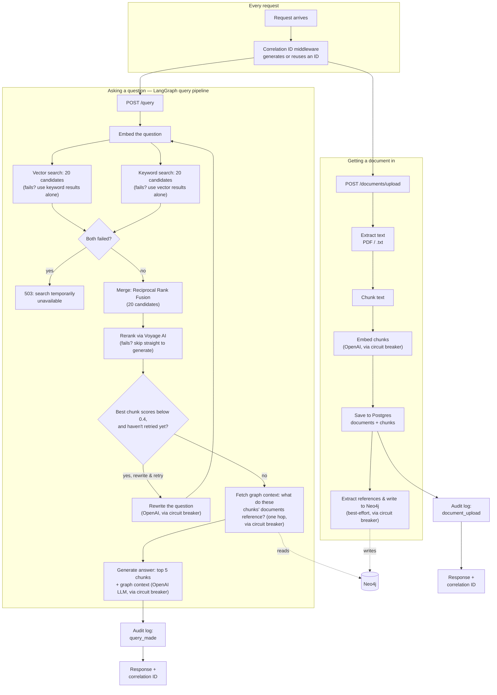
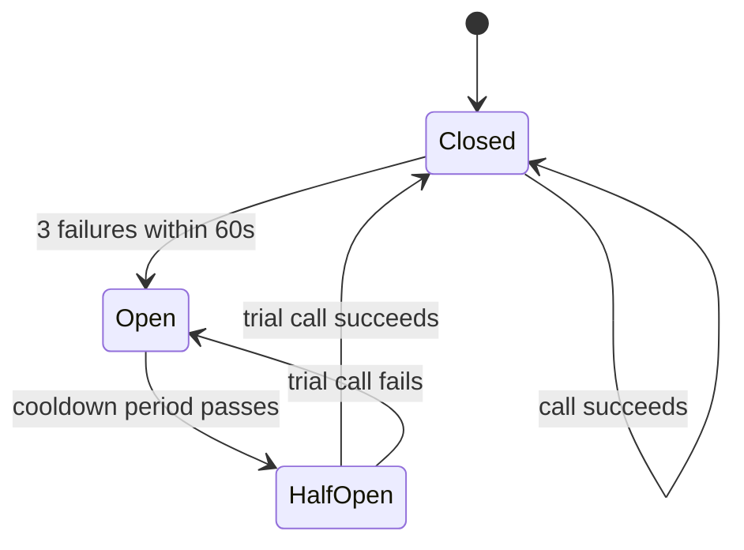

# Knowledge Brain — Architecture Guide

## What this system does

Knowledge Brain lets a company upload its internal documents and then ask
questions about them in plain English. Think of it like a private search
engine that gives you answers instead of a list of links.

## The big picture — how the pieces fit together

Two things exist now: getting a document *into* the system, and asking a
question *about* it. The second of those is no longer a straight line —
it's a LangGraph pipeline that can notice its own search results are
weak, rewrite the question, and try once more before giving up and
answering with whatever it has. Both flows now also touch a second
database: Neo4j, which remembers explicit references between documents
(not similarity — actual "this mentions that") and lets a question's
answer pull in context from a document that was never directly
retrieved, only connected. Everything after that in the build order
doesn't exist yet. Every request, regardless of which flow it's on,
also gets a correlation ID, an audit log entry, and circuit-breaker
protection around its external AI calls (OpenAI, Voyage AI, and now
Neo4j).

**Getting a document in:** a user uploads a file → the API receives it →
the file's raw text is pulled out → that text is cut into small
overlapping pieces → each piece is turned into a list of numbers that
represents its meaning → those pieces and their numbers are saved in the
database. If anything goes wrong along the way, the document is marked as
failed rather than left in limbo. If it succeeds, one more thing happens
before the response goes out: an LLM reads the document's text looking
for specific, named things it mentions (an error code, a ticket number),
and for each one, checks whether any *other* already-stored document
actually contains it — if so, that connection gets written to Neo4j as
an explicit link between the two documents. This step is best-effort:
if it fails, the upload still succeeds, it just won't have graph links
yet.

**Asking a question:** a user sends a question → it's turned into a
meaning-vector, and two independent searches run one after another: a
vector search (closest meaning) and a keyword search (Postgres full-text
search, for exact terms vector search can miss — error codes, product
IDs, rare proper nouns). Each fetches a wider pool of 20 candidates, not
just the final 5. If one of the two searches fails, the system doesn't
give up — it proceeds using whichever search actually succeeded, and
only returns an error if *both* fail. The two ranked lists (or the one
that's available) are merged into one using Reciprocal Rank Fusion,
favoring chunks either search strongly agrees on. That merged pool is
then reranked: Voyage AI's reranking model looks at the actual question
and each candidate chunk *together* (unlike vector/keyword search, which
score them separately), and picks the 5 that actually answer the
question best — and now also reports *how* relevant the best one really
is. If that top score is below a threshold (0.4) and this is the first
attempt, the pipeline doesn't just accept weak results — it asks an LLM
to rephrase the question, and searches again from scratch with the new
phrasing, once. If reranking itself is unavailable, or a second attempt
still comes up weak, the pipeline moves on anyway rather than looping
forever, and generates the best answer it can from whatever it found.
Once there are chunks worth using, one more step runs before
generation: for the documents behind those final chunks, the system
asks Neo4j what each one explicitly references — not what's similar to
it, what it actually *names* — and pulls in one snippet from each
referenced document, one hop only. Those final chunks, the graph
snippets, plus the *original* question (never the rewritten one — the
rewrite is only a search tool, not a replacement for what the user
actually asked), are handed to an LLM, which answers using only that
retrieved text, and says it doesn't know rather than guessing if the
answer isn't there.

**What's new since the last update:** a Neo4j document relationship
graph (build-order step 6). Unlike hybrid search or reranking, this
isn't about finding text that reads similarly — it's about explicit,
named connections between documents (a support note mentioning a
specific ticket ID that another document actually defines) that
similarity search structurally cannot see. An LLM extracts what a
document explicitly mentions at upload time; the existing keyword
search (no new lookup mechanism needed) resolves each mention to a
real document if one exists; a `REFERENCES` edge gets written to Neo4j.
At query time, the pipeline follows that edge one hop out from whatever
was actually retrieved, pulling in extra context from documents that
were never directly searched, only connected. Verified live: a question
answerable only by combining two separate documents came back correct,
citing a detail that existed solely in the graph-linked one. See
ADR-015.

The query pipeline (build-order step 5) is a LangGraph graph that can
loop back once if what it finds is weak, rather than a fixed sequence.
Getting the "weak" signal right took a real pivot: the original plan
(retry when zero chunks come back) turned out to basically never fire
with real data, since vector search always returns *something*, however
irrelevant — live testing caught this before it shipped. The actual
trigger is Voyage's own relevance score on the best chunk found,
thresholded at 0.4 based on real measured scores (a true match scored
0.914; irrelevant questions scored ~0.28–0.29 against the same data).
See ADR-014.

## The main components

**API route (`app/api/documents.py`)** — the "front door." Accepts an
uploaded file over the network, rejects unsupported file types immediately,
and hands the file off to the ingestion service. Talks to: the ingestion
service. If it disappeared, there'd be no way to get a file into the system
at all.

**Ingestion service (`app/services/ingestion_service.py`)** — the
conductor. Knows the *order* the pipeline steps must run in (extract, then
chunk, then embed, then save), and marks the document ready or failed at
the end. Talks to: extraction, chunking, embedding, and the repository. If
it disappeared, each individual step would still work, but nothing would
tie them together. Deliberately does *not* know about the relationship
graph below — building references is a separate concern, run
afterward, not folded into this service's own responsibility.

**Document graph service (`app/services/document_graph_service.py`)**
— runs once per document, right after ingestion succeeds. Reads what
the document explicitly mentions (via reference extraction), checks
whether any mention actually matches content already in another
document (reusing `find_by_keyword`, no new lookup needed), and records
a `REFERENCES` edge in Neo4j for each real match. Talks to: reference
extraction, the repository, and the graph repository. Best-effort — if
it fails, the document still uploads successfully, it just won't have
graph links yet.

**Reference extraction (`app/services/reference_extraction.py`)** — a
single, narrow LLM call: given a document's text, return the specific
named things it mentions (error codes, ticket numbers, policy names) —
not general topics, only things specific enough to plausibly be their
own document. Wrapped in its own circuit breaker
(`openai_reference_extraction`). Talks to: OpenAI.

**Extraction (`app/services/extraction.py`)** — pulls plain text out of a
file's raw bytes. Different file types (PDF vs plain text) need different
extraction logic, since a PDF's bytes contain layout and font information
mixed in with the actual words.

**Chunking (`app/services/chunking.py`)** — cuts a long piece of text into
smaller, overlapping pieces. Necessary because embedding models work on
short passages, and because search works better on small, focused pieces
than on one giant block of text.

**Embedding (`app/services/embedding.py`)** — calls an external AI model
(OpenAI) that turns each chunk of text into a list of numbers representing
its meaning. This is what will eventually let us search "by meaning"
instead of just by exact keyword.

**Repository (`app/repositories/document_repository.py`)** — the only
place in the codebase that talks directly to the database. Everything else
asks the repository to save or update things, rather than writing its own
database queries.

**Retrieval service (`app/services/retrieval_service.py`)** — still the
conductor for answering questions. `answer_question` builds a small
LangGraph graph (in `__init__`) and hands the question to it; the
actual step logic lives in six methods on this class (`_retrieve_node`,
`_rerank_node`, `_rewrite_node`, `_should_retry`, `_graph_context_node`,
`_generate_node`), each a graph node, all reusing the exact same
search/rerank/graph-lookup helpers hardened in ADR-012, ADR-013, and
ADR-015 — nothing about the existing partial-failure or
reranker-fallback behavior changed to add graph context on top. Talks
to: embedding, the repository, hybrid search, reranking, query
rewriting, the graph repository, and generation.

**Query graph (`app/services/query_graph.py`)** — defines the shape of
the data that flows between the retrieval service's graph nodes
(`QueryState`: the question, its possibly-rewritten form, candidates,
reranked chunks, a relevance score, retry count, the answer) and wires
those nodes into a compiled LangGraph graph. Talks to: nothing directly
— it only describes connections between methods the retrieval service
already owns.

**Query rewriting (`app/services/query_rewriting.py`)** — a single,
narrowly-scoped LLM call: given a question that just returned weak
search results, ask a model to rephrase it into something more likely to
find real content. Wrapped in its own circuit breaker
(`openai_query_rewrite`), kept separate from generation's, so a
rewriting outage can't be mistaken for a generation outage. Talks to:
OpenAI.

**Hybrid search (`app/services/hybrid_search.py`)** — merges the vector
search and keyword search result lists into one ranked list, using
Reciprocal Rank Fusion (scoring by rank position in each list, summed
across both, rather than trying to compare their raw, incomparable
scores). Talks to: nothing directly — it's a pure function called by the
retrieval service.

**Reranking (`app/services/reranking.py`)** — takes hybrid search's wider
candidate pool and re-scores it by sending the actual question and each
candidate chunk *together* to Voyage AI's reranking model, unlike
vector/keyword search, which score them separately and therefore more
approximately. Returns only the best few chunks, in order. Wrapped in its
own circuit breaker (`voyage_reranking`), independent from the two
OpenAI ones. Talks to: Voyage AI's hosted API.

**Generation (`app/services/generation.py`)** — sends the question and the
retrieved chunks to an LLM, with instructions to answer only from that
text and admit uncertainty rather than guess. This is the piece that
actually turns "relevant text" into a readable answer.

**Database (Postgres + pgvector, running in Docker)** — stores documents
and their chunks, including each chunk's meaning-vector, in one place,
and now answers both "which chunks are closest in meaning to this
vector?" (pgvector cosine similarity) and "which chunks best match these
keywords?" (Postgres's built-in full-text search) — no second database
needed for either.

**Graph database (Neo4j, running in Docker)** — stores one node per
document and directed `REFERENCES` edges between them, answering a
question neither pgvector nor full-text search can: "what does this
document explicitly point at, regardless of how differently worded the
two are." `app/core/graph_database.py` holds the driver/session setup
(mirrors `database.py`), and `app/repositories/graph_repository.py` is
the only place that writes Cypher (mirrors `document_repository.py`).
Wrapped in its own circuit breaker (`neo4j`).

**Correlation ID middleware (`app/core/middleware.py`)** — stamps every
incoming request with a unique ID (or reuses one a caller already sent),
readable from anywhere in the code handling that request via
`get_correlation_id()`, and echoes it back as a response header. Talks to:
nothing directly — every route and response includes its value. If it
disappeared, there'd be no way to trace one request's activity across
logs.

**Audit log (`app/models/audit_log.py`, `app/repositories/audit_repository.py`)**
— an append-only record of every user-initiated, state-changing action
(a document was uploaded, a question was asked). The repository
deliberately exposes only an insert method — nothing in the codebase can
update or delete an entry. Talks to: called directly from the API routes,
right after each action succeeds.

**Circuit breaker (`app/core/circuit_breaker.py`)** — wraps both OpenAI
call sites (embedding and generation) and stops calling OpenAI for a
cooldown period once it's failed repeatedly, instead of letting every
request separately wait for a doomed call to time out. Two independent
instances exist, one per call site, so a run of embedding failures
doesn't affect generation's circuit.

## Key decisions we made and why

We run the pipeline synchronously (the user waits while their file is
processed) rather than using a background queue like Kafka, deliberately
starting simple and adding a queue later once we feel the pain of long
processing times. Concretely, that pain has a number: with the database
connection pool's default size, roughly 15 concurrent uploads is enough
to start exhausting it, since each upload holds its connection for the
whole pipeline's duration — that's the actual threshold that would justify
Kafka, not a vague sense of "too much traffic." See ADR-001.

We chose Postgres + pgvector over a dedicated vector database (Qdrant) to
start, since it keeps document metadata and search vectors in one place
with one connection, and Qdrant is planned for later once we need
specialized, large-scale vector search. See ADR-002.

We run Postgres in Docker rather than installing it directly on the
developer's machine, to avoid it colliding with other software already
installed locally, and so the exact same setup works on any machine. See
ADR-003.

We instruct the answer-generation model explicitly to say it doesn't know
rather than guess, because an LLM's default tendency is to always produce
a confident-sounding answer — without that instruction, missing or
irrelevant retrieved context would likely lead to a made-up answer instead
of an honest "not found." See ADR-004.

Rather than retrofitting every "enterprise requirement" from an expanded
project scope all at once, we split them by whether they're actually
buildable yet: correlation IDs, audit logging, and circuit breakers were
added now since they're self-contained; PII detection, access control,
and Azure-specific concerns (API gateway, Key Vault) were deferred, since
they depend on work — an auth model, an actual cloud deployment — that
doesn't exist yet. See ADR-007.

The correlation ID is shared across a request using a `ContextVar` rather
than FastAPI's `request.state`, specifically because services and the
repository are called several layers deep and never receive the raw
`request` object — a `ContextVar` is readable from anywhere in that call
chain without threading it through every function signature. See ADR-008.

The circuit breaker was built by hand rather than pulling in a library,
consistent with how the rest of this project was built, and its state
lives in each process's memory — meaning it does not yet work correctly
across multiple server instances, since each one tracks failures
independently. At real scale that's not just a missed optimization, it's
a misleading on-call signal: dashboards would show inconsistent,
partial error rates split oddly across replicas instead of one clean
"OpenAI is down," which looks like a bug rather than the protection
working as intended. See ADR-010.

Keyword search uses Postgres's built-in full-text search rather than a
dedicated search engine like Elasticsearch, for the same reason pgvector
was chosen over Qdrant — one database, no new infrastructure. The two
result lists (vector and keyword) are merged with Reciprocal Rank Fusion
rather than trying to combine their raw scores directly, since a cosine
distance and a text-relevance score aren't measured on comparable scales.
See ADR-011.

Reranking uses Voyage AI's hosted API rather than a local cross-encoder
model or reusing OpenAI with a ranking prompt — the goal was specifically
a model purpose-trained for relevance scoring, without pulling a heavy
new local ML dependency into a project that otherwise only ever talks to
hosted AI APIs. Reranking is the one external AI dependency in this
system that's genuinely optional: if it fails, the request still
succeeds, just using hybrid search's own ranking instead — unlike an
OpenAI failure, which still fails the request today, just with a clean
`503` instead of a crash. See ADR-013.

The query pipeline detects "weak retrieval" using Voyage's own
relevance score, not an empty-results check — the empty-results version
was actually built first, per the original plan, and found not to work
against live testing: vector search has no relevance floor, so it
always returns *something*. The retry is also deliberately skipped, not
just declined, when reranking itself is unavailable rather than merely
weak — rewriting the question can't fix an unreachable API, and would
likely just hit the same open circuit again a moment later. `MAX_RETRIES`
is a hard cap of 1, and deliberately not something that gets raised
under higher traffic — more retries under load means more calls to the
exact vendors already struggling, worsening the problem instead of
fixing it, the same retry-storm reasoning ADR-012 already used once. See
ADR-014.

The document relationship graph tracks explicit references extracted
from a document's own text, not topic similarity an LLM infers — the
latter was considered and rejected specifically because it would
substantially duplicate what vector search already does; the graph's
whole reason to exist is answering a structurally different question
similarity search can't. Traversal is deliberately capped at one hop
(what a document directly references, never references-of-references),
and the whole feature is best-effort, same as reranking: unreachable
Neo4j degrades to "no extra context," never a failed upload or a failed
query. See ADR-015.

## How data moves through the system

**Uploading a document:** a user sends a file to the upload address. The
system checks the file type is supported, creates a database record for
the document immediately (marked "pending"), then extracts its text,
splits that text into chunks, turns each chunk into a meaning-vector, and
saves everything to the database. If every step succeeds, the document is
marked "ready." If any step fails, the document is marked "failed" instead
of being left stuck partway through. If it succeeds, one more thing
happens: an LLM reads the document's own text for specific things it
names — an error code, a ticket ID — and for each one, the existing
keyword search checks whether any other stored document actually
contains it. Real matches get written to Neo4j as an explicit link. This
step can't fail the upload; if Neo4j or the extraction call is
unavailable, the document is still "ready," it just has no graph links.

**Asking a question:** a user sends a question to the query address. The
question is turned into a meaning-vector using the same embedding model
used for chunks, so the two are comparable. Postgres finds 20 candidate
chunks by vector similarity and, separately, 20 by keyword match, and
merges the two ranked lists into one with Reciprocal Rank Fusion. Voyage
AI's reranking model then looks at the actual question and each of those
20 candidates together, narrows them down to the 5 that genuinely answer
the question best, and reports how relevant the best one actually is.
If that top score is weak and this is the first attempt, the pipeline
loops back: an LLM rephrases the question, and the whole search runs
again with the new phrasing — once, never more. Once there are chunks
worth using, the system asks Neo4j what the documents behind those
chunks explicitly reference — one hop only — and pulls in a snippet
from each. Those chunks, the graph snippets, and the *original*
question are sent to an LLM, which writes an answer grounded only in
that retrieved text.

## What could go wrong and how we handle it

**A scanned PDF with no real text** — some PDF pages are just a photograph
of a page, with no actual character data underneath. Extracting text from
a page like that returns nothing, so that page contributes no searchable
content. The document still gets marked "ready," since nothing in the
pipeline actually errors — it just silently produces zero useful chunks,
which is a worse failure mode than a visible one, since there's no signal
telling anyone it happened. Not handled yet — a future improvement would
add OCR (a technology that reads text out of images) to cover this case.

**An embedding call fails partway through a large document** — because all
of a document's chunks are sent to the embedding model in a single batch
request, a failure there means none of that document's chunks get saved,
not a partial set. The whole document is marked "failed," and it would
need to be re-uploaded and reprocessed from scratch.

**No documents have been uploaded yet, or nothing relevant matches** — the
similarity search still returns *something* (it always returns the
closest chunks it can find, even if none are truly relevant). The query
pipeline now notices this, using Voyage's own relevance score rather
than trusting that "some chunks came back" means they're any good — if
the best one scores below 0.4 and this is the first attempt, it rewrites
the question and tries once more before giving up. Even after that,
there's still no guarantee: the generation step's "say you don't know"
instruction is what actually prevents a bad answer, and that instruction
isn't perfectly reliable — there's no automated evaluation harness yet
(build-order step 9) measuring how often the model still guesses despite
being told not to, so today the only backstop is a human noticing an
answer looks wrong. See ADR-004 and ADR-014.

**The query pipeline's retry loop itself has a blind spot** — when it
fires, it's invisible to anyone watching the system from outside: the
user just gets an answer, with nothing in the API response indicating a
retry happened. The only trace today is a correlation-tagged log line
inside `_rewrite_node`. There's no metric yet for "how often does this
retry fire," so an on-call engineer would have to know to grep logs for
it specifically — acceptable at zero production traffic, not acceptable
once this serves real users. See ADR-014.

**OpenAI itself starts failing repeatedly (outage, rate limit)** — after
3 failures within 60 seconds, that call site's circuit breaker opens.
Further ingestion attempts fail fast and the document is marked `failed`,
same as any other embedding failure. Further query attempts get an
immediate `503` with a clear "temporarily unavailable" message instead of
hanging until a timeout. After a cooldown, one trial call is allowed
through to check whether OpenAI has recovered. This only works cleanly
as a single process today — run more than one server instance and each
tracks its own failures independently, so one instance can report "down"
while others keep serving successfully, a confusing, inconsistent signal
rather than a clean one. See ADR-010.

**Voyage AI (reranking) starts failing repeatedly** — after 3 failures in
60 seconds, its own independent circuit breaker opens, same mechanism as
the OpenAI ones. Unlike an OpenAI failure, this doesn't fail the request:
`retrieval_service.py` catches it and falls back to hybrid search's own
Reciprocal Rank Fusion order instead, so the user still gets an answer,
just without reranking's improvement to which chunks were chosen. See
ADR-013.

**Neo4j starts failing repeatedly, either during upload or during a
query** — its own independent circuit breaker opens after 3 failures in
60 seconds, same mechanism as the others. Neither case fails the
request: an upload still succeeds without new graph links (the
extraction LLM call and Neo4j write share one try/except in
`documents.py`, catching only `CircuitOpenError`), and a query still
answers using its retrieved chunks alone, without extra graph context.
Reranking and Neo4j are now the two dependencies in this system where a
failure degrades *quality*, not *availability* — everything else
(OpenAI's embedding and generation calls) still fails the request
outright today, just cleanly, as a `503`. See ADR-015.

**The audit log's tamper-proofing is currently code-level only** — the
repository has no update/delete methods, but the database connection
itself is a superuser and could bypass a real database-level restriction.
True enforcement needs either a separate, deliberately restricted database
role, or (the more realistic enterprise fix) shipping audit entries to
genuinely separate write-once storage, like Azure Blob Storage with an
immutability policy — neither exists yet. See ADR-009.

**Neo4j's document lookup has no index either, same class of gap** —
`MATCH (d:Document {id: $document_id})` currently matches by scanning,
not by an index. Fine at the current handful of documents, a full scan
at real scale — same shape of deferred work as the two gaps below, just
one more database added to the list, not a new kind of problem.

**A referenced document's snippet is naive, not targeted** — the
context pulled in from a referenced document is always just that
document's *first* chunk, not the chunk most relevant to the actual
question being asked. A more accurate version would rerun retrieval
against just that document using the current question — not built,
a known simplification made for this pass, not an oversight.

**Neither half of hybrid search has a real index yet** — both
`cosine_distance` and `to_tsvector` are computed fresh, on every row, on
every query. Fine at our current tiny scale, but at 10 million chunks
(roughly 61 GB of raw embedding data alone, at 1536 dimensions per vector)
an unindexed scan on every query becomes the dominant cost. The fix is an
HNSW index on the embedding column and a GIN index on a persisted
`tsvector` column — deliberately deferred, tracked as a future
optimization rather than forgotten. See ADR-002.

**Keyword search can return fewer chunks than requested, even when vector
search always returns exactly the requested count** — vector search
always finds *the closest* chunks, even if they're not a good match;
keyword search is a real filter and may find fewer matches, or none.
Reciprocal Rank Fusion handles this naturally — a chunk found by only one
search still gets included, just without the score boost a chunk found by
both searches gets.

**One of the two hybrid searches actually errors out (not just "found
nothing," a real failure)** — the request no longer fails outright. The
retrieval service catches each search's failure independently and
proceeds using whichever one succeeded; only a failure of *both* searches
returns a `503`. Getting this right required a second fix: rolling back
the database session to recover from one search's failure was quietly
invalidating the *other* search's already-fetched, successful results,
since a rollback expires every object the session is still tracking —
fixed by detaching each search's results from the session immediately
after fetching them. Found by actually running a test that force-fails
each search independently, not by reading the code. See ADR-012.

## Glossary

**Chunk** — a small piece of a larger document's text.

**Embedding / vector** — a list of numbers produced by an AI model that
represents what a piece of text means, used so similar meanings can be
found by comparing numbers instead of comparing exact words.

**pgvector** — an add-on to Postgres that lets it store and search
embedding vectors alongside normal data.

**Cosine similarity** — a way of comparing two vectors by the angle
between them, used to measure how similar in meaning two pieces of text
are, regardless of how long either one is.

**Retrieval-Augmented Generation (RAG)** — the pattern of finding relevant
text first, then handing it to an LLM to write an answer from, instead of
asking the LLM to answer purely from what it already knows.

**Reranking** — a second, more accurate pass over a search's candidate
results, narrowing a larger pool down to the best few before they reach
generation.

**Cross-encoder** — the kind of model reranking uses: it looks at a
question and one candidate chunk *together*, in a single pass, rather
than comparing two separately-computed representations the way vector
search does. More accurate, but too slow to run against every row in a
database — only against a short candidate list.

**Hallucination** — when an LLM confidently states something false or
made-up, typically because it lacks real information and defaults to
guessing rather than admitting uncertainty.

**Repository** — the part of the code responsible only for reading and
writing to the database, with no business logic in it.

**Service** — the part of the code responsible for business logic — the
actual sequence of steps a feature performs.

**Correlation ID** — a unique ID assigned to one incoming request, included
in every response and log line from that request, so its whole story can
be traced even while many other requests are happening at once.

**`ContextVar`** — a Python variable that's automatically kept separate
per concurrent task, letting code anywhere in that task's call stack read
the same value without it being passed explicitly as a parameter.

**Circuit breaker** — a safeguard that stops calling a repeatedly-failing
external service for a cooldown period, so requests fail fast instead of
each one separately waiting for a doomed call to time out. Named after
the same mechanism in an electrical panel.

**Audit log** — a permanent, append-only record of significant
user-initiated actions (who did what, when), kept for accountability —
its value depends on nobody, including the application itself, being able
to edit or delete an entry after it's written.

**Hybrid search** — combining keyword (exact-term) search with vector
(meaning-based) search, so a system can find both "conceptually similar"
results and "contains this exact word/code" results, instead of only one.

**Full-text search / `tsvector` / GIN index** — Postgres's built-in
keyword search: `tsvector` is a normalized, searchable form of text
(lowercased, stop words removed, words stemmed to their root); a GIN
index lets Postgres search that form quickly instead of reprocessing raw
text on every query.

**Reciprocal Rank Fusion (RRF)** — a way to merge two independently
ranked lists into one, by scoring each item based on *where it ranked* in
each list (not its raw score) and summing those scores — so items both
lists agree are good naturally rise to the top.

**LangGraph** — a framework for building a pipeline as a graph of steps
("nodes") connected by "edges," instead of one fixed sequence of
function calls. Its point is *conditional* edges: the next step can
depend on what the current step actually found, which lets a pipeline
branch or loop, not just run the same steps in the same order every
time.

**Node / edge (LangGraph)** — a node is one step in the pipeline (e.g.
"rerank the candidates"); an edge connects two nodes. A conditional edge
picks which node runs next based on the current state, rather than
always going to the same next step.

**Graph database (Neo4j)** — a database built around nodes (things —
here, one per document) and edges (relationships between things — here,
`REFERENCES`), optimized for "what's connected to this, and how." Not
to be confused with LangGraph above: LangGraph's "graph" is a pipeline
of code steps, this one is actual stored data about how documents
relate to each other — same word, two unrelated meanings, both used in
this project.

**Cypher** — Neo4j's query language, built specifically for describing
and following relationships (`MATCH (a)-[:REFERENCES]->(b)`), the same
role SQL plays for Postgres.

**One-hop traversal** — following a relationship exactly one step out
(what this document directly references) rather than chasing it
further (what *those* documents reference, in turn). A deliberate scope
limit here, not a technical ceiling — unbounded traversal means
unbounded extra context and cost per query.

**Relevance score** — a number a reranker assigns to how well a specific
chunk actually answers a specific question, roughly 0 (unrelated) to 1
(a strong match) for Voyage's reranker specifically. Different from
cosine similarity or `ts_rank`: those compare separately-computed
representations, this compares the actual question and the actual chunk
together.

**Query rewriting** — asking an LLM to rephrase a question that just
returned poor search results, so the *retrieval* step gets a better shot
at finding real content on a second attempt. Distinct from the answer
the user eventually sees, which is always generated from their
*original* question, never the rewritten one.
