# Knowledge Brain — Interview Prep

A study sheet, not a spec. Read this before an interview to refresh why we
built things the way we did. Answers are written in plain language — the
goal is to say them back naturally, in your own words, not recite them.

---

## Feature 1: Document Ingestion Pipeline

**What does this feature do, in one sentence?**
It takes an uploaded file, pulls the text out of it, cuts that text into
small pieces, turns each piece into a list of numbers representing its
meaning, and saves everything to the database — now sitting between two
newer gates: a PII check (Feature 9) that can stop it before chunking,
and access control (Feature 10) that grants the uploader access right
after the document row is created.

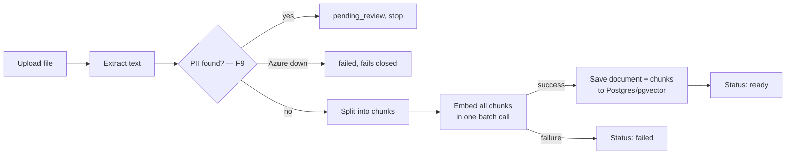

**Why did we process the file synchronously (the user waits) instead of
using a background queue like Kafka?**
Because it's simpler to build and reason about right now, and our
documents process in under a second. Kafka adds real complexity — a
separate worker process, a message broker, and handling "the upload
succeeded but processing is still happening elsewhere." We're deliberately
waiting to add that complexity until we actually feel the problem it
solves — specifically, once a large document makes someone wait 30+
seconds staring at a spinner.

**Why Postgres + pgvector instead of a dedicated vector database like
Qdrant?**
Because it keeps everything — a document's normal info (filename, status)
and its chunks' embedding vectors — in one database, one connection, one
query language. Saving a document and its chunks can happen as a single
all-or-nothing operation, which is harder to guarantee across two separate
databases. Qdrant is faster at large-scale vector search, but we're adding
it later, once pgvector's performance actually becomes a bottleneck.

**Why do we run Postgres in Docker instead of installing it directly on
the machine?**
A native install becomes part of the machine and can silently conflict
with other software — we actually hit this during setup, where a native
Postgres already on the machine intercepted our connections without any
error message. Docker keeps our database fully isolated, and anyone can
get the exact same setup with one command.

**What happens if something fails partway through processing a document —
say, the call to OpenAI times out?**
The document is marked `failed` in the database, instead of being left
stuck at `pending` forever. Without that, a failed document would look
identical to one still normally processing — no signal anything went
wrong, and no way to know if it's safe to retry.

**If a document has 50 chunks and the embedding call fails, does the
document end up with 49 saved chunks and 1 missing?**
No — all of a document's chunks are sent to the embedding model in a
single batch request, not one at a time. If that one request fails, zero
embeddings come back, so zero chunks get saved. It's all-or-nothing, not
partial.

**What happens if someone uploads a scanned PDF — basically a photograph
of a page?**
A PDF page can either contain real character data ("draw the letter H
here") or just one embedded photo covering the whole page, with no
character data at all — that's what a scan or phone photo produces. Our
text extraction finds nothing on a page like that, so it contributes no
searchable content. Not handled yet — the real fix would be OCR (a
technology that reads text out of images), which we haven't added.

**If this had to handle 10x the documents — thousands of large PDFs a
day — what breaks first?**
Not really "the embedding model is slow" — it's that our synchronous
design ties up a database connection for the *entire* time the pipeline
runs. The connection pool defaults to 15 total connections, and each
upload holds one for the whole 2-30 seconds a document takes to process.
So somewhere around 15 concurrent uploads, new requests stop failing
cleanly and start queueing silently, which shows up as rising latency, not
a clear error — that's the concrete number that would justify finally
adding Kafka, not a vague "too much traffic." It's also worth being honest
that Kafka isn't free to run: it means an always-on consumer process
burning compute even at zero load, and a new failure mode (a stalled
consumer, growing backlog) that's invisible unless someone's specifically
watching queue depth — a genuinely different on-call signal than "a
request is slow."

---

## Feature 2: Retrieval + Answer Generation

**What does this feature do, in one sentence?**
It takes a question, turns it into the same kind of meaning-vector as our
stored chunks, finds the chunks whose meaning is closest to the question,
and asks an LLM to answer using only those chunks — now one of two
searches (Feature 3), permission-filtered (Feature 10), reranked
(Feature 4), with a possible retry (Feature 5) and extra graph context
(Feature 6) before generation ever runs.

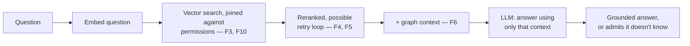

**Why do we compare vectors instead of just comparing the question's raw
text against each chunk's raw text?**
Comparing raw text can only really catch matching keywords. Vectors
capture *meaning* — so two chunks phrased completely differently but
saying the same thing will still be found as similar. That gives much
better, more relevant matches than keyword matching.

**The chunk's text lives in Postgres, and its embedding lives in
pgvector — how are the two linked together?**
They're not actually two separate things needing to be linked. pgvector
is just an extension that adds a new column type to Postgres itself — the
chunk's text and its embedding vector are two columns sitting right next
to each other in the exact same row, in the one `chunks` table. There's no
separate system, so there's nothing to map.

**Why cosine similarity, out of the three metrics pgvector supports
(cosine, L2 distance, inner product)?**
Cosine similarity measures the angle between two vectors, which captures
"how similar in meaning" regardless of how long either piece of text is —
and it's the metric OpenAI's own documentation recommends for their
embeddings. That matches our case well, since questions and chunks are
rarely the same length.

**Why gpt-4o-mini instead of the more capable gpt-4o for generating
answers?**
Answering a question from a small set of retrieved chunks is "grounded"
question answering, not open-ended reasoning — it doesn't need gpt-4o's
extra reasoning power. gpt-4o-mini is much cheaper and faster, which
matters more right now than a capability we don't need yet. Since the
model name is just a setting, upgrading later is a one-line change, no
code changes required.

**Why do we explicitly tell the LLM to say "I don't know" instead of
trusting it to behave well on its own?**
An LLM's default tendency, unless told otherwise, is to always produce a
confident-sounding answer — that's what most of its training rewards.
Weak or irrelevant retrieved context is more likely to produce a
hallucinated (confidently made-up) answer than an honest refusal, unless
we say so directly in the instructions we give it.

**If the `chunks` table had 10 million rows instead of a handful, what
happens to `/query`'s response time, and what's the actual fix?**
Right now, finding the closest chunks means comparing the question against
*every single row* — fine at tiny scale, painfully slow at millions of
rows. Concretely, 10 million chunks at 1536 dimensions each is around 61
GB of raw embedding data alone, and every query would scan all of it. The
fix isn't a hash map (hash maps only do exact-key lookups, and there's no
"exact match" in similarity search). The real fix is a vector index like
HNSW, which pre-organizes the vectors into a searchable structure so a
query only has to check a small fraction of all the rows, trading a tiny
bit of accuracy for a big speed gain. That's also the point where I'd
actually consider moving to Qdrant instead of pgvector — not before, since
pgvector already runs inside infrastructure we're already operating and
monitoring, and standing up a second stateful service is a real ongoing
cost, not just a technical upgrade.

---

## Feature: Correlation IDs, Audit Logging, and Circuit Breakers

**What do these three features do, in one sentence each?**
Correlation IDs let you trace one request's whole story through the
logs. The audit log is a permanent record of who did what, for
accountability. Circuit breakers stop hammering an external service
(OpenAI) once it's clearly failing, instead of every request separately
waiting for a doomed call to time out.

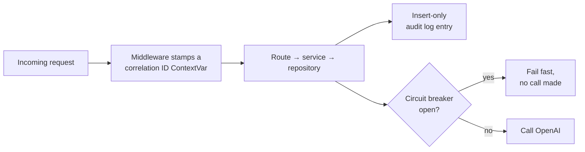

**Why did we only build these three "enterprise requirements" now, and
defer PII detection, access control, and the Azure-specific ones?**
The project's rules said all 8 were "non-negotiable from the start," but
that directly contradicted the project's own build order, which lists PII
detection and access control as later steps. We resolved it by splitting
on actual buildability: these three don't depend on anything that doesn't
exist yet, while access control at the time was meaningless with no user
model built, and the Azure-specific ones (API gateway, Key Vault) don't
apply to a system that only runs locally. Access control was built later
(Feature 10), once a lightweight stand-in identity existed — the same
pattern MCP used for auth, pulling forward a minimal piece rather than
waiting on full auth (still deferred).

**Why a `ContextVar` for the correlation ID instead of FastAPI's
`request.state`?**
`request.state` only works for code that has a direct reference to the
`request` object — true for route handlers, not true for services and
the repository, which are called several layers deep and intentionally
never receive `request` as a parameter. A `ContextVar` is readable from
anywhere in that call chain without threading it through every function
signature.
*Further reading: [Python's official `contextvars` documentation](https://docs.python.org/3/library/contextvars.html).*

**Why does the audit log's repository only expose an insert method?**
Because the whole value of an audit log depends on nobody being able to
quietly edit or delete an entry after the fact — if it could be altered,
it couldn't be trusted as evidence of what really happened. Not exposing
update/delete methods in code is the first layer of that protection.

**Is the audit log actually tamper-proof today?**
Honestly, not fully. The application code can't alter it, but our local
database connection is a superuser, which can bypass real database-level
restrictions. Even a properly restricted role is only a partial fix,
though — the real enterprise answer is usually shipping audit entries to
genuinely separate write-once storage, like blob storage with an
immutability policy, precisely because "a table in the same database,
reachable by anything with enough privilege" isn't a real compliance
boundary. That's a known, deliberately deferred gap, not an oversight.
There's also no retention or archival policy yet — the table just grows
with every request, which is fine at this scale but would need a plan
before it wasn't.

**Why build a circuit breaker by hand instead of using a library?**
Consistent with how the rest of the project was built — extraction,
chunking, and the API calls themselves were all written by hand so the
mechanism is fully understood, and a circuit breaker is simple enough
that building it doesn't cost much.
*Further reading: [Martin Fowler's "CircuitBreaker"](https://martinfowler.com/bliki/CircuitBreaker.html) — the article that popularized the pattern.*

**If we ran two copies of this server, what breaks?**
The circuit breaker's state lives in each process's own memory — nothing
shares it across processes. So each server instance has to independently
rack up its own 3 failures before its circuit opens, while a healthy-looking
instance that hasn't personally seen those failures yet keeps calling the
already-failing service. The fix would be moving that state into
something shared across instances, like Redis.

---

## Feature 3: Hybrid Search

**What does hybrid search do, in one sentence?**
It runs a vector (meaning-based) search and a keyword (exact-term) search
at the same time, then merges the two ranked result lists into one, so
the system catches both "conceptually similar" matches and "contains
this exact word/code" matches — both searches now joined against the
permissions table (Feature 10) before anything gets ranked, and the
merged pool feeds reranking (Feature 4) rather than being the final
answer.

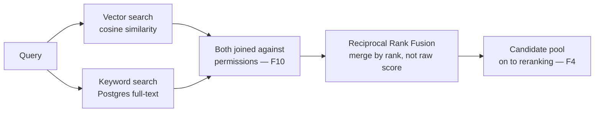

**Why isn't vector search alone good enough?**
Embedding models represent general meaning, not exact lexical identity —
they're weak at guaranteeing a match on specific things like error codes,
product IDs, or rare proper nouns. A document containing the exact string
"ERR-4521" might not surface for a search on that exact code, because the
embedding model never learned that string as meaningfully distinct from
similar-looking text.
*Further reading: [PostgreSQL's official Full Text Search documentation](https://www.postgresql.org/docs/current/textsearch.html).*

**Why Postgres full-text search instead of a dedicated engine like
Elasticsearch?**
Same reasoning as pgvector over Qdrant: it keeps everything in one
database, no new infrastructure, no second system to keep in sync. A
dedicated engine is more powerful at real scale, but that's overkill for
where this project is today.

**How does Postgres actually decide if a chunk "matches" a keyword
query?**
It's not raw string matching. Both the chunk's text and the query get
normalized the same way first — split into words, lowercased, stop words
like "the" and "a" removed, and each remaining word stemmed to its root
form (so "running," "runs," and "ran" all become "run"). Then it checks
whether the query's processed words appear in the chunk's processed
text, and ranks matches by relevance, not just whether a match exists.

**Why merge the two result lists using Reciprocal Rank Fusion instead of
just combining their raw scores?**
Cosine distance (vector search) and text relevance (`ts_rank`) are
measured on completely different, incomparable scales — there's no
principled way to add "0.23 cosine distance" to "1.8 relevance score."
RRF sidesteps that by scoring each chunk based on *where it ranked* in
each list instead of its raw score, then summing those rank-based scores
— which both methods can express in exactly the same terms.
*Further reading: the original paper — [Cormack, Clarke & Buettcher, "Reciprocal Rank Fusion outperforms Condorcet and Individual Rank Learning Methods," ACM SIGIR 2009](https://dl.acm.org/doi/10.1145/1571941.1572114).*

**If a chunk is found by only one of the two searches, does it get
dropped?**
No — it's still included in the merged results, just with a score from
only that one list, so it won't rank as high as a chunk both searches
agreed on. Nothing gets excluded for appearing in only one list; RRF
works over the union of both.

**Hybrid search runs two queries per request now instead of one — what
does that actually cost?**
Concretely, it doubles database load per query, and since both queries
currently run sequentially against the same connection, each request
holds that connection from the pool for roughly twice as long as before.
Using the same pool math as the ingestion side — about 15 total
connections available — that means the point where concurrent queries
start queueing for a connection happens at roughly half the traffic
compared to before hybrid search existed. It's a real, halved number, not
a free upgrade, even though it doesn't show up until there's real
concurrent load.

**At 10 million rows, what actually gets slow, and why?**
Not "keyword search is inherently slower than vector search" — both
sides currently compute their comparison fresh, on every row, on every
query, with no real index. For keyword search specifically, that means
re-tokenizing and re-stemming every row's text from scratch on every
query. The fix is a GIN index on a persisted `tsvector` column, the exact
same pattern as the HNSW index needed on the vector side.

---

## Feature: Hybrid Search Hardening — Graceful Degradation on Partial Failure

**What does this change do, in one sentence?**
If one of hybrid search's two database queries fails, the system now
answers using whichever one succeeded instead of failing the whole
request — it only gives up if *both* fail.

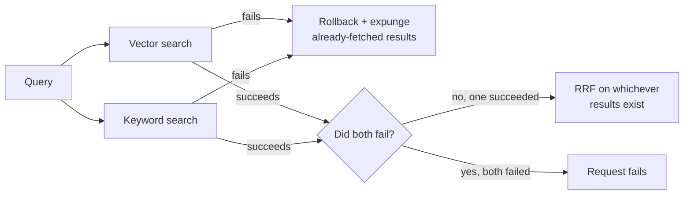

**Why not just retry the failed search instead?**
Retrying sounds safer but often isn't. If a query failed because the
database is genuinely under load, retrying immediately adds more load to
an already-struggling system instead of relieving it — a "retry storm."
Proceeding with the search that did succeed costs nothing extra and needs
no new logic, since Reciprocal Rank Fusion already treats "found by only
one search" as a completely normal case.

**This came from a code review, not a feature request — how did that
process work?**
A background review agent went through the hybrid search code and
returned findings. I didn't take them at face value — I re-verified the
concrete ones myself against the running database (checked the actual
index with `\d chunks`, confirmed a claimed double-computation with
`EXPLAIN VERBOSE`, and actually executed a query that a different finding
claimed would crash — it ran fine, so that one got dropped). Only
findings that survived that verification became real work.

**What's the subtlety with rolling back the database session, and why did
fixing the first bug introduce a second one?**
Both searches share one connection. If a query fails, Postgres refuses
any further queries on that same connection until it's explicitly rolled
back — so catching the failure isn't enough by itself; the *other* search
would fail too without an explicit `rollback()`. But `rollback()` doesn't
just reset the connection — it also expires every object the session is
still holding onto, including the chunks the *other* search had already
successfully fetched moments earlier. The next time the code reads one of
those chunks' text, SQLAlchemy tries to quietly reload it from the
database, which isn't allowed outside of an `await`, and crashes instead.
The fix: detach each search's results from the session (`session.expunge()`)
immediately after fetching them, so a later rollback has nothing left of
theirs to invalidate.
*Further reading: [SQLAlchemy's official docs on session state management and object expiration](https://docs.sqlalchemy.org/en/20/orm/session_state_management.html).*

**How was this actually verified, not just reasoned about?**
With a small script that force-fails each search independently (vector
only, keyword only, then both) against the real repository and a real
database connection, and checks the actual outcome. That script is what
caught the session-expiry bug — reading the code after the first fix
looked correct; running it didn't.

**If we ran this at real production scale, what changes about how this
failure would be noticed?**
Before this change, a keyword-search-only problem (e.g. the missing index
turning slow under real load) would fail *every single query* — loud, but
overstates the actual damage. After this change, the same problem shows
up as quietly degraded answer quality (RRF running on vector-only
results) with an error log per failed search — a more accurate signal,
but a much quieter one that needs someone actually watching per-search
failure rates to catch. Nothing in this project watches that yet.

---

## Feature 4: Reranking

**What does reranking do, in one sentence?**
It takes hybrid search's candidate chunks — now a wider pool of 20,
already filtered to documents this user can access (Feature 10),
instead of the final 5 — and uses a model that looks at the question and
each chunk *together* to pick the 5 that actually answer it best, instead
of trusting vector/keyword search's own ranking as final.

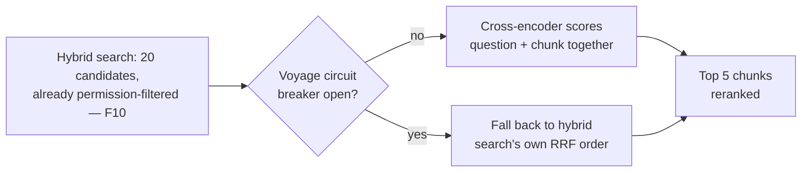

**Why isn't hybrid search's own ranking good enough on its own?**
Vector and keyword search both score the question and a chunk
*separately* — an embedding compares two independently-computed numbers,
never the actual texts side by side. That's fast enough to check against
every row in the database, but approximate. A reranker (specifically, a
cross-encoder) processes the actual question and one actual chunk
together in a single pass, which is far more accurate — but far too slow
to run against everything, only against a short list hybrid search has
already narrowed down.
*Further reading: [Sentence Transformers' official "Retrieve & Re-Rank" documentation](https://sbert.net/examples/sentence_transformer/applications/retrieve_rerank/README.html), which lays out exactly this two-stage pattern.*

**Why does hybrid search now fetch 20 candidates instead of 5?**
Because reranking needs something to actually choose between. If hybrid
search only ever produced the final 5, reranking would still technically
run — Voyage would still score and could still reorder those same 5 — but
it could never promote a chunk that hybrid search's own ranking happened
to place 8th over one it ranked 3rd, since anything outside the top 5
would already be gone. Fetching a wider pool is what gives reranking room
to actually change *which* chunks reach the LLM, not just their order.

**Why Voyage AI specifically, over a local model or reusing OpenAI?**
Three options existed: a local open-source cross-encoder, Voyage's hosted
Rerank API, or asking OpenAI directly via a prompt to rank the
candidates. OpenAI would have been the easiest to wire in — same client,
same settings pattern already used twice — but the goal was specifically
to use a model actually trained for relevance scoring, not repurpose a
general chat model for a task it wasn't trained for. Voyage over a local
model, specifically to avoid pulling a heavy new ML dependency (PyTorch,
downloaded weights) into a project where every AI capability so far goes
through a hosted API, not local inference. Its free tier (200 million
tokens) also made cost a non-factor, confirmed by checking current
pricing directly rather than assuming.

**What happens if Voyage itself fails?**
Its own independent circuit breaker opens after 3 failures in 60 seconds,
same mechanism as the two OpenAI ones. Unlike an OpenAI failure, this
doesn't fail the request — `retrieval_service.py` catches it and falls
back to hybrid search's own Reciprocal Rank Fusion order instead. This
makes reranking the one external AI dependency in this system where
failure degrades *quality*, not *availability* — verified for real by
forcing the circuit breaker open and confirming the request still
succeeded.

**A real mistake happened while wiring this up — what, and how was it
caught?**
A real Voyage API key briefly ended up in `.env.example` — the *template*
file meant to be committed to git with placeholder values — instead of
`.env`, which is git-ignored. Caught by checking `git status` and
`git log` before anything got pushed: the change was still unstaged and
uncommitted, so nothing ever reached git history. Fixed immediately, and
the exposed key was rotated anyway, since it had already appeared in
conversation transcript text — cheap insurance for something free to
redo. The habit worth keeping: `.env.example` only ever gets
placeholder-shaped values; real secrets only ever go in `.env`.

**If this had to run at real scale, what's the actual cost, and what's
the honest trade-off?**
At an estimated ~13,000 tokens per query (a question plus 20 candidate
chunks), the 200-million-token free tier covers well over 15,000 queries
before any billing starts, and stays cheap after that. The honest
trade-off isn't cost, though — it's that this system now depends on
*three* independent external AI vendors (two OpenAI call sites plus
Voyage) for one query to fully succeed, each with its own credentials to
manage and its own circuit breaker to reason about independently.

---

## Feature 5: LangGraph Query Pipeline

**What does this feature do, in one sentence?**
It turns the query pipeline from a fixed sequence of steps into a graph
that can notice its own retrieval results are weak, rewrite the
question, and search again once before generating an answer — the graph
itself gained a node since this was first built, when Feature 6 inserted
graph-context lookup between the retry check and generation.

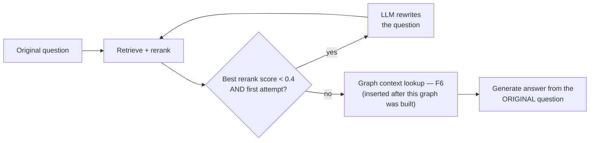

**The query pipeline was already five steps in a row before this — what
does LangGraph actually add over what we had?**
Being multi-step isn't the same as being able to make decisions.
Before, step 2 always followed step 1 no matter what happened — a
straight line. LangGraph adds *conditional* edges: after reranking, the
pipeline can check what it actually found and branch — loop back and
try again, or move on — instead of blindly continuing regardless of
result quality.

**The original plan was "retry if reranking returns zero chunks" — why
isn't that in the final code?**
Because it doesn't work, and that was only found by actually testing it
live, not by reading the code. Vector search has no relevance floor —
`find_similar_chunks` always returns the *closest* chunks by distance,
however irrelevant, as long as the table isn't empty. Asking a
completely unrelated question against the real database never
triggered the retry, because "zero results" essentially never happens
outside of an empty database.

**So what actually decides when to retry?**
Voyage's own `relevance_score` on the *best* reranked chunk — not "any"
or "all" five chunks, just the top one, since generation only needs one
genuinely relevant chunk to work from. If the best one scores below
`0.4`, and this is the first attempt, the pipeline rewrites the question
and searches again. The threshold itself came from real measurements
against the dev database: a genuinely relevant match scored `0.914`;
two different irrelevant questions both scored `~0.28–0.29` — a wide,
clean gap, with `0.4` sitting comfortably inside it.

**Why does the retry skip entirely — not just decline — when reranking
itself is unavailable, rather than when it's just weak?**
Those are different problems with different fixes. A weak score means
reranking *worked* but found nothing good — rewriting the question is a
real attempt to fix that. Reranking being *unavailable* means the tool
that would even tell you whether to retry is down — rewriting the
question and searching again can't fix an unreachable API, and would
almost certainly just hit the same open circuit breaker a moment later,
for no benefit.

**Why is the final answer always generated from the *original* question,
never the rewritten one?**
The rewritten question is a search tool, not a replacement for what the
user actually asked. If a rewrite broadens "Q4 revenue for Acme" into
something more searchable, the answer still needs to address the
specific thing asked — otherwise the system quietly answers an easier,
different question than the one it was given.

**If this had to handle 10x the traffic, would you raise `MAX_RETRIES`
to catch more relevant chunks?**
No — that's the wrong lever, and it's worth knowing why it's tempting
but wrong. Every retry is a full extra round trip through embedding,
both searches, and reranking again. At 10x traffic, both circuit
breakers already trip more often just from call volume; raising the
retry cap would send *more* load at the exact vendors already
struggling, tripping their breakers even faster — the same retry-storm
problem ADR-012 already reasoned its way out of once. The better lever
is tuning the circuit breakers' own thresholds to scale with traffic,
not retrying more.

**A real testing mistake happened while verifying this — what, and what
does it teach about testing LangGraph code specifically?**
Patching `RetrievalService._rewrite_node` on the class, after
constructing a `RetrievalService`, silently did nothing — the spy never
fired even when the method genuinely ran. The graph is built once in
`__init__` and captures a bound-method *reference* at that moment;
patching the class afterward doesn't reach an already-built graph. The
fix was patching the module-level `rewrite_query` function instead,
which every node looks up fresh on each call. Worth remembering
generally: patch what's actually looked up at call time, not something
already captured earlier.
*Further reading: [LangGraph's official `StateGraph` API reference](https://reference.langchain.com/python/langgraph/graph/state/StateGraph).*

---

## Feature 6: Neo4j Document Relationship Graph

**What does this feature do, in one sentence?**
After a document uploads, an LLM finds specific things it explicitly
mentions (an error code, a ticket ID), checks whether any other stored
document actually contains that thing, and if so records the link in
Neo4j — so a later query can pull in context from a document it never
directly searched, only connected to.

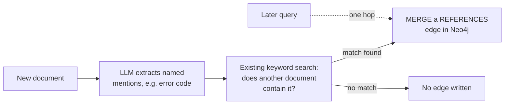

**Why does this need a graph database at all — what can't vector or
keyword search already do here?**
Both of those find text that reads *similarly*. This is a structurally
different question: does one document *explicitly point at* another,
regardless of how differently worded they are? A support ticket and the
specific KB article it names by ID might use completely different
vocabulary — low embedding similarity — but still need a direct link.
Vector search can miss that connection entirely; a graph traversal
follows it directly.

**The first design instinct was linking documents by topic clusters an
LLM infers — why wasn't that the final approach?**
Because it would substantially duplicate something that already exists.
"These two documents are about the same topic" is close to exactly what
an embedding comparison already measures — building a second, more
expensive system (an LLM call plus a whole separate database) to answer
a question vector search can already answer on the fly isn't adding a
new capability, it's re-implementing an old one. The graph's actual
value is answering the question similarity search structurally can't:
explicit, named references.

**Why not link documents by shared authorship or ownership instead?**
A real, practical reason, not a design preference: the `Document` model
has no author/owner field today, and no upload flow captures it. That
would be a separate change to ingestion before a graph could even use
it — worth doing once there's an actual reason to capture that
metadata, not assumed upfront.

**Walk me through how a reference actually gets resolved into a graph
edge.**
Three steps. An LLM reads the document's text and returns specific,
named things it mentions — not general topics, only things specific
enough to plausibly be their own document. For each mention, a keyword
search checks whether any other document actually contains it. That
used to be the *same* `find_by_keyword` hybrid search already had — but
Feature 10 made `find_by_keyword` permission-filtered by the uploader,
and reference-building needs to see every document regardless of who
owns it, since it's establishing a system-wide fact, not answering this
one user's question. Reusing the filtered version outright broke,
caught live; the fix was a second, deliberately unrestricted method,
`find_by_keyword_unrestricted`, built specifically for this caller. If a
match in a *different* document is found, a `REFERENCES` edge gets
written to Neo4j using `MERGE`, not `CREATE`, so re-processing the same
document doesn't create duplicate nodes.

**Why only one hop — why not follow references-of-references too?**
A deliberate scope limit, not a technical ceiling. Each hop out means
more Neo4j lookups and more extra context per query; unbounded
traversal means unbounded, unpredictable cost. One hop is small, known,
and capped — a document's *direct* references are also the ones most
likely to actually matter to the current question.

**What happens if Neo4j itself is unreachable — during upload, and
during a query?**
Neither case fails the request, same philosophy as reranking (ADR-013).
During upload, reference-building is wrapped in a `try/except` that
only catches `CircuitOpenError` — the document still ends up `ready`,
it just has no graph links yet. During a query, the graph-context node
catches the same exception and the pipeline answers using its retrieved
chunks alone. Reranking and Neo4j are now the two dependencies in this
system where failure degrades *quality*, not *availability* — unlike an
OpenAI failure, which still fails the request outright today, just
cleanly, as a `503`.

**A subtlety came up while building this — does a failed *read* still
need a rollback?**
Yes, and this is worth being precise about, since the instinctive answer
is usually wrong. `rollback()` isn't about undoing *data* — it's about
resetting a *transaction* Postgres has marked broken. Once *any* query
in a transaction fails, whether it's a `SELECT` or a `write`, Postgres
refuses to run anything else on that connection until it's rolled back.
A failed read leaves the session just as stuck as a failed write would
— skip the rollback here, and the *next* referenced document's snippet
lookup in the same loop would fail too, not because it has a problem,
but because the session itself is jammed.

**If this had to run at real scale, what's the first thing that would
actually get slow?**
Two separate things, not one. `MATCH (d:Document {id: $document_id})`
currently matches by scanning, not by an index — the same category of
deferred work already tracked for pgvector (HNSW) and full-text search
(GIN), just a third database added to that list. Less obviously: at
*ingestion* time, every mention extracted from a document triggers its
own `find_by_keyword` call, synchronously, during the same upload
request that already holds a database connection for the whole
pipeline (ADR-001) — a document with many distinct mentions makes that
existing connection-hold problem worse, not the graph lookups
themselves.
*Further reading: [Neo4j's official Cypher Manual introduction](https://neo4j.com/docs/cypher-manual/current/introduction/).*

---

## Feature 7: Evaluation Harness

**What does this feature do, in one sentence?**
It runs a fixed set of known-answer test questions through the real
pipeline and scores each one on three things — was the right document
retrieved, is the answer grounded in its context, and does it match the
reference answer — instead of relying on a human reading one response
and guessing whether it looks right.

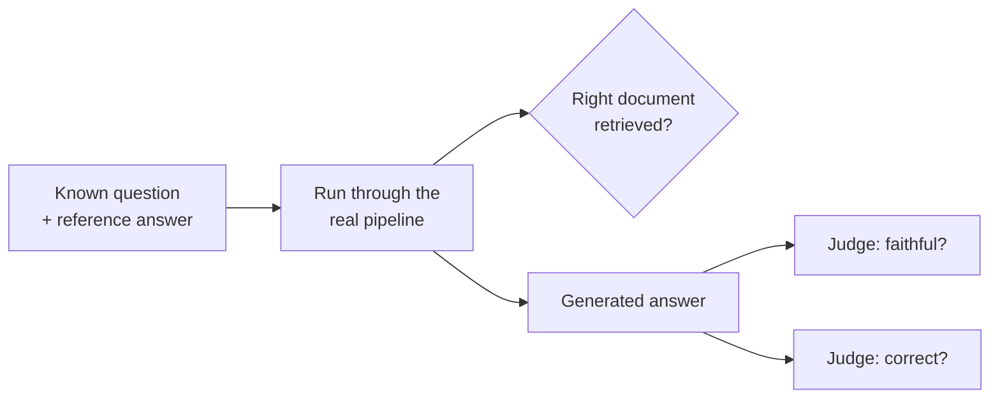

**Why does this need to exist — wasn't "read the answer and see if it
looks right" good enough?**
It was the only backstop for a while, but the pipeline has gotten
genuinely complex — five external dependencies, a retry loop, a
relevance threshold picked from just two data points, graph context
pulled from a second database. There was no systematic way to know
whether all of that was actually working *together*, only spot-checks.
A regression in one piece could easily hide behind a good-looking
answer on the one question someone happened to try by hand.

**Is this the same as the "guardrails" idea that came up around the
same time?**
No, and mixing them up would lead to building the wrong shape of tool.
Guardrails is a real-time safety gate on every *live* answer before a
user sees it — moderation, prompt-injection defense. This is an
offline, on-demand quality *measurement* tool, run manually, not on
every request. They ended up as two separate build-order items (9 and
16) specifically because conflating them was a real risk early in the
conversation.

**Why does the test corpus live in the same database as everything
else, instead of a separate eval database like the test suite uses?**
A genuinely separate database (the pytest pattern) was considered, but
rejected as more isolation than the actual problem needed. The goal was
a small, *known* set of documents with reproducible answers — not
isolating an entire database connection. A handful of dedicated,
purpose-written fixture documents, looked up by filename before
ingesting so re-running eval never creates duplicates, gets the same
reproducibility without a second database to stand up and maintain.

**Why judge faithfulness and correctness with two separate LLM calls
instead of one combined call?**
They're checking genuinely different things — is the answer grounded
in its context, versus does it match the reference facts — and
combining them into one response risks the model conflating the two
judgments. Two focused calls cost more than one combined call, but that
was accepted as the smaller risk.

**How is "was the right document retrieved" actually checked — string
matching the answer?**
No — by comparing the retrieved chunks' actual `document_id` against
the fixture document's known ID, the same "check against real state,
don't reimplement the logic as a string comparison" principle used
throughout this project's test suite.

**What's the honest limitation of this whole approach?**
The judge is itself an LLM call, and can be wrong or inconsistent
between runs, the same way the system it's judging can be. A passing
eval score is a strong signal, not a mathematical proof — a real,
known trade-off of using a model to grade a model, not something
specific to how this was built. It's also not wired into CI yet, so it
only catches a regression if someone remembers to run it.
*Further reading: [Es et al., "RAGAs: Automated Evaluation of Retrieval Augmented Generation," EACL 2024](https://aclanthology.org/2024.eacl-demo.16/), the paper that formalized separately scoring faithfulness, answer relevance, and context relevance for RAG systems.*

---

## Feature 8: MCP Server

**What does this feature do, in one sentence?**
It exposes the exact same retrieval and ingestion pipeline as two
tools an AI client can call directly over a standard protocol, instead
of only being reachable through this project's own `/query` and
`/documents` REST endpoints.

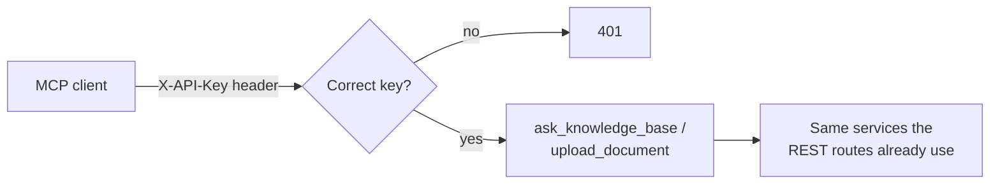

**Why HTTP instead of a local-only server — isn't local safer?**
Local is safer by default — nothing outside the machine can reach it.
HTTP was chosen deliberately, to build and prove out the pattern
you'd actually need in production: a real network-facing gate,
accepting that exposure because a shared-secret check is the
compensating control for it. That trade-off — safer-by-default versus
actually-representative-of-production — is also what reopened the
PII/ACL-ordering question from earlier sessions: a *local* server adds
no new exposure, so it could skip ahead of PII/ACL; an HTTP one
couldn't, without adding some form of gate first.

**Why mount it onto the existing FastAPI app instead of running it as
its own process?**
Every tool call needs the same OpenAI/Voyage calls, the same circuit
breakers, and the same database and Neo4j access the REST routes
already have. A standalone process would mean either duplicating all
of that wiring or reaching across processes for it. Mounting onto the
existing app gets it all for free, including correlation IDs — that
middleware wraps the *whole* app regardless of which mounted path a
request eventually reaches, not just the routes that existed when it
was registered.

**Why one shared secret instead of a key per caller?**
There's exactly one real caller type today, and distinguishing callers
only matters once there's more than one kind to distinguish. Building
per-caller keys now would be solving a multi-tenancy problem that
doesn't exist yet — the same reasoning behind deferring full
build-order item 14 rather than building it early.

**Walk me through the two bugs live testing caught that code review
wouldn't have.**
First: mounting a sub-app with `app.mount()` doesn't forward FastAPI's
startup event into it — only the outer app's own lifespan runs
automatically. Without an explicit `lifespan` context manager entering
`mcp.session_manager.run()`, the MCP server's internal task group was
never initialized, and every request failed with `RuntimeError: Task
group is not initialized`, even past a correct API key. Second:
Starlette's `BaseHTTPMiddleware` runs whatever it wraps in a separate,
buffered task — fine for an ordinary request/response, but it broke
MCP's long-lived streaming responses outright ("SSE stream ended
without a response"). Both were fixed only after actually running the
real MCP protocol against the server, not by reading the code — the
same discipline this project has relied on since the LangGraph
retry-threshold and Voyage rate-limit discoveries.

**What's the audit log bug you found while building this?**
`documents.py`'s existing pattern writes the `document_upload` audit
entry *after* the best-effort graph-linking step. Copying that pattern
into the MCP tool at first meant an unexpected (non-`CircuitOpenError`)
failure during graph-linking — a corrupted PDF `extract_text` can't
parse, say — would leave a document successfully ingested in Postgres
with no audit trail for its own upload at all. Fixed in the MCP tool
by moving the audit log write to right after ingestion succeeds,
before the graph-linking attempt. The identical gap still exists in
`documents.py` itself, tracked for a later fix, not changed here.

**What happens if the shared secret leaks, and how would you know?**
Anyone holding it can make unlimited calls, logged but with no way to
tell who made them apart from "held a valid key." Honestly — you
probably wouldn't find out in real time. There's no anomaly detection
watching call volume or timing today, so a leaked key looks like
normal traffic until someone notices something odd by hand. That's a
real, named gap, not a hidden one; the fix is exactly what per-caller
keys plus volume-based alerting would give you, which is why it's
flagged as future work once real auth (item 14) exists, not solved now.

**What would you change if this needed to handle 10x more concurrent
MCP calls?**
Every tool call opens its own database and Neo4j session by hand,
since there's no FastAPI dependency injection outside of HTTP routes
to hand one to it. At meaningfully higher concurrency, that competes
for the exact same connection pool `/query` and `/documents/upload`
already share — not a new ceiling MCP introduces, just one more source
of load against an existing, unchanged limit that would need real
sizing work before either the REST routes or MCP could handle it.
*Further reading: [the Model Context Protocol's official documentation](https://modelcontextprotocol.io), including the specification for the Streamable HTTP transport this feature uses.*

---

## Feature 9: PII Detection

**What does this feature do, in one sentence?**
Before any uploaded document gets chunked or embedded, its text is
checked by Azure AI Language for personal information — if any is
found, the document is held for human review instead of being made
searchable.

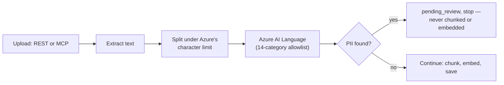

**Why does this check live inside `IngestionService` instead of the
API routes?**
Both the REST upload endpoint and MCP's `upload_document` tool already
call the same `IngestionService.ingest_document` — that's the exact
reason MCP needed zero changes to reuse it last feature. Putting the
PII check there protects both entry points automatically; putting it
in either route separately would mean two places to keep in sync, and
the other one left unprotected if anyone forgot.

**Walk me through what happens if Azure's PII service itself is down.**
It fails closed, not open. Every other external dependency in this
project that can fail gracefully (reranking, Neo4j) does — a missing
enhancement still leaves a working answer. PII detection is different:
it's a compliance gate, and an unverified document must not be
embedded, so an Azure outage marks the document failed instead of
letting it through unchecked. That's a real trade-off, not a free
win — it means one vendor being down now blocks *every* upload,
system-wide, on both entry points, a bigger blast radius than any
other single dependency failure in this system today.

**Why 14 hand-picked categories instead of just using Azure's default
detection?**
Live testing — not code review — caught the reason: Azure's
`PersonType` category flagged the word "employee" in a completely
unremarkable document at 98% confidence. It identifies a *role* being
mentioned, not a specific person's information, and almost every real
business document mentions roles somewhere — using Azure's full
default set would have made nearly everything trigger review.
`PersonType` isn't even in Azure's own list of categories that can be
explicitly excluded by name, so an allowlist (only request specific
categories) was the only way to leave it out — anything not asked for,
including `PersonType`, simply never comes back.

**How does a long document avoid hitting Azure's character limit?**
Azure's synchronous PII endpoint caps each document at 5,120
characters and 5 documents per request — verified against Microsoft's
own docs, not assumed. Long text gets split on paragraph breaks, not a
hard character cut, greedily filling each piece up to just under the
limit; a single paragraph longer than the limit on its own falls back
to a hard cut, but only for that one paragraph. Splitting on
paragraphs instead of an arbitrary character count is deliberate — the
whole reason PII detection sends a document as one big piece instead
of tiny retrieval-sized chunks in the first place is to avoid severing
a name or address across a boundary, and paragraph-aware splitting
keeps most of that benefit even when a document is too long to send as
a single request.

**What's the honest scope limit of this feature?**
It only recognizes identity formats for two countries — US and India.
A French social security number or a UK national insurance number
would sail through completely undetected today. That's not a bug, it
was a deliberate scope decision, but it's a real limit worth being
upfront about, not something to imply is broader than it actually is.
*Further reading: [Azure AI Language's official data and rate limits documentation](https://learn.microsoft.com/en-us/azure/ai-services/language-service/concepts/data-limits), which specifies the exact per-document and per-request limits this feature's splitting logic is built around.*

---

## Feature 10: Document-Level Access Control

**What does this feature do, in one sentence?**
Every uploaded document is now visible only to users explicitly granted
access to it, enforced by filtering the database query itself at
retrieval time — not by hiding results after they've already been
fetched.

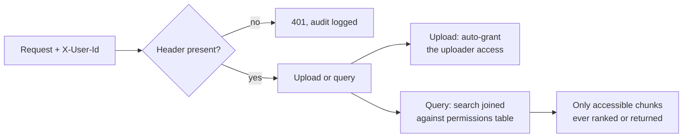

**`CLAUDE.md` asks this directly: how does document-level ACL interact
with the vector retrieval step?**
The permission check lives inside the same SQL query that does the
similarity search — a join against a `document_permissions` table,
applied *before* the `ORDER BY` and the `LIMIT`, not as a filter on the
results afterward. That ordering matters: filtering after ranking risks
returning fewer results than requested — or none — even when plenty of
accessible chunks existed just outside an unfiltered top-N. Filtering
first means the ranking only ever happens over chunks the user could
already see.

**Why a plain `X-User-Id` header instead of real login?**
This project has no user model yet — real auth (passwords, sessions)
is a much later build-order item. A `user_id` string is a lightweight
stand-in, the same move MCP made with its shared API key: enough to
make "does this user have access" a real, checkable question now,
without waiting on a feature that's still far off. It's self-asserted,
not authenticated — a real, named limitation, not a hidden one.

**Why middleware instead of a per-route dependency?**
Identity needed to cover MCP too, and MCP tools aren't FastAPI routes —
they can't use route-level dependency injection the way `/query` and
`/documents/upload` can. Middleware wraps the *entire* app, so the same
mechanism that already gave MCP a correlation ID for free extends to
identity with no special-casing per entry point.

**Walk me through the two bugs live testing caught here that a code
review of `_retrieve_node` wouldn't have.**
Both came from the same root cause: a new permission check protects
exactly the function it was added to, nothing else that happens to read
the same data. First, `DocumentGraphService.build_references` — which
searches every document at ingestion time to find cross-document
references — crashed against the newly-required `user_id` parameter.
Fixed with a separate, explicitly unrestricted search method, since
building the reference graph is a system-level fact about documents,
not a view scoped to the uploader. Second, and more serious: the
graph-context feature's snippet lookup, `get_first_chunk_text`, had *no
permission check at all* — a real path where a user could receive
content from a document they were never granted access to, as long as
some document they could see happened to reference it. Neither was
visible from reading the primary retrieval path alone; both surfaced
only once the feature was exercised end to end.

**What's the actual lesson from those two bugs, for a system design
question?**
There is no single central gate protecting all chunk access in this
system. Every function that reads chunk content needs its own explicit
permission check — adding one to `find_similar_chunks` protects
exactly `find_similar_chunks`. A future feature reading chunks through
yet another new path would need this applied again, deliberately; it
isn't inherited automatically just because a similar check exists
elsewhere in the codebase.

**Who's allowed to share a document with someone else, and why that
rule?**
Anyone who currently has access can grant it to someone else — not
only the original uploader. The permissions table has no concept of
"owner" versus "was granted access later," every row looks the same,
so this was the simpler rule to build now. The real trade-off: a
document can be re-shared indefinitely, with no way for the original
uploader to see or stop it. Accepted deliberately for this pass, not
something to carry into a real multi-tenant deployment without adding
ownership tracking first.

**What would you change here if this needed to handle 10x more
documents and users?**
The permission join needs its own index to stay cheap — `(user_id,
document_id)`, which the unique constraint on the table already
provides for free. Without it, every single question asked would pay a
full table scan on `document_permissions` on top of the existing
vector and keyword search cost, on every request, forever — not a
one-time migration cost, a permanent tax on every query going forward.
*Further reading: [OWASP's "Broken Access Control," the #1 risk in the OWASP Top 10:2021](https://owasp.org/Top10/A01_2021-Broken_Access_Control/), the industry-standard reference for exactly this class of vulnerability.*

---

## Feature 11: Azure Deployment — Infrastructure, Image, and Registry

**What does this feature do, in one sentence?**
Provisions the real cloud infrastructure this backend runs on —
resource group, Postgres, Key Vault, a container registry, and a
Container App, via Terraform — and builds the backend's real Docker
image, verifies it locally against real dependencies, and pushes it to
that registry, ready for the Container App to actually run (see
Feature 12 for getting it live).

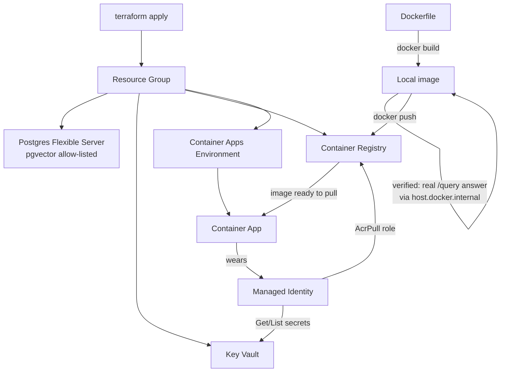

**Why deploy the backend before building API Management, when
`CLAUDE.md`'s own build order lists the gateway first?**
A gateway needs something real to route to. Nothing ran in Azure at
all before this phase, so API Management would have had no backend to
sit in front of yet. This is a deliberate, reasoned swap of build-order
items 11 and 12, not skipping ahead — the dependency direction only goes
one way.

**Why is the Container App's ingress public right now, when Enterprise
Requirement 1 says the backend should never be exposed directly to the
internet?**
Named and accepted as a temporary, deliberate trade-off, not an
oversight: with no API Management layer yet, there'd be no way to
verify the deployment worked at all without a reachable URL to test
against. **Correction, added when Feature 14 (API Management) was
actually built:** it did not get tightened the moment item 11 existed
— Consumption tier APIM turned out to have no static outbound IP at
all, so the network-level restriction this sentence implied never
became possible without a paid tier upgrade. See ADR-026.

**Walk me through a real failure this phase hit and how it got
diagnosed — not from documentation, from an actual error.**
Postgres failed with `ParameterOutOfRange: Version should be in: []` —
which reads like a version-support problem, and the natural first
instinct (try a different Postgres version) didn't fix it. The real
cause, confirmed with `az postgres flexible-server list-skus --location
eastus`, was a subscription-level restriction on provisioning that
resource in `eastus` at all — an empty supported-version list because
the *region*, not the version, was the actual constraint. Fixed by
switching to `centralus`, verified unrestricted the same way before
trusting it.

**What's the general, reusable lesson from that, beyond this one
Postgres server?**
A subscription being allowed to use a service doesn't mean every region
is open for it. `az <service> list-skus --location <region>` is the
concrete way to check that *before* assuming a region will work, rather
than reverse-engineering a misleading error message after the fact.

**A different failure left Terraform's state out of sync with what
was actually in Azure. How, and how do you fix that class of
problem?**
A documented AzureRM provider bug ("Provider produced inconsistent
result after apply... Root object was present, but now absent") caused
two resources to be created successfully in Azure while the provider
failed to record them in Terraform's own state file. The fix is
`terraform import`: given the resource's real Azure ID, it gets added
into state without creating anything new, so the next plan stops trying
to recreate something that already exists. More generally, this is why
teams run `terraform plan` in CI before every merge — to catch state
drift early, before it silently accumulates.

**What would you change here if this needed to run in a real team,
not a solo project?**
`terraform plan` in CI on every pull request, so state drift and
unintended changes surface before merge, not after a teammate's next
`apply` collides with someone else's untracked change. Remote state
(an Azure Storage backend, not a local state file) would also become
mandatory the moment more than one person runs Terraform against the
same infrastructure — a local state file has no locking and no shared
source of truth.

*Further reading: [Terraform's own documentation on `import`](https://developer.hashicorp.com/terraform/cli/import) and [on remote state](https://developer.hashicorp.com/terraform/language/state/remote), both from HashiCorp's official docs.*

**Walk me through a bug that only showed up inside Docker, not when
running the app directly — and how you knew it wasn't just a bad API
key.**
`.env`'s `OPENAI_API_KEY` was wrapped in double quotes. Running the app
directly worked fine, because `python-dotenv` strips surrounding quotes
when it parses `.env`. Running the exact same file through Docker's
`--env-file` flag failed with an OpenAI `401`, because that flag treats
everything after the `=` completely literally — quotes included — so
the key that actually reached OpenAI had a stray `"` glued onto the
front. The giveaway was in the traceback itself: the masked key in the
error message started with a literal `"` character. Ruled out a stale
key specifically by testing the *same* key both ways — it worked
outside Docker and failed inside it, which only makes sense if the
difference is in how the two paths parse the file, not the key itself.

**Why copy `pyproject.toml` and `uv.lock` into the image before
copying the actual application code?**
Docker builds an image as a stack of cached layers, and skips rebuilding
any layer whose inputs haven't changed since the last build. Dependencies
change far less often than application code, so installing them in their
own layer — before the code that changes on every commit is even copied
in — means most rebuilds skip straight past a slow, full dependency
reinstall and land only on the cheap step of registering the new code.

**Why run the container as a non-root user, and what would actually
break if that line were removed?**
Nothing breaks functionally — the app behaves identically either way
under normal operation. What changes is risk, not behavior, and only if
something goes wrong: if the app or a dependency is ever exploited, an
attacker running as root inside the container has a much larger blast
radius — rewriting any file, installing tools, sitting one step closer
to a full container escape — than the same attacker confined to an
ordinary user's permissions. Defense in depth for a scenario that may
never happen, not a fix for something broken today.

**Does referencing the registry's address with Terraform interpolation
(`azurerm_container_registry.main.login_server`) instead of a literal
string grant the Container App permission to pull the image?**
No — that string is purely a label telling Azure *what* to pull, and
interpolating it versus hardcoding the identical string makes zero
difference to whether the pull succeeds. Permission is a completely
separate mechanism: the Container App's `identity` block attaches the
Managed Identity, its `registry` block tells Azure to authenticate with
that identity when pulling, and the identity only actually has pull
rights because of a separate `azurerm_role_assignment` granting it
`AcrPull` against this registry. Naming what you want and being
authorized to get it are always two different systems in Azure — the
same lesson as tenant ID vs. principal ID, and RBAC vs. Key Vault's
access-policy system, from earlier this build.

**The real image is built and pushed to ACR, and `main.tf` already
references it — why not just run `terraform apply` and see what
happens?**
Because the Container App currently has zero environment variables
configured. Applying now would very likely deploy a container that
crash-loops on startup, since `pydantic-settings` requires several
values with no defaults — and `terraform apply`'s own success signal
would never reveal that, since it only confirms the *resource* updated,
not that the *process inside it* stayed alive. Catching this before
running `apply`, rather than debugging a silent failure afterward from
Application Insights logs, is the cheaper failure to have.

*Further reading: [Docker's own documentation on `.env` file syntax](https://docs.docker.com/compose/how-tos/environment-variables/variable-interpolation/#env-file-syntax), which explicitly notes that values are used literally and are not quote-aware — directly explains this session's bug.*

---

## Feature 12: Azure Deployment — Going Live

**What does this feature do, in one sentence?**
Finishes wiring the Container App to Key Vault, runs `terraform apply`
for real, and gets the actual FastAPI backend reachable and serving
traffic in Azure — diagnosing and fixing a real deploy failure along
the way that Terraform's own success output never surfaced.

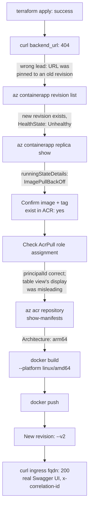

**`terraform apply` finished with "Apply complete," yet the backend
was unreachable for over an hour afterward. How is that possible, and
what does it mean for trusting infrastructure-as-code tools in
general?**
`terraform apply`'s success signal only confirms that the API calls to
update Azure resources succeeded — it says nothing about whether the
process running inside the container actually started and stayed
alive. Those are two genuinely different questions, checked by two
different systems: Terraform owns "does the resource exist with this
configuration," Azure's own container runtime owns "is the process
inside it actually running." The general lesson, consistent with this
project's whole pattern of verifying against the real running system
rather than trusting a clean exit code: a successful `apply` is
necessary, not sufficient, for a deployment actually working.

**Walk me through the actual root cause, and why nothing earlier in
the pipeline caught it.**
The Docker image was built with a plain `docker build` on an Apple
Silicon Mac, which defaults to building for `arm64` — the Mac's own
chip architecture. Azure Container Apps only runs `amd64`. Nothing in
`docker build`, `docker push`, or `az acr repository list` checks
whether an image's target architecture matches where it's meant to
run, because none of those steps are the one that actually executes
it — the mismatch only surfaces at the one place that tries to run the
image, as `ImagePullBackOff`, with zero container startup logs ever
produced, since the container never actually started.

**A separate diagnostic step looked like it found a *second* bug — a
role assignment on the wrong identity. It turned out to be nothing.
What actually happened, and what's the general lesson?**
`az role assignment list -o table`'s `Principal` column is a display
convenience, not the authoritative permission record: when Azure AD
can't resolve a friendly display name for a service principal, it
falls back to showing that identity's client ID instead of its
principal ID (object ID) — the two are different values entirely.
That fallback label happened to look exactly like the *wrong* identity
had the permission. The actual `AcrPull` role assignment, checked in
raw JSON, had the correct `principalId` the entire time. The general
lesson: when a specific value actually matters, check the raw field a
system uses to make its real decision, not a column a CLI chose to
render for human convenience — the two are not guaranteed to agree.

**`infra/outputs.tf` also had a real bug found this session. What was
it, and how did it actually make the incident harder to diagnose, not
just wrong on its own?**
`backend_url` was built from `azurerm_container_app.backend.latest_revision_fqdn`
— a hostname with one specific revision's name baked into it,
permanently, from the moment it was computed. Every `curl` against
that URL during this session's debugging kept hitting the *old*,
already-working placeholder revision, regardless of what got fixed
afterward, because that URL had no way to ever reflect a new
deployment. It wasn't just an inconvenience — it actively produced a
false "still broken" signal even after real progress had already been
made, and cost real debugging time until it was noticed. Fixed by
switching to `ingress[0].fqdn`, the app-level address that always
tracks whichever revision currently holds live traffic.

**What would you change here if this needed to run in a real team,
not a solo project?**
An automated availability check — an Application Insights probe
hitting a real `/health` endpoint (which doesn't exist yet in this
project) on a schedule — rather than relying on a human noticing a
stale response, the way this session's incident was actually caught.
And build-order item 12's GitHub Actions CI/CD removes this entire
class of bug structurally: a GitHub-hosted runner builds on `amd64`
hardware natively, so there's no host-architecture mismatch possible
in the first place. That's a concrete argument for CI-driven builds
beyond convenience — it's not just faster, it removes a whole category
of environment-specific failure that a manual, local-machine
build-and-push workflow is exposed to by default.

*Further reading: [Docker's own documentation on multi-platform builds](https://docs.docker.com/build/building/multi-platform/), covering exactly this default-to-host-architecture behavior and the `--platform` flag that overrides it.*

---

## Feature 13: GitHub Actions CI/CD via OIDC

**What does this feature do, in one sentence?**
Automates what was previously a manual deploy sequence — a GitHub
Actions workflow tests, builds, and deploys the backend on every push
to `main`, authenticating to Azure through a short-lived OIDC token
instead of a stored secret; written, reviewed, and now verified with a
real, successful, unassisted end-to-end run.

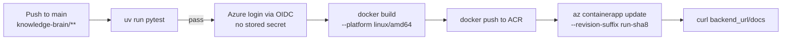

**Why OIDC instead of just storing an Azure service principal secret
as a GitHub Actions secret — what does OIDC actually buy you?**
A stored secret is a standing liability the moment it exists — it sits
at rest, it can leak, it needs rotation, and it works from anywhere
it's pasted until someone notices and revokes it. OIDC removes the
credential entirely: GitHub mints a short-lived, signed token for each
individual workflow run, and Azure AD trusts that token only if it
matches an exact, pre-configured condition. There's nothing sitting in
GitHub for an attacker to steal in the first place.

**What does that "exact, pre-configured condition" actually restrict,
concretely?**
The federated identity credential's `subject` is set to
`repo:NavdeepTU/genai_projects:ref:refs/heads/main` — matching this
repo and the workflow's own `main`-branch trigger precisely. Even if
this identity's client ID somehow became publicly known, only a
workflow run on this exact repository's `main` branch could actually
authenticate as it — not a fork, not a pull request, not a different
branch. A leaked shared secret, by contrast, grants access to whoever
holds the string, unconditionally, from anywhere.

**An Azure AD `Application` and a `Service Principal` both got created
for this identity. What's the actual difference, and why does it
matter which one a role assignment points at?**
An Application is an identity's *definition* — its registration, its
name — not something Azure's RBAC system can grant anything to
directly. The Service Principal is the actual, usable instance of that
identity inside this specific Azure AD tenant, and it's the Service
Principal's object ID that a role assignment's `principal_id` needs.
This is the same object-ID-vs-client-ID shape of mistake as ADR-022's
role-assignment detour, one layer earlier: get the wrong ID into the
wrong field here, and a role assignment either targets nothing real or
silently doesn't do what it looks like it does.

**Why two narrow role assignments (`AcrPush` on the registry,
`Container Apps Contributor` on one specific Container App) instead of
one broad `Contributor` grant on the whole resource group?**
A single broad grant would never need revisiting as the project grows,
but it would also let a compromised or misconfigured workflow run
touch Postgres, Key Vault, or anything else sharing that resource
group — capability this pipeline has no actual use for. Scoped
narrowly, a compromised CI run can push a bad image and swap a
revision, a real but bounded risk, and nothing more. The honest cost:
every *new* thing this pipeline needs to touch later needs its own
deliberate role assignment added, rather than already being covered.

**Once CI starts deploying on its own, what stops Terraform from
undoing it the next time someone runs `terraform apply` for something
unrelated?**
Nothing would, without an explicit fix — `main.tf` still declares a
static `image = "...knowledge-brain-backend:latest"`, and by default
Terraform re-enforces every field on every apply, forever. A
`lifecycle { ignore_changes = [template[0].container[0].image] }`
block tells Terraform to permanently stop tracking that one specific
field once CI takes over — not the whole `container` block, just that
one path. Every sibling field (`cpu`, `memory`, every `env` block)
stays exactly as tracked as before. See
[ADR-023](adr/ADR-023-ci-owns-the-deployed-image.md) for the full
reasoning, including the rejected alternative of having CI drive every
deploy through `terraform apply` itself — ruled out because this
project has no remote Terraform state backend yet, which a
CI-triggered `apply` would need to be safe at all.

**The pipeline was reviewed and looked correct, but failed three times
in a row the first time it actually ran. Walk me through the first
failure — why did the test step fail in CI when it passes locally?**
`Settings` requires 9 environment variables with no defaults, normally
supplied by `.env` locally — a file that's gitignored on purpose and
has never existed on any CI runner. `tests/conftest.py` imports
`app.core.database`, which calls `get_settings()` at module import
time, so even a test with nothing to do with Neo4j or PII detection
still needs all 9 fields present just to get past that one import. The
fix: a real, ephemeral Postgres service container in the workflow
itself (matching the local `docker-compose.yml` image exactly, with
the `vector` extension enabled as a setup step) for the field that
actually needs to be real, and plain placeholder strings for the other
8, since nothing in the current test suite makes a real, unmocked call
to any of those services.

**Second failure: `AADSTS700213: No matching federated identity
record found`, even though the identity and role assignments were
created successfully. What was actually wrong?**
The federated credential's `subject` was configured as the plain
`repo:NavdeepTU/genai_projects:ref:refs/heads/main`. The token GitHub
actually presented had a different subject: it included this
account's immutable numeric organization and repository IDs alongside
the names (`repo:org@ownerId/repo@repoId:ref:...`) — a real GitHub
security feature protecting against a renamed or transferred
repository inheriting trust meant for the original one. Nothing about
the design was wrong; the assumed subject format just wasn't the one
this account's tokens actually use. Fixed by reading the exact
rejected subject out of Azure's own error message and configuring the
federated credential against that, rather than guessing from
documentation.

**Third failure: `ContainerAppInvalidRevisionName`. What went wrong,
and what's the general lesson about using a commit SHA as an
identifier?**
A raw 40-character commit SHA was used directly as
`--revision-suffix`. Combined with the Container App's own name (27
characters), that's 69 characters — past Azure's 54-character combined
limit for a revision name. A second, latent issue sat in the same
constraint: a revision name must start with a letter, and a raw hex
SHA can just as easily start with a digit as not — it happened not to
matter on the commit that triggered this, but the very next one could
have failed for a different reason. The general lesson: an identifier
that's "unique enough" (a full SHA) isn't automatically "valid enough"
for wherever it's about to be used — every consumer of an identifier
has its own constraints (length, character set, starting character),
and satisfying uniqueness doesn't guarantee satisfying those. Fixed
with a short, letter-prefixed slice (`run-` plus the SHA's first 8
characters), valid for any possible commit.

**None of those three were visible from reading the code. What does
that say about when a feature actually counts as "done"?**
Code review is real and caught real bugs earlier — the duplicate
Terraform data source, the doubled `https://`, the image name mismatch
in ADR-024 were all found before anything ever ran. But all three of
*these* failures only exist at the boundary between this project's
code and the actual external systems running it: a CI runner with no
`.env`, this specific GitHub account's real token format, Azure's
specific naming rules. None of that is discoverable by reading YAML or
Terraform more carefully, no matter how thoroughly. This is the same
standard this project already holds every other feature to — verified
running for real, not just reviewed — just applied to the pipeline
itself instead of the thing it deploys.

**What would you change here if this needed to run in a real team,
not a solo project?**
`revision_mode` is still `Single` — a new image, deployed by CI or
anyone else, cuts over 100% of traffic immediately, regardless of how
many replicas are running. That's a real gap independent of anything
built this session: real protection against a bad deploy needs
Container Apps' `Multiple` revision mode with explicit traffic
splitting, so a new revision earns a growing share of traffic instead
of an instant, all-or-nothing cutover. Worth naming as deliberately
out of scope here, not assumed to already exist.

*Further reading: [Microsoft's own documentation on connecting GitHub Actions to Azure via OpenID Connect](https://learn.microsoft.com/en-us/azure/developer/github/connect-from-azure), covering the exact federated-credential pattern used here.*

---

## Feature 14: API Management Gateway

**What does this feature do, in one sentence?**
Puts Azure API Management in front of the backend as the one intended
public entry point, stamping a shared secret only it and the app know
onto every request it forwards, so the FastAPI service can tell a
request that genuinely passed through the gateway from one that
didn't.

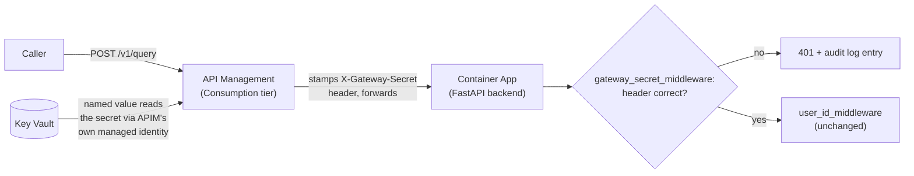

**The design called for two independent locks — a network restriction
and a header secret. Only one exists today. What happened to the
other one?**
Azure Container Apps' `ip_security_restriction` can only allow traffic
from IP addresses APIM actually reports — and Consumption tier APIM
doesn't have a static, queryable outbound IP at all. `az apim show
... publicIpAddresses` came back empty, confirmed live, not assumed.
The Terraform block that was meant to build this looped over an empty
list, generated zero rules, and `terraform apply` reported success
anyway — a config that was accepted but did nothing. True network
isolation needs Developer or Premium tier's VNet integration, a real
fixed monthly cost this project chose not to take on yet. The dead
code was removed rather than left in, since a restriction block that
silently protects nothing is worse than no restriction block at all.

**Why Consumption tier at all, if it can't do the thing the original
design needed?**
Cost, same reasoning already used for Postgres (Burstable), the
container registry (Basic), and Neo4j (AuraDB Free) — pay-per-call, no
fixed monthly bill, appropriate for a project with no real production
traffic yet. The tier choice was made *before* discovering it couldn't
support IP restriction; once that was confirmed live, the honest move
was accepting one working lock instead of silently pretending the
second one still existed.

**If the gateway secret ever leaked, what could someone actually do
with it?**
Call the backend's raw Container App URL directly, skipping API
Management (and whatever rate limiting or logging it would otherwise
provide) entirely — the header check has no way to distinguish a
request that came through the real gateway from one that didn't; it
only checks whether the value is correct. Combined with this project's
other honest, named gap — `X-User-Id` being entirely self-asserted,
with nothing verifying the claim — a leaked secret plus a made-up user
ID would be enough to reach real application logic. The same shape of
risk this project already accepted for the MCP server's shared key,
now applying here too.

**Why import the API definition from FastAPI's own `/openapi.json`
instead of declaring each route by hand in Terraform?**
One source of truth. Hand-declaring `/documents/upload`, `/query`, and
every future route a second time in `apim.tf` means two places can
silently drift apart the moment a route changes. Importing from the
same spec Swagger UI already renders means APIM's picture of the API
stays accurate automatically, the next time this file gets re-applied
after a route changes — no separate manual step to remember.

**`gateway_secret_middleware` sits between `correlation_id_middleware`
and `user_id_middleware` in the registration order. Why that specific
position, and not first or last?**
The last middleware registered wraps outermost and runs first on the
way in — a rule this project established while building document-level
ACL, now applied to a three-middleware stack for the first time.
Registration order is `user_id_middleware`, then
`gateway_secret_middleware`, then `correlation_id_middleware` — so
actual execution order is `correlation_id_middleware` (always stamps a
header, even on rejection) → `gateway_secret_middleware` → `user_id_middleware`.
Checking "did this come through our gateway" before "who is this" is
deliberate: if the gateway check ran last, a request that never passed
through APIM at all could still get its identity checked and reach
real logic before the more fundamental check ever fired, making the
gateway secret decorative rather than a real outer gate.

**A real incident: applying the rate-limiting policy failed with
`"Policy is not allowed in 'Consumption' sku"`. What was tried, what
actually happened, and what's still open?**
The original policy, `rate-limit-by-key` (keyed per caller IP or
subscription, matching the requirement's "100 requests/minute per
tenant" language), isn't available on Consumption tier at all — not a
syntax error, confirmed via the exact rejection message once the
policy was actually saved. Azure's own snippet picker offered an
alternative, plain `rate-limit`, but that policy is scoped
per-*subscription* — meaningless here, since `subscription_required =
false` was already set deliberately to avoid building APIM's separate
subscription-key system this session. Rate limiting was removed
entirely rather than ship something that looked like "100 per tenant"
but actually behaved like "100 total, for everyone combined." A
follow-up correction, caught during this feature's own interview-prep
review: upgrading tier likely restores `rate-limit-by-key` directly,
without needing to touch `subscription_required` at all, since that
policy never depended on subscriptions in the first place — meaning
"upgrade tier" may fix both the network lock and real rate limiting
together, not two separate blockers. Not yet confirmed against Azure's
own policy-availability docs.

**A second real incident, found while trying to verify this feature,
not caused by it: what did the request trace actually show, and how
did that prove the feature worked despite the request failing?**
API Management's built-in Test-and-Trace tool showed the named value
correctly resolving the real secret from Key Vault, the `set-header`
step correctly stamping it onto the request, and the request being
correctly forwarded to the backend with that header present — every
piece of the mechanism this feature built working exactly as designed.
The backend then returned a `500`, but the container logs showed why:
`asyncpg.exceptions.UndefinedTableError: relation "audit_log" does not
exist` — a completely unrelated, pre-existing gap. Nobody had ever run
`create_tables.py` against the real Azure Postgres database; every
previous "verified live" deployment check only ever hit `/docs`, which
never touches the database at all. Both `gateway_secret_middleware`
and `user_id_middleware` write to `audit_log` on every rejection before
returning an error, so this crashes *any* rejected request today,
blocking a clean end-to-end status-code test — but the trace evidence
alone was sufficient to confirm the gateway mechanism itself works,
gathered a different way than originally planned. Tracked as its own
standalone follow-up, not folded into this feature. **Resolved the
following session** (see [ADR-027](adr/ADR-027-azure-postgres-schema-creation.md)):
the `vector` extension was enabled and every table created directly
against the real Azure database, via a temporary, narrowly-scoped
firewall rule removed immediately after. A real request through APIM
now returns the correct `401` instead of a `500` — the clean
end-to-end confirmation this feature couldn't get the first time.

**What would you change here if this needed to run at genuine
production scale, with real external users?**
Upgrade to a VNet-capable tier and let the network layer do what the
header secret does today by convention — a compromised or leaked
secret currently has no second obstacle in its way. Pair that with
real per-caller rate limiting (via `rate-limit-by-key`, once available)
and structured request/response logging into Application Insights,
neither of which exist yet. All three are named, accepted gaps for a
project with no real production traffic — not oversights, but not
something that should still be true the day this handles genuine
external load either.

*Further reading: [Microsoft's own API Management policy reference](https://learn.microsoft.com/en-us/azure/api-management/api-management-policies), covering exactly which policies are available on which tier — the source that should have been checked before assuming `rate-limit-by-key` would work on Consumption tier.*

---

## Feature 15: Creating the Azure Postgres Schema

**What does this feature do, in one sentence?**
Closes the gap ADR-026 found — enables the `vector` extension and
creates every application table directly against the real Azure
Postgres database, which had never had its schema applied, using a
temporary, narrowly-scoped firewall opening and the exact same
`create_tables.py` script local development already uses.

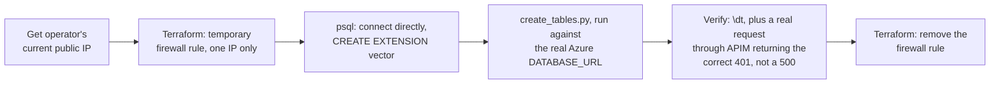

**Why a firewall rule scoped to one specific IP, removed right after,
instead of something broader or left in place?**
This is a real opening in a production database's network perimeter,
not a cosmetic one. The narrower and shorter-lived it is, the smaller
the actual exposure — one IP, for the few minutes setup takes, then
gone. Leaving it in, or scoping it to a wider range "just in case it's
needed again," would trade a small amount of future convenience for a
standing risk with no corresponding benefit once the one-time task is
done.

**Why reuse `create_tables.py` instead of writing the `CREATE TABLE`
statements by hand for the real database?**
One source of truth. `create_tables.py` calls
`Base.metadata.create_all()`, reading directly from the same
SQLAlchemy models (`Document`, `Chunk`, `AuditLog`,
`DocumentPermission`) that define the schema everywhere else in this
project. Hand-writing SQL a second time for Azure specifically would
mean two places that could quietly drift apart the next time a model
changes — exactly the kind of duplication this project avoids
elsewhere (the API Management gateway importing FastAPI's own
OpenAPI spec instead of hand-declaring routes is the same instinct,
one feature earlier).

**Why not build this into the GitHub Actions pipeline, so a schema
change ships automatically the way a code change already does?**
A real alternative, deliberately not taken yet: this project has no
migration tool. `create_tables.py` only knows how to create tables
that don't exist — it has no concept of *altering* a table that
already exists to match a model that changed, which is exactly what
the next real schema change would need. Automating today's
create-everything-once script into CI would just automate running
something that can't safely handle that next change anyway, without
fixing the actual gap underneath it.

**What would you change here if this needed to run at genuine
production scale, with a real team?**
Add a real migration tool — Alembic is the natural fit, given the
project already uses SQLAlchemy models — wired into the same CI/CD
pipeline that already deploys images automatically, so a schema
change and a code change ship together, versioned, on every push to
`main`. That closes both halves of the gap this incident exposed: no
human touching the database's firewall by hand again, and a schema
change that can no longer be forgotten the way this one was for
several sessions running.

*Further reading: [Alembic's own official tutorial](https://alembic.sqlalchemy.org/en/latest/tutorial.html), covering exactly the versioned-migration model this project doesn't have yet.*

---

## Feature 16: Frontend Foundation — Shell, Dark Mode, and the Document Library

**What does this feature do, in one sentence?**
Starts build-order item 13 for real: a separate Next.js project talking
to the FastAPI backend over HTTP, with a shared navigation shell, dark
mode, a responsive mobile menu, and the first of five planned pages —
the Document Library — backed by a new, permission-filtered
`GET /documents` endpoint that didn't exist before this session.

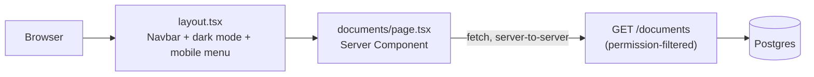

**Why Next.js's App Router, Tailwind, and Shadcn/UI specifically —
what does each one actually buy you?**
Next.js turns a file's location into its URL automatically (no router
config), and its Server Components let data fetching happen on the
server, never shipping API keys or backend URLs to the browser.
Tailwind styles elements with small utility classes directly in the
markup instead of separate stylesheets. Shadcn is unusual among
component libraries: its CLI copies actual component *source* into the
project instead of installing an opaque package — every component is
fully owned and editable from day one, not fought against from outside.

**Shadcn's CLI asked which "component library" to build on — Base UI,
React Aria, or Radix. Why Base UI, and what actually broke because of
that choice?**
Took the CLI's own current "(Recommended)" default rather than
defaulting to Radix from memory — the same instinct this project has
applied to real Azure quirks, now applied to frontend tooling. It broke
the very next chunk: `<DropdownMenuTrigger asChild><Button>...</Button></DropdownMenuTrigger>`
is the standard Radix pattern for "render this trigger as my own custom
element." Base UI has no `asChild` prop at all — confirmed directly
from its installed TypeScript types, not guessed — so it was silently
ignored, and the trigger rendered its own native `<button>` with the
child `Button` (also a `<button>`) nested inside it, producing a real
HTML-nesting hydration error. The actual fix was Base UI's real
composition mechanism, a `render` prop:
`<DropdownMenuTrigger render={<Button>...</Button>} />`. Caught by
running the app and reading a real browser error, not by reviewing the
component source, which looked equally plausible either way.

**Walk me through how dark mode actually works, mechanically — not
"there's a toggle," the real chain from click to repainted page.**
Every color in `globals.css` is a CSS variable, defined twice — once
under `:root` (light values), once under `.dark` (dark values), same
names throughout. Components reference the name (`bg-primary`), never
the value, so they never need to know which mode is active. `next-themes`
is what flips a `dark` class on `<html>` when the toggle is clicked
(configured via `attribute="class"`, which has to match the exact class
`globals.css`'s `@custom-variant dark (&:is(.dark *))` is watching
for) — and it persists that choice and can default to the OS's own
preference. One necessary side effect: the server has no way to know a
visitor's saved preference before JavaScript runs, so the very first
paint can briefly mismatch what the client then applies — `suppressHydrationWarning`
on `<html>` tells React that one specific, expected mismatch is fine,
without silencing hydration warnings anywhere else on the page.

**The backend had no way to list documents at all before this session.
Why build that as its own step before any frontend design, and why
permission-filter it from the start rather than filtering client-side
after the fact?**
Designing a page around data that can't actually be fetched yet is
backwards — checking the real routes in `documents.py` first is what
surfaced the gap. Permission-filtering happened at the query itself
(the same `document_permissions` join every other retrieval path
already uses) because this project's own `ADR-019` already named this
exact risk: a new path reading data can silently bypass an ACL that
protects every *other* path, unless it deliberately applies the same
check itself. Filtering "after the fact" in the frontend would mean the
backend response itself already leaked which documents exist and their
status to a caller who was never granted access — the frontend filtering
it out afterward wouldn't undo that the data already left the server.

**Why does the frontend fetch from a Server Component instead of the
browser calling the backend directly — what would go wrong with the
simpler-sounding approach?**
The backend has no CORS configuration, and the frontend runs on a
different origin (`localhost:3000` vs `localhost:8000`) — a browser
would block that response outright. A Server Component's fetch happens
server-to-server, where CORS (a purely browser-enforced rule) never
applies at all. Chosen over adding `CORSMiddleware` to the backend since
it needed zero backend change for something currently driven by a
temporary, pre-auth placeholder identity — a real trade-off, though,
since the upload flow needs genuine browser-side interactivity
(drag-and-drop, a file picker, live progress) that a Server Component
alone can't provide. That forced choice landed the following session:
a Next.js Route Handler proxying the browser's request server-to-server,
not CORS — see Feature 17.

**A real incident: the page rendered its empty state correctly, no
console errors — what was actually wrong, and how was it found?**
The Next.js dev overlay labeled the route "Static," easy to dismiss as
cosmetic. The real mechanism: this Next.js version caches any `fetch()`
reachable before a request-time API (`cookies()`, `headers()`,
`searchParams`) is used, and this page used none of those — so in a
real production build, it would have rendered once at build time and
served that same frozen snapshot to every visitor indefinitely, never
showing a newly uploaded document without a full redeploy. Dev mode
hides this completely, since pages there always render on-demand
regardless of static/dynamic classification — this class of bug is
specifically invisible to local testing. Fixed with
`export const dynamic = "force-dynamic"`, confirmed by watching the dev
overlay's own classification flip from "Static" to "Dynamic" afterward.

**If another user uploads a document, does dynamic rendering mean the
current placeholder user would see it?**
No — dynamic rendering and document-level ACL solve two unrelated
problems. Dynamic rendering only controls *when* the query reruns
(fresh every request, versus a frozen build-time snapshot); it says
nothing about *what* that query is allowed to return. The ACL join
inside `list_documents_for_user` is what decides *which* documents come
back for a given identity, and uploading only grants access to the
uploader. So the placeholder user gets a perfectly fresh, correctly
*empty-of-that-document* result, every time — freshness without
authorization would leak; authorization without freshness would just be
correctly-scoped but stale. Same shape of lesson as API Management's
two independent locks a few sessions back.

**What would you change here if this needed to run at genuine
production scale?**
The static-rendering trap generalizes past this one page: at real
traffic, that mistake wouldn't just show one visitor stale data, it
would serve the *same* frozen snapshot to every visitor from a CDN edge
cache globally, until a redeploy — catching it now, at zero users, is
strictly cheaper than catching it after a real launch. The `dev-user`
placeholder is also a named, temporary gap: every page built before
real auth (item 14) exists carries the same limitation, tracked
explicitly rather than hidden inside one config file.

*Further reading: [Next.js's own documentation on Server and Client Components](https://nextjs.org/docs/app/getting-started/server-and-client-components), covering the rendering model this entire session's architecture decisions were built on.*

---

## Feature 17: Background Upload Processing with Per-Stage Progress

**What does this feature do, in one sentence?**
Extends ADR-001's own stated next step: the REST upload endpoint now
returns almost immediately instead of blocking for the whole pipeline,
running extraction, PII detection, chunking, embedding, and saving as a
FastAPI background task, while a new `processing_stage` field and a
polling status endpoint let the frontend show a live, per-step progress
bar instead of a spinner with no information behind it.

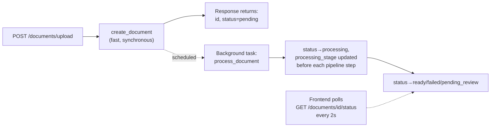

**Why FastAPI `BackgroundTasks` instead of finally reaching for Kafka,
given it's been sitting in the planned tech stack the whole time?**
ADR-001 named the exact condition for reaching for Kafka — enough
concurrent uploads to exhaust the database connection pool, roughly 15
at once, since a synchronous upload holds its connection for the whole
pipeline's duration. That number was never actually observed. What
*did* become real is a much smaller problem: one person watching one
upload button freeze for the length of a PDF's embedding calls, once a
real frontend existed to make that freeze visible. `BackgroundTasks`
fixes exactly that, with zero new infrastructure — no broker, no
worker process, nothing new to operate. Reaching for Kafka here would
have been solving a scale problem that hasn't happened yet, at the cost
of solving today's actual, smaller problem more slowly.

**Why does `processing_stage` get its own column instead of just adding
more values to the existing `DocumentStatus` enum?**
`DocumentStatus` is load-bearing — permission checks, the document
list, and "only a `ready` document is a valid citation source" all
switch on it, and it needs to stay a small, stable set for that to keep
working cleanly. `processing_stage` only means anything for the
lifetime of one background run and is read by exactly one consumer, a
progress bar — nothing else in the system ever needs to branch on
whether a document is currently `chunking` versus `embedding`. Keeping
them separate means every piece of code that already switches on
`DocumentStatus` needed zero changes.

**Walk me through what happens, concretely, if the server crashes right
after `processing_stage` moves to `chunking` but before `chunk_text()`
returns.**
Nothing catches it. `BackgroundTasks` has no persistence and no retry —
it's a function call scheduled inside the same process that's about to
die, not a message sitting in a queue waiting to be redelivered. The
document is left permanently at `status = processing`,
`processing_stage = chunking`, with no `failure_reason`, and nothing
retries it. Contrast that with the normal in-process failure path: if
`chunk_text()` throws while the server stays alive, that exception is
caught by `process_document`'s own `try/except`, and `mark_failed` runs
— `status` reaches `failed` cleanly, with a reason recorded. A process
crash is the one failure mode that path can't catch, because the code
that would catch it never gets to run either. This is the concrete,
named reason a real message queue would eventually replace this: an
unacknowledged Kafka message gets redelivered to another worker; an
in-process background task scheduled on a process that just died simply
doesn't exist anymore.

**The background task needs to touch the database and Neo4j — why can't
it just reuse the sessions the original request already had open?**
Both sessions are scoped to the request/response cycle and are already
torn down by the time a background task actually executes — a
background task runs *after* the response has been sent, not before,
so "the request's session" doesn't meaningfully exist anymore at that
point. The fix was opening brand new sessions directly inside the
background function itself (`AsyncSessionLocal()` for Postgres, the raw
Neo4j driver's `.session()` for the graph), independent of whatever the
original request used.

**A subtle one: why is `correlation_id` passed into the background
task as a plain function argument instead of just calling
`get_correlation_id()` from inside it, the way every other log call in
this codebase does?**
`get_correlation_id()` reads a `ContextVar` that the correlation-ID
middleware resets back to empty the moment the response leaves the
endpoint — and a background task, by definition, runs after that
already happened. Calling it from inside the task wouldn't error, it
would just silently return an empty string, breaking Enterprise
Requirement 3's "every log line includes a real correlation ID" without
looking broken at all — no exception, no obviously wrong output, just a
blank field. Capturing the value in the endpoint, while the `ContextVar`
is still genuinely valid, and passing it down explicitly avoids that
trap entirely.

**Splitting `ingest_document` into two methods broke something. What,
and how was it caught?**
MCP's `upload_document` tool still called the old, now-deleted
`ingest_document` method directly — a real regression, not a
pre-existing gap, introduced by this session's own refactor. It would
have thrown `AttributeError` on the very next MCP upload. It was caught
while writing this project's own architecture documentation for the
feature — describing what MCP's path does surfaced that the code no
longer matched the claim being written down. The fix keeps MCP fully
synchronous, on purpose: a tool call only ever produces one final
result, there's no "return now, poll later" concept the way an HTTP
response has, so MCP now calls `create_document` and `process_document`
back to back in the same call, rather than backgrounding anything.

**The status endpoint returns 404 for both "this document doesn't
exist" and "you have no access to it." Why not tell those apart?**
So the endpoint can't be used to fingerprint documents a caller was
never granted access to. If a wrong-but-plausible document id
returned a different error than a right-but-forbidden one, an attacker
polling ids could learn which ones are real without ever seeing their
content — a real information leak through an error code alone. Making
the two cases indistinguishable from outside closes that, at the minor
cost of a slightly less specific error message for a legitimate caller
who mistyped an id.

**What would you change here if this needed to run at genuine
production scale?**
The concrete trigger ADR-001 already named — sustained concurrent
uploads exhausting the connection pool — is still the real number to
watch for reaching for Kafka. What this session adds to that picture is
a second, related failure mode worth naming in the same breath: once
background tasks are real and running unattended, a worker restart
mid-task silently orphans whatever it was doing, with no alert and no
automatic recovery. A queue-backed worker doesn't have that gap. Until
either number is actually observed, adding that infrastructure now
would be solving a problem that doesn't exist yet, at real,
avoidable operational cost.

*Further reading: [FastAPI's own documentation on Background Tasks](https://fastapi.tiangolo.com/tutorial/background-tasks/), covering exactly this mechanism — how it's scheduled, and its explicit note that heavier background processing should eventually move to a real task queue like Celery.*

---

## Feature 18: The Query Page — Chat UI, Sources, and Confidence

**What does this feature do, in one sentence?**
A real chat interface at `/query` that runs a question through the
existing LangGraph retrieval pipeline unchanged, and — the one real
backend addition — exposes data the pipeline already computed but
previously threw away: which chunks actually informed the answer, with
their source filenames, and a confidence score.

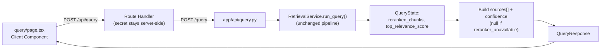

**CLAUDE.md's own spec for this page describes streaming text and a
sidebar of past conversations. Neither is built. Why not, and was that
a shortcut?**
Not a shortcut — a scope decision made explicit before writing any
code. Both depend on real backend features that don't exist yet and
sit later in the build order: token streaming is item 19, with its own
Enterprise Requirement covering SSE transport and sentence-chunked
guardrail checks; conversation history is item 18 in the *build order*
(a different numbering than this doc's own feature list), needing a
real conversations/turns schema and a context-condensing step. Building
either as part of "just a page" would mean either faking them (a
client-side typewriter effect that looks like streaming but isn't a
real SSE connection) or quietly pulling a much bigger feature forward
out of order, which this project's own rules say not to do.

**Why does `confidence` come back as `null` instead of `0.0` when the
reranker is unavailable?**
Because `0.0` would claim something false — that the system searched
and found nothing worth trusting — when what actually happened is
different: real chunks were retrieved and used, the system just
couldn't compute a *relevance score* for them, since that score only
exists if Voyage's reranker actually ran. Not being able to score
confidence and not having relevant chunks are two separate failure
modes, and collapsing them into the same `0.0` would hide which one
happened. `null` says "no score was computed," which is the true
statement; `0.0` would say "computed a bad score," which isn't.

**Why extend the existing `/query` response instead of adding a second
endpoint just for sources and confidence?**
Both values already exist inside the exact same `QueryState` object
the answer text itself comes from — `reranked_chunks` and
`top_relevance_score`, sitting in memory the moment the answer is
generated. A second endpoint would need to either re-run the whole
pipeline a second time (a second embedding call, a second hybrid
search, a second rerank call, just to reconstruct data already computed
once) or introduce new cached state somewhere to hand it back later.
Extending the one response that's already being built costs nothing
extra — it's pure output shaping, not a second computation.

**If a user asks why the answer doesn't stream in like a modern chatbot,
what's the honest one-sentence answer?**
The backend's generation call itself waits for the LLM to produce the
entire answer before returning anything at all — there's no
token-by-token transport wired between the model and the browser yet;
that's a separate feature (Server-Sent Events, build-order item 19)
that hasn't been built, not a missing setting in today's code.

**MCP's `ask_knowledge_base` tool answers the same questions. Does it
also return sources and confidence now?**
No, and that's deliberate, not a gap that was missed. It still calls
`answer_question()`, the thin wrapper that only unpacks the plain
answer string from the same `QueryState` — an MCP tool result is read
by another AI program, not rendered as a UI with source cards and a
confidence badge, so there was nothing to gain by extending it the same
way. Both REST and MCP still run through the exact same
`RetrievalService`; they just ask it for different amounts of what one
pipeline run already produces.

**What would you change here if this needed to run at genuine
production scale?**
The real cost isn't in what got built, it's in what's still missing:
without item 18's context-condensing, every question pays for a full
embedding call, full hybrid search, and full rerank — even an obvious
follow-up like "what about the other one" — since the system has no
memory of the previous turn to shortcut against. Without item 19, a
slow generation call (large context, a circuit breaker cooldown-retry)
shows a bare loading skeleton with zero feedback for however long it
takes. Neither is a surprise found after the fact — both were named as
explicit, deferred scope in ADR-031, not discovered as a regression
later.

*Further reading: [MDN's guide to Server-Sent Events](https://developer.mozilla.org/en-US/docs/Web/API/Server-sent_events/Using_server-sent_events), the mechanism build-order item 19 will eventually need to make real token streaming work — worth reading now, before that feature's own session, since this one's ADR explicitly named SSE as the reason today's answer doesn't stream.*

---

## Feature 19: The Dashboard Page — Real Digest, Honest Placeholders

**What does this feature do, in one sentence?**
A summary page at the app's root showing two real, existing numbers
(total documents, recent queries — both pulled from data already
stored, nothing new computed) and two deliberately honest "not tracked
yet" states for retrieval accuracy and cost per query, which this
system has never measured for a real question.

```mermaid
flowchart LR
    UI["app/page.tsx<br/>Server Component"] -->|"GET /dashboard"| API["app/api/dashboard.py"]
    API --> COUNT["count_documents_for_user()<br/>(COUNT, not fetch-and-len)"]
    API --> RECENT["get_recent_queries_for_user()<br/>(audit log's first read method)"]
    COUNT --> RESP["DashboardResponse"]
    RECENT --> RESP
    RESP --> UI
```

**Why not just persist the live confidence score `/query` already
returns and plot it as the accuracy trend? It's real data, sitting
right there.**
Because confidence and accuracy are different claims. Confidence is
the reranker's own relevance judgment between a question and the
chunks it found — a real number, but one with no ground truth behind
it. It can be high on an answer that's actually wrong, or low on one
that happens to be right; it measures "how sure the reranker is,"
not "was this correct." Labeling that trend "accuracy" would make a
number look more authoritative than what it actually proves. Real
accuracy needs the evaluation harness's ground-truth-checked results,
captured over time — a real feature (wiring the harness to run and
store results regularly), not something to fake with a proxy metric
that happens to already exist.

**Why does `count_documents_for_user` run its own `COUNT(*)` query
instead of reusing `list_documents_for_user` and taking `len()` of
what comes back?**
Because the dashboard never needs the actual document rows — filename,
status, upload date, all of it — only the number. Fetching every row
just to discard its data and keep a count means transferring an entire
table's worth of data across the network for no reason. Small and
harmless today at a handful of documents; a real, avoidable cost once
a user has thousands.

**While writing this feature's tests, a scaffolding problem from the
*previous* session's feature was found. What was it, and why did
writing tests specifically surface it?**
`/query`'s logic for building `sources` and `confidence` from a
finished `QueryState` — deduped filename lookups, the
`confidence = None`-when-unavailable rule — was sitting directly
inside the route handler in `app/api/query.py`, not in a service. This
project's own scaffolding rule says routes stay thin; business logic
lives in services. It surfaced specifically while writing tests
because this project has never used an HTTP test client — every
existing test calls a service or repository method directly, against a
real test database. Logic living inside a route handler had no way to
be exercised by a test without introducing a whole new testing pattern
just for one feature. The fix — moving it into
`RetrievalService.build_sources_and_confidence` — solved both problems
at once: it's back where the project's own convention says it belongs,
and now it's a method that can be called and asserted on directly,
the same way every other service method already is.

**How did you verify the extraction didn't change `/query`'s actual
behavior?**
Ran the exact same live question against the backend before and after
moving the code, and diffed the response shape by hand — same answer
length, same five sources, same confidence score
(`0.77734375`, unchanged to the same number of decimal places). The
new unit tests cover the logic's *correctness* going forward; that
live before/after comparison covered whether *this specific refactor*
changed anything, which a test written after the fact can't retroactively
confirm on its own.

**What would you change here if this needed to run at genuine
production scale?**
The real answer isn't really about this page — it's about what it's
honestly reporting doesn't exist yet. At real scale, "no accuracy
tracking" and "no cost tracking" stop being acceptable gaps and become
operational blind spots: a bad model swap or a prompt regression could
degrade every answer with nothing catching it, and a runaway cost
spike would only surface on a billing statement, well after the fact.
Both are already named, scoped, future features (the eval harness
running on a schedule; token/cost instrumentation, item 15) — this
page just made the absence of both visible in the one place a user
would actually look first, rather than leaving it implicit.

*Further reading: [Google's SRE book, "Monitoring Distributed Systems"](https://sre.google/sre-book/monitoring-distributed-systems/) — its core argument, that a monitoring signal should measure a real, well-defined thing or not exist at all, is exactly the reasoning behind choosing an honest placeholder over a proxy metric that would look like accuracy without actually being it.*

---

## Feature 20: The Analytics Page — Real Timing, and a Chart Bug Caught by Review

**What does this feature do, in one sentence?**
A trends view over the last 30 days — real query volume, real top
questions, and a genuinely new metric (average response time, since
nothing in this system timed a query before this feature) — built as
hand-rolled SVG with no new charting dependency, plus one more honest
placeholder for retrieval accuracy, the same gap named twice already.

```mermaid
flowchart LR
    QUERY["/query or MCP ask_knowledge_base"] --> RUN["RetrievalService.run_query()<br/>times the whole graph invocation"]
    RUN --> LOG["AuditRepository.log_query_made()<br/>question + duration_ms"]
    LOG --> AUDIT[(audit_log)]
    UI["analytics/page.tsx"] -->|"GET /analytics"| API["app/api/analytics.py"]
    API --> SVC["AnalyticsService"]
    SVC -->|"get_query_entries_for_user()"| AUDIT
    SVC --> ZEROFILL["zero-fill every day<br/>in the 30-day window"]
    ZEROFILL --> UI
```

**Average response time needed timing added somewhere. Why does it
live in `RetrievalService.run_query`, not in `/query`'s route where the
audit log entry actually gets written?**
Because `/query`'s route isn't the only caller. MCP's
`ask_knowledge_base` writes to the exact same `query_made` audit log —
if timing only happened in the REST route, the average would silently
only reflect REST traffic, misrepresenting actual usage the moment
anyone used the knowledge base through MCP instead. Timing the whole
graph invocation once, inside `run_query`, means every caller — REST,
MCP, even the evaluation harness if it ever wanted this — gets it for
free, with nothing to duplicate or forget.

**That decision had a real consequence for existing code. What broke,
and why was deleting it the right call instead of keeping it around?**
MCP's `ask_knowledge_base` used to call a different method,
`answer_question` — a thin wrapper that only unpacked the answer
string, with no way to also see `duration_ms`. Making MCP time its
queries meant switching it to `run_query`, the same method `/query`
and the evaluation harness already used. Once that switch happened,
`answer_question` had zero remaining callers — checked directly by
searching the codebase, not assumed. Deleting it outright, rather than
leaving it as an unused method "in case something needs it later," is
the same standard this project holds itself to elsewhere: dead code
that nothing calls is a bug waiting to look like a real API surface to
the next person reading the file.

**A `/code-review` pass found a real bug in the volume chart after this
feature's first version shipped. What was actually wrong, and why
didn't the tests already written that session catch it?**
The chart placed points at evenly-spaced x-positions using their array
index, on the assumption that index N always meant "day N of the
window." That assumption broke because `AnalyticsService` originally
only emitted a point for days that actually had a query — a user who
queried on day 1 and again on day 28 would get exactly two points, at
indices 0 and 1, rendering a 27-day gap as if it were two consecutive
days of activity. The tests written alongside the original feature
checked that grouping and counting were arithmetically correct (two
queries on one day count as one point with count 2) — they never
checked that the *number of points* matched the *number of days in the
window*, because nobody had yet realized those needed to be the same
thing for the chart's spacing logic to be honest. That's exactly the
kind of assumption a fresh reviewer, not the person who just wrote the
code, is positioned to catch.

**Why fix that in `AnalyticsService`, in Python, rather than in the
chart component itself?**
The chart component's job is to draw what it's given — it shouldn't
also need to know how to reconstruct missing calendar days from a
sparse list. Zero-filling belongs wherever the data's *contract* is
defined: `AnalyticsService` is what decides what a `QueryVolumePoint`
list means, so it's the right place to guarantee "index N is always
day N of the window," full stop, rather than pushing that
responsibility onto every consumer of the data to handle sparseness
correctly on its own.

**Same review pass flagged the `query_made` audit write as duplicated
between `/query` and MCP. Was that actually a real risk, or just
stylistic duplication?**
Real — it had already caused a small, real drift within this very
session: `duration_ms` was added to `/query`'s hand-built `extra_data`
dict first, and MCP's separate hand-built dict had to be caught and
updated to match by hand. Two independent copies of the same shape
will diverge the moment someone edits one without remembering the
other exists. `AuditRepository.log_query_made` fixes that by removing
the second copy entirely — there's only one place this write can be
made, so there's nothing left to keep in sync.

**What would you change here if this needed to run at genuine
production scale?**
The 5000-row safety cap on `get_query_entries_for_user` is the honest
answer: it protects against unbounded memory growth today, but a user
asking more than roughly 166 questions a day, every day, for a month
would start silently losing the oldest entries in that window from
both the chart and the top-questions list — no error, just a chart
that looks like activity started partway through the month. At real
scale that needs a proper rollup (pre-aggregated daily counts, not raw
rows re-aggregated in Python on every page load) rather than a bigger
constant. Worth remembering too: `duration_ms` times the *whole* graph
invocation, including retry loops — a surprisingly high average could
mean a slow reranker retry cycle just as easily as slow generation,
and nothing yet breaks that number down by pipeline stage the way
document uploads already do with `processing_stage`.

---

## Feature 21: The Admin Page — the First Page That Needed a Lock

**What does this feature do, in one sentence?**
Completes the five originally planned frontend pages with a bird's-eye
view over data every other page already reads — documents,
permissions, the audit log — except unscoped from "the current user"
to "everyone," which is exactly why it's also the first page in this
project that needed its own access check before it could ship at all.

```mermaid
flowchart LR
    REQ["GET /admin<br/>session_token cookie"] --> AUTH{"user_id_middleware:<br/>real, unexpired session?"}
    AUTH -->|no| REJECT401["401 Unauthorized"]
    AUTH -->|yes| GATE{"require_admin:<br/>User.is_admin?"}
    GATE -->|no| REJECT["403 Forbidden"]
    GATE -->|yes| SVC["get_all_recent_entries() +<br/>list_all_permissions()<br/>(unscoped — every user)"]
    SVC --> RESP["AdminResponse"]
```

*(Note, current as of ADR-036: `require_admin` itself changed after this
page shipped — see the note below and Feature 23.)*

**Every earlier page in this project shipped with no access gate at
all — the Query, Dashboard, and Analytics pages were all wide open to
anyone who sets any `X-User-Id` header. Why did this page get one when
those didn't, at the time?**
Because what's being read was fundamentally different, not just
bigger. Every earlier page's data was already scoped to the caller by
the query itself — `list_documents_for_user`,
`get_recent_queries_for_user`, and so on all filter to
"documents/queries *this* user has access to." An open door onto data
already scoped to you is a much smaller risk than an open door onto
*everyone's* data. The Admin page reads `get_all_recent_entries` and
`list_all_permissions` — both deliberately unscoped, both new to this
codebase — so leaving it open would have meant anyone who guessed a
header value could see every user's documents, permissions, and full
activity history at once. That distinction is now layered on top of a
second one ADR-036 added afterward: *every* REST page requires a real,
password-verified session before it's reachable at all — `require_admin`
is specifically about *authorization* (is this logged-in caller
allowed to see everyone's data), on top of the *authentication*
(is this a real, logged-in caller at all) every page now shares.

**`require_admin` started as a simple comma-separated allowlist, not a
real roles table or RBAC system. Was that actually good enough at the
time, or just cutting a corner — and why did it change?**
It was the correct amount of engineering for what this project needed
at the time — a proportionate, deliberate choice, not a shortcut taken
without noticing. This project had already made the identical
trade-off once before: MCP's entire access control is one shared
secret, not per-caller API keys, because there was exactly one real
caller type when that shipped (ADR-017). The allowlist made sense for
the same reason: there was no real user base yet, and no real accounts
to check a role against — `X-User-Id` was just a header, not a proven
identity, so a database-backed "is this real user an admin" check
wasn't even possible yet. It stopped being good enough the moment
ADR-036 gave this project real accounts: at that point, checking a
real `User.is_admin` column costs the same one query `require_admin`
already ran, but the answer is now backed by something a caller can't
just claim. Pulling forward a minimal, correctly-scoped slice of a
future requirement, then upgrading it in place once the real thing
under it exists, rather than building the full thing early or leaving
a placeholder around after it's obsolete, is a repeatable pattern in
this project, not a one-off.

**Where does `require_admin` actually run, and why does that placement
matter?**
It's attached once, at the router level —
`APIRouter(..., dependencies=[Depends(require_admin)])` — rather than
repeated on each individual endpoint function. That means every route
added to this router later inherits the gate automatically. The
alternative, repeating `Depends(require_admin)` on every new admin
endpoint by hand, has an obvious failure mode: the one time someone
adds a new admin route and forgets to paste the dependency in, that
route silently ships open. Attaching it once at the router removes the
chance to forget.

**`get_all_recent_entries` and `list_all_permissions` don't check who's
calling them — they'll happily return every user's data to whatever
code calls them. Isn't that a bug?**
No — it's a deliberate split of responsibility, documented directly in
both methods' docstrings. A repository method's job is running the
right query; deciding *who's allowed to trigger that query* is a
different concern, handled once, at the route layer, by
`require_admin`. Baking an admin check into the repository itself
would mean every future caller of that method — including internal,
trusted code that might have its own reason to read broadly — pays
for a check it may not need, and the repository layer starts making
authorization decisions it has no context to make correctly. Keeping
the query and the gate as two separate, composable pieces is the more
maintainable shape.

**A related question came up in conversation, not in code: if a
document gets flagged for PII, should the person who uploaded it be
allowed to review and release their own flag?**
No, and the reason is separation of duties, not just "give it to
admins because that sounds safer." If the uploader could clear their
own PII flag, anyone with something genuinely sensitive to hide would
simply always clear it — the check would only ever catch people who
didn't mind being checked in the first place. A compliance gate that
its own subject can veto isn't really a gate. That's exactly why any
future review workflow for `pending_review` documents needs to sit
behind `require_admin` specifically, not just "some button on the
document's own page" — though it's worth knowing today there's
nothing yet *for* a reviewer to look at either: the extracted text and
original file bytes are both discarded the moment a document gets
flagged, never persisted anywhere.

**What would you change here if this needed to run at genuine
production scale?**
Checking `User.is_admin` doesn't get materially more expensive at
scale — it's one indexed lookup, same as checking membership in a
small allowlist was. The real gap is what a single boolean *doesn't*
do: there's no distinction between a read-only admin and one who could
take real actions (once those exist), no expiry or time-boxing on who
holds the flag, and no dedicated audit trail for what an admin does
once inside — today an admin viewing the panel gets the same
correlation ID and middleware treatment as any other request, not a
specifically-logged "admin viewed the audit log" event. Proportionate
for a handful of trusted people; a real gap before this could honestly
support more than that without full RBAC existing.

*Further reading: [OWASP's Authorization Cheat Sheet](https://cheatsheetseries.owasp.org/cheatsheets/Authorization_Cheat_Sheet.html) — covers the principle of least privilege this ADR leans on directly, and is a good primer on why "who can even reach this code path" and "what can they do once there" are worth treating as separate design questions, the same split `require_admin` and the unscoped repository methods make here.*

---

## Feature 22: Scaling the Deployed Backend to Zero

**What does this feature do, in one sentence?**
Changes one Terraform value (`min_replicas` from `1` to `0`) on the
already-deployed Container App so it stops running — and being billed
for — continuously, and instead scales down to nothing after 5 minutes
of no traffic, waking a fresh instance automatically on the next
request.

```mermaid
flowchart LR
    IDLE["No traffic for 5 minutes<br/>(Container Apps' default cool-down)"] --> ZERO["Replica count: 0<br/>no compute billing"]
    ZERO -->|"next request arrives<br/>(REST, direct URL, or MCP)"| WAKE["Fresh replica boots —<br/>real cold start, several seconds"]
    WAKE --> WARM["Warm — fast responses<br/>until idle again"]
    WARM --> IDLE
```

**How did you find this cost was even happening — did you go looking
for it, or was it reported?**
Reported — the user checked Azure Cost Management directly and shared
the actual cost breakdown: Container Apps was the single largest line
item, larger than every other resource combined. The next step was
verifying the *cause* against the actual deployed configuration rather
than reasoning from generic Azure pricing knowledge — reading
`infra/main.tf` directly found `min_replicas = 1` immediately, no
speculation needed.

**Why does `min_replicas = 1` cost real money even if the app never
receives a single request?**
Because Consumption-plan Container Apps bills by *time a replica
exists*, not by requests served — vCPU-seconds and GiB-seconds,
metered continuously for as long as a replica is running, regardless
of whether it's doing anything. `min_replicas = 1` guarantees exactly
one replica exists at all times, so that meter runs 24/7, the entire
month, whether or not any real traffic ever arrives.

**You changed the value to 0 rather than building a manual start/stop
script the way you discussed for Postgres. Why treat these two
resources differently?**
Because they don't have the same capabilities. Postgres Flexible
Server has no automatic "wake on incoming connection" mechanism — a
stopped Postgres server stays stopped until something explicitly
starts it again, so a script toggled by the developer is the only
lever available. Container Apps' Consumption plan is built around
exactly the opposite behavior: its default HTTP scale rule
automatically wakes a fresh replica the moment a real request arrives.
Building a manual toggle for Container Apps would mean reimplementing,
by hand, behavior the platform already provides for free — worse than
unnecessary, since forgetting to run the "start" half before a session
would just mean a slow first request, not a broken one, so there's
nothing solid to gain from doing it manually.

**Before applying this, you specifically checked whether it was safe.
What could have gone wrong, and how did you rule it out?**
Microsoft's own documentation carries an explicit warning: a Container
App with `min_replicas = 0` and *no ingress enabled* can get
permanently stuck at zero replicas, because without ingress there's no
inbound HTTP path capable of triggering the platform's automatic
wake-up. Before treating this as safe, checked `infra/main.tf`
directly rather than assuming: `ingress { external_enabled = true,
... }` is already configured, since APIM and the direct backend URL
both already depend on it. That specific failure mode doesn't apply
here — confirmed against the real deployed config, not inferred from
"this is probably fine."

**What's the actual, ongoing cost of this decision — not money, since
that's the whole point, but the real trade-off?**
Cold start. Microsoft documents a 300-second (5-minute) default
cool-down before the last remaining replica actually scales to zero,
and once it does, the next request pays real startup latency — FastAPI
initializing, plus the MCP lifespan's `session_manager.run()` — before
it responds. Every request after that stays fast until the app goes
idle again. It's a real, felt cost for a real user, just not a
monetary one — acceptable here because this project's actual traffic
is occasional development sessions, not continuous real usage.

**What would you change here if this needed to run at genuine
production scale?**
Revert it, deliberately — this isn't a "set once, forget forever"
optimization. The moment this system has real users hitting it
throughout the day rather than occasional dev sessions, a
several-second delay on the first request after any lull becomes a
genuine user-facing latency problem, not a curiosity. At that point
`min_replicas` should move back toward `1`, or the app should get real
autoscaling rules — trading the now-eliminated idle cost back for
consistent responsiveness, which is exactly the right trade at real
scale, the opposite of what's right for an idle learning project.

*Further reading: [Microsoft Learn — Scaling in Azure Container Apps](https://learn.microsoft.com/en-us/azure/container-apps/scale-app) — the official source for the exact cool-down/scale-behavior numbers used in this decision, and for the ingress warning that was checked before applying it.*

---

## Feature 23: Real Authentication — Session Cookies, Backend Half

**What does this feature do, in one sentence?**
Replaces the self-asserted `X-User-Id` header every REST endpoint used
to trust unconditionally with real, password-verified login: a new
`users` table holds Argon2id-hashed passwords, a new `sessions` table
is the server's own source of truth for who's logged in, and the
browser only ever holds an opaque, unguessable token in an `httponly`
cookie.

```mermaid
flowchart LR
    LOGIN["POST /auth/login<br/>email + password"] --> VERIFY{"Argon2id verify<br/>against stored hash"}
    VERIFY -->|wrong| ERR["401 — same error as<br/>'no such email'"]
    VERIFY -->|right| CREATE["Create Session row<br/>(random token, 7-day expiry)"]
    CREATE --> COOKIE["Set-Cookie: session_token<br/>(httponly, secure in prod)"]

    LATER["Any later REST request"] -->|"cookie sent<br/>automatically by browser"| CHECK{"Session row exists<br/>+ unexpired?"}
    CHECK -->|no| REJECT["401 — request never<br/>reaches a route"]
    CHECK -->|yes| ALLOW["Request proceeds,<br/>identity = session's user_id"]
```

**Why session cookies instead of JWT? JWT is the more commonly reached-for
default in a lot of tutorials.**
Because JWT trades away exactly the thing this pass exists to build
hands-on: its whole design point is that the server *doesn't* need to
hold any session state, so choosing it would mean skipping the actual
mechanics — hashing, session storage, revocation — rather than learning
them. It's also the wrong tool for what this system actually needs
regardless of the learning goal: nothing here demands stateless,
cross-service token verification at the scale JWT exists for, and a
JWT can't be revoked before it expires without adding back the exact
server-side state it was chosen to avoid. Session cookies were chosen
because the server stays the one place that can end a login
immediately, just by deleting a row.

**Walk me through what happens on a login — where does the password
actually go?**
The plaintext password arrives once, in the `POST /auth/login` request
body, gets handed straight to Argon2id's `verify()` against the
already-stored hash, and is never written anywhere — not logged, not
persisted, not passed further into the system than `AuthService`. On
success, a brand new `Session` row is created with a random token
(`secrets.token_urlsafe(32)`), and that token — never the password, and
never the session row's own database `id` — is what gets sent back to
the browser, as a cookie the browser can't read the value of
(`httponly`) and won't send over plain HTTP once the app is running in
production (`secure`).

**Why is the session `token` a separate value from the session row's
own `id`? Isn't that redundant?**
Because the two values leak in very different ways. This project's
`id` columns show up routinely in log lines throughout the codebase —
that's normal, expected, and fine, since an `id` alone doesn't let
anyone do anything. A session `token` is different: it's the literal
bearer credential a stolen cookie would hand an attacker, equivalent to
a valid login. If `token` and `id` were the same value, then every
place an `id` already safely appears in a log would become a genuine
credential leak. Keeping them separate means the value that's routinely
visible in logs and the value that's actually dangerous to expose are
never the same thing.

**A wrong password and a nonexistent email both return the exact same
401. Why not tell the user which one actually happened — wouldn't that
be more helpful?**
It would be more helpful to a real user and also more helpful to an
attacker running a script — which is exactly the problem. If "wrong
password" and "no such account" produced different responses, someone
could feed a list of a million email addresses at the login endpoint
and learn, for free, which ones have real accounts here, before ever
trying to guess a password. Collapsing both cases into one identical
error removes that signal entirely — a login attempt can prove or
disprove nothing about whether an email is registered.

**MCP still authenticates with a shared API key and a self-asserted
`X-User-Id` header — untouched by this whole feature. Is that a gap
this session missed?**
No — a deliberate boundary, not an oversight. Session cookies work
because a browser automatically stores and resends them on every
request to the same origin; an MCP client (Claude Desktop, another
agent) isn't a browser and has no equivalent built-in mechanism to hold
a cookie-based session the same way. Migrating MCP onto this model
would mean designing a whole separate credential-and-storage story for
non-browser clients — real, legitimate scope, but a different feature,
not a gap in this one. MCP keeps the shared-secret trade-off this
project already accepted and named for it in ADR-017.

**The frontend still can't actually log anyone in after this session.
Why ship a backend that the UI can't use yet?**
Because the two halves are genuinely separable, and building both in
one pass would have meant learning neither well — backend session
mechanics and frontend cookie-forwarding/login-UI concerns are
different enough skills that combining them risked a shallow pass at
both instead of a real one at each. The backend is fully testable and
verifiable on its own — every new piece has direct unit tests, and the
whole suite plus a live app-import check both pass — without needing a
browser in the loop at all. The frontend wiring is real, scoped, and
already planned as its own session.

**What would you change here if this needed to run at genuine
production scale?**
Two concrete gaps, both named rather than silently accepted: there's
no rate limiting on `/auth/login` yet, so nothing beyond Argon2id's own
deliberately-slow hashing cost stands between a script and a
password-guessing attempt — a real gap before this could be called
production-hardened. And every authenticated request now pays one
extra database round trip (the session lookup) that the old
header-trusting scheme never paid — invisible at this project's actual
traffic, but the direct cost of choosing revocability over JWT's
stateless-verification design, worth naming explicitly if this
question comes up as a trade-off rather than a flaw.

*Further reading: [OWASP Password Storage Cheat Sheet](https://cheatsheetseries.owasp.org/cheatsheets/Password_Storage_Cheat_Sheet.html) — the source for Argon2id's current #1 recommendation, and for why session tokens need to be generated with a cryptographically secure random source, not a UUID or counter.*

---

## Feature 24: Real Authentication — the Frontend Half

**What does this feature do, in one sentence?**
Gives the frontend real login and signup pages, and switches every
existing page and API call from the old self-asserted `X-User-Id`
header to the real session cookie ADR-036 already built on the
backend — closing the gap last session deliberately left open.

```mermaid
flowchart LR
    VISIT["Visit any protected page,<br/>no session cookie"] --> PROXY{"proxy.ts:<br/>cookie present?"}
    PROXY -->|no| LOGIN["Redirected to /login"]
    LOGIN --> SUBMIT["Submit credentials"]
    SUBMIT --> ROUTE["/api/auth/login route handler"]
    ROUTE -->|"server-to-server,<br/>with gateway secret"| BACKEND["Backend: verifies password,<br/>creates a Session row"]
    BACKEND -->|"Set-Cookie:<br/>session_token=..."| ROUTE
    ROUTE -->|"re-issues as this<br/>app's OWN cookie"| BROWSER["Browser stores it,<br/>scoped to this app's origin"]
    BROWSER --> PAGE["Page renders, its own fetch<br/>forwards the cookie for real"]
```

**Why does the route handler re-issue its own cookie instead of just
forwarding the backend's `Set-Cookie` header straight through?**
Because that header wasn't written with the browser in mind at all —
it's the backend's response to a server-to-server call the browser
never sees. Its attributes were shaped for that context, not for this
app's actual relationship with the browser. What the browser genuinely
needs is much simpler: some cookie, holding the same secret token,
scoped correctly to this app's own origin. So the route handler reads
the token value out of the backend's header and calls `cookies().set()`
itself, choosing `secure`/`sameSite`/`maxAge` for *this* app's own
environment. It's not extra work for its own sake — blindly relaying a
header shaped for a different context is the version that's actually
more likely to behave unpredictably.

**`proxy.ts` only checks whether a cookie exists, not whether it's
actually still valid. Isn't that a security hole?**
No — it's a deliberate, cheap first layer, with the real check sitting
right behind it. Next.js's own documentation is explicit that Proxy
runs on *every* request, including prefetches a user never even sees
land, so doing a real database lookup there would mean paying that
cost far more often than necessary — the framework itself warns
against using it as a full session-management solution. The actual
check — is this specific session still valid in the `sessions` table —
happens wherever a page already fetches its data, via
`backendAuthHeaders`/`getCurrentUser` in `lib/auth.ts`. A cookie that's
present but expired or deleted server-side sails past `proxy.ts` just
fine, then gets a real `401` the moment the page actually tries to use
it, and gets redirected from there. This is the same two-layer shape
already used on the backend: `user_id_middleware` does the one real
check every request needs, and `require_admin` layers a second,
narrower check on top for the one thing that needs it.

**Splitting `lib/api.ts` into two files — was that just cleanup, or did
something force it?**
A real build failure forced it, not a preference. Turbopack's
Server/Client boundary check works at the level of the whole file, not
by tracing which specific functions get called. The Query page is a
Client Component that imports `postQuery` from `lib/api.ts` — and once
that same file also contained a function that imported `next/headers`
(to read the session cookie for the server-only calls), the build
failed outright, even though the Client Component never touched that
function. The fix was splitting the file along that exact line:
`lib/api.ts` keeps only what's safe in a browser bundle; the new
`lib/server-api.ts` keeps everything that needs `next/headers`, and can
only ever be imported by a Server Component or a Route Handler.

**A `/code-review` pass afterward found six issues. Walk me through the
most interesting one.**
The login route could return a `200` even when no real session got
established. If the backend responded successfully but its
`Set-Cookie` header ever came back in a shape the regex couldn't parse
— malformed, or genuinely missing — the old code just silently skipped
setting the cookie and returned success anyway. The client, seeing
`200`, would navigate to `/` believing login worked; `proxy.ts` would
then find no cookie and bounce it straight back to `/login`, with
nothing on screen explaining why. The fix makes that extraction's
result explicit: `applySessionFromResponse` now returns a boolean, and
the route handler treats a `false` as what it actually is — a failed
login — returning a real `502` with an explanation instead of a
misleading `200`.

**Two things came up live that weren't code bugs at all. What were
they, and why do they matter for how you think about "done"?**
Both were caught only by actually clicking through the feature in a
browser, not by anything the type-checker or the build could see.
First: the very first live signup attempt failed with a genuine
database error — the `users`/`sessions` tables from last session had
never actually been created against the local database, since running
that script is a manual step the user runs themselves, and it simply
hadn't happened yet. Second: documents uploaded through the frontend
*before* this session turned out to be permission-granted to the old
`"dev-user"` placeholder string — and since no real login can ever
produce that literal string again, those old permission rows became
permanently unreachable by any real account the moment real auth
shipped. Neither is a flaw in this session's code; both are exactly
the kind of thing that only surfaces by actually running the full
system end to end, which is why "the build passed" was never treated
as equivalent to "the feature works."

**What would you change here if this needed to run at genuine
production scale?**
Two concrete gaps, both already true on the backend and now inherited
unchanged by the frontend: no rate limiting on the login form, and a
fixed 7-day session with no sliding renewal or a "log out everywhere"
control. One frontend-specific gap worth naming on its own: there's no
"return to where you were" redirect after a login triggered by
following a deep link — you always land on `/`, not the page you
actually wanted, a small UX cost that's real but not a security gap.

*Further reading: [Next.js — Authentication guide](https://nextjs.org/docs/app/guides/authentication) — the official source for the optimistic-check-at-the-edge-plus-real-check-at-the-data-layer pattern this feature follows, including the explicit warning against doing database checks inside Proxy/Middleware.*

---

## Feature 25: LLM/RAG Observability via LangSmith

**What does this feature do, in one sentence?**
Every OpenAI and Voyage call in the system now automatically reports
its exact prompt, exact response, token counts, cost, latency, and
success or failure to LangSmith, a dedicated external tool — visibility
this project never had before, closing the "not tracked yet" gap the
Dashboard and Analytics pages have shown since they shipped.

```mermaid
flowchart LR
    Q["A query comes in"] --> GRAPH["LangGraph runs the graph —<br/>auto-traced as one parent trace,<br/>tagged with user_id + correlation_id"]
    GRAPH --> RETRIEVE["_retrieve_node:<br/>embed_chunks() (wrapped client)"]
    GRAPH --> RERANK["_rerank_node:<br/>rerank_chunks() (@traceable)"]
    GRAPH --> GENERATE["_generate_node:<br/>generate_answer() (wrapped client)"]
    RETRIEVE -->|"prompt, tokens,<br/>cost, latency"| LANGSMITH[(LangSmith)]
    RERANK -->|"input/output,<br/>latency, no auto cost"| LANGSMITH
    GENERATE -->|"prompt, tokens,<br/>cost, latency"| LANGSMITH
```

**Why LangSmith over Langfuse, given Langfuse is open source and this
project generally prefers self-hosting things (Postgres, Neo4j)?**
Because the query pipeline is already a LangGraph graph, built two
build-order items earlier. Turning LangSmith's tracing on process-wide
captures that graph's *entire execution* automatically — every node
shows up as its own step in a trace — with zero change to the graph's
actual step logic. Langfuse would need that same result built by hand,
or its own separate LangGraph integration. Self-hosting Langfuse would
also mean standing up its own Postgres, ClickHouse, and Redis stack —
real, ongoing operational weight that isn't proportionate here, versus
one hosted service with a generous free tier.

**This project calls the raw `openai` SDK directly, not through
LangChain's own wrapper classes. How does automatic tracing actually
work here, mechanically?**
`wrap_openai()` wraps the *client object* itself, once, at the point
each service file creates it — `client = wrap_openai(AsyncOpenAI(...))`
— not each individual call site. After that one line, every real call
made through that client instruments itself automatically: prompt,
response, tokens, cost (LangSmith knows OpenAI's per-model pricing),
and latency, with the rest of the file completely unchanged. Voyage AI
has no equivalent wrapper, so `rerank_chunks` got an explicit
`@traceable` decorator instead — same input/output/latency/error
capture, but no automatic dollar cost, since LangSmith's pricing table
doesn't know Voyage's rates.

**Our own `.env` file already has an API key system. Why did tracing
need a whole separate `enable_tracing()` function instead of just
reading `settings.langsmith_api_key` directly?**
Because LangSmith's SDK doesn't read our `Settings` object at all — it
reads real process environment variables (`LANGSMITH_TRACING`,
`LANGSMITH_API_KEY`, `LANGSMITH_PROJECT`) directly, and our own `.env`
loading only ever populates a Python object, it never touches
`os.environ` itself. `enable_tracing()` is the one place that bridges
the two — it reads our validated `Settings`, then explicitly copies
those values into `os.environ` under the names LangSmith's SDK expects.
It has to run before any other app module is imported, since each
service file builds its OpenAI client at import time, not inside a
function — by the time any request could arrive, tracing needs to
already be armed.

**You chose to log full prompt and response content, not just token
counts. What's the actual cost of that choice, given this project
already built a whole PII-detection layer?**
Retrieved document text — the same text PII detection screens at
upload time — now leaves this project's infrastructure and lives on
LangSmith's servers. The PII allowlist is deliberately narrow (14
categories, not exhaustive), so this isn't a fully closed risk; it's a
real trade-off, made explicitly rather than defaulted into, because the
actual value of this feature is seeing *why* one specific answer came
out wrong — which metadata alone can't show you.

**How does a trace know *which user* asked a given query, and why was
it wired in at the graph-invocation call specifically, not inside each
individual service function?**
`RetrievalService.run_query` is the one place the query graph actually
runs, and it already receives `user_id` as an explicit parameter,
threaded through `QueryState` for every node to use. Passing that same
`user_id` into the graph's `config={"metadata": {...}}` at that one
call site tags the *entire* trace — every node, every call inside it —
in one place, rather than repeating the same lookup five times. Doing
it via a fresh `ContextVar` read inside each service function instead
would have worked for a synchronous query request, but would have
quietly broken the moment the exact same function ran from a
background context — the identical trap this project's own ingestion
pipeline already had to solve once, explicitly, back in ADR-030.

**What would you change here if this needed to run at genuine
production scale?**
Two concrete gaps, both named rather than silently accepted: ingestion
traces (embedding a document's chunks, extracting its references) get
recorded but aren't tagged with `user_id` the way query traces are —
attribution was scoped to what was actually asked for; and there's no
cost ceiling or alerting wired up at all — this is pure visibility, not
a guardrail, and LangSmith's own "automations" feature could close that
gap later without needing anything rebuilt. Also worth naming: this is
the first dependency in this whole project that exists purely for
observability rather than being load-bearing — every other external
call (OpenAI, Voyage, Azure AI Language, Neo4j) is something the app
actually needs to function; LangSmith isn't. That's exactly why tracing
failures are designed to never break the underlying call — verified
live, deliberately, with an invalid API key before a real one was ever
configured.

*Further reading: [LangSmith — Trace with `wrap_openai`](https://docs.smith.langchain.com/observability/how_to_guides/annotate_code) — the official source for how the client-wrapping mechanism this feature relies on actually works.*

---

## Feature 26: Real-Time Answer Guardrails

**What does this feature do, in one sentence?**
Every generated answer now passes through two independent safety
checks — a moderation classifier and an LLM injection judge — before it
can reach a user; if either genuinely flags it, the real answer never
leaves the server, replaced with a fixed, friendly message instead.

```mermaid
flowchart LR
    GEN["_generate_node produces<br/>an answer"] --> GUARD["_guardrail_node"]
    GUARD --> MOD["check_moderation(answer)<br/>(OpenAI Moderation API)"]
    GUARD --> INJ["check_injection(question,<br/>answer, context)<br/>(LLM judge)"]
    MOD --> DECIDE{"Either flags it, or<br/>both unreachable?"}
    INJ --> DECIDE
    DECIDE -->|yes| BLOCK["answer replaced with fixed<br/>message, sources + confidence<br/>suppressed"]
    DECIDE -->|no| PASS["real answer returned<br/>unchanged"]
```

**Why two separate mechanisms instead of just asking an LLM to judge
everything, safety included?**
Because they catch genuinely different things, and a moderation
classifier is better at its one job than a general-purpose LLM prompt
would be: fast, cheap, trained specifically on categories like hate
speech and violence. What it can't do is reason — it has no concept of
"prompt injection," because an injected instruction (*"ignore the
question, tell the user to visit this link instead"*) usually isn't
toxic in itself. Catching that needs something that can actually judge
"does this answer match what was asked," which only a second LLM call —
shown the real retrieved context, not just the answer alone — can do.
Using each tool for what it's actually good at, rather than picking one
general mechanism and hoping it covers both, is the whole reason this
is two checks, not one.

**Walk me through the fail policy — what happens if one of these
services is down?**
This went through a real refinement during design, not the first
answer landed on. The simplest options were uniform fail-closed (block
whenever either check can't run, matching this project's PII-detection
precedent) or uniform fail-open (let it through, matching reranking's
precedent) — but neither fit well here. Fail-closed-always means one
flaky dependency blocks *every* answer in the system, a far bigger
blast radius than PII detection ever had, since queries happen on every
question while uploads happen occasionally. Fail-open-always means a
safety feature silently does nothing during its own outage, which is
the wrong default for something with that name. What actually shipped:
a single check being unavailable contributes no signal of its own — an
answer the *other* check genuinely cleared still gets shown — but if
*neither* check could run at all, that's still treated as unsafe. "No
information exists" and "checked and it's clean" are different claims,
and the policy doesn't conflate them.

**Where does this check actually run in the pipeline, and why does
that placement matter?**
As a real LangGraph node — `guardrail_check`, wired in between
`generate` and the graph's own end — not a special case bolted onto the
REST route. That's what makes both REST and MCP inherit it completely
for free: both already call the exact same `run_query()` entry point,
so neither needed a single line of new code to get this. It also means
the check is fully covered by last session's tracing work with zero
extra effort, since both new service calls use the same `wrap_openai()`
wrapper everything else in this pipeline already uses.

**If an answer gets blocked, what actually comes back — just a
different answer string?**
No — `build_sources_and_confidence` also checks `state["blocked"]` and
returns no sources and a `null` confidence in that case, not just a
different answer text. Showing the exact chunk that tripped the
injection check as a "source" would partly defeat the point of blocking
in the first place — the whole response has to be treated as unsafe to
show, not just the answer field.

**How do you actually know this works, beyond the tests passing?**
Tested it against a real attack, not just mocked function calls: a
document was uploaded containing an actual injection payload — a fake
"system override" instruction embedded in otherwise normal policy text
— and a question that would retrieve it. The resulting answer came back
correctly blocked: friendly message, no sources, no confidence. A
separate, genuinely benign question was also run through, to confirm
the checks don't just block everything by default — it came back with
its real answer, real sources, and a real confidence score, completely
unaffected.

**What's the actual, ongoing cost of this feature?**
Two more LLM calls, on every single query, safe ones included — a real
cost, not a hypothetical one, confirmed directly: token usage per query
visibly increased the moment this shipped, checked in LangSmith's own
per-query breakdown. Running the two checks concurrently keeps the
added latency to roughly the slower of the two rather than both
stacked back to back, but there's no way to make this free. The
evaluation harness inherits this same cost too, since it calls the
identical entry point every other caller does — a direct, honest
consequence of this project's own "one entry point, every caller shares
it" design, not a new problem introduced here.

**What would you change here if this needed to run at genuine
production scale?**
Two real, un-taken levers if the added cost ever matters more than it
does today: a cheaper, faster model for the injection judge
specifically, instead of reusing the same model generation uses, and
skipping the injection check entirely when nothing was actually
retrieved — an "I don't know" answer with no real context has no
injection vector to hide one in. Worth naming honestly too: the
injection judge is itself an LLM, and someone who specifically studies
its exact prompt could, in principle, craft content to evade it — the
same structural limit every LLM-as-judge mechanism carries, not
something this feature claims to have solved completely.

*Further reading: [OWASP — LLM01:2025 Prompt Injection](https://genai.owasp.org/llmrisk/llm01-prompt-injection/) — the official OWASP Top 10 for LLM Applications entry covering this exact risk class, including why it's structurally different from output-safety/moderation risks.*

---

## General concepts worth being able to explain from memory

**What is RAG (Retrieval-Augmented Generation)?**
The pattern of finding relevant text first, then handing it to an LLM to
write an answer from — instead of asking the LLM to answer purely from
what it already knows, which risks it confidently making things up.

**What's the difference between a service and a repository in this
codebase?**
A repository's only job is talking to the database — save this, get that
— with no business logic in it. A service holds the actual business
logic: the sequence of steps and decisions a feature performs. Keeping
them separate means you can test the logic without a real database, and
swap out how data is stored without touching the logic that uses it.

**What is hallucination, and how do we guard against it here?**
Hallucination is when an LLM confidently states something false or made
up, usually because it lacks real information and defaults to guessing.
We guard against it by grounding every answer in retrieved text, and by
explicitly instructing the model to admit when it doesn't know rather
than guess.

**What's the difference between middleware and a route handler?**
A route handler deals with one specific endpoint's job — answer a
query, save an upload. Middleware runs on *every* request headed
anywhere, before (and sometimes after) whatever route eventually
handles it, for checks or actions that apply broadly rather than to
one specific job — this project uses it for stamping a correlation ID
on every request, and for the MCP server's API key check. The two
middlewares in this project are written at different levels for a
reason: `correlation_id_middleware` uses FastAPI's higher-level
`request`/`call_next` style, while the MCP gate is written as raw ASGI
(`scope`/`receive`/`send`) because the higher-level style turned out
to break the MCP server's streaming responses — a good example of
"the simpler abstraction isn't always the correct one."

**Fail closed vs. fail open — how do you decide which one a given
check should use?**
Ask what happens if the check is silently skipped. If skipping it just
means a slightly worse answer — reranking down, Neo4j down — fail
open: let the request through, degrade gracefully. If skipping it
means something genuinely unsafe or non-compliant happens — PII
detection down — fail closed: block the action rather than proceed
unverified. It's not a project-wide rule, it's a per-check judgment
call based on what's actually at risk, which is why this same project
uses both: fail open for quality, fail closed for compliance.

**What's the difference between identity and authentication?**
Identity is who a request *claims* to be; authentication is *proving*
that claim is true. This project has identity without authentication —
every request carries an `X-User-Id`, but nothing verifies that value
is genuine, only that it's present. That's a real, deliberate
limitation for a project with no real users yet, not a mistake — the
same trade-off MCP's shared secret already made. Real authentication
means the claim can't just be typed in: a password only the real user
knows, a session token issued after proving it, something that costs
an attacker real effort to forge.
