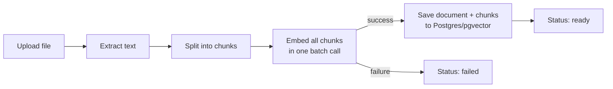
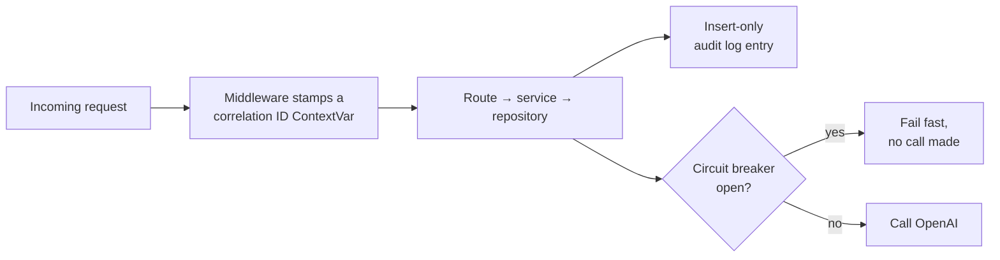
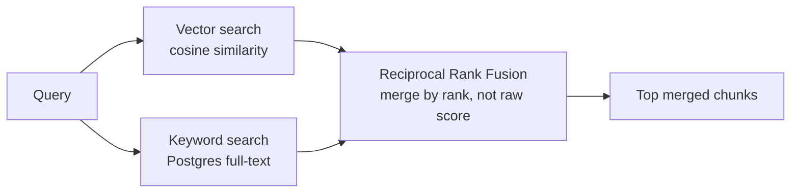
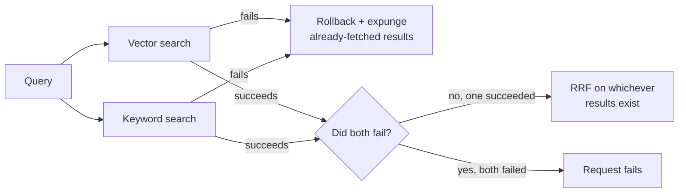
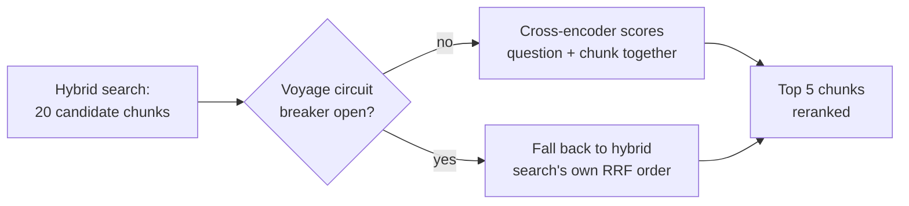
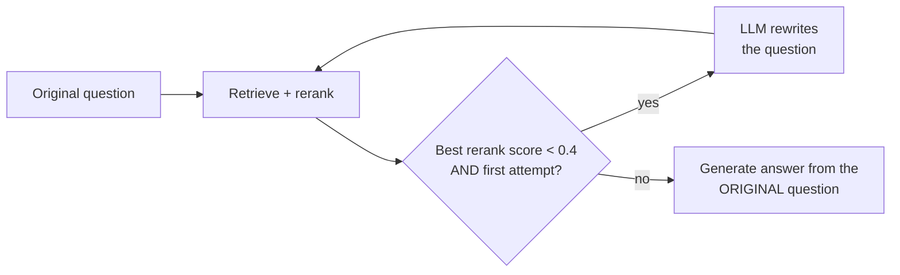
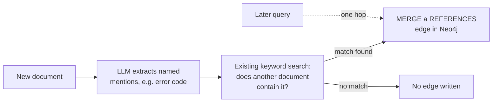
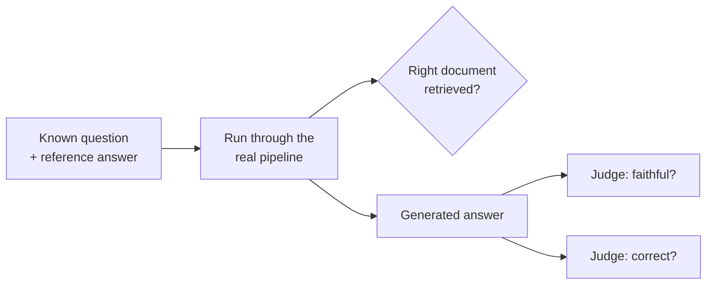
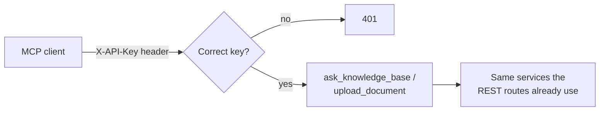
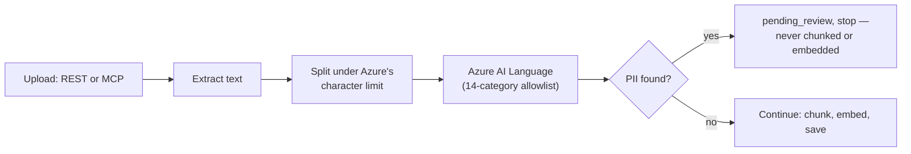

# Knowledge Brain — Interview Prep

A study sheet, not a spec. Read this before an interview to refresh why we
built things the way we did. Answers are written in plain language — the
goal is to say them back naturally, in your own words, not recite them.

---

## Feature 1: Document Ingestion Pipeline

**What does this feature do, in one sentence?**
It takes an uploaded file, pulls the text out of it, cuts that text into
small pieces, turns each piece into a list of numbers representing its
meaning, and saves everything to the database.



**Why did we process the file synchronously (the user waits) instead of
using a background queue like Kafka?**
Because it's simpler to build and reason about right now, and our
documents process in under a second. Kafka adds real complexity — a
separate worker process, a message broker, and handling "the upload
succeeded but processing is still happening elsewhere." We're deliberately
waiting to add that complexity until we actually feel the problem it
solves — specifically, once a large document makes someone wait 30+
seconds staring at a spinner.

**Why Postgres + pgvector instead of a dedicated vector database like
Qdrant?**
Because it keeps everything — a document's normal info (filename, status)
and its chunks' embedding vectors — in one database, one connection, one
query language. Saving a document and its chunks can happen as a single
all-or-nothing operation, which is harder to guarantee across two separate
databases. Qdrant is faster at large-scale vector search, but we're adding
it later, once pgvector's performance actually becomes a bottleneck.

**Why do we run Postgres in Docker instead of installing it directly on
the machine?**
A native install becomes part of the machine and can silently conflict
with other software — we actually hit this during setup, where a native
Postgres already on the machine intercepted our connections without any
error message. Docker keeps our database fully isolated, and anyone can
get the exact same setup with one command.

**What happens if something fails partway through processing a document —
say, the call to OpenAI times out?**
The document is marked `failed` in the database, instead of being left
stuck at `pending` forever. Without that, a failed document would look
identical to one still normally processing — no signal anything went
wrong, and no way to know if it's safe to retry.

**If a document has 50 chunks and the embedding call fails, does the
document end up with 49 saved chunks and 1 missing?**
No — all of a document's chunks are sent to the embedding model in a
single batch request, not one at a time. If that one request fails, zero
embeddings come back, so zero chunks get saved. It's all-or-nothing, not
partial.

**What happens if someone uploads a scanned PDF — basically a photograph
of a page?**
A PDF page can either contain real character data ("draw the letter H
here") or just one embedded photo covering the whole page, with no
character data at all — that's what a scan or phone photo produces. Our
text extraction finds nothing on a page like that, so it contributes no
searchable content. Not handled yet — the real fix would be OCR (a
technology that reads text out of images), which we haven't added.

**If this had to handle 10x the documents — thousands of large PDFs a
day — what breaks first?**
Not really "the embedding model is slow" — it's that our synchronous
design ties up a database connection for the *entire* time the pipeline
runs. The connection pool defaults to 15 total connections, and each
upload holds one for the whole 2-30 seconds a document takes to process.
So somewhere around 15 concurrent uploads, new requests stop failing
cleanly and start queueing silently, which shows up as rising latency, not
a clear error — that's the concrete number that would justify finally
adding Kafka, not a vague "too much traffic." It's also worth being honest
that Kafka isn't free to run: it means an always-on consumer process
burning compute even at zero load, and a new failure mode (a stalled
consumer, growing backlog) that's invisible unless someone's specifically
watching queue depth — a genuinely different on-call signal than "a
request is slow."

---

## Feature 2: Retrieval + Answer Generation

**What does this feature do, in one sentence?**
It takes a question, turns it into the same kind of meaning-vector as our
stored chunks, finds the chunks whose meaning is closest to the question,
and asks an LLM to answer using only those chunks.

```mermaid
flowchart LR
    Q[Question] --> QEMB[Embed question]
    QEMB --> SEARCH[Find closest chunks<br/>by cosine similarity]
    SEARCH --> LLM[LLM: answer using<br/>only these chunks]
    LLM --> ANS[Grounded answer,<br/>or "I don't know"]
```

**Why do we compare vectors instead of just comparing the question's raw
text against each chunk's raw text?**
Comparing raw text can only really catch matching keywords. Vectors
capture *meaning* — so two chunks phrased completely differently but
saying the same thing will still be found as similar. That gives much
better, more relevant matches than keyword matching.

**The chunk's text lives in Postgres, and its embedding lives in
pgvector — how are the two linked together?**
They're not actually two separate things needing to be linked. pgvector
is just an extension that adds a new column type to Postgres itself — the
chunk's text and its embedding vector are two columns sitting right next
to each other in the exact same row, in the one `chunks` table. There's no
separate system, so there's nothing to map.

**Why cosine similarity, out of the three metrics pgvector supports
(cosine, L2 distance, inner product)?**
Cosine similarity measures the angle between two vectors, which captures
"how similar in meaning" regardless of how long either piece of text is —
and it's the metric OpenAI's own documentation recommends for their
embeddings. That matches our case well, since questions and chunks are
rarely the same length.

**Why gpt-4o-mini instead of the more capable gpt-4o for generating
answers?**
Answering a question from a small set of retrieved chunks is "grounded"
question answering, not open-ended reasoning — it doesn't need gpt-4o's
extra reasoning power. gpt-4o-mini is much cheaper and faster, which
matters more right now than a capability we don't need yet. Since the
model name is just a setting, upgrading later is a one-line change, no
code changes required.

**Why do we explicitly tell the LLM to say "I don't know" instead of
trusting it to behave well on its own?**
An LLM's default tendency, unless told otherwise, is to always produce a
confident-sounding answer — that's what most of its training rewards.
Weak or irrelevant retrieved context is more likely to produce a
hallucinated (confidently made-up) answer than an honest refusal, unless
we say so directly in the instructions we give it.

**If the `chunks` table had 10 million rows instead of a handful, what
happens to `/query`'s response time, and what's the actual fix?**
Right now, finding the closest chunks means comparing the question against
*every single row* — fine at tiny scale, painfully slow at millions of
rows. Concretely, 10 million chunks at 1536 dimensions each is around 61
GB of raw embedding data alone, and every query would scan all of it. The
fix isn't a hash map (hash maps only do exact-key lookups, and there's no
"exact match" in similarity search). The real fix is a vector index like
HNSW, which pre-organizes the vectors into a searchable structure so a
query only has to check a small fraction of all the rows, trading a tiny
bit of accuracy for a big speed gain. That's also the point where I'd
actually consider moving to Qdrant instead of pgvector — not before, since
pgvector already runs inside infrastructure we're already operating and
monitoring, and standing up a second stateful service is a real ongoing
cost, not just a technical upgrade.

---

## Feature: Correlation IDs, Audit Logging, and Circuit Breakers

**What do these three features do, in one sentence each?**
Correlation IDs let you trace one request's whole story through the
logs. The audit log is a permanent record of who did what, for
accountability. Circuit breakers stop hammering an external service
(OpenAI) once it's clearly failing, instead of every request separately
waiting for a doomed call to time out.



**Why did we only build these three "enterprise requirements" now, and
defer PII detection, access control, and the Azure-specific ones?**
The project's rules said all 8 were "non-negotiable from the start," but
that directly contradicted the project's own build order, which lists PII
detection and access control as later steps. We resolved it by splitting
on actual buildability: these three don't depend on anything that doesn't
exist yet, while access control is meaningless with no auth model built,
and the Azure-specific ones (API gateway, Key Vault) don't apply to a
system that only runs locally.

**Why a `ContextVar` for the correlation ID instead of FastAPI's
`request.state`?**
`request.state` only works for code that has a direct reference to the
`request` object — true for route handlers, not true for services and
the repository, which are called several layers deep and intentionally
never receive `request` as a parameter. A `ContextVar` is readable from
anywhere in that call chain without threading it through every function
signature.
*Further reading: [Python's official `contextvars` documentation](https://docs.python.org/3/library/contextvars.html).*

**Why does the audit log's repository only expose an insert method?**
Because the whole value of an audit log depends on nobody being able to
quietly edit or delete an entry after the fact — if it could be altered,
it couldn't be trusted as evidence of what really happened. Not exposing
update/delete methods in code is the first layer of that protection.

**Is the audit log actually tamper-proof today?**
Honestly, not fully. The application code can't alter it, but our local
database connection is a superuser, which can bypass real database-level
restrictions. Even a properly restricted role is only a partial fix,
though — the real enterprise answer is usually shipping audit entries to
genuinely separate write-once storage, like blob storage with an
immutability policy, precisely because "a table in the same database,
reachable by anything with enough privilege" isn't a real compliance
boundary. That's a known, deliberately deferred gap, not an oversight.
There's also no retention or archival policy yet — the table just grows
with every request, which is fine at this scale but would need a plan
before it wasn't.

**Why build a circuit breaker by hand instead of using a library?**
Consistent with how the rest of the project was built — extraction,
chunking, and the API calls themselves were all written by hand so the
mechanism is fully understood, and a circuit breaker is simple enough
that building it doesn't cost much.
*Further reading: [Martin Fowler's "CircuitBreaker"](https://martinfowler.com/bliki/CircuitBreaker.html) — the article that popularized the pattern.*

**If we ran two copies of this server, what breaks?**
The circuit breaker's state lives in each process's own memory — nothing
shares it across processes. So each server instance has to independently
rack up its own 3 failures before its circuit opens, while a healthy-looking
instance that hasn't personally seen those failures yet keeps calling the
already-failing service. The fix would be moving that state into
something shared across instances, like Redis.

---

## Feature 3: Hybrid Search

**What does hybrid search do, in one sentence?**
It runs a vector (meaning-based) search and a keyword (exact-term) search
at the same time, then merges the two ranked result lists into one, so
the system catches both "conceptually similar" matches and "contains
this exact word/code" matches.



**Why isn't vector search alone good enough?**
Embedding models represent general meaning, not exact lexical identity —
they're weak at guaranteeing a match on specific things like error codes,
product IDs, or rare proper nouns. A document containing the exact string
"ERR-4521" might not surface for a search on that exact code, because the
embedding model never learned that string as meaningfully distinct from
similar-looking text.
*Further reading: [PostgreSQL's official Full Text Search documentation](https://www.postgresql.org/docs/current/textsearch.html).*

**Why Postgres full-text search instead of a dedicated engine like
Elasticsearch?**
Same reasoning as pgvector over Qdrant: it keeps everything in one
database, no new infrastructure, no second system to keep in sync. A
dedicated engine is more powerful at real scale, but that's overkill for
where this project is today.

**How does Postgres actually decide if a chunk "matches" a keyword
query?**
It's not raw string matching. Both the chunk's text and the query get
normalized the same way first — split into words, lowercased, stop words
like "the" and "a" removed, and each remaining word stemmed to its root
form (so "running," "runs," and "ran" all become "run"). Then it checks
whether the query's processed words appear in the chunk's processed
text, and ranks matches by relevance, not just whether a match exists.

**Why merge the two result lists using Reciprocal Rank Fusion instead of
just combining their raw scores?**
Cosine distance (vector search) and text relevance (`ts_rank`) are
measured on completely different, incomparable scales — there's no
principled way to add "0.23 cosine distance" to "1.8 relevance score."
RRF sidesteps that by scoring each chunk based on *where it ranked* in
each list instead of its raw score, then summing those rank-based scores
— which both methods can express in exactly the same terms.
*Further reading: the original paper — [Cormack, Clarke & Buettcher, "Reciprocal Rank Fusion outperforms Condorcet and Individual Rank Learning Methods," ACM SIGIR 2009](https://dl.acm.org/doi/10.1145/1571941.1572114).*

**If a chunk is found by only one of the two searches, does it get
dropped?**
No — it's still included in the merged results, just with a score from
only that one list, so it won't rank as high as a chunk both searches
agreed on. Nothing gets excluded for appearing in only one list; RRF
works over the union of both.

**Hybrid search runs two queries per request now instead of one — what
does that actually cost?**
Concretely, it doubles database load per query, and since both queries
currently run sequentially against the same connection, each request
holds that connection from the pool for roughly twice as long as before.
Using the same pool math as the ingestion side — about 15 total
connections available — that means the point where concurrent queries
start queueing for a connection happens at roughly half the traffic
compared to before hybrid search existed. It's a real, halved number, not
a free upgrade, even though it doesn't show up until there's real
concurrent load.

**At 10 million rows, what actually gets slow, and why?**
Not "keyword search is inherently slower than vector search" — both
sides currently compute their comparison fresh, on every row, on every
query, with no real index. For keyword search specifically, that means
re-tokenizing and re-stemming every row's text from scratch on every
query. The fix is a GIN index on a persisted `tsvector` column, the exact
same pattern as the HNSW index needed on the vector side.

---

## Feature: Hybrid Search Hardening — Graceful Degradation on Partial Failure

**What does this change do, in one sentence?**
If one of hybrid search's two database queries fails, the system now
answers using whichever one succeeded instead of failing the whole
request — it only gives up if *both* fail.



**Why not just retry the failed search instead?**
Retrying sounds safer but often isn't. If a query failed because the
database is genuinely under load, retrying immediately adds more load to
an already-struggling system instead of relieving it — a "retry storm."
Proceeding with the search that did succeed costs nothing extra and needs
no new logic, since Reciprocal Rank Fusion already treats "found by only
one search" as a completely normal case.

**This came from a code review, not a feature request — how did that
process work?**
A background review agent went through the hybrid search code and
returned findings. I didn't take them at face value — I re-verified the
concrete ones myself against the running database (checked the actual
index with `\d chunks`, confirmed a claimed double-computation with
`EXPLAIN VERBOSE`, and actually executed a query that a different finding
claimed would crash — it ran fine, so that one got dropped). Only
findings that survived that verification became real work.

**What's the subtlety with rolling back the database session, and why did
fixing the first bug introduce a second one?**
Both searches share one connection. If a query fails, Postgres refuses
any further queries on that same connection until it's explicitly rolled
back — so catching the failure isn't enough by itself; the *other* search
would fail too without an explicit `rollback()`. But `rollback()` doesn't
just reset the connection — it also expires every object the session is
still holding onto, including the chunks the *other* search had already
successfully fetched moments earlier. The next time the code reads one of
those chunks' text, SQLAlchemy tries to quietly reload it from the
database, which isn't allowed outside of an `await`, and crashes instead.
The fix: detach each search's results from the session (`session.expunge()`)
immediately after fetching them, so a later rollback has nothing left of
theirs to invalidate.
*Further reading: [SQLAlchemy's official docs on session state management and object expiration](https://docs.sqlalchemy.org/en/20/orm/session_state_management.html).*

**How was this actually verified, not just reasoned about?**
With a small script that force-fails each search independently (vector
only, keyword only, then both) against the real repository and a real
database connection, and checks the actual outcome. That script is what
caught the session-expiry bug — reading the code after the first fix
looked correct; running it didn't.

**If we ran this at real production scale, what changes about how this
failure would be noticed?**
Before this change, a keyword-search-only problem (e.g. the missing index
turning slow under real load) would fail *every single query* — loud, but
overstates the actual damage. After this change, the same problem shows
up as quietly degraded answer quality (RRF running on vector-only
results) with an error log per failed search — a more accurate signal,
but a much quieter one that needs someone actually watching per-search
failure rates to catch. Nothing in this project watches that yet.

---

## Feature 4: Reranking

**What does reranking do, in one sentence?**
It takes hybrid search's candidate chunks — now a wider pool of 20,
instead of the final 5 — and uses a model that looks at the question and
each chunk *together* to pick the 5 that actually answer it best, instead
of trusting vector/keyword search's own ranking as final.



**Why isn't hybrid search's own ranking good enough on its own?**
Vector and keyword search both score the question and a chunk
*separately* — an embedding compares two independently-computed numbers,
never the actual texts side by side. That's fast enough to check against
every row in the database, but approximate. A reranker (specifically, a
cross-encoder) processes the actual question and one actual chunk
together in a single pass, which is far more accurate — but far too slow
to run against everything, only against a short list hybrid search has
already narrowed down.
*Further reading: [Sentence Transformers' official "Retrieve & Re-Rank" documentation](https://sbert.net/examples/sentence_transformer/applications/retrieve_rerank/README.html), which lays out exactly this two-stage pattern.*

**Why does hybrid search now fetch 20 candidates instead of 5?**
Because reranking needs something to actually choose between. If hybrid
search only ever produced the final 5, reranking would still technically
run — Voyage would still score and could still reorder those same 5 — but
it could never promote a chunk that hybrid search's own ranking happened
to place 8th over one it ranked 3rd, since anything outside the top 5
would already be gone. Fetching a wider pool is what gives reranking room
to actually change *which* chunks reach the LLM, not just their order.

**Why Voyage AI specifically, over a local model or reusing OpenAI?**
Three options existed: a local open-source cross-encoder, Voyage's hosted
Rerank API, or asking OpenAI directly via a prompt to rank the
candidates. OpenAI would have been the easiest to wire in — same client,
same settings pattern already used twice — but the goal was specifically
to use a model actually trained for relevance scoring, not repurpose a
general chat model for a task it wasn't trained for. Voyage over a local
model, specifically to avoid pulling a heavy new ML dependency (PyTorch,
downloaded weights) into a project where every AI capability so far goes
through a hosted API, not local inference. Its free tier (200 million
tokens) also made cost a non-factor, confirmed by checking current
pricing directly rather than assuming.

**What happens if Voyage itself fails?**
Its own independent circuit breaker opens after 3 failures in 60 seconds,
same mechanism as the two OpenAI ones. Unlike an OpenAI failure, this
doesn't fail the request — `retrieval_service.py` catches it and falls
back to hybrid search's own Reciprocal Rank Fusion order instead. This
makes reranking the one external AI dependency in this system where
failure degrades *quality*, not *availability* — verified for real by
forcing the circuit breaker open and confirming the request still
succeeded.

**A real mistake happened while wiring this up — what, and how was it
caught?**
A real Voyage API key briefly ended up in `.env.example` — the *template*
file meant to be committed to git with placeholder values — instead of
`.env`, which is git-ignored. Caught by checking `git status` and
`git log` before anything got pushed: the change was still unstaged and
uncommitted, so nothing ever reached git history. Fixed immediately, and
the exposed key was rotated anyway, since it had already appeared in
conversation transcript text — cheap insurance for something free to
redo. The habit worth keeping: `.env.example` only ever gets
placeholder-shaped values; real secrets only ever go in `.env`.

**If this had to run at real scale, what's the actual cost, and what's
the honest trade-off?**
At an estimated ~13,000 tokens per query (a question plus 20 candidate
chunks), the 200-million-token free tier covers well over 15,000 queries
before any billing starts, and stays cheap after that. The honest
trade-off isn't cost, though — it's that this system now depends on
*three* independent external AI vendors (two OpenAI call sites plus
Voyage) for one query to fully succeed, each with its own credentials to
manage and its own circuit breaker to reason about independently.

---

## Feature 5: LangGraph Query Pipeline

**What does this feature do, in one sentence?**
It turns the query pipeline from a fixed sequence of steps into a graph
that can notice its own retrieval results are weak, rewrite the
question, and search again once before generating an answer.



**The query pipeline was already five steps in a row before this — what
does LangGraph actually add over what we had?**
Being multi-step isn't the same as being able to make decisions.
Before, step 2 always followed step 1 no matter what happened — a
straight line. LangGraph adds *conditional* edges: after reranking, the
pipeline can check what it actually found and branch — loop back and
try again, or move on — instead of blindly continuing regardless of
result quality.

**The original plan was "retry if reranking returns zero chunks" — why
isn't that in the final code?**
Because it doesn't work, and that was only found by actually testing it
live, not by reading the code. Vector search has no relevance floor —
`find_similar_chunks` always returns the *closest* chunks by distance,
however irrelevant, as long as the table isn't empty. Asking a
completely unrelated question against the real database never
triggered the retry, because "zero results" essentially never happens
outside of an empty database.

**So what actually decides when to retry?**
Voyage's own `relevance_score` on the *best* reranked chunk — not "any"
or "all" five chunks, just the top one, since generation only needs one
genuinely relevant chunk to work from. If the best one scores below
`0.4`, and this is the first attempt, the pipeline rewrites the question
and searches again. The threshold itself came from real measurements
against the dev database: a genuinely relevant match scored `0.914`;
two different irrelevant questions both scored `~0.28–0.29` — a wide,
clean gap, with `0.4` sitting comfortably inside it.

**Why does the retry skip entirely — not just decline — when reranking
itself is unavailable, rather than when it's just weak?**
Those are different problems with different fixes. A weak score means
reranking *worked* but found nothing good — rewriting the question is a
real attempt to fix that. Reranking being *unavailable* means the tool
that would even tell you whether to retry is down — rewriting the
question and searching again can't fix an unreachable API, and would
almost certainly just hit the same open circuit breaker a moment later,
for no benefit.

**Why is the final answer always generated from the *original* question,
never the rewritten one?**
The rewritten question is a search tool, not a replacement for what the
user actually asked. If a rewrite broadens "Q4 revenue for Acme" into
something more searchable, the answer still needs to address the
specific thing asked — otherwise the system quietly answers an easier,
different question than the one it was given.

**If this had to handle 10x the traffic, would you raise `MAX_RETRIES`
to catch more relevant chunks?**
No — that's the wrong lever, and it's worth knowing why it's tempting
but wrong. Every retry is a full extra round trip through embedding,
both searches, and reranking again. At 10x traffic, both circuit
breakers already trip more often just from call volume; raising the
retry cap would send *more* load at the exact vendors already
struggling, tripping their breakers even faster — the same retry-storm
problem ADR-012 already reasoned its way out of once. The better lever
is tuning the circuit breakers' own thresholds to scale with traffic,
not retrying more.

**A real testing mistake happened while verifying this — what, and what
does it teach about testing LangGraph code specifically?**
Patching `RetrievalService._rewrite_node` on the class, after
constructing a `RetrievalService`, silently did nothing — the spy never
fired even when the method genuinely ran. The graph is built once in
`__init__` and captures a bound-method *reference* at that moment;
patching the class afterward doesn't reach an already-built graph. The
fix was patching the module-level `rewrite_query` function instead,
which every node looks up fresh on each call. Worth remembering
generally: patch what's actually looked up at call time, not something
already captured earlier.
*Further reading: [LangGraph's official `StateGraph` API reference](https://reference.langchain.com/python/langgraph/graph/state/StateGraph).*

---

## Feature 6: Neo4j Document Relationship Graph

**What does this feature do, in one sentence?**
After a document uploads, an LLM finds specific things it explicitly
mentions (an error code, a ticket ID), checks whether any other stored
document actually contains that thing, and if so records the link in
Neo4j — so a later query can pull in context from a document it never
directly searched, only connected to.



**Why does this need a graph database at all — what can't vector or
keyword search already do here?**
Both of those find text that reads *similarly*. This is a structurally
different question: does one document *explicitly point at* another,
regardless of how differently worded they are? A support ticket and the
specific KB article it names by ID might use completely different
vocabulary — low embedding similarity — but still need a direct link.
Vector search can miss that connection entirely; a graph traversal
follows it directly.

**The first design instinct was linking documents by topic clusters an
LLM infers — why wasn't that the final approach?**
Because it would substantially duplicate something that already exists.
"These two documents are about the same topic" is close to exactly what
an embedding comparison already measures — building a second, more
expensive system (an LLM call plus a whole separate database) to answer
a question vector search can already answer on the fly isn't adding a
new capability, it's re-implementing an old one. The graph's actual
value is answering the question similarity search structurally can't:
explicit, named references.

**Why not link documents by shared authorship or ownership instead?**
A real, practical reason, not a design preference: the `Document` model
has no author/owner field today, and no upload flow captures it. That
would be a separate change to ingestion before a graph could even use
it — worth doing once there's an actual reason to capture that
metadata, not assumed upfront.

**Walk me through how a reference actually gets resolved into a graph
edge.**
Three steps. An LLM reads the document's text and returns specific,
named things it mentions — not general topics, only things specific
enough to plausibly be their own document. For each mention, the
*existing* keyword search (`find_by_keyword`, already built for hybrid
search) checks whether any other document actually contains it — no new
search mechanism needed. If a match in a *different* document is found,
a `REFERENCES` edge gets written to Neo4j using `MERGE`, not `CREATE`,
so re-processing the same document doesn't create duplicate nodes.

**Why only one hop — why not follow references-of-references too?**
A deliberate scope limit, not a technical ceiling. Each hop out means
more Neo4j lookups and more extra context per query; unbounded
traversal means unbounded, unpredictable cost. One hop is small, known,
and capped — a document's *direct* references are also the ones most
likely to actually matter to the current question.

**What happens if Neo4j itself is unreachable — during upload, and
during a query?**
Neither case fails the request, same philosophy as reranking (ADR-013).
During upload, reference-building is wrapped in a `try/except` that
only catches `CircuitOpenError` — the document still ends up `ready`,
it just has no graph links yet. During a query, the graph-context node
catches the same exception and the pipeline answers using its retrieved
chunks alone. Reranking and Neo4j are now the two dependencies in this
system where failure degrades *quality*, not *availability* — unlike an
OpenAI failure, which still fails the request outright today, just
cleanly, as a `503`.

**A subtlety came up while building this — does a failed *read* still
need a rollback?**
Yes, and this is worth being precise about, since the instinctive answer
is usually wrong. `rollback()` isn't about undoing *data* — it's about
resetting a *transaction* Postgres has marked broken. Once *any* query
in a transaction fails, whether it's a `SELECT` or a `write`, Postgres
refuses to run anything else on that connection until it's rolled back.
A failed read leaves the session just as stuck as a failed write would
— skip the rollback here, and the *next* referenced document's snippet
lookup in the same loop would fail too, not because it has a problem,
but because the session itself is jammed.

**If this had to run at real scale, what's the first thing that would
actually get slow?**
Two separate things, not one. `MATCH (d:Document {id: $document_id})`
currently matches by scanning, not by an index — the same category of
deferred work already tracked for pgvector (HNSW) and full-text search
(GIN), just a third database added to that list. Less obviously: at
*ingestion* time, every mention extracted from a document triggers its
own `find_by_keyword` call, synchronously, during the same upload
request that already holds a database connection for the whole
pipeline (ADR-001) — a document with many distinct mentions makes that
existing connection-hold problem worse, not the graph lookups
themselves.
*Further reading: [Neo4j's official Cypher Manual introduction](https://neo4j.com/docs/cypher-manual/current/introduction/).*

---

## Feature 7: Evaluation Harness

**What does this feature do, in one sentence?**
It runs a fixed set of known-answer test questions through the real
pipeline and scores each one on three things — was the right document
retrieved, is the answer grounded in its context, and does it match the
reference answer — instead of relying on a human reading one response
and guessing whether it looks right.



**Why does this need to exist — wasn't "read the answer and see if it
looks right" good enough?**
It was the only backstop for a while, but the pipeline has gotten
genuinely complex — five external dependencies, a retry loop, a
relevance threshold picked from just two data points, graph context
pulled from a second database. There was no systematic way to know
whether all of that was actually working *together*, only spot-checks.
A regression in one piece could easily hide behind a good-looking
answer on the one question someone happened to try by hand.

**Is this the same as the "guardrails" idea that came up around the
same time?**
No, and mixing them up would lead to building the wrong shape of tool.
Guardrails is a real-time safety gate on every *live* answer before a
user sees it — moderation, prompt-injection defense. This is an
offline, on-demand quality *measurement* tool, run manually, not on
every request. They ended up as two separate build-order items (9 and
16) specifically because conflating them was a real risk early in the
conversation.

**Why does the test corpus live in the same database as everything
else, instead of a separate eval database like the test suite uses?**
A genuinely separate database (the pytest pattern) was considered, but
rejected as more isolation than the actual problem needed. The goal was
a small, *known* set of documents with reproducible answers — not
isolating an entire database connection. A handful of dedicated,
purpose-written fixture documents, looked up by filename before
ingesting so re-running eval never creates duplicates, gets the same
reproducibility without a second database to stand up and maintain.

**Why judge faithfulness and correctness with two separate LLM calls
instead of one combined call?**
They're checking genuinely different things — is the answer grounded
in its context, versus does it match the reference facts — and
combining them into one response risks the model conflating the two
judgments. Two focused calls cost more than one combined call, but that
was accepted as the smaller risk.

**How is "was the right document retrieved" actually checked — string
matching the answer?**
No — by comparing the retrieved chunks' actual `document_id` against
the fixture document's known ID, the same "check against real state,
don't reimplement the logic as a string comparison" principle used
throughout this project's test suite.

**What's the honest limitation of this whole approach?**
The judge is itself an LLM call, and can be wrong or inconsistent
between runs, the same way the system it's judging can be. A passing
eval score is a strong signal, not a mathematical proof — a real,
known trade-off of using a model to grade a model, not something
specific to how this was built. It's also not wired into CI yet, so it
only catches a regression if someone remembers to run it.
*Further reading: [Es et al., "RAGAs: Automated Evaluation of Retrieval Augmented Generation," EACL 2024](https://aclanthology.org/2024.eacl-demo.16/), the paper that formalized separately scoring faithfulness, answer relevance, and context relevance for RAG systems.*

---

## Feature 8: MCP Server

**What does this feature do, in one sentence?**
It exposes the exact same retrieval and ingestion pipeline as two
tools an AI client can call directly over a standard protocol, instead
of only being reachable through this project's own `/query` and
`/documents` REST endpoints.



**Why HTTP instead of a local-only server — isn't local safer?**
Local is safer by default — nothing outside the machine can reach it.
HTTP was chosen deliberately, to build and prove out the pattern
you'd actually need in production: a real network-facing gate,
accepting that exposure because a shared-secret check is the
compensating control for it. That trade-off — safer-by-default versus
actually-representative-of-production — is also what reopened the
PII/ACL-ordering question from earlier sessions: a *local* server adds
no new exposure, so it could skip ahead of PII/ACL; an HTTP one
couldn't, without adding some form of gate first.

**Why mount it onto the existing FastAPI app instead of running it as
its own process?**
Every tool call needs the same OpenAI/Voyage calls, the same circuit
breakers, and the same database and Neo4j access the REST routes
already have. A standalone process would mean either duplicating all
of that wiring or reaching across processes for it. Mounting onto the
existing app gets it all for free, including correlation IDs — that
middleware wraps the *whole* app regardless of which mounted path a
request eventually reaches, not just the routes that existed when it
was registered.

**Why one shared secret instead of a key per caller?**
There's exactly one real caller type today, and distinguishing callers
only matters once there's more than one kind to distinguish. Building
per-caller keys now would be solving a multi-tenancy problem that
doesn't exist yet — the same reasoning behind deferring full
build-order item 14 rather than building it early.

**Walk me through the two bugs live testing caught that code review
wouldn't have.**
First: mounting a sub-app with `app.mount()` doesn't forward FastAPI's
startup event into it — only the outer app's own lifespan runs
automatically. Without an explicit `lifespan` context manager entering
`mcp.session_manager.run()`, the MCP server's internal task group was
never initialized, and every request failed with `RuntimeError: Task
group is not initialized`, even past a correct API key. Second:
Starlette's `BaseHTTPMiddleware` runs whatever it wraps in a separate,
buffered task — fine for an ordinary request/response, but it broke
MCP's long-lived streaming responses outright ("SSE stream ended
without a response"). Both were fixed only after actually running the
real MCP protocol against the server, not by reading the code — the
same discipline this project has relied on since the LangGraph
retry-threshold and Voyage rate-limit discoveries.

**What's the audit log bug you found while building this?**
`documents.py`'s existing pattern writes the `document_upload` audit
entry *after* the best-effort graph-linking step. Copying that pattern
into the MCP tool at first meant an unexpected (non-`CircuitOpenError`)
failure during graph-linking — a corrupted PDF `extract_text` can't
parse, say — would leave a document successfully ingested in Postgres
with no audit trail for its own upload at all. Fixed in the MCP tool
by moving the audit log write to right after ingestion succeeds,
before the graph-linking attempt. The identical gap still exists in
`documents.py` itself, tracked for a later fix, not changed here.

**What happens if the shared secret leaks, and how would you know?**
Anyone holding it can make unlimited calls, logged but with no way to
tell who made them apart from "held a valid key." Honestly — you
probably wouldn't find out in real time. There's no anomaly detection
watching call volume or timing today, so a leaked key looks like
normal traffic until someone notices something odd by hand. That's a
real, named gap, not a hidden one; the fix is exactly what per-caller
keys plus volume-based alerting would give you, which is why it's
flagged as future work once real auth (item 14) exists, not solved now.

**What would you change if this needed to handle 10x more concurrent
MCP calls?**
Every tool call opens its own database and Neo4j session by hand,
since there's no FastAPI dependency injection outside of HTTP routes
to hand one to it. At meaningfully higher concurrency, that competes
for the exact same connection pool `/query` and `/documents/upload`
already share — not a new ceiling MCP introduces, just one more source
of load against an existing, unchanged limit that would need real
sizing work before either the REST routes or MCP could handle it.
*Further reading: [the Model Context Protocol's official documentation](https://modelcontextprotocol.io), including the specification for the Streamable HTTP transport this feature uses.*

---

## Feature 9: PII Detection

**What does this feature do, in one sentence?**
Before any uploaded document gets chunked or embedded, its text is
checked by Azure AI Language for personal information — if any is
found, the document is held for human review instead of being made
searchable.



**Why does this check live inside `IngestionService` instead of the
API routes?**
Both the REST upload endpoint and MCP's `upload_document` tool already
call the same `IngestionService.ingest_document` — that's the exact
reason MCP needed zero changes to reuse it last feature. Putting the
PII check there protects both entry points automatically; putting it
in either route separately would mean two places to keep in sync, and
the other one left unprotected if anyone forgot.

**Walk me through what happens if Azure's PII service itself is down.**
It fails closed, not open. Every other external dependency in this
project that can fail gracefully (reranking, Neo4j) does — a missing
enhancement still leaves a working answer. PII detection is different:
it's a compliance gate, and an unverified document must not be
embedded, so an Azure outage marks the document failed instead of
letting it through unchecked. That's a real trade-off, not a free
win — it means one vendor being down now blocks *every* upload,
system-wide, on both entry points, a bigger blast radius than any
other single dependency failure in this system today.

**Why 14 hand-picked categories instead of just using Azure's default
detection?**
Live testing — not code review — caught the reason: Azure's
`PersonType` category flagged the word "employee" in a completely
unremarkable document at 98% confidence. It identifies a *role* being
mentioned, not a specific person's information, and almost every real
business document mentions roles somewhere — using Azure's full
default set would have made nearly everything trigger review.
`PersonType` isn't even in Azure's own list of categories that can be
explicitly excluded by name, so an allowlist (only request specific
categories) was the only way to leave it out — anything not asked for,
including `PersonType`, simply never comes back.

**How does a long document avoid hitting Azure's character limit?**
Azure's synchronous PII endpoint caps each document at 5,120
characters and 5 documents per request — verified against Microsoft's
own docs, not assumed. Long text gets split on paragraph breaks, not a
hard character cut, greedily filling each piece up to just under the
limit; a single paragraph longer than the limit on its own falls back
to a hard cut, but only for that one paragraph. Splitting on
paragraphs instead of an arbitrary character count is deliberate — the
whole reason PII detection sends a document as one big piece instead
of tiny retrieval-sized chunks in the first place is to avoid severing
a name or address across a boundary, and paragraph-aware splitting
keeps most of that benefit even when a document is too long to send as
a single request.

**What's the honest scope limit of this feature?**
It only recognizes identity formats for two countries — US and India.
A French social security number or a UK national insurance number
would sail through completely undetected today. That's not a bug, it
was a deliberate scope decision, but it's a real limit worth being
upfront about, not something to imply is broader than it actually is.
*Further reading: [Azure AI Language's official data and rate limits documentation](https://learn.microsoft.com/en-us/azure/ai-services/language-service/concepts/data-limits), which specifies the exact per-document and per-request limits this feature's splitting logic is built around.*

---

## General concepts worth being able to explain from memory

**What is RAG (Retrieval-Augmented Generation)?**
The pattern of finding relevant text first, then handing it to an LLM to
write an answer from — instead of asking the LLM to answer purely from
what it already knows, which risks it confidently making things up.

**What's the difference between a service and a repository in this
codebase?**
A repository's only job is talking to the database — save this, get that
— with no business logic in it. A service holds the actual business
logic: the sequence of steps and decisions a feature performs. Keeping
them separate means you can test the logic without a real database, and
swap out how data is stored without touching the logic that uses it.

**What is hallucination, and how do we guard against it here?**
Hallucination is when an LLM confidently states something false or made
up, usually because it lacks real information and defaults to guessing.
We guard against it by grounding every answer in retrieved text, and by
explicitly instructing the model to admit when it doesn't know rather
than guess.

**What's the difference between middleware and a route handler?**
A route handler deals with one specific endpoint's job — answer a
query, save an upload. Middleware runs on *every* request headed
anywhere, before (and sometimes after) whatever route eventually
handles it, for checks or actions that apply broadly rather than to
one specific job — this project uses it for stamping a correlation ID
on every request, and for the MCP server's API key check. The two
middlewares in this project are written at different levels for a
reason: `correlation_id_middleware` uses FastAPI's higher-level
`request`/`call_next` style, while the MCP gate is written as raw ASGI
(`scope`/`receive`/`send`) because the higher-level style turned out
to break the MCP server's streaming responses — a good example of
"the simpler abstraction isn't always the correct one."

**Fail closed vs. fail open — how do you decide which one a given
check should use?**
Ask what happens if the check is silently skipped. If skipping it just
means a slightly worse answer — reranking down, Neo4j down — fail
open: let the request through, degrade gracefully. If skipping it
means something genuinely unsafe or non-compliant happens — PII
detection down — fail closed: block the action rather than proceed
unverified. It's not a project-wide rule, it's a per-check judgment
call based on what's actually at risk, which is why this same project
uses both: fail open for quality, fail closed for compliance.
